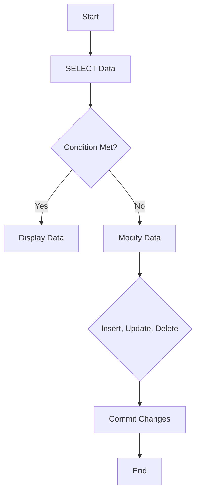

## 3.3 DML (Data Manipulation Language) Commands

Data Manipulation Language (DML) commands are the backbone of SQL operations, allowing us to interact with data stored in relational databases. In this section, we will delve into the core DML commands: `SELECT`, `INSERT`, `UPDATE`, `DELETE`, and `TRUNCATE`. We will explore how these commands are used for data retrieval and modification, and discuss transaction considerations to ensure data integrity.

### Data Retrieval: SELECT Statements and Constructing Queries

The `SELECT` statement is the most commonly used DML command, enabling us to retrieve data from one or more tables. It forms the basis of most SQL queries and can be used to extract specific columns, filter rows, and join tables.

#### Basic SELECT Syntax

The basic syntax of a `SELECT` statement is as follows:

```sql
SELECT column1, column2, ...
FROM table_name
WHERE condition;
```

- **column1, column2, ...**: Specify the columns to retrieve.
- **table_name**: The table from which to retrieve data.
- **condition**: An optional clause to filter rows.

#### Example: Retrieving Specific Columns

Consider a `customers` table with columns `customer_id`, `first_name`, `last_name`, and `email`. To retrieve the first and last names of all customers, use:

```sql
SELECT first_name, last_name
FROM customers;
```

#### Filtering Data with WHERE Clause

The `WHERE` clause allows us to filter data based on specific conditions. For example, to find customers with the last name 'Smith':

```sql
SELECT first_name, last_name
FROM customers
WHERE last_name = 'Smith';
```

#### Using Aggregate Functions

Aggregate functions like `COUNT`, `SUM`, `AVG`, `MIN`, and `MAX` are used to perform calculations on data. For instance, to count the number of customers:

```sql
SELECT COUNT(*)
FROM customers;
```

#### Joining Tables

Joins are used to combine rows from two or more tables based on related columns. Here's an example of an `INNER JOIN` between `orders` and `customers` tables:

```sql
SELECT orders.order_id, customers.first_name, customers.last_name
FROM orders
INNER JOIN customers ON orders.customer_id = customers.customer_id;
```

### Data Modification

Data modification involves inserting, updating, and deleting records in a database. These operations are crucial for maintaining and updating the data stored in tables.

#### Insertion: Adding New Records with INSERT

The `INSERT` statement is used to add new records to a table. There are two main forms: inserting a single row and inserting multiple rows.

##### Inserting a Single Row

To insert a single row into the `customers` table:

```sql
INSERT INTO customers (first_name, last_name, email)
VALUES ('John', 'Doe', 'john.doe@example.com');
```

##### Inserting Multiple Rows

To insert multiple rows at once:

```sql
INSERT INTO customers (first_name, last_name, email)
VALUES 
('Jane', 'Smith', 'jane.smith@example.com'),
('Emily', 'Jones', 'emily.jones@example.com');
```

#### Updating: Changing Existing Records with UPDATE

The `UPDATE` statement modifies existing records in a table. It is important to use the `WHERE` clause to specify which records to update; otherwise, all records will be updated.

##### Example: Updating a Single Record

To update the email of a customer with `customer_id` 1:

```sql
UPDATE customers
SET email = 'new.email@example.com'
WHERE customer_id = 1;
```

##### Example: Updating Multiple Records

To give all customers with the last name 'Doe' a new email domain:

```sql
UPDATE customers
SET email = REPLACE(email, '@example.com', '@newdomain.com')
WHERE last_name = 'Doe';
```

#### Deletion: Removing Records with DELETE and TRUNCATE

The `DELETE` statement removes records from a table, while `TRUNCATE` removes all records and resets any auto-increment counters.

##### Deleting Specific Records

To delete a customer with `customer_id` 1:

```sql
DELETE FROM customers
WHERE customer_id = 1;
```

##### Truncating a Table

To remove all records from the `customers` table:

```sql
TRUNCATE TABLE customers;
```

### Transaction Considerations: Ensuring Data Integrity

Transactions are crucial for maintaining data integrity during modifications. They allow multiple operations to be executed as a single unit of work, ensuring that either all operations succeed or none do.

#### Understanding Transactions

A transaction typically includes the following commands:

- **BEGIN**: Start a transaction.
- **COMMIT**: Save changes made during the transaction.
- **ROLLBACK**: Undo changes if an error occurs.

#### Example: Using Transactions

Consider a scenario where we need to transfer funds between two accounts. This involves debiting one account and crediting another. Using transactions ensures that both operations are completed successfully or not at all.

```sql
BEGIN;

UPDATE accounts
SET balance = balance - 100
WHERE account_id = 1;

UPDATE accounts
SET balance = balance + 100
WHERE account_id = 2;

COMMIT;
```

If an error occurs during the transaction, a `ROLLBACK` can be issued to undo changes:

```sql
ROLLBACK;
```

#### Isolation Levels

Isolation levels determine how transaction integrity is visible to other transactions. Common levels include:

- **READ UNCOMMITTED**: Transactions can read uncommitted changes.
- **READ COMMITTED**: Only committed changes are visible.
- **REPEATABLE READ**: Ensures consistent data during the transaction.
- **SERIALIZABLE**: The highest level, ensuring complete isolation.

### Try It Yourself

Experiment with the following code examples to deepen your understanding of DML commands. Try modifying the `WHERE` clauses, adding new columns, or using different aggregate functions.

### Visualizing DML Operations

To better understand the flow of DML operations, consider the following diagram illustrating the process of data retrieval and modification:



This diagram shows the decision-making process involved in retrieving and modifying data using DML commands.

### References and Links

For further reading on SQL DML commands, consider the following resources:

- [W3Schools SQL Tutorial](https://www.w3schools.com/sql/)
- [MDN Web Docs: SQL](https://developer.mozilla.org/en-US/docs/Glossary/SQL)
- [SQL Tutorial by TutorialsPoint](https://www.tutorialspoint.com/sql/index.htm)

### Knowledge Check

- What is the purpose of the `SELECT` statement?
- How do you ensure data integrity during data modification?
- What is the difference between `DELETE` and `TRUNCATE`?

### Embrace the Journey

Remember, mastering DML commands is just the beginning of your SQL journey. As you progress, you'll build more complex queries and data manipulation techniques. Keep experimenting, stay curious, and enjoy the journey!

## Quiz Time!



### What is the primary purpose of the `SELECT` statement in SQL?

- [x] To retrieve data from a database
- [ ] To insert new data into a database
- [ ] To update existing data in a database
- [ ] To delete data from a database

> **Explanation:** The `SELECT` statement is used to retrieve data from one or more tables in a database.

### Which SQL command is used to add new records to a table?

- [ ] SELECT
- [x] INSERT
- [ ] UPDATE
- [ ] DELETE

> **Explanation:** The `INSERT` command is used to add new records to a table.

### What is the difference between `DELETE` and `TRUNCATE`?

- [x] `DELETE` removes specific records, `TRUNCATE` removes all records
- [ ] `DELETE` removes all records, `TRUNCATE` removes specific records
- [ ] Both remove specific records
- [ ] Both remove all records

> **Explanation:** `DELETE` is used to remove specific records based on a condition, while `TRUNCATE` removes all records from a table.

### How can you ensure that a series of SQL operations are treated as a single unit of work?

- [ ] By using the `SELECT` statement
- [x] By using transactions
- [ ] By using `TRUNCATE`
- [ ] By using `INSERT`

> **Explanation:** Transactions allow multiple operations to be executed as a single unit of work, ensuring data integrity.

### What is the purpose of the `WHERE` clause in a `SELECT` statement?

- [x] To filter records based on a condition
- [ ] To join tables
- [ ] To aggregate data
- [ ] To sort data

> **Explanation:** The `WHERE` clause is used to filter records based on a specified condition.

### Which isolation level ensures complete isolation of transactions?

- [ ] READ UNCOMMITTED
- [ ] READ COMMITTED
- [ ] REPEATABLE READ
- [x] SERIALIZABLE

> **Explanation:** The SERIALIZABLE isolation level ensures complete isolation of transactions, preventing any interference.

### What is the effect of the `ROLLBACK` command in a transaction?

- [x] It undoes all changes made during the transaction
- [ ] It commits all changes made during the transaction
- [ ] It starts a new transaction
- [ ] It ends the transaction

> **Explanation:** The `ROLLBACK` command undoes all changes made during the transaction, restoring the database to its previous state.

### Which SQL command is used to modify existing records in a table?

- [ ] SELECT
- [ ] INSERT
- [x] UPDATE
- [ ] DELETE

> **Explanation:** The `UPDATE` command is used to modify existing records in a table.

### What is the purpose of aggregate functions in SQL?

- [x] To perform calculations on data
- [ ] To join tables
- [ ] To filter data
- [ ] To sort data

> **Explanation:** Aggregate functions like `COUNT`, `SUM`, `AVG`, `MIN`, and `MAX` are used to perform calculations on data.

### True or False: The `TRUNCATE` command resets any auto-increment counters in a table.

- [x] True
- [ ] False

> **Explanation:** The `TRUNCATE` command removes all records from a table and resets any auto-increment counters.


