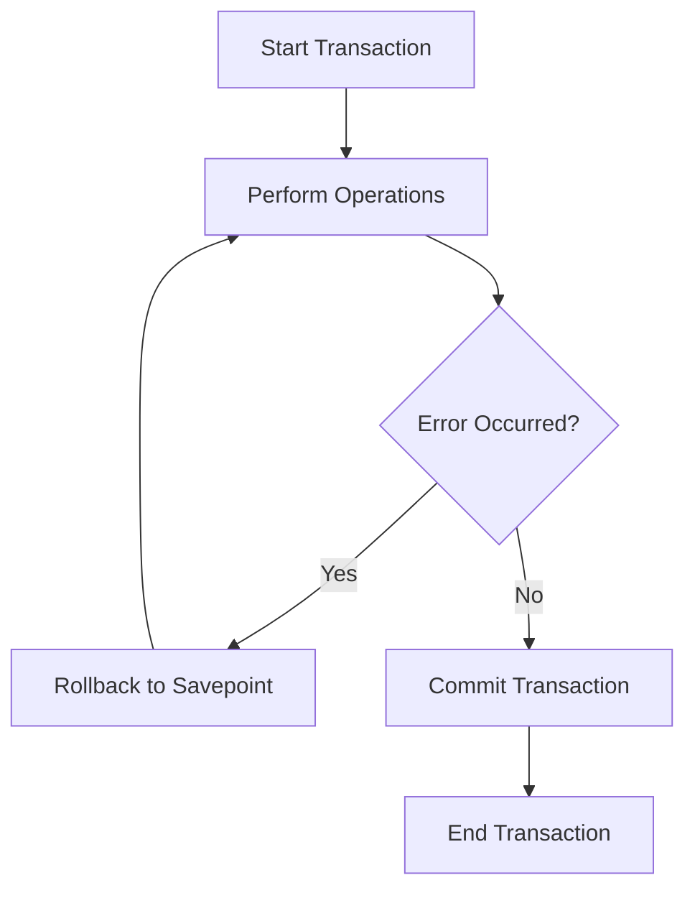

## 3.4 DCL (Data Control Language) and TCL (Transaction Control Language)

In the realm of SQL, Data Control Language (DCL) and Transaction Control Language (TCL) are pivotal in managing database security and ensuring data integrity during transactions. Understanding these concepts is crucial for expert software engineers and architects aiming to build robust, secure, and efficient database systems.

### Introduction to DCL and TCL

Data Control Language (DCL) is primarily concerned with the security aspect of databases, allowing administrators to control access to data. On the other hand, Transaction Control Language (TCL) deals with the management of transactions, ensuring that database operations are executed reliably and consistently.

### Data Control Language (DCL)

DCL commands are used to control access to data in a database. They are essential for maintaining security and ensuring that only authorized users can perform specific actions on the database.

#### GRANT Command

The `GRANT` command is used to provide specific privileges to users or roles. These privileges can include the ability to select, insert, update, or delete data, as well as the ability to execute stored procedures or functions.

**Syntax:**

```sql
GRANT privilege_name ON object_name TO {user_name | PUBLIC | role_name} [WITH GRANT OPTION];
```

- **privilege_name**: The type of privilege to be granted (e.g., SELECT, INSERT).
- **object_name**: The database object (e.g., table, view) on which the privilege is granted.
- **user_name**: The user or role receiving the privilege.
- **WITH GRANT OPTION**: Allows the grantee to grant the privilege to others.

**Example:**

```sql
-- Grant SELECT and INSERT privileges on the employees table to user 'john_doe'
GRANT SELECT, INSERT ON employees TO john_doe;

-- Grant EXECUTE privilege on a stored procedure to a role
GRANT EXECUTE ON PROCEDURE calculate_bonus TO hr_role WITH GRANT OPTION;
```

#### REVOKE Command

The `REVOKE` command is used to remove previously granted privileges from users or roles. This is crucial for maintaining security and ensuring that users do not retain unnecessary access.

**Syntax:**

```sql
REVOKE privilege_name ON object_name FROM {user_name | PUBLIC | role_name};
```

**Example:**

```sql
-- Revoke INSERT privilege on the employees table from user 'john_doe'
REVOKE INSERT ON employees FROM john_doe;

-- Revoke EXECUTE privilege on a stored procedure from a role
REVOKE EXECUTE ON PROCEDURE calculate_bonus FROM hr_role;
```

### Security Best Practices with DCL

1. **Principle of Least Privilege**: Always grant the minimum level of access necessary for users to perform their tasks. This minimizes the risk of unauthorized data access or modification.

2. **Regular Auditing**: Periodically review user privileges to ensure they align with current roles and responsibilities. This helps in identifying and revoking unnecessary permissions.

3. **Role-Based Access Control (RBAC)**: Use roles to manage permissions more efficiently. Assign users to roles based on their job functions, and grant privileges to roles instead of individual users.

4. **Use of WITH GRANT OPTION**: Be cautious when using the `WITH GRANT OPTION`, as it allows users to grant privileges to others, potentially leading to privilege escalation.

### Transaction Control Language (TCL)

TCL commands are used to manage transactions in a database. A transaction is a sequence of operations performed as a single logical unit of work. TCL ensures that these operations are completed successfully and consistently.

#### COMMIT Command

The `COMMIT` command is used to save all changes made during the current transaction permanently. Once a transaction is committed, the changes cannot be undone.

**Syntax:**

```sql
COMMIT;
```

**Example:**

```sql
BEGIN;

-- Insert a new employee record
INSERT INTO employees (name, position, salary) VALUES ('Jane Doe', 'Manager', 75000);

-- Commit the transaction
COMMIT;
```

#### ROLLBACK Command

The `ROLLBACK` command is used to undo changes made during the current transaction. This is useful in scenarios where an error occurs, and you need to revert the database to its previous state.

**Syntax:**

```sql
ROLLBACK;
```

**Example:**

```sql
BEGIN;

-- Attempt to update employee salary
UPDATE employees SET salary = 80000 WHERE name = 'Jane Doe';

-- An error occurs, rollback the transaction
ROLLBACK;
```

#### SAVEPOINT Command

The `SAVEPOINT` command allows you to set intermediate points within a transaction. You can roll back to a specific savepoint without affecting the entire transaction.

**Syntax:**

```sql
SAVEPOINT savepoint_name;
```

**Example:**

```sql
BEGIN;

-- Set a savepoint before updating salaries
SAVEPOINT before_salary_update;

-- Update employee salaries
UPDATE employees SET salary = salary * 1.1 WHERE department = 'Sales';

-- Rollback to the savepoint if needed
ROLLBACK TO SAVEPOINT before_salary_update;

-- Commit the transaction
COMMIT;
```

### Visualizing Transaction Control Flow

To better understand the flow of transaction control, let's visualize the process using a flowchart.



**Description:** This flowchart illustrates the typical flow of a transaction, where operations are performed, and based on whether an error occurs, the transaction is either rolled back to a savepoint or committed.

### Security Best Practices with TCL

1. **Atomicity**: Ensure that transactions are atomic, meaning that all operations within a transaction are completed successfully, or none are. This prevents partial updates that could lead to data inconsistencies.

2. **Consistency**: Maintain database consistency by ensuring that transactions transition the database from one valid state to another.

3. **Isolation**: Transactions should be isolated from each other to prevent concurrent transactions from interfering with one another. Use appropriate isolation levels to balance performance and consistency.

4. **Durability**: Once a transaction is committed, its changes should be permanent, even in the event of a system failure.

### Try It Yourself

To deepen your understanding of DCL and TCL, try modifying the code examples provided. For instance, experiment with granting different privileges to users or creating complex transactions with multiple savepoints. Observe how changes in privileges affect user access and how transactions behave under different scenarios.

### References and Further Reading

- [SQL GRANT and REVOKE](https://www.w3schools.com/sql/sql_grant_revoke.asp) - W3Schools
- [Transaction Control Language](https://www.geeksforgeeks.org/sql-transaction-control-language-tcl-commands/) - GeeksforGeeks
- [Database Security Best Practices](https://www.oracle.com/database/technologies/security.html) - Oracle

### Knowledge Check

Let's reinforce what we've learned with some questions and exercises.

1. **What is the purpose of the `GRANT` command in SQL?**
2. **How does the `ROLLBACK` command help in transaction management?**
3. **Why is it important to follow the principle of least privilege in database security?**
4. **Create a transaction that updates multiple tables and uses savepoints.**

### Embrace the Journey

Remember, mastering DCL and TCL is just one step in becoming an expert in SQL design patterns. As you progress, you'll gain the skills needed to build more secure and efficient database systems. Keep experimenting, stay curious, and enjoy the journey!

## Quiz Time!



### What is the primary purpose of the GRANT command in SQL?

- [x] To provide specific privileges to users or roles.
- [ ] To remove privileges from users or roles.
- [ ] To save changes permanently in a transaction.
- [ ] To undo changes made during a transaction.

> **Explanation:** The GRANT command is used to provide specific privileges to users or roles, allowing them to perform certain actions on the database.

### Which command is used to undo changes made during a transaction?

- [ ] COMMIT
- [x] ROLLBACK
- [ ] GRANT
- [ ] REVOKE

> **Explanation:** The ROLLBACK command is used to undo changes made during the current transaction, reverting the database to its previous state.

### What does the WITH GRANT OPTION allow a user to do?

- [x] Grant the same privileges to other users.
- [ ] Revoke privileges from other users.
- [ ] Commit changes in a transaction.
- [ ] Rollback changes in a transaction.

> **Explanation:** The WITH GRANT OPTION allows a user to grant the same privileges they have received to other users.

### What is the purpose of a SAVEPOINT in a transaction?

- [x] To set intermediate points within a transaction for partial rollbacks.
- [ ] To commit changes permanently.
- [ ] To provide privileges to users.
- [ ] To remove privileges from users.

> **Explanation:** A SAVEPOINT allows setting intermediate points within a transaction, enabling partial rollbacks without affecting the entire transaction.

### Which principle should be followed to minimize security risks in database access?

- [x] Principle of Least Privilege
- [ ] Principle of Maximum Privilege
- [ ] Principle of Equal Privilege
- [ ] Principle of Random Privilege

> **Explanation:** The Principle of Least Privilege states that users should be granted the minimum level of access necessary to perform their tasks, minimizing security risks.

### What is the main function of the COMMIT command?

- [x] To save all changes made during the current transaction permanently.
- [ ] To undo changes made during the current transaction.
- [ ] To provide privileges to users.
- [ ] To remove privileges from users.

> **Explanation:** The COMMIT command is used to save all changes made during the current transaction permanently, making them irreversible.

### How can you revoke a privilege from a user in SQL?

- [x] Using the REVOKE command.
- [ ] Using the GRANT command.
- [ ] Using the COMMIT command.
- [ ] Using the ROLLBACK command.

> **Explanation:** The REVOKE command is used to remove previously granted privileges from users or roles.

### What is the significance of transaction isolation?

- [x] To prevent concurrent transactions from interfering with each other.
- [ ] To ensure that all operations within a transaction are completed successfully.
- [ ] To maintain database consistency.
- [ ] To make changes permanent in a transaction.

> **Explanation:** Transaction isolation ensures that concurrent transactions do not interfere with each other, maintaining data integrity and consistency.

### Which command is used to remove privileges from users or roles?

- [ ] GRANT
- [x] REVOKE
- [ ] COMMIT
- [ ] ROLLBACK

> **Explanation:** The REVOKE command is used to remove previously granted privileges from users or roles.

### True or False: Once a transaction is committed, its changes can be undone.

- [ ] True
- [x] False

> **Explanation:** Once a transaction is committed, its changes are permanent and cannot be undone.




