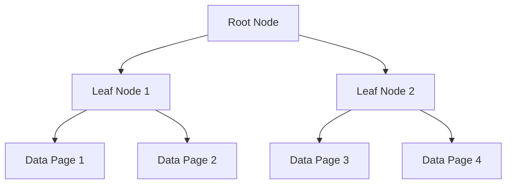

## 3.5 SQL Constraints and Indexes

In the realm of SQL databases, constraints and indexes are pivotal in ensuring data integrity and enhancing performance. As expert software engineers and architects, understanding how to effectively implement and manage these features is crucial for building robust and efficient database systems. In this section, we will delve into the various types of constraints and indexes, their purposes, and best practices for their use.

### Implementing Constraints: Techniques for Enforcing Business Rules

Constraints in SQL are rules applied to table columns to enforce data integrity and business logic. They ensure that the data stored in the database adheres to specific rules and conditions, preventing invalid data entry and maintaining consistency across the database.

#### Types of SQL Constraints

1. **Primary Key Constraint**: 
   - **Purpose**: Uniquely identifies each row in a table.
   - **Characteristics**: A primary key must contain unique values and cannot contain NULLs.
   - **Example**:
     ```sql
     CREATE TABLE Employees (
         EmployeeID INT PRIMARY KEY,
         FirstName VARCHAR(50),
         LastName VARCHAR(50)
     );
     ```

2. **Foreign Key Constraint**:
   - **Purpose**: Establishes a relationship between two tables, ensuring referential integrity.
   - **Characteristics**: A foreign key in one table points to a primary key in another table.
   - **Example**:
     ```sql
     CREATE TABLE Orders (
         OrderID INT PRIMARY KEY,
         OrderDate DATE,
         CustomerID INT,
         FOREIGN KEY (CustomerID) REFERENCES Customers(CustomerID)
     );
     ```

3. **Unique Constraint**:
   - **Purpose**: Ensures all values in a column are distinct.
   - **Characteristics**: Allows NULLs, but only one NULL per column.
   - **Example**:
     ```sql
     CREATE TABLE Products (
         ProductID INT PRIMARY KEY,
         ProductName VARCHAR(100) UNIQUE
     );
     ```

4. **Check Constraint**:
   - **Purpose**: Validates data based on a Boolean expression.
   - **Characteristics**: Ensures that all values in a column satisfy a specific condition.
   - **Example**:
     ```sql
     CREATE TABLE Employees (
         EmployeeID INT PRIMARY KEY,
         Age INT CHECK (Age >= 18)
     );
     ```

5. **Default Constraint**:
   - **Purpose**: Assigns a default value to a column if no value is specified.
   - **Characteristics**: Automatically inserts the default value when no other value is provided.
   - **Example**:
     ```sql
     CREATE TABLE Orders (
         OrderID INT PRIMARY KEY,
         OrderDate DATE DEFAULT GETDATE()
     );
     ```

#### Best Practices for Using Constraints

- **Define Constraints at the Table Level**: This enhances readability and ensures that constraints are applied consistently.
- **Use Descriptive Names**: Naming constraints clearly (e.g., `CHK_Age`) helps in understanding their purpose and simplifies maintenance.
- **Leverage Constraints for Data Validation**: Use constraints to enforce business rules directly in the database, reducing the need for application-level validation.
- **Regularly Review Constraints**: As business requirements evolve, ensure that constraints remain relevant and effective.

### Indexes: Speeding Up Data Retrieval

Indexes are database objects that improve the speed of data retrieval operations on a database table at the cost of additional writes and storage space. They are crucial for optimizing query performance, especially in large databases.

#### Purpose of Indexes

Indexes work by creating a data structure (usually a B-tree or hash table) that allows the database engine to quickly locate and access the data without scanning the entire table. This significantly reduces the time complexity of data retrieval operations.

#### Types of Indexes

1. **Clustered Index**:
   - **Purpose**: Determines the physical order of data in a table.
   - **Characteristics**: A table can have only one clustered index, as it defines the order of the rows.
   - **Example**:
     ```sql
     CREATE CLUSTERED INDEX idx_EmployeeID ON Employees(EmployeeID);
     ```

2. **Non-Clustered Index**:
   - **Purpose**: Provides a logical order for data retrieval without affecting the physical order.
   - **Characteristics**: A table can have multiple non-clustered indexes.
   - **Example**:
     ```sql
     CREATE NONCLUSTERED INDEX idx_LastName ON Employees(LastName);
     ```

3. **Unique Index**:
   - **Purpose**: Ensures that all values in the index are distinct.
   - **Characteristics**: Similar to a unique constraint but can be applied to multiple columns.
   - **Example**:
     ```sql
     CREATE UNIQUE INDEX idx_UniqueProductName ON Products(ProductName);
     ```

4. **Full-Text Index**:
   - **Purpose**: Optimizes text-based searches, allowing complex queries on string data.
   - **Characteristics**: Useful for searching large text fields.
   - **Example**:
     ```sql
     CREATE FULLTEXT INDEX ON Documents(Content) KEY INDEX PK_Documents;
     ```

#### Index Management: Monitoring and Optimizing Index Usage

- **Analyze Query Performance**: Use tools like SQL Server Profiler or EXPLAIN PLAN to identify slow queries and determine if indexing can help.
- **Regularly Rebuild and Reorganize Indexes**: Over time, indexes can become fragmented, impacting performance. Regular maintenance is essential.
- **Consider Index Selectivity**: High selectivity (unique values) is ideal for indexes, as it reduces the number of rows scanned.
- **Avoid Over-Indexing**: While indexes speed up reads, they can slow down writes. Balance is key.

#### Balancing Act: Trade-offs Between Read Performance and Write Overhead

Indexes improve read performance but can introduce overhead during data modification operations (INSERT, UPDATE, DELETE). It's crucial to strike a balance between read and write performance by carefully selecting which columns to index.

### Visualizing Index Structures

To better understand how indexes work, let's visualize a simple B-tree structure, which is commonly used in database indexing.



**Diagram Description**: This diagram represents a B-tree structure, where the root node points to leaf nodes, which in turn point to data pages. This hierarchical structure allows for efficient data retrieval.

### Try It Yourself

Experiment with creating and managing indexes in your database. Try adding a new index to a frequently queried column and observe the impact on query performance. Consider removing an index and noting the effect on write operations.

### References and Links

- [SQL Constraints - W3Schools](https://www.w3schools.com/sql/sql_constraints.asp)
- [Indexing in SQL - MDN Web Docs](https://developer.mozilla.org/en-US/docs/Web/SQL/Indexing)

### Knowledge Check

- **What is the primary purpose of a foreign key constraint?**
- **How does a clustered index differ from a non-clustered index?**
- **Why is it important to regularly rebuild indexes?**

### Embrace the Journey

Remember, mastering SQL constraints and indexes is a journey. As you continue to explore and experiment, you'll gain deeper insights into optimizing database performance. Stay curious, keep learning, and enjoy the process!

## Quiz Time!



### What is the primary purpose of a primary key constraint?

- [x] To uniquely identify each row in a table
- [ ] To enforce referential integrity between tables
- [ ] To ensure all values in a column are distinct
- [ ] To assign a default value to a column

> **Explanation:** A primary key constraint uniquely identifies each row in a table, ensuring that each entry is distinct and not null.

### Which constraint ensures that all values in a column are distinct?

- [ ] Primary Key
- [x] Unique
- [ ] Foreign Key
- [ ] Check

> **Explanation:** A unique constraint ensures that all values in a column are distinct, allowing only one NULL value.

### What is a clustered index?

- [x] An index that determines the physical order of data in a table
- [ ] An index that provides a logical order for data retrieval
- [ ] An index that ensures all values are distinct
- [ ] An index that optimizes text-based searches

> **Explanation:** A clustered index determines the physical order of data in a table, allowing only one per table.

### How does a non-clustered index differ from a clustered index?

- [x] It provides a logical order for data retrieval without affecting physical order
- [ ] It determines the physical order of data in a table
- [ ] It ensures all values are distinct
- [ ] It optimizes text-based searches

> **Explanation:** A non-clustered index provides a logical order for data retrieval without affecting the physical order of data in the table.

### Why is it important to regularly rebuild indexes?

- [x] To prevent fragmentation and maintain performance
- [ ] To ensure all values in a column are distinct
- [ ] To enforce referential integrity between tables
- [ ] To assign a default value to a column

> **Explanation:** Regularly rebuilding indexes prevents fragmentation, which can degrade performance over time.

### What is the purpose of a foreign key constraint?

- [ ] To uniquely identify each row in a table
- [x] To enforce referential integrity between tables
- [ ] To ensure all values in a column are distinct
- [ ] To assign a default value to a column

> **Explanation:** A foreign key constraint enforces referential integrity between tables, ensuring that relationships are maintained.

### Which type of index is used for optimizing text-based searches?

- [ ] Clustered Index
- [ ] Non-Clustered Index
- [ ] Unique Index
- [x] Full-Text Index

> **Explanation:** A full-text index is used for optimizing text-based searches, allowing complex queries on string data.

### What is the trade-off of using indexes in a database?

- [x] Improved read performance but increased write overhead
- [ ] Improved write performance but decreased read performance
- [ ] Increased storage space but decreased query complexity
- [ ] Decreased storage space but increased query complexity

> **Explanation:** Indexes improve read performance but can increase write overhead due to the additional data structures that need to be maintained.

### How can you ensure that a column does not accept NULL values?

- [x] Use a NOT NULL constraint
- [ ] Use a UNIQUE constraint
- [ ] Use a CHECK constraint
- [ ] Use a DEFAULT constraint

> **Explanation:** A NOT NULL constraint ensures that a column does not accept NULL values, requiring a value for each row.

### True or False: A table can have multiple clustered indexes.

- [ ] True
- [x] False

> **Explanation:** A table can have only one clustered index because it defines the physical order of the data in the table.


