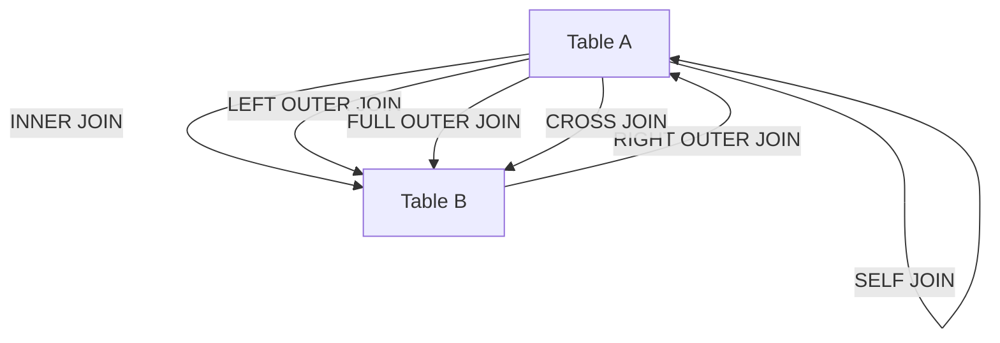

## 3.6 Advanced Joins: INNER, OUTER, CROSS, SELF

In the realm of SQL, joins are a fundamental concept that allows us to retrieve data from multiple tables based on a related column. Understanding and mastering the different types of joins is crucial for any software engineer or architect aiming to design efficient and scalable database solutions. In this section, we will delve into advanced join techniques, including INNER, OUTER, CROSS, and SELF joins, providing detailed explanations, code examples, and visualizations to enhance your understanding.

### INNER JOIN

**Intent:** The INNER JOIN is used to return rows when there is a match in both tables being joined. It is the most common type of join and is often the default join type in SQL queries.

**Key Participants:**
- **Table A**: The first table in the join operation.
- **Table B**: The second table in the join operation.

**Applicability:** Use INNER JOIN when you need to retrieve records that have matching values in both tables.

**Sample Code Snippet:**

```sql
SELECT employees.name, departments.department_name
FROM employees
INNER JOIN departments ON employees.department_id = departments.id;
```

**Explanation:** This query retrieves the names of employees and their corresponding department names by matching the `department_id` in the `employees` table with the `id` in the `departments` table.

**Design Considerations:** 
- Ensure that the columns used for joining have indexes to improve performance.
- Be aware that INNER JOIN will exclude rows that do not have matching values in both tables.

### LEFT/RIGHT OUTER JOIN

**Intent:** OUTER JOINs are used to include non-matching rows from one or both tables. LEFT OUTER JOIN returns all rows from the left table and the matched rows from the right table. RIGHT OUTER JOIN does the opposite.

**Key Participants:**
- **Left Table**: The table from which all rows are returned.
- **Right Table**: The table from which only matching rows are returned.

**Applicability:** Use LEFT or RIGHT OUTER JOIN when you need to include all records from one table and the matched records from the other.

**Sample Code Snippet:**

```sql
-- LEFT OUTER JOIN Example
SELECT employees.name, departments.department_name
FROM employees
LEFT OUTER JOIN departments ON employees.department_id = departments.id;

-- RIGHT OUTER JOIN Example
SELECT employees.name, departments.department_name
FROM employees
RIGHT OUTER JOIN departments ON employees.department_id = departments.id;
```

**Explanation:** The LEFT OUTER JOIN example retrieves all employees and their department names, including employees without a department. The RIGHT OUTER JOIN example retrieves all departments and their employees, including departments without employees.

**Design Considerations:**
- Consider the impact of NULL values in the result set.
- Use RIGHT OUTER JOIN sparingly as it can often be rewritten as a LEFT OUTER JOIN for clarity.

### FULL OUTER JOIN

**Intent:** FULL OUTER JOIN combines the results of both LEFT and RIGHT OUTER JOINs, returning all rows from both tables, with NULLs in place where there is no match.

**Key Participants:**
- **Table A**: The first table in the join operation.
- **Table B**: The second table in the join operation.

**Applicability:** Use FULL OUTER JOIN when you need to include all records from both tables, regardless of whether there is a match.

**Sample Code Snippet:**

```sql
SELECT employees.name, departments.department_name
FROM employees
FULL OUTER JOIN departments ON employees.department_id = departments.id;
```

**Explanation:** This query retrieves all employees and departments, including those without a match in the other table.

**Design Considerations:**
- FULL OUTER JOINs can be resource-intensive; ensure that they are necessary for your use case.
- Be prepared to handle NULL values in your application logic.

### CROSS JOIN

**Intent:** CROSS JOIN produces a Cartesian product of the two tables, combining each row from the first table with every row from the second table.

**Key Participants:**
- **Table A**: The first table in the join operation.
- **Table B**: The second table in the join operation.

**Applicability:** Use CROSS JOIN when you need to generate combinations of rows from two tables.

**Sample Code Snippet:**

```sql
SELECT employees.name, departments.department_name
FROM employees
CROSS JOIN departments;
```

**Explanation:** This query generates all possible combinations of employees and departments.

**Design Considerations:**
- CROSS JOINs can result in large result sets; use them judiciously.
- Ensure that a Cartesian product is truly needed for your application logic.

### SELF JOIN

**Intent:** SELF JOIN is used to join a table to itself, often for hierarchical data or when comparing rows within the same table.

**Key Participants:**
- **Table A**: The table being joined to itself.

**Applicability:** Use SELF JOIN when you need to compare rows within the same table or model hierarchical relationships.

**Sample Code Snippet:**

```sql
SELECT e1.name AS Employee, e2.name AS Manager
FROM employees e1
INNER JOIN employees e2 ON e1.manager_id = e2.id;
```

**Explanation:** This query retrieves employees and their managers by joining the `employees` table to itself.

**Design Considerations:**
- SELF JOINs can be complex to understand; ensure that the join condition is clear.
- Consider using aliases to differentiate between the two instances of the table.

### Visualizing SQL Joins

To better understand how these joins work, let's visualize them using a Venn diagram representation.



**Description:** This diagram illustrates the relationships between tables in different types of joins. Each arrow represents a join operation, showing how rows from one table relate to rows in another.

### Try It Yourself

Experiment with the code examples provided by modifying the table names, columns, and join conditions. Try creating your own tables and performing different types of joins to see how the results change. This hands-on practice will reinforce your understanding of SQL joins.

### References and Links

- [SQL Joins on W3Schools](https://www.w3schools.com/sql/sql_join.asp)
- [SQL Joins on MDN Web Docs](https://developer.mozilla.org/en-US/docs/Web/SQL/Join)
- [Advanced SQL Joins on GeeksforGeeks](https://www.geeksforgeeks.org/sql-join-set-1-inner-left-right-and-full-joins/)

### Knowledge Check

- What is the difference between INNER JOIN and OUTER JOIN?
- How does a CROSS JOIN differ from other types of joins?
- When would you use a SELF JOIN?
- What are the potential pitfalls of using FULL OUTER JOIN?

### Embrace the Journey

Remember, mastering SQL joins is a journey. As you progress, you'll be able to design more complex queries and optimize your database interactions. Keep experimenting, stay curious, and enjoy the process of learning and applying these powerful SQL techniques!

## Quiz Time!



### What is the primary purpose of an INNER JOIN?

- [x] To return rows with matching values in both tables.
- [ ] To return all rows from the left table.
- [ ] To return all rows from the right table.
- [ ] To produce a Cartesian product of two tables.

> **Explanation:** INNER JOIN returns rows where there is a match in both tables.

### Which join type includes all rows from the left table and matched rows from the right table?

- [x] LEFT OUTER JOIN
- [ ] RIGHT OUTER JOIN
- [ ] FULL OUTER JOIN
- [ ] CROSS JOIN

> **Explanation:** LEFT OUTER JOIN includes all rows from the left table and matched rows from the right table.

### What does a CROSS JOIN produce?

- [x] A Cartesian product of two tables.
- [ ] Only matching rows from both tables.
- [ ] All rows from the left table.
- [ ] All rows from the right table.

> **Explanation:** CROSS JOIN produces a Cartesian product, combining each row from the first table with every row from the second table.

### When would you use a SELF JOIN?

- [x] To join a table to itself.
- [ ] To join two different tables.
- [ ] To produce a Cartesian product.
- [ ] To include all rows from both tables.

> **Explanation:** SELF JOIN is used to join a table to itself, often for hierarchical data.

### What is a potential drawback of using FULL OUTER JOIN?

- [x] It can be resource-intensive and result in NULL values.
- [ ] It only returns matching rows.
- [ ] It produces a Cartesian product.
- [ ] It excludes non-matching rows.

> **Explanation:** FULL OUTER JOIN can be resource-intensive and result in NULL values where there is no match.

### Which join type can result in a large result set and should be used judiciously?

- [x] CROSS JOIN
- [ ] INNER JOIN
- [ ] LEFT OUTER JOIN
- [ ] RIGHT OUTER JOIN

> **Explanation:** CROSS JOIN can result in a large result set as it produces a Cartesian product.

### What is the key difference between LEFT OUTER JOIN and RIGHT OUTER JOIN?

- [x] LEFT OUTER JOIN returns all rows from the left table, RIGHT OUTER JOIN returns all rows from the right table.
- [ ] LEFT OUTER JOIN returns all rows from the right table, RIGHT OUTER JOIN returns all rows from the left table.
- [ ] Both return only matching rows.
- [ ] Both produce a Cartesian product.

> **Explanation:** LEFT OUTER JOIN returns all rows from the left table, while RIGHT OUTER JOIN returns all rows from the right table.

### How can you differentiate between two instances of the same table in a SELF JOIN?

- [x] By using table aliases.
- [ ] By using different column names.
- [ ] By using different table names.
- [ ] By using different databases.

> **Explanation:** Table aliases are used to differentiate between two instances of the same table in a SELF JOIN.

### What is the result of an INNER JOIN if there are no matching rows?

- [x] An empty result set.
- [ ] All rows from the left table.
- [ ] All rows from the right table.
- [ ] A Cartesian product.

> **Explanation:** If there are no matching rows, INNER JOIN results in an empty result set.

### TRUE or FALSE: FULL OUTER JOIN combines the results of both LEFT and RIGHT OUTER JOINs.

- [x] True
- [ ] False

> **Explanation:** FULL OUTER JOIN combines the results of both LEFT and RIGHT OUTER JOINs, including all rows from both tables.


