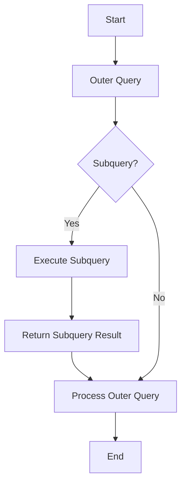

## 3.7 Subqueries and Correlated Queries

In the realm of SQL, subqueries and correlated queries are powerful tools that allow developers to perform complex data retrieval and manipulation tasks. These nested queries can be used to filter data, perform calculations, and implement conditional logic within a single SQL statement. In this section, we will delve into the intricacies of subqueries and correlated queries, exploring their use cases, performance considerations, and best practices.

### Understanding Subqueries

**Subqueries**, also known as inner queries or nested queries, are queries embedded within another SQL query. They are typically enclosed in parentheses and can be used in various parts of a SQL statement, such as the `SELECT`, `FROM`, `WHERE`, or `HAVING` clauses. Subqueries can return a single value, a list of values, or a complete result set, depending on their context and usage.

#### Types of Subqueries

1. **Single-Value Subqueries**: Return a single value, often used in the `WHERE` clause for comparison.
2. **Multi-Value Subqueries**: Return a list of values, commonly used with `IN` or `ANY` operators.
3. **Table Subqueries**: Return a complete result set, used in the `FROM` clause as a derived table.

#### Example of a Simple Subquery

Let's consider a scenario where we want to find employees who earn more than the average salary in their department. We can achieve this using a subquery:

```sql
SELECT employee_id, employee_name, salary
FROM employees
WHERE salary > (
    SELECT AVG(salary)
    FROM employees
    WHERE department_id = employees.department_id
);
```

In this example, the subquery calculates the average salary for each department, and the outer query retrieves employees whose salary exceeds this average.

### Correlated Subqueries

**Correlated Subqueries** are a special type of subquery that reference columns from the outer query. Unlike regular subqueries, correlated subqueries are executed once for each row processed by the outer query. This makes them more dynamic but potentially less efficient than non-correlated subqueries.

#### Example of a Correlated Subquery

Suppose we want to find employees who have the highest salary in their department. A correlated subquery can be used:

```sql
SELECT employee_id, employee_name, salary
FROM employees e1
WHERE salary = (
    SELECT MAX(salary)
    FROM employees e2
    WHERE e2.department_id = e1.department_id
);
```

Here, the subquery is correlated because it references `e1.department_id` from the outer query. It finds the maximum salary for each department, and the outer query retrieves employees with that salary.

### Use Cases for Subqueries and Correlated Queries

Subqueries and correlated queries are versatile tools in SQL, with several practical applications:

1. **Filtering Data**: Subqueries can be used to filter data based on complex conditions that are not easily expressed with simple comparisons.
2. **Calculations**: Perform calculations that require intermediate results, such as averages, sums, or counts.
3. **Conditional Logic**: Implement conditional logic within SQL statements, allowing for more dynamic and flexible queries.

### Performance Considerations

While subqueries and correlated queries offer powerful capabilities, they can also impact performance if not used judiciously. Here are some considerations:

1. **Execution Frequency**: Correlated subqueries are executed once for each row processed by the outer query, which can lead to performance issues with large datasets.
2. **Indexing**: Proper indexing can significantly improve the performance of subqueries, especially when they involve large tables or complex joins.
3. **Alternatives**: In some cases, using joins or Common Table Expressions (CTEs) can provide better performance and readability than subqueries.

### Best Practices for Using Subqueries and Correlated Queries

1. **Optimize Subquery Execution**: Ensure that subqueries are optimized for performance by using indexes and avoiding unnecessary computations.
2. **Use Joins When Appropriate**: Consider using joins instead of subqueries when they provide better performance or readability.
3. **Limit Correlated Subqueries**: Use correlated subqueries sparingly, as they can be less efficient than non-correlated subqueries.
4. **Test and Profile Queries**: Regularly test and profile queries to identify performance bottlenecks and optimize them accordingly.

### Visualizing Subqueries and Correlated Queries

To better understand the execution flow of subqueries and correlated queries, let's visualize the process using a flowchart:



This flowchart illustrates the decision-making process involved in executing a SQL query with a subquery. If a subquery is present, it is executed first, and its result is used to process the outer query.

### Try It Yourself

To deepen your understanding of subqueries and correlated queries, try modifying the examples provided:

1. **Modify the Simple Subquery**: Change the condition to find employees who earn less than the average salary in their department.
2. **Experiment with Correlated Subqueries**: Adjust the correlated subquery to find employees with the lowest salary in their department.

### References and Further Reading

- [W3Schools: SQL Subqueries](https://www.w3schools.com/sql/sql_subqueries.asp)
- [MDN Web Docs: SQL Subqueries](https://developer.mozilla.org/en-US/docs/Web/SQL/Guide/Using_subqueries)
- [SQL Performance Explained](https://sql-performance-explained.com/)

### Knowledge Check

To reinforce your understanding of subqueries and correlated queries, consider the following questions:

1. What is the primary difference between a subquery and a correlated subquery?
2. How can subqueries be used to filter data in SQL?
3. What are some performance considerations when using subqueries?
4. When might it be more appropriate to use a join instead of a subquery?

### Embrace the Journey

Remember, mastering subqueries and correlated queries is just one step in your journey to becoming an expert SQL developer. As you continue to explore and experiment with these concepts, you'll gain the skills and confidence needed to tackle even the most complex database challenges. Keep experimenting, stay curious, and enjoy the journey!

---

## Quiz Time!



### What is a subquery in SQL?

- [x] A query nested within another query
- [ ] A query that only returns a single value
- [ ] A query that is always correlated
- [ ] A query that cannot be used in the WHERE clause

> **Explanation:** A subquery is a query nested within another query and can be used in various clauses such as SELECT, FROM, WHERE, or HAVING.

### Which of the following is true about correlated subqueries?

- [x] They reference columns from the outer query
- [ ] They are always more efficient than non-correlated subqueries
- [ ] They cannot be used in the SELECT clause
- [ ] They are executed only once

> **Explanation:** Correlated subqueries reference columns from the outer query and are executed once for each row processed by the outer query.

### In which clause can a subquery be used?

- [x] SELECT
- [x] FROM
- [x] WHERE
- [x] HAVING

> **Explanation:** Subqueries can be used in the SELECT, FROM, WHERE, and HAVING clauses.

### What is a potential drawback of using correlated subqueries?

- [x] They can be less efficient due to repeated execution
- [ ] They cannot return multiple values
- [ ] They are not supported by all SQL databases
- [ ] They cannot be used with joins

> **Explanation:** Correlated subqueries can be less efficient because they are executed once for each row processed by the outer query.

### How can subqueries be optimized for performance?

- [x] By using indexes
- [ ] By avoiding the WHERE clause
- [ ] By using only single-value subqueries
- [ ] By using correlated subqueries exclusively

> **Explanation:** Subqueries can be optimized by using indexes, which can improve performance, especially with large tables.

### When might it be more appropriate to use a join instead of a subquery?

- [x] When performance is a concern
- [ ] When only single-value results are needed
- [ ] When the database does not support joins
- [ ] When the query is very simple

> **Explanation:** Joins can often provide better performance and readability than subqueries, especially with large datasets.

### What is a single-value subquery?

- [x] A subquery that returns a single value
- [ ] A subquery that returns a list of values
- [ ] A subquery that returns a complete result set
- [ ] A subquery that cannot be used in the SELECT clause

> **Explanation:** A single-value subquery returns a single value and is often used in the WHERE clause for comparison.

### What is the purpose of using subqueries in SQL?

- [x] To perform complex data retrieval and manipulation tasks
- [ ] To simplify the SQL syntax
- [ ] To avoid using joins
- [ ] To ensure queries are always efficient

> **Explanation:** Subqueries are used to perform complex data retrieval and manipulation tasks within a single SQL statement.

### Which of the following is a use case for subqueries?

- [x] Filtering data based on complex conditions
- [ ] Simplifying SQL syntax
- [ ] Avoiding the use of indexes
- [ ] Ensuring queries are always efficient

> **Explanation:** Subqueries can be used to filter data based on complex conditions that are not easily expressed with simple comparisons.

### True or False: Correlated subqueries are always more efficient than non-correlated subqueries.

- [ ] True
- [x] False

> **Explanation:** Correlated subqueries are not always more efficient; they can be less efficient due to repeated execution for each row processed by the outer query.



---
