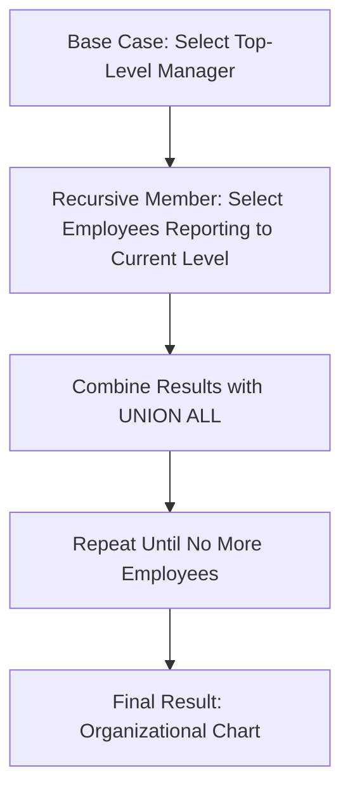

## 3.8 Common Table Expressions (CTEs) and Recursive Queries

In the realm of SQL, Common Table Expressions (CTEs) and Recursive Queries stand out as powerful tools for enhancing query readability, modularity, and efficiency. As expert software engineers and architects, mastering these features is crucial for tackling complex data retrieval tasks and optimizing database performance. In this section, we will delve into the syntax, benefits, and practical applications of CTEs and Recursive Queries, providing you with the knowledge to leverage these techniques effectively.

### Understanding Common Table Expressions (CTEs)

**Common Table Expressions (CTEs)** are temporary result sets that you can reference within a `SELECT`, `INSERT`, `UPDATE`, or `DELETE` statement. They are defined using the `WITH` clause and offer a way to simplify complex queries by breaking them into more manageable parts.

#### Syntax of CTEs

The basic syntax for a CTE is as follows:

```sql
WITH cte_name (column1, column2, ...) AS (
    -- CTE query definition
    SELECT ...
)
SELECT * FROM cte_name;
```

- **`WITH` Clause**: Initiates the CTE.
- **`cte_name`**: The name of the CTE, which can be referenced in subsequent queries.
- **Column List**: Optional list of column names for the CTE.
- **CTE Query Definition**: The query that defines the CTE.

#### Benefits of Using CTEs

1. **Improved Readability**: CTEs allow you to break down complex queries into simpler, more readable parts.
2. **Modularity**: By defining reusable query components, CTEs promote modularity and maintainability.
3. **Encapsulation**: CTEs encapsulate logic, making it easier to understand and modify queries.
4. **Recursion**: CTEs support recursive queries, enabling efficient hierarchical data retrieval.

### Implementing Recursive CTEs

**Recursive CTEs** are a special type of CTE that allow you to perform recursive operations, making them ideal for querying hierarchical data structures such as organizational charts or bill of materials.

#### Structure of Recursive CTEs

A recursive CTE consists of two parts:

1. **Base Case**: The initial query that provides the starting point for recursion.
2. **Recursive Member**: The query that references the CTE itself, allowing for iteration.

The syntax for a recursive CTE is as follows:

```sql
WITH RECURSIVE cte_name (column1, column2, ...) AS (
    -- Base case
    SELECT ...
    UNION ALL
    -- Recursive member
    SELECT ...
    FROM cte_name
    WHERE ...
)
SELECT * FROM cte_name;
```

- **`UNION ALL`**: Combines the results of the base case and recursive member.
- **Recursive Reference**: The recursive member references the CTE, enabling iteration.

#### Example: Organizational Chart

Let's consider an example of querying an organizational chart using a recursive CTE. Suppose we have a table `employees` with columns `employee_id`, `employee_name`, and `manager_id`.

```sql
CREATE TABLE employees (
    employee_id INT PRIMARY KEY,
    employee_name VARCHAR(100),
    manager_id INT
);

INSERT INTO employees (employee_id, employee_name, manager_id) VALUES
(1, 'Alice', NULL),
(2, 'Bob', 1),
(3, 'Charlie', 1),
(4, 'David', 2),
(5, 'Eve', 2);

WITH RECURSIVE org_chart AS (
    -- Base case: Select the top-level manager
    SELECT employee_id, employee_name, manager_id, 1 AS level
    FROM employees
    WHERE manager_id IS NULL
    UNION ALL
    -- Recursive member: Select employees reporting to the current level
    SELECT e.employee_id, e.employee_name, e.manager_id, oc.level + 1
    FROM employees e
    INNER JOIN org_chart oc ON e.manager_id = oc.employee_id
)
SELECT employee_id, employee_name, level
FROM org_chart;
```

In this example, the recursive CTE `org_chart` starts with the top-level manager (`Alice`) and iteratively retrieves employees reporting to each manager, building the organizational hierarchy.

### Visualizing Recursive CTEs

To better understand the flow of a recursive CTE, let's visualize the process using a flowchart:



This flowchart illustrates the iterative process of a recursive CTE, starting with the base case and repeatedly applying the recursive member until all levels of the hierarchy are retrieved.

### Practical Applications of CTEs and Recursive Queries

CTEs and Recursive Queries are versatile tools with numerous practical applications:

1. **Hierarchical Data Retrieval**: Efficiently query hierarchical structures like organizational charts, file systems, and bill of materials.
2. **Data Transformation**: Simplify complex data transformations by breaking them into manageable steps.
3. **Reporting and Analytics**: Enhance reporting queries by encapsulating logic and improving readability.
4. **Graph Traversal**: Perform graph traversal operations, such as finding shortest paths or connected components.

### Design Considerations

When using CTEs and Recursive Queries, consider the following:

- **Performance**: Recursive queries can be resource-intensive. Optimize by limiting recursion depth and using appropriate indexes.
- **Termination**: Ensure recursive queries have a termination condition to prevent infinite loops.
- **Readability**: Use descriptive names for CTEs and columns to enhance readability and maintainability.

### Differences and Similarities

CTEs and Recursive Queries are often compared to subqueries and temporary tables. Here are some key differences and similarities:

- **CTEs vs. Subqueries**: CTEs improve readability and modularity, while subqueries are inline and may be less readable.
- **CTEs vs. Temporary Tables**: CTEs are transient and exist only during query execution, whereas temporary tables persist for the session.
- **Recursive CTEs vs. Loops**: Recursive CTEs are declarative and set-based, while loops are procedural and may require more complex logic.

### Try It Yourself

To deepen your understanding, try modifying the organizational chart example:

- **Add More Levels**: Insert additional employees with varying levels of hierarchy and observe the query results.
- **Filter by Level**: Modify the query to filter employees by a specific level in the hierarchy.
- **Calculate Depth**: Extend the query to calculate the depth of each employee in the hierarchy.

### References and Links

For further reading on CTEs and Recursive Queries, consider the following resources:

- [SQL Server CTE Documentation](https://docs.microsoft.com/en-us/sql/t-sql/queries/select-common-table-expressions-cte)
- [PostgreSQL Recursive Queries](https://www.postgresql.org/docs/current/queries-with.html)
- [Oracle Recursive Subquery Factoring](https://docs.oracle.com/en/database/oracle/oracle-database/19/sqlrf/SELECT.html#GUID-3E5D9A8A-3F5E-4E4C-9F3D-1B7F7A1B8A3B)

### Knowledge Check

To reinforce your understanding, consider the following questions:

- What are the key benefits of using CTEs in SQL queries?
- How do recursive CTEs differ from regular CTEs?
- What are some practical applications of recursive queries in database design?

### Embrace the Journey

Remember, mastering CTEs and Recursive Queries is a journey. As you experiment and apply these techniques, you'll gain deeper insights into SQL's capabilities. Keep exploring, stay curious, and enjoy the process of enhancing your database design skills!

## Quiz Time!



### What is the primary purpose of a Common Table Expression (CTE)?

- [x] To simplify complex queries by breaking them into manageable parts
- [ ] To permanently store query results in the database
- [ ] To replace all subqueries in SQL
- [ ] To enforce data integrity constraints

> **Explanation:** CTEs are used to simplify complex queries by breaking them into more readable and manageable parts.

### How does a recursive CTE differ from a regular CTE?

- [x] It includes a base case and a recursive member
- [ ] It can only be used with SELECT statements
- [ ] It requires a temporary table to function
- [ ] It is limited to a single level of recursion

> **Explanation:** A recursive CTE includes a base case and a recursive member, allowing it to perform iterative operations.

### Which SQL clause is used to define a CTE?

- [x] WITH
- [ ] SELECT
- [ ] FROM
- [ ] WHERE

> **Explanation:** The `WITH` clause is used to define a CTE in SQL.

### What is a common use case for recursive CTEs?

- [x] Querying hierarchical data structures
- [ ] Performing simple arithmetic operations
- [ ] Enforcing foreign key constraints
- [ ] Creating database indexes

> **Explanation:** Recursive CTEs are commonly used for querying hierarchical data structures like organizational charts.

### What is the role of the UNION ALL operator in a recursive CTE?

- [x] To combine the results of the base case and recursive member
- [ ] To filter out duplicate rows
- [ ] To enforce data integrity
- [ ] To create a temporary table

> **Explanation:** The `UNION ALL` operator combines the results of the base case and recursive member in a recursive CTE.

### What should you consider when using recursive CTEs?

- [x] Performance and termination conditions
- [ ] Only using them for simple queries
- [ ] Avoiding them in all production environments
- [ ] Using them to replace all subqueries

> **Explanation:** When using recursive CTEs, consider performance and ensure there are termination conditions to prevent infinite loops.

### How can you optimize a recursive CTE?

- [x] Limit recursion depth and use appropriate indexes
- [ ] Use temporary tables instead
- [ ] Avoid using the UNION ALL operator
- [ ] Only use them for small datasets

> **Explanation:** Optimizing a recursive CTE involves limiting recursion depth and using appropriate indexes to enhance performance.

### What is a key difference between CTEs and temporary tables?

- [x] CTEs are transient and exist only during query execution
- [ ] CTEs persist for the session
- [ ] Temporary tables are more readable
- [ ] Temporary tables are used only for recursive queries

> **Explanation:** CTEs are transient and exist only during query execution, while temporary tables persist for the session.

### Which of the following is NOT a benefit of using CTEs?

- [ ] Improved readability
- [ ] Modularity
- [x] Permanent storage of results
- [ ] Encapsulation

> **Explanation:** CTEs do not provide permanent storage of results; they are used for improved readability, modularity, and encapsulation.

### True or False: Recursive CTEs can be used to perform graph traversal operations.

- [x] True
- [ ] False

> **Explanation:** Recursive CTEs can be used to perform graph traversal operations, such as finding shortest paths or connected components.




