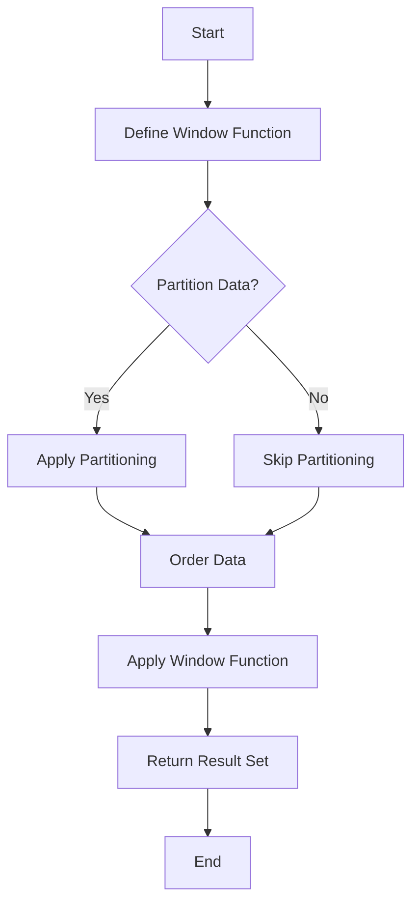

## 3.9 Window Functions and Analytic Queries

In the realm of SQL, window functions and analytic queries stand out as powerful tools for performing complex calculations across sets of rows. Unlike aggregate functions, which collapse data into a single result, window functions allow you to maintain the granularity of your data while performing calculations. This section will delve into the intricacies of window functions, their types, and practical use cases to enhance your SQL querying capabilities.

### Introduction to Window Functions

Window functions are a subset of SQL functions that perform calculations across a set of table rows related to the current row. They are called "window functions" because they operate over a "window" or a subset of rows defined by the user. This capability is particularly useful for tasks such as calculating running totals, moving averages, and ranking data.

#### Key Concepts

- **Window**: A window is a set of rows that the function operates on. It is defined using the `OVER()` clause.
- **Frame**: A subset of the window, defined using the `ROWS` or `RANGE` clause within the `OVER()` clause.
- **Partitioning**: Dividing the result set into partitions to which the window function is applied independently.
- **Ordering**: Specifying the order of rows within each partition.

### Types of Window Functions

Window functions can be categorized into three main types: ranking, aggregate, and offset functions. Each serves a distinct purpose and can be used to solve different types of problems.

#### Ranking Functions

Ranking functions assign a rank to each row within a partition of a result set. They are useful for scenarios where you need to rank items, such as determining the top-selling products.

- **`ROW_NUMBER()`**: Assigns a unique sequential integer to rows within a partition, starting at 1.
- **`RANK()`**: Similar to `ROW_NUMBER()`, but rows with equal values receive the same rank, leaving gaps in the sequence.
- **`DENSE_RANK()`**: Like `RANK()`, but without gaps in the ranking sequence.

**Example:**

```sql
SELECT 
    employee_id, 
    salary, 
    ROW_NUMBER() OVER (ORDER BY salary DESC) AS row_num,
    RANK() OVER (ORDER BY salary DESC) AS rank,
    DENSE_RANK() OVER (ORDER BY salary DESC) AS dense_rank
FROM 
    employees;
```

In this example, we rank employees based on their salary using different ranking functions.

#### Aggregate Functions

Aggregate functions perform calculations across a set of rows and return a single value. When used as window functions, they allow you to calculate aggregates without collapsing the result set.

- **`SUM()`**: Calculates the sum of values.
- **`AVG()`**: Computes the average of values.
- **`COUNT()`**: Counts the number of rows.

**Example:**

```sql
SELECT 
    department_id, 
    employee_id, 
    salary, 
    SUM(salary) OVER (PARTITION BY department_id) AS total_department_salary,
    AVG(salary) OVER (PARTITION BY department_id) AS avg_department_salary
FROM 
    employees;
```

This query calculates the total and average salary for each department without collapsing the result set.

#### Offset Functions

Offset functions provide access to a row at a given physical offset from the current row within the result set.

- **`LEAD()`**: Returns the value of a subsequent row.
- **`LAG()`**: Returns the value of a preceding row.

**Example:**

```sql
SELECT 
    employee_id, 
    salary, 
    LEAD(salary, 1) OVER (ORDER BY salary) AS next_salary,
    LAG(salary, 1) OVER (ORDER BY salary) AS previous_salary
FROM 
    employees;
```

This query retrieves the salary of the next and previous employee in the order of their salaries.

### Partitioning and Ordering

Partitioning and ordering are crucial components of window functions. They define how the data is divided and ordered for the function to operate on.

#### Partitioning

Partitioning divides the result set into partitions to which the window function is applied independently. This is done using the `PARTITION BY` clause.

**Example:**

```sql
SELECT 
    department_id, 
    employee_id, 
    salary, 
    RANK() OVER (PARTITION BY department_id ORDER BY salary DESC) AS department_rank
FROM 
    employees;
```

In this example, employees are ranked within their respective departments based on salary.

#### Ordering

Ordering specifies the order of rows within each partition. This is done using the `ORDER BY` clause within the `OVER()` clause.

**Example:**

```sql
SELECT 
    employee_id, 
    salary, 
    SUM(salary) OVER (ORDER BY hire_date) AS running_total
FROM 
    employees;
```

This query calculates a running total of salaries ordered by hire date.

### Use Cases

Window functions are versatile and can be applied to a variety of use cases. Here are a few common scenarios:

#### Running Totals

Running totals are cumulative sums that are updated as new data is added. They are useful for tracking cumulative metrics over time.

**Example:**

```sql
SELECT 
    transaction_date, 
    amount, 
    SUM(amount) OVER (ORDER BY transaction_date) AS running_total
FROM 
    transactions;
```

#### Moving Averages

Moving averages smooth out fluctuations in data by averaging values over a specified number of periods.

**Example:**

```sql
SELECT 
    transaction_date, 
    amount, 
    AVG(amount) OVER (ORDER BY transaction_date ROWS BETWEEN 2 PRECEDING AND CURRENT ROW) AS moving_average
FROM 
    transactions;
```

This query calculates a moving average over the current and two preceding rows.

### Visualizing Window Functions

To better understand how window functions operate, let's visualize the process using a diagram.



**Diagram Description:** This flowchart illustrates the process of applying a window function. It begins with defining the function, optionally partitioning the data, ordering it, applying the function, and returning the result set.

### Design Considerations

When using window functions, consider the following:

- **Performance**: Window functions can be resource-intensive, especially on large datasets. Optimize queries by indexing columns used in partitioning and ordering.
- **Complexity**: While powerful, window functions can make queries complex. Ensure clarity by commenting on your code and breaking down complex queries into smaller parts.
- **Compatibility**: Not all SQL dialects support window functions. Verify compatibility with your database system.

### Differences and Similarities

Window functions are often confused with aggregate functions. The key difference is that window functions do not collapse the result set, allowing for more granular analysis. Both types of functions can be used together to achieve complex calculations.

### Try It Yourself

Experiment with window functions by modifying the examples provided. Try changing the partitioning and ordering criteria, or use different window functions to see how the results change.

### References and Links

- [Window Functions in SQL](https://www.sqlshack.com/sql-window-functions/)
- [SQL Server Window Functions](https://docs.microsoft.com/en-us/sql/t-sql/queries/select-over-clause-transact-sql?view=sql-server-ver15)
- [PostgreSQL Window Functions](https://www.postgresql.org/docs/current/tutorial-window.html)

### Knowledge Check

- What is the primary purpose of window functions in SQL?
- How do ranking functions differ from aggregate functions?
- What is the role of partitioning in window functions?

### Embrace the Journey

Remember, mastering window functions is a journey. As you explore and experiment, you'll uncover new ways to analyze and interpret your data. Stay curious and enjoy the process!

## Quiz Time!



### What is a window function in SQL?

- [x] A function that performs calculations across a set of rows related to the current row.
- [ ] A function that aggregates data into a single result.
- [ ] A function that only operates on a single row.
- [ ] A function that modifies the structure of a table.

> **Explanation:** Window functions perform calculations across a set of rows related to the current row, unlike aggregate functions that collapse data into a single result.

### Which of the following is a ranking function in SQL?

- [x] ROW_NUMBER()
- [ ] SUM()
- [ ] LEAD()
- [ ] AVG()

> **Explanation:** `ROW_NUMBER()` is a ranking function that assigns a unique sequential integer to rows within a partition.

### What does the `PARTITION BY` clause do in a window function?

- [x] Divides the result set into partitions for the window function to operate independently.
- [ ] Orders the rows within each partition.
- [ ] Aggregates data within each partition.
- [ ] Filters rows based on a condition.

> **Explanation:** The `PARTITION BY` clause divides the result set into partitions, allowing the window function to operate independently on each partition.

### How does `RANK()` differ from `DENSE_RANK()`?

- [x] `RANK()` leaves gaps in the ranking sequence, while `DENSE_RANK()` does not.
- [ ] `RANK()` does not leave gaps, while `DENSE_RANK()` does.
- [ ] Both functions leave gaps in the ranking sequence.
- [ ] Neither function leaves gaps in the ranking sequence.

> **Explanation:** `RANK()` leaves gaps in the ranking sequence when there are ties, whereas `DENSE_RANK()` does not leave gaps.

### What is the purpose of the `LEAD()` function?

- [x] To access the value of a subsequent row.
- [ ] To access the value of a preceding row.
- [ ] To calculate the sum of values.
- [ ] To assign a rank to each row.

> **Explanation:** The `LEAD()` function provides access to the value of a subsequent row within the result set.

### Which clause is used to specify the order of rows within each partition?

- [x] ORDER BY
- [ ] PARTITION BY
- [ ] GROUP BY
- [ ] HAVING

> **Explanation:** The `ORDER BY` clause is used to specify the order of rows within each partition in a window function.

### What is a common use case for window functions?

- [x] Calculating running totals.
- [ ] Modifying table structures.
- [ ] Filtering data based on conditions.
- [ ] Joining tables.

> **Explanation:** Window functions are commonly used for calculating running totals, among other analytic tasks.

### Which function would you use to calculate a moving average?

- [x] AVG() with a window frame.
- [ ] SUM() with a window frame.
- [ ] COUNT() with a window frame.
- [ ] ROW_NUMBER() with a window frame.

> **Explanation:** The `AVG()` function, when used with a window frame, can calculate a moving average over a specified number of periods.

### True or False: Window functions collapse the result set like aggregate functions.

- [ ] True
- [x] False

> **Explanation:** Window functions do not collapse the result set; they maintain the granularity of the data while performing calculations.

### What should you consider when using window functions on large datasets?

- [x] Performance optimization, such as indexing columns used in partitioning and ordering.
- [ ] Avoiding the use of window functions altogether.
- [ ] Using window functions only on small datasets.
- [ ] Ignoring performance considerations.

> **Explanation:** Window functions can be resource-intensive, so it's important to optimize performance by indexing columns used in partitioning and ordering.




