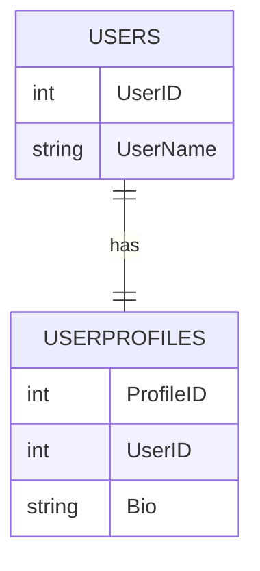
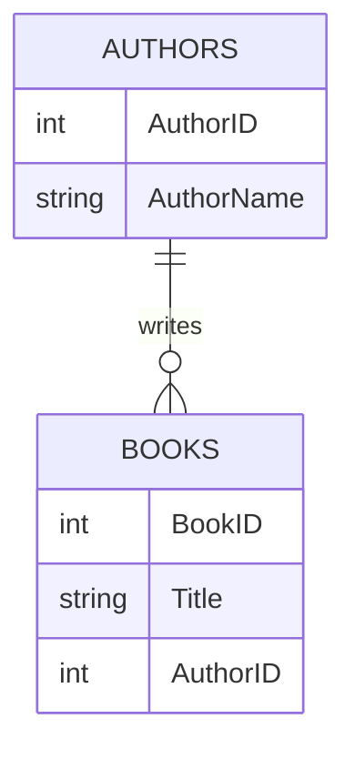
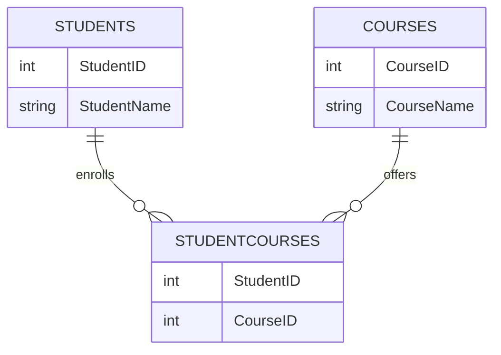

## 4.1 One-to-One, One-to-Many, and Many-to-Many Relationships

In the realm of relational databases, understanding and implementing relationships between tables is crucial for designing efficient and scalable systems. This section delves into the three fundamental types of relationships: one-to-one, one-to-many, and many-to-many. We will explore their implementation, use cases, and best practices, providing you with the knowledge to apply these patterns effectively in your database designs.

### One-to-One Relationships

#### Design Pattern Name: One-to-One Relationship

**Category**: Data Modeling

**Intent**: To establish a direct relationship between two entities where each entity instance is associated with exactly one instance of the other entity.

#### Implementation

In SQL, a one-to-one relationship is typically implemented using a foreign key with a unique constraint. This ensures that each record in the primary table corresponds to exactly one record in the related table.

**Example**: Consider a scenario where we have two tables: `Users` and `UserProfiles`. Each user has exactly one profile.

```sql
CREATE TABLE Users (
    UserID INT PRIMARY KEY,
    UserName VARCHAR(100) NOT NULL
);

CREATE TABLE UserProfiles (
    ProfileID INT PRIMARY KEY,
    UserID INT UNIQUE,
    Bio TEXT,
    FOREIGN KEY (UserID) REFERENCES Users(UserID)
);
```

In this example, the `UserProfiles` table has a foreign key `UserID` that references the `Users` table. The `UNIQUE` constraint ensures that each `UserID` appears only once in the `UserProfiles` table, establishing a one-to-one relationship.

#### Use Cases

- **Separating Optional Data**: Use one-to-one relationships to separate optional or sensitive data from the main entity. This can improve performance by allowing the main table to remain lightweight.
- **Modular Design**: Facilitate modular design by separating concerns. For example, storing user authentication details separately from user profiles.

#### Key Participants

- **Primary Table**: The main entity table (e.g., `Users`).
- **Secondary Table**: The related entity table with a foreign key (e.g., `UserProfiles`).

#### Applicability

- When each entity in a table should have exactly one corresponding entity in another table.
- When separating optional or sensitive data from the main entity.

#### Design Considerations

- Ensure that the foreign key in the secondary table is unique to maintain the one-to-one relationship.
- Consider performance implications of joining tables, especially if the secondary table contains large or sensitive data.

#### Differences and Similarities

- **Similar to One-to-Many**: Both use foreign keys, but one-to-one requires a unique constraint.
- **Different from Many-to-Many**: Does not require a junction table.

### One-to-Many Relationships

#### Design Pattern Name: One-to-Many Relationship

**Category**: Data Modeling

**Intent**: To establish a relationship where a single entity instance in one table can be associated with multiple instances in another table.

#### Implementation

A one-to-many relationship is implemented by placing a foreign key in the child table that references the primary key of the parent table.

**Example**: Consider a scenario where we have `Authors` and `Books`. Each author can write multiple books.

```sql
CREATE TABLE Authors (
    AuthorID INT PRIMARY KEY,
    AuthorName VARCHAR(100) NOT NULL
);

CREATE TABLE Books (
    BookID INT PRIMARY KEY,
    Title VARCHAR(200) NOT NULL,
    AuthorID INT,
    FOREIGN KEY (AuthorID) REFERENCES Authors(AuthorID)
);
```

In this example, the `Books` table has a foreign key `AuthorID` that references the `Authors` table, establishing a one-to-many relationship.

#### Use Cases

- **Standard Parent-Child Relationships**: Such as authors and books, customers and orders, or departments and employees.
- **Hierarchical Data**: Representing hierarchical data structures like organizational charts.

#### Key Participants

- **Parent Table**: The main entity table (e.g., `Authors`).
- **Child Table**: The related entity table with a foreign key (e.g., `Books`).

#### Applicability

- When a single entity in one table can be associated with multiple entities in another table.
- When modeling hierarchical or parent-child relationships.

#### Design Considerations

- Ensure referential integrity by enforcing foreign key constraints.
- Consider indexing the foreign key column in the child table for performance optimization.

#### Differences and Similarities

- **Similar to One-to-One**: Both use foreign keys, but one-to-many does not require a unique constraint.
- **Different from Many-to-Many**: Does not require a junction table.

### Many-to-Many Relationships

#### Design Pattern Name: Many-to-Many Relationship

**Category**: Data Modeling

**Intent**: To establish a relationship where multiple instances of one entity can be associated with multiple instances of another entity.

#### Implementation

A many-to-many relationship is implemented using a junction (association) table that contains foreign keys referencing the primary keys of the two related tables.

**Example**: Consider a scenario where we have `Students` and `Courses`. Each student can enroll in multiple courses, and each course can have multiple students.

```sql
CREATE TABLE Students (
    StudentID INT PRIMARY KEY,
    StudentName VARCHAR(100) NOT NULL
);

CREATE TABLE Courses (
    CourseID INT PRIMARY KEY,
    CourseName VARCHAR(100) NOT NULL
);

CREATE TABLE StudentCourses (
    StudentID INT,
    CourseID INT,
    PRIMARY KEY (StudentID, CourseID),
    FOREIGN KEY (StudentID) REFERENCES Students(StudentID),
    FOREIGN KEY (CourseID) REFERENCES Courses(CourseID)
);
```

In this example, the `StudentCourses` table serves as a junction table, linking `Students` and `Courses` through their respective foreign keys.

#### Use Cases

- **Linking Entities**: Such as students and courses, products and categories, or actors and movies.
- **Complex Relationships**: Modeling complex relationships where entities can have multiple associations.

#### Key Participants

- **Primary Tables**: The main entity tables (e.g., `Students` and `Courses`).
- **Junction Table**: The association table with foreign keys (e.g., `StudentCourses`).

#### Applicability

- When multiple instances of one entity can be associated with multiple instances of another entity.
- When modeling complex relationships with multiple associations.

#### Design Considerations

- Ensure the junction table has a composite primary key consisting of the foreign keys.
- Consider indexing the foreign keys in the junction table for performance optimization.

#### Differences and Similarities

- **Similar to One-to-Many**: Both use foreign keys, but many-to-many requires a junction table.
- **Different from One-to-One**: Requires a junction table and does not use a unique constraint.

### Visualizing Relationships

To better understand these relationships, let's visualize them using Mermaid.js diagrams.

#### One-to-One Relationship Diagram



#### One-to-Many Relationship Diagram



#### Many-to-Many Relationship Diagram



### Try It Yourself

Experiment with the code examples by modifying the table structures or adding new fields. For instance, try adding an `EnrollmentDate` field to the `StudentCourses` table to track when a student enrolled in a course.

### References and Links

- [W3Schools SQL Tutorial](https://www.w3schools.com/sql/)
- [MDN Web Docs: SQL](https://developer.mozilla.org/en-US/docs/Web/SQL)
- [SQL Constraints](https://www.geeksforgeeks.org/sql-constraints/)

### Knowledge Check

- Explain the difference between one-to-one and one-to-many relationships.
- Provide an example of a many-to-many relationship in a real-world scenario.
- Describe how a junction table is used in a many-to-many relationship.

### Embrace the Journey

Remember, mastering SQL relationships is a crucial step in designing robust and scalable databases. As you progress, you'll encounter more complex scenarios that will challenge and enhance your understanding. Keep experimenting, stay curious, and enjoy the journey!

## Quiz Time!



### What is a key characteristic of a one-to-one relationship?

- [x] Each record in one table corresponds to exactly one record in another table.
- [ ] Each record in one table corresponds to multiple records in another table.
- [ ] Each record in one table corresponds to no records in another table.
- [ ] Each record in one table corresponds to an unknown number of records in another table.

> **Explanation:** A one-to-one relationship ensures that each record in one table corresponds to exactly one record in another table.

### How is a one-to-many relationship typically implemented in SQL?

- [x] By placing a foreign key in the child table.
- [ ] By placing a foreign key in the parent table.
- [ ] By using a junction table.
- [ ] By using a unique constraint.

> **Explanation:** A one-to-many relationship is implemented by placing a foreign key in the child table that references the primary key of the parent table.

### What is the purpose of a junction table in a many-to-many relationship?

- [x] To link two tables by storing foreign keys from both tables.
- [ ] To store unique constraints for both tables.
- [ ] To act as a primary table in the relationship.
- [ ] To store additional data unrelated to the relationship.

> **Explanation:** A junction table is used to link two tables in a many-to-many relationship by storing foreign keys from both tables.

### Which of the following is a use case for a one-to-one relationship?

- [x] Separating optional or sensitive data from the main entity.
- [ ] Linking multiple entities like students and courses.
- [ ] Representing hierarchical data structures.
- [ ] Modeling complex relationships with multiple associations.

> **Explanation:** One-to-one relationships are often used to separate optional or sensitive data from the main entity.

### What is a common use case for a one-to-many relationship?

- [x] Standard parent-child relationships.
- [ ] Linking entities like students and courses.
- [ ] Separating optional data from the main entity.
- [ ] Modeling complex relationships with multiple associations.

> **Explanation:** One-to-many relationships are commonly used for standard parent-child relationships.

### How is referential integrity ensured in a one-to-many relationship?

- [x] By enforcing foreign key constraints.
- [ ] By using unique constraints.
- [ ] By using a junction table.
- [ ] By using composite keys.

> **Explanation:** Referential integrity in a one-to-many relationship is ensured by enforcing foreign key constraints.

### What is a key difference between one-to-one and many-to-many relationships?

- [x] One-to-one uses a unique constraint, while many-to-many uses a junction table.
- [ ] One-to-one uses a junction table, while many-to-many uses a unique constraint.
- [ ] One-to-one uses a composite key, while many-to-many uses a foreign key.
- [ ] One-to-one uses a foreign key, while many-to-many uses a composite key.

> **Explanation:** One-to-one relationships use a unique constraint, while many-to-many relationships use a junction table.

### In a many-to-many relationship, what does the junction table contain?

- [x] Foreign keys referencing the primary keys of the related tables.
- [ ] Primary keys of the related tables.
- [ ] Unique constraints for the related tables.
- [ ] Composite keys for the related tables.

> **Explanation:** The junction table in a many-to-many relationship contains foreign keys referencing the primary keys of the related tables.

### What is the role of the parent table in a one-to-many relationship?

- [x] It is the main entity table that the child table references.
- [ ] It is the table that contains the foreign key.
- [ ] It is the table that acts as a junction table.
- [ ] It is the table that contains a unique constraint.

> **Explanation:** The parent table is the main entity table that the child table references in a one-to-many relationship.

### True or False: A one-to-one relationship can be implemented without a unique constraint.

- [ ] True
- [x] False

> **Explanation:** A one-to-one relationship requires a unique constraint to ensure that each record in one table corresponds to exactly one record in another table.




