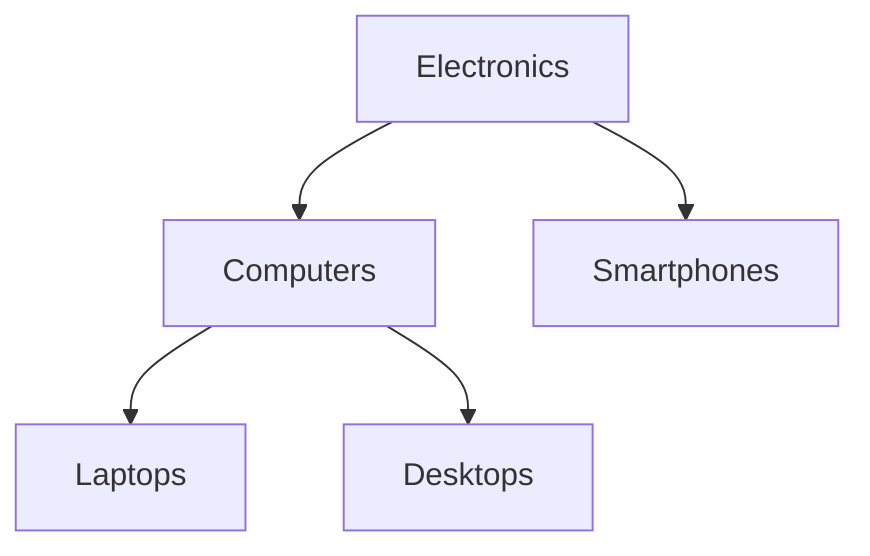

## 4.2.1 Adjacency List Model

In the realm of SQL design patterns, the Adjacency List Model stands out as a straightforward and intuitive approach for representing hierarchical data. This model is particularly useful when dealing with data structures that naturally form a hierarchy, such as organizational charts, file systems, or category trees. In this section, we will delve into the intricacies of the Adjacency List Model, exploring its structure, advantages, limitations, and practical implementation.

### Structure of the Adjacency List Model

The Adjacency List Model is characterized by its simplicity. Each record in the table contains a reference to its parent, forming a parent-child relationship. This is typically achieved by having a column that stores the identifier of the parent node. The root node, which has no parent, is usually represented by a `NULL` value in the parent column.

#### Key Components

- **Node ID**: A unique identifier for each node in the hierarchy.
- **Parent ID**: A reference to the parent node's ID. The root node has a `NULL` parent ID.

#### Example Table Structure

```sql
CREATE TABLE categories (
    id INT PRIMARY KEY,
    name VARCHAR(255) NOT NULL,
    parent_id INT,
    FOREIGN KEY (parent_id) REFERENCES categories(id)
);
```

In this table, each category has a unique `id`, a `name`, and a `parent_id` that points to the `id` of its parent category.

### Advantages of the Adjacency List Model

1. **Simplicity**: The model is easy to understand and implement. It mirrors the natural hierarchical structure, making it intuitive for developers and database administrators.

2. **Flexibility**: Adding or removing nodes is straightforward. You can easily insert a new node by specifying its parent, or delete a node and its descendants by handling the parent-child relationships.

3. **Compatibility**: The model is compatible with most relational database systems and can be implemented using standard SQL.

### Limitations of the Adjacency List Model

1. **Inefficient for Deep Hierarchy Queries**: Querying deep hierarchies can be inefficient, as it often requires recursive queries or multiple joins to traverse the hierarchy.

2. **Complexity in Path Queries**: Finding the path from a node to the root or vice versa can be complex and computationally expensive.

3. **Limited Support for Advanced Hierarchical Operations**: Operations like finding all descendants or ancestors require additional logic and can be cumbersome to implement.

### Practical Implementation

Let's explore how to implement and query the Adjacency List Model in SQL with practical examples.

#### Inserting Data

To insert data into the `categories` table, you specify the `id`, `name`, and `parent_id`. For the root node, the `parent_id` is `NULL`.

```sql
INSERT INTO categories (id, name, parent_id) VALUES
(1, 'Electronics', NULL),
(2, 'Computers', 1),
(3, 'Laptops', 2),
(4, 'Desktops', 2),
(5, 'Smartphones', 1);
```

#### Querying the Hierarchy

To retrieve the entire hierarchy, you can use a recursive common table expression (CTE). This allows you to traverse the hierarchy efficiently.

```sql
WITH RECURSIVE category_hierarchy AS (
    SELECT id, name, parent_id, 1 AS level
    FROM categories
    WHERE parent_id IS NULL
    UNION ALL
    SELECT c.id, c.name, c.parent_id, ch.level + 1
    FROM categories c
    INNER JOIN category_hierarchy ch ON c.parent_id = ch.id
)
SELECT * FROM category_hierarchy;
```

This query starts with the root node and recursively joins each child node, building the hierarchy level by level.

#### Visualizing the Hierarchy

To better understand the structure, let's visualize the hierarchy using a diagram.



**Diagram Description**: This diagram represents the hierarchy of categories, with "Electronics" as the root node, branching into "Computers" and "Smartphones". "Computers" further branches into "Laptops" and "Desktops".

### Design Considerations

- **When to Use**: The Adjacency List Model is ideal for simple hierarchies where the depth is not excessive, and the operations are primarily focused on parent-child relationships.

- **Performance**: Consider using indexes on the `parent_id` column to improve query performance, especially for large datasets.

- **Alternatives**: For more complex hierarchical operations, consider other models like the Nested Set Model or Closure Table Pattern.

### Differences and Similarities

The Adjacency List Model is often compared to other hierarchical models:

- **Nested Set Model**: Unlike the Adjacency List Model, the Nested Set Model uses left and right values to represent the hierarchy, allowing for efficient retrieval of all descendants but making updates more complex.

- **Closure Table Pattern**: This pattern stores all ancestor-descendant pairs in a separate table, enabling efficient queries for all descendants or ancestors but requiring more storage space.

### Try It Yourself

Experiment with the Adjacency List Model by modifying the code examples. Try adding new categories, changing parent-child relationships, or querying specific paths in the hierarchy. This hands-on approach will deepen your understanding of the model's capabilities and limitations.

### References and Links

For further reading on hierarchical data modeling in SQL, consider the following resources:

- [MDN Web Docs on SQL](https://developer.mozilla.org/en-US/docs/Web/SQL)
- [W3Schools SQL Tutorial](https://www.w3schools.com/sql/)
- [Recursive Queries in SQL](https://www.sqlshack.com/recursive-queries-using-common-table-expressions-cte-in-sql-server/)

### Knowledge Check

- How does the Adjacency List Model represent hierarchical data?
- What are the advantages and limitations of using the Adjacency List Model?
- How can you query a hierarchy using a recursive CTE in SQL?

### Embrace the Journey

Remember, mastering SQL design patterns is a journey. The Adjacency List Model is just one of many tools in your arsenal. As you continue to explore and experiment, you'll gain a deeper understanding of how to model and query complex data structures. Keep pushing the boundaries, stay curious, and enjoy the process!

## Quiz Time!



### What is a key advantage of the Adjacency List Model?

- [x] Simplicity and ease of understanding
- [ ] Efficient for deep hierarchy queries
- [ ] Minimal storage requirements
- [ ] Advanced hierarchical operations support

> **Explanation:** The Adjacency List Model is praised for its simplicity and ease of understanding, making it a popular choice for straightforward hierarchical data structures.

### What is a common limitation of the Adjacency List Model?

- [ ] Complexity in implementation
- [x] Inefficient for deep hierarchy queries
- [ ] High storage requirements
- [ ] Lack of compatibility with SQL

> **Explanation:** The Adjacency List Model can be inefficient for deep hierarchy queries, as it often requires recursive queries or multiple joins.

### How is the root node represented in the Adjacency List Model?

- [x] With a NULL parent ID
- [ ] With a unique identifier
- [ ] With a special flag
- [ ] With a zero value

> **Explanation:** In the Adjacency List Model, the root node is typically represented by a NULL value in the parent ID column.

### Which SQL feature is commonly used to query hierarchies in the Adjacency List Model?

- [ ] Window functions
- [x] Recursive CTEs
- [ ] Aggregate functions
- [ ] Subqueries

> **Explanation:** Recursive Common Table Expressions (CTEs) are commonly used to query hierarchies in the Adjacency List Model.

### What is a key component of the Adjacency List Model?

- [x] Node ID and Parent ID
- [ ] Left and Right values
- [ ] Ancestor table
- [ ] Path enumeration

> **Explanation:** The Adjacency List Model relies on Node ID and Parent ID to establish parent-child relationships.

### Which alternative model is more efficient for retrieving all descendants?

- [ ] Adjacency List Model
- [x] Nested Set Model
- [ ] Star Schema
- [ ] Snowflake Schema

> **Explanation:** The Nested Set Model is more efficient for retrieving all descendants due to its use of left and right values.

### How can performance be improved in the Adjacency List Model?

- [x] By indexing the parent_id column
- [ ] By using more storage space
- [ ] By reducing the number of nodes
- [ ] By avoiding recursive queries

> **Explanation:** Indexing the parent_id column can significantly improve query performance in the Adjacency List Model.

### What is a common use case for the Adjacency List Model?

- [x] Organizational charts
- [ ] Flat data structures
- [ ] Non-hierarchical data
- [ ] Large-scale data processing

> **Explanation:** The Adjacency List Model is commonly used for hierarchical data structures like organizational charts.

### Which diagramming tool is used to visualize the hierarchy in this guide?

- [ ] UML
- [ ] Visio
- [x] Mermaid.js
- [ ] Lucidchart

> **Explanation:** Mermaid.js is used in this guide to create diagrams for visualizing hierarchical structures.

### True or False: The Adjacency List Model is the best choice for all hierarchical data needs.

- [ ] True
- [x] False

> **Explanation:** The Adjacency List Model is not the best choice for all hierarchical data needs, especially when dealing with deep hierarchies or complex operations.



By understanding and implementing the Adjacency List Model, you can effectively manage and query hierarchical data in SQL. Keep exploring and experimenting to master this essential design pattern!
