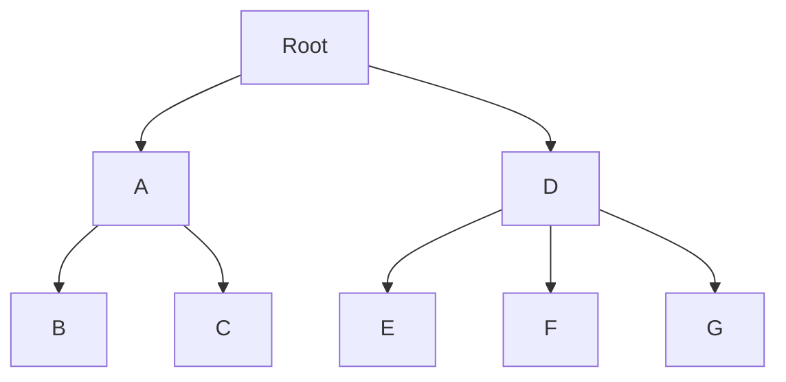

## 4.2.2 Nested Set Model

The Nested Set Model is a powerful design pattern used for managing hierarchical data in SQL databases. It is particularly advantageous for read-intensive operations, allowing efficient querying of hierarchical structures. However, it comes with its own set of challenges, especially when it comes to maintaining the hierarchy during insertions and deletions. In this section, we will delve into the intricacies of the Nested Set Model, exploring its structure, advantages, limitations, and practical implementation.

### Understanding the Nested Set Model

The Nested Set Model represents hierarchical data using a pair of integers, often referred to as "left" and "right" values. These values define the position of each node within the hierarchy, allowing for efficient querying of parent-child relationships and subtrees.

#### Structure of the Nested Set Model

In the Nested Set Model, each node in the hierarchy is assigned two numbers: a left value and a right value. These numbers are used to represent the position of the node within the hierarchy. The left value is assigned when the node is first encountered during a depth-first traversal of the tree, and the right value is assigned when the node is last encountered.

Here is a simple example to illustrate the structure:

```plaintext
Root
├── A
│   ├── B
│   └── C
└── D
    ├── E
    └── F
```

In this hierarchy, the nodes would be assigned left and right values as follows:

| Node | Left | Right |
|------|------|-------|
| Root |  1   |   12  |
| A    |  2   |   5   |
| B    |  3   |   4   |
| C    |  6   |   7   |
| D    |  8   |   11  |
| E    |  9   |   10  |
| F    |  12  |   13  |

### Advantages of the Nested Set Model

1. **Efficient Read Operations**: The Nested Set Model is optimized for read-intensive operations. Queries to retrieve all descendants of a node or to find the path from a node to the root can be executed efficiently using simple range queries.

2. **Compact Representation**: The model provides a compact representation of hierarchical data, using only two integers per node to represent the entire hierarchy.

3. **Flexibility in Querying**: The model allows for flexible querying of hierarchical data, enabling complex queries such as finding all ancestors, descendants, or siblings of a node.

### Limitations of the Nested Set Model

1. **Complex Maintenance**: The primary drawback of the Nested Set Model is the complexity involved in maintaining the hierarchy during insertions and deletions. Adjusting the left and right values of nodes can be cumbersome and error-prone.

2. **Performance Overhead**: While read operations are efficient, write operations can be costly, especially in large hierarchies, as they may require updating the left and right values of multiple nodes.

3. **Limited Support for Dynamic Hierarchies**: The model is less suited for dynamic hierarchies where nodes are frequently added or removed, due to the complexity of maintaining the left and right values.

### Implementing the Nested Set Model in SQL

Let's explore how to implement the Nested Set Model in SQL, using a practical example. We will create a table to store the hierarchy and demonstrate how to perform common operations such as inserting, deleting, and querying nodes.

#### Creating the Table

First, we need to create a table to store the hierarchical data. The table will include columns for the node ID, name, left value, and right value.

```sql
CREATE TABLE hierarchy (
    id INT PRIMARY KEY,
    name VARCHAR(255),
    lft INT NOT NULL,
    rgt INT NOT NULL
);
```

#### Inserting Nodes

Inserting nodes into the Nested Set Model requires careful adjustment of the left and right values. Let's insert the nodes from our example hierarchy.

```sql
-- Insert the root node
INSERT INTO hierarchy (id, name, lft, rgt) VALUES (1, 'Root', 1, 12);

-- Insert child nodes of Root
INSERT INTO hierarchy (id, name, lft, rgt) VALUES (2, 'A', 2, 5);
INSERT INTO hierarchy (id, name, lft, rgt) VALUES (3, 'B', 3, 4);
INSERT INTO hierarchy (id, name, lft, rgt) VALUES (4, 'C', 6, 7);
INSERT INTO hierarchy (id, name, lft, rgt) VALUES (5, 'D', 8, 11);
INSERT INTO hierarchy (id, name, lft, rgt) VALUES (6, 'E', 9, 10);
INSERT INTO hierarchy (id, name, lft, rgt) VALUES (7, 'F', 12, 13);
```

#### Querying the Hierarchy

One of the key advantages of the Nested Set Model is the ability to perform efficient queries. Let's explore some common queries.

**Finding All Descendants of a Node**

To find all descendants of a node, we can use a simple range query:

```sql
SELECT * FROM hierarchy WHERE lft BETWEEN 2 AND 5;
```

This query retrieves all nodes that are descendants of node A.

**Finding the Path to the Root**

To find the path from a node to the root, we can use the following query:

```sql
SELECT * FROM hierarchy WHERE lft <= 3 AND rgt >= 4 ORDER BY lft;
```

This query retrieves the path from node B to the root.

#### Updating the Hierarchy

Updating the hierarchy, such as inserting or deleting nodes, requires careful adjustment of the left and right values. Let's explore how to insert a new node.

**Inserting a New Node**

To insert a new node, we need to update the left and right values of existing nodes to make space for the new node. Let's insert a new node G as a child of node D.

```sql
-- Update the right values of nodes to the right of the new node
UPDATE hierarchy SET rgt = rgt + 2 WHERE rgt >= 11;

-- Update the left values of nodes to the right of the new node
UPDATE hierarchy SET lft = lft + 2 WHERE lft > 11;

-- Insert the new node
INSERT INTO hierarchy (id, name, lft, rgt) VALUES (8, 'G', 11, 12);
```

### Visualizing the Nested Set Model

To better understand the structure of the Nested Set Model, let's visualize the hierarchy using a diagram.



This diagram represents the hierarchy with the newly inserted node G.

### Design Considerations

When implementing the Nested Set Model, consider the following:

- **Use Cases**: The model is best suited for read-intensive applications where the hierarchy is relatively static.
- **Maintenance**: Implement robust mechanisms for maintaining the left and right values during updates.
- **Performance**: Monitor the performance of write operations, especially in large hierarchies.

### Differences and Similarities with Other Models

The Nested Set Model is often compared to other hierarchical models, such as the Adjacency List Model. While the Adjacency List Model is simpler to implement and maintain, it is less efficient for read operations. The Nested Set Model, on the other hand, excels in read performance but requires more complex maintenance.

### Try It Yourself

Experiment with the Nested Set Model by modifying the code examples. Try inserting new nodes, deleting existing nodes, and querying different parts of the hierarchy. Observe how the left and right values change with each operation.

### References and Further Reading

- [MDN Web Docs: SQL](https://developer.mozilla.org/en-US/docs/Web/SQL)
- [W3Schools: SQL Tutorial](https://www.w3schools.com/sql/)
- [SQL for Data Science](https://www.coursera.org/learn/sql-for-data-science)

### Knowledge Check

Before moving on, test your understanding of the Nested Set Model with the following questions.

## Quiz Time!



### What is the primary advantage of the Nested Set Model?

- [x] Efficient read operations
- [ ] Simple maintenance
- [ ] Dynamic hierarchy support
- [ ] Low write overhead

> **Explanation:** The Nested Set Model is optimized for efficient read operations, making it ideal for read-intensive applications.

### How are nodes represented in the Nested Set Model?

- [x] Using left and right values
- [ ] Using parent-child pointers
- [ ] Using adjacency lists
- [ ] Using hash maps

> **Explanation:** Nodes in the Nested Set Model are represented using left and right values, which define their position in the hierarchy.

### What is a limitation of the Nested Set Model?

- [x] Complex maintenance during updates
- [ ] Inefficient read operations
- [ ] Lack of flexibility in querying
- [ ] High memory usage

> **Explanation:** The Nested Set Model requires complex maintenance during updates, as left and right values need to be adjusted.

### Which SQL operation is efficient in the Nested Set Model?

- [x] Read operations
- [ ] Insert operations
- [ ] Delete operations
- [ ] Update operations

> **Explanation:** The Nested Set Model is optimized for efficient read operations, allowing for quick retrieval of hierarchical data.

### What is required when inserting a new node in the Nested Set Model?

- [x] Adjusting left and right values of existing nodes
- [ ] Creating a new table
- [ ] Using a temporary table
- [ ] Dropping existing nodes

> **Explanation:** Inserting a new node requires adjusting the left and right values of existing nodes to maintain the hierarchy.

### How can you find all descendants of a node in the Nested Set Model?

- [x] Using a range query on left and right values
- [ ] Using a join operation
- [ ] Using a recursive query
- [ ] Using a subquery

> **Explanation:** A range query on left and right values can efficiently retrieve all descendants of a node.

### What is a key consideration when using the Nested Set Model?

- [x] Efficient read operations
- [ ] Simple write operations
- [ ] Dynamic hierarchy support
- [ ] Low maintenance

> **Explanation:** The Nested Set Model is best suited for applications where efficient read operations are a priority.

### Which model is often compared to the Nested Set Model?

- [x] Adjacency List Model
- [ ] Star Schema
- [ ] Snowflake Schema
- [ ] EAV Model

> **Explanation:** The Adjacency List Model is often compared to the Nested Set Model, as both are used for hierarchical data.

### What is the primary use case for the Nested Set Model?

- [x] Read-intensive applications
- [ ] Write-intensive applications
- [ ] Dynamic hierarchies
- [ ] Real-time data processing

> **Explanation:** The Nested Set Model is ideal for read-intensive applications where the hierarchy is relatively static.

### True or False: The Nested Set Model is ideal for dynamic hierarchies.

- [ ] True
- [x] False

> **Explanation:** The Nested Set Model is not ideal for dynamic hierarchies due to the complexity of maintaining left and right values during updates.



Remember, mastering the Nested Set Model is just one step in your journey to becoming an expert in SQL design patterns. Keep experimenting, stay curious, and enjoy the process of learning and applying these powerful techniques!
