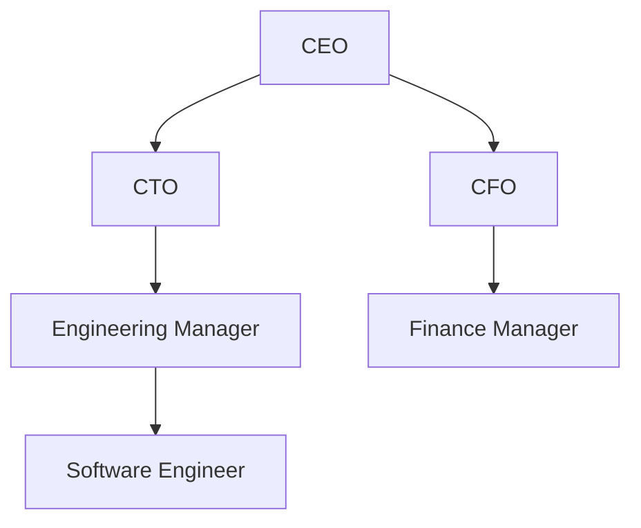

## 4.2.3 Path Enumeration

In the realm of hierarchical data modeling, the Path Enumeration pattern stands out as a powerful technique for representing hierarchical relationships within a relational database. This pattern involves storing the full path of nodes as strings, which can significantly simplify ancestor-descendant queries. However, like any design pattern, it comes with its own set of advantages and limitations. In this section, we will delve deep into the Path Enumeration pattern, exploring its structure, benefits, challenges, and practical applications.

### Understanding Path Enumeration

Path Enumeration is a method used to represent hierarchical data by storing the path from the root node to a given node as a string. Each node in the hierarchy is assigned a unique identifier, and the path is constructed by concatenating these identifiers. This approach allows for straightforward queries to determine the hierarchy's structure, such as finding all ancestors or descendants of a particular node.

#### Key Concepts

- **Node**: An individual element or point in the hierarchy.
- **Path**: A string representing the sequence of nodes from the root to a specific node.
- **Delimiter**: A character or set of characters used to separate node identifiers within the path string.

### Advantages of Path Enumeration

1. **Simplified Queries**: Path Enumeration allows for simple SQL queries to retrieve ancestors or descendants of a node. By using string pattern matching, you can easily find all nodes within a particular path.

2. **Efficient Read Operations**: Since the entire path is stored as a string, read operations to determine hierarchy relationships are efficient and require minimal joins.

3. **Flexibility**: This pattern is flexible and can be adapted to various hierarchical structures, making it suitable for a wide range of applications.

### Limitations of Path Enumeration

1. **String Manipulation Overhead**: Storing paths as strings can lead to increased storage requirements and may involve complex string manipulation operations.

2. **Update Complexity**: Changes in the hierarchy, such as moving a node, require updating the path strings for all descendant nodes, which can be resource-intensive.

3. **Limited Depth**: The maximum depth of the hierarchy may be constrained by the maximum length of the path string, depending on the database system.

### Implementing Path Enumeration

Let's explore how to implement the Path Enumeration pattern in a relational database using SQL. We'll use a simple example of an organizational hierarchy to illustrate the concept.

#### Step 1: Define the Table Structure

First, we need to define a table to store the nodes of our hierarchy. Each node will have an ID, a name, and a path.

```sql
CREATE TABLE organization (
    id INT PRIMARY KEY,
    name VARCHAR(255),
    path VARCHAR(255)
);
```

#### Step 2: Insert Data

Next, we'll insert some sample data into our table. Each node's path will be constructed by concatenating its ID with the IDs of its ancestors.

```sql
INSERT INTO organization (id, name, path) VALUES
(1, 'CEO', '/1/'),
(2, 'CTO', '/1/2/'),
(3, 'CFO', '/1/3/'),
(4, 'Engineering Manager', '/1/2/4/'),
(5, 'Finance Manager', '/1/3/5/'),
(6, 'Software Engineer', '/1/2/4/6/');
```

#### Step 3: Querying the Hierarchy

With the data in place, we can now perform queries to explore the hierarchy. For example, to find all descendants of the CTO, we can use a simple `LIKE` query.

```sql
SELECT * FROM organization WHERE path LIKE '/1/2/%';
```

This query will return all nodes whose path starts with `/1/2/`, effectively retrieving all descendants of the CTO.

### Visualizing Path Enumeration

To better understand how Path Enumeration works, let's visualize the hierarchy using a diagram.



In this diagram, each node is connected to its parent, and the path for each node is represented as a sequence of node IDs.

### Design Considerations

When implementing the Path Enumeration pattern, consider the following:

- **Delimiter Choice**: Choose a delimiter that does not conflict with node identifiers. Common choices include slashes (`/`) or dots (`.`).

- **Path Length**: Ensure that the path column can accommodate the maximum expected path length. This may require adjusting the column's data type or size.

- **Indexing**: Consider indexing the path column to improve query performance, especially for large hierarchies.

### Differences and Similarities with Other Patterns

Path Enumeration is often compared to other hierarchical modeling patterns, such as the Adjacency List and Nested Set models. Here are some key differences:

- **Adjacency List**: Stores parent-child relationships directly, requiring recursive queries to traverse the hierarchy. Path Enumeration simplifies these queries by storing the entire path.

- **Nested Set**: Represents hierarchy using left and right values, allowing for efficient subtree queries but requiring complex updates. Path Enumeration offers simpler queries but more complex updates.

### Try It Yourself

To gain hands-on experience with Path Enumeration, try modifying the code examples provided. For instance, add new nodes to the hierarchy and update existing paths to reflect changes in the structure. Experiment with different delimiters and observe how they affect query performance.

### References and Further Reading

For more information on hierarchical data modeling and SQL design patterns, consider exploring the following resources:

- [MDN Web Docs on SQL](https://developer.mozilla.org/en-US/docs/Web/SQL)
- [W3Schools SQL Tutorial](https://www.w3schools.com/sql/)
- [SQL for Data Science on Coursera](https://www.coursera.org/learn/sql-for-data-science)

### Knowledge Check

Before moving on, take a moment to reflect on what you've learned about Path Enumeration. Consider the advantages and limitations of this pattern and how it might apply to your own projects.

### Embrace the Journey

Remember, mastering SQL design patterns is a journey. As you continue to explore and experiment with different patterns, you'll gain a deeper understanding of how to model complex data structures effectively. Stay curious, keep learning, and enjoy the process!

## Quiz Time!



### What is the primary advantage of using Path Enumeration in hierarchical data modeling?

- [x] Simplifies ancestor-descendant queries
- [ ] Reduces storage requirements
- [ ] Eliminates the need for indexing
- [ ] Automatically updates paths on node changes

> **Explanation:** Path Enumeration simplifies ancestor-descendant queries by storing the full path as a string, allowing for straightforward pattern matching.

### Which of the following is a limitation of the Path Enumeration pattern?

- [ ] Efficient read operations
- [x] String manipulation overhead
- [ ] Flexibility in adapting to various structures
- [ ] Simplified queries

> **Explanation:** Path Enumeration involves string manipulation overhead, which can increase storage requirements and complicate updates.

### How is the path constructed in the Path Enumeration pattern?

- [x] By concatenating node identifiers
- [ ] By storing parent-child relationships directly
- [ ] By using left and right values
- [ ] By storing node levels

> **Explanation:** In Path Enumeration, the path is constructed by concatenating node identifiers, creating a string that represents the sequence from the root to the node.

### What SQL operation is commonly used to query descendants in Path Enumeration?

- [ ] JOIN
- [ ] GROUP BY
- [x] LIKE
- [ ] UNION

> **Explanation:** The `LIKE` operation is used to match paths that start with a specific sequence, allowing for efficient descendant queries.

### Which delimiter is commonly used in Path Enumeration to separate node identifiers?

- [x] Slash (/)
- [ ] Comma (,)
- [ ] Semicolon (;)
- [ ] Pipe (|)

> **Explanation:** A slash (/) is a common delimiter used in Path Enumeration to separate node identifiers within the path string.

### What is a key difference between Path Enumeration and the Adjacency List model?

- [x] Path Enumeration stores the full path as a string
- [ ] Path Enumeration requires recursive queries
- [ ] Adjacency List simplifies ancestor-descendant queries
- [ ] Adjacency List uses left and right values

> **Explanation:** Path Enumeration stores the full path as a string, while the Adjacency List model stores direct parent-child relationships.

### Which of the following is a design consideration when implementing Path Enumeration?

- [ ] Avoiding the use of delimiters
- [x] Ensuring the path column can accommodate maximum path length
- [ ] Using recursive queries for updates
- [ ] Storing node levels

> **Explanation:** It's important to ensure that the path column can accommodate the maximum expected path length to avoid truncation.

### How does Path Enumeration handle updates in the hierarchy?

- [ ] Automatically updates all paths
- [x] Requires updating paths for all descendant nodes
- [ ] Uses recursive queries for updates
- [ ] Eliminates the need for updates

> **Explanation:** When a node is moved, Path Enumeration requires updating the paths for all descendant nodes to reflect the change.

### What is a common use case for Path Enumeration?

- [x] Organizational hierarchies
- [ ] Flat data structures
- [ ] Non-hierarchical data
- [ ] Unstructured data

> **Explanation:** Path Enumeration is commonly used for representing organizational hierarchies and other hierarchical data structures.

### True or False: Path Enumeration is suitable for all types of hierarchical data.

- [ ] True
- [x] False

> **Explanation:** While Path Enumeration is effective for certain hierarchical data structures, it may not be suitable for all types due to its limitations, such as update complexity.




