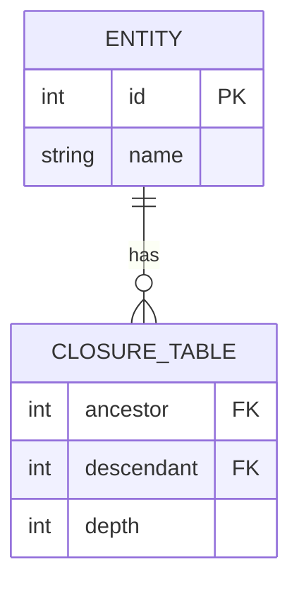
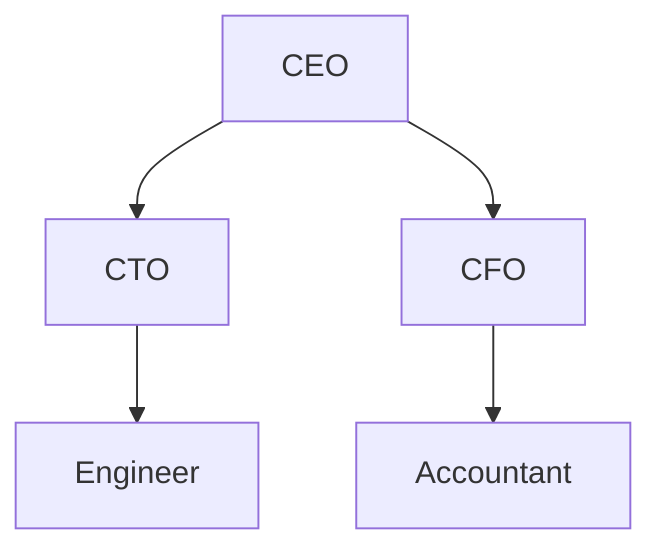

## 4.2.4 Closure Table Pattern

In the realm of hierarchical data modeling, the Closure Table Pattern stands out as a robust and efficient solution for managing complex relationships. This pattern is particularly useful when dealing with hierarchical data structures, such as organizational charts, category trees, or file systems. In this section, we will delve into the Closure Table Pattern, exploring its structure, advantages, limitations, and practical implementation using SQL.

### Design Pattern Name

**Closure Table Pattern**

### Category

Hierarchical Data Modeling

### Intent

The Closure Table Pattern is designed to efficiently store and query hierarchical data in a relational database. It achieves this by maintaining a separate table that records all paths between nodes in the hierarchy, allowing for flexible and performant querying of ancestor-descendant relationships.

### Diagrams

To better understand the Closure Table Pattern, let's visualize the structure using a diagram. This will help us grasp how the pattern organizes hierarchical data.



**Diagram Description:** The diagram illustrates the relationship between the `ENTITY` table, which stores the nodes, and the `CLOSURE_TABLE`, which records all ancestor-descendant paths. The `depth` column indicates the distance between nodes.

### Key Participants

- **Entity Table**: Stores the nodes of the hierarchy, each with a unique identifier.
- **Closure Table**: Records all paths between nodes, including the depth of each path.

### Applicability

The Closure Table Pattern is applicable in scenarios where:

- Hierarchical data needs to be queried efficiently, including all ancestors or descendants of a node.
- The hierarchy is dynamic, with frequent updates, additions, or deletions.
- Complex queries involving multiple levels of the hierarchy are required.

### Sample Code Snippet

Let's explore how to implement the Closure Table Pattern in SQL with a practical example. We'll create a simple organizational hierarchy to demonstrate the pattern.

#### Step 1: Create the Entity Table

```sql
CREATE TABLE Entity (
    id INT PRIMARY KEY,
    name VARCHAR(255) NOT NULL
);
```

#### Step 2: Create the Closure Table

```sql
CREATE TABLE ClosureTable (
    ancestor INT NOT NULL,
    descendant INT NOT NULL,
    depth INT NOT NULL,
    PRIMARY KEY (ancestor, descendant),
    FOREIGN KEY (ancestor) REFERENCES Entity(id),
    FOREIGN KEY (descendant) REFERENCES Entity(id)
);
```

#### Step 3: Insert Sample Data

```sql
-- Insert entities
INSERT INTO Entity (id, name) VALUES (1, 'CEO');
INSERT INTO Entity (id, name) VALUES (2, 'CTO');
INSERT INTO Entity (id, name) VALUES (3, 'CFO');
INSERT INTO Entity (id, name) VALUES (4, 'Engineer');
INSERT INTO Entity (id, name) VALUES (5, 'Accountant');

-- Insert closure paths
INSERT INTO ClosureTable (ancestor, descendant, depth) VALUES (1, 1, 0);
INSERT INTO ClosureTable (ancestor, descendant, depth) VALUES (1, 2, 1);
INSERT INTO ClosureTable (ancestor, descendant, depth) VALUES (1, 3, 1);
INSERT INTO ClosureTable (ancestor, descendant, depth) VALUES (1, 4, 2);
INSERT INTO ClosureTable (ancestor, descendant, depth) VALUES (1, 5, 2);
INSERT INTO ClosureTable (ancestor, descendant, depth) VALUES (2, 2, 0);
INSERT INTO ClosureTable (ancestor, descendant, depth) VALUES (2, 4, 1);
INSERT INTO ClosureTable (ancestor, descendant, depth) VALUES (3, 3, 0);
INSERT INTO ClosureTable (ancestor, descendant, depth) VALUES (3, 5, 1);
INSERT INTO ClosureTable (ancestor, descendant, depth) VALUES (4, 4, 0);
INSERT INTO ClosureTable (ancestor, descendant, depth) VALUES (5, 5, 0);
```

#### Step 4: Querying the Hierarchy

To retrieve all descendants of the CEO, we can use the following query:

```sql
SELECT e.name
FROM ClosureTable ct
JOIN Entity e ON ct.descendant = e.id
WHERE ct.ancestor = 1 AND ct.depth > 0;
```

**Key Lines Explanation:**

- The `ClosureTable` is joined with the `Entity` table to fetch the names of all descendants.
- The condition `ct.ancestor = 1` specifies the starting node (CEO), and `ct.depth > 0` ensures we exclude the node itself.

### Design Considerations

When implementing the Closure Table Pattern, consider the following:

- **Storage Overhead**: The closure table can grow significantly, especially in deep hierarchies, as it stores all possible paths.
- **Maintenance Complexity**: Inserting, updating, or deleting nodes requires careful management of the closure table to maintain data integrity.
- **Query Flexibility**: The pattern excels in scenarios requiring complex queries, such as retrieving all ancestors or descendants of a node.

### Differences and Similarities

The Closure Table Pattern is often compared to other hierarchical data modeling patterns, such as the Adjacency List Model and the Nested Set Model. Here's how they differ:

- **Adjacency List Model**: Stores only direct parent-child relationships, making it simpler but less efficient for querying entire hierarchies.
- **Nested Set Model**: Uses left and right values to represent hierarchy, which can be complex to maintain but efficient for certain queries.

### Try It Yourself

To deepen your understanding, try modifying the code examples:

- Add new nodes to the hierarchy and update the closure table accordingly.
- Experiment with different queries to retrieve ancestors or descendants.
- Consider implementing a function to automate closure table updates when nodes are added or removed.

### Visualizing Hierarchical Queries

Let's visualize how the Closure Table Pattern facilitates querying hierarchical data.



**Diagram Description:** This diagram represents the organizational hierarchy, with the CEO at the top, followed by the CTO and CFO, and their respective subordinates.

### References and Links

For further reading on hierarchical data modeling and the Closure Table Pattern, consider these resources:

- [SQL for Hierarchical Data](https://www.sqlshack.com/sql-for-hierarchical-data/)
- [Managing Hierarchical Data in MySQL](https://mikehillyer.com/articles/managing-hierarchical-data-in-mysql/)
- [Closure Table Pattern on Wikipedia](https://en.wikipedia.org/wiki/Closure_table)

### Knowledge Check

Let's reinforce your understanding with a few questions:

- What are the key components of the Closure Table Pattern?
- How does the Closure Table Pattern differ from the Adjacency List Model?
- What are the advantages and limitations of using the Closure Table Pattern?

### Embrace the Journey

Remember, mastering the Closure Table Pattern is just one step in your journey to becoming an expert in SQL design patterns. Keep experimenting, stay curious, and enjoy the process of learning and applying new concepts.

### Formatting and Structure

Organize your implementation with clear headings and comments. Use bullet points to break down complex information, and highlight important terms or concepts for easy reference.

### Writing Style

Use first-person plural (we, let's) to create a collaborative feel. Avoid gender-specific pronouns and define acronyms and abbreviations upon first use.

## Quiz Time!



### What is the primary purpose of the Closure Table Pattern?

- [x] To efficiently store and query hierarchical data
- [ ] To simplify database schema design
- [ ] To reduce storage requirements
- [ ] To improve transaction speed

> **Explanation:** The Closure Table Pattern is designed to efficiently store and query hierarchical data by maintaining a separate table that records all paths between nodes.

### Which table in the Closure Table Pattern records all ancestor-descendant paths?

- [ ] Entity Table
- [x] Closure Table
- [ ] Hierarchy Table
- [ ] Path Table

> **Explanation:** The Closure Table is responsible for recording all ancestor-descendant paths, including the depth of each path.

### What is a key advantage of the Closure Table Pattern?

- [x] Flexible and efficient querying of hierarchical data
- [ ] Simplified data insertion
- [ ] Reduced storage requirements
- [ ] Faster transaction processing

> **Explanation:** The Closure Table Pattern allows for flexible and efficient querying of hierarchical data, making it ideal for complex queries.

### How does the Closure Table Pattern differ from the Adjacency List Model?

- [x] It stores all paths between nodes, not just direct relationships
- [ ] It uses left and right values to represent hierarchy
- [ ] It simplifies data insertion
- [ ] It reduces storage requirements

> **Explanation:** Unlike the Adjacency List Model, which stores only direct parent-child relationships, the Closure Table Pattern records all paths between nodes.

### What is a potential limitation of the Closure Table Pattern?

- [x] Additional storage and maintenance requirements
- [ ] Inability to handle dynamic hierarchies
- [ ] Complexity in querying data
- [ ] Lack of support for foreign keys

> **Explanation:** The Closure Table Pattern can require additional storage and maintenance due to the need to store all possible paths in the hierarchy.

### Which SQL command is used to create the Closure Table?

- [x] CREATE TABLE
- [ ] INSERT INTO
- [ ] SELECT FROM
- [ ] UPDATE TABLE

> **Explanation:** The `CREATE TABLE` command is used to define the structure of the Closure Table, specifying columns and constraints.

### What does the `depth` column in the Closure Table indicate?

- [x] The distance between ancestor and descendant nodes
- [ ] The number of children a node has
- [ ] The level of the node in the hierarchy
- [ ] The number of ancestors a node has

> **Explanation:** The `depth` column indicates the distance between ancestor and descendant nodes, helping to determine the hierarchy level.

### How can you retrieve all descendants of a node using the Closure Table Pattern?

- [x] By querying the Closure Table with the ancestor's ID
- [ ] By querying the Entity Table with the descendant's ID
- [ ] By using a recursive query on the Entity Table
- [ ] By joining the Closure Table with itself

> **Explanation:** To retrieve all descendants of a node, query the Closure Table using the ancestor's ID and join it with the Entity Table to get the names.

### What is the role of the `Entity` table in the Closure Table Pattern?

- [x] To store the nodes of the hierarchy
- [ ] To record all ancestor-descendant paths
- [ ] To maintain the depth of each path
- [ ] To simplify data insertion

> **Explanation:** The `Entity` table stores the nodes of the hierarchy, each with a unique identifier, serving as the basis for the Closure Table.

### True or False: The Closure Table Pattern is ideal for static hierarchies with infrequent updates.

- [ ] True
- [x] False

> **Explanation:** The Closure Table Pattern is particularly useful for dynamic hierarchies with frequent updates, as it allows for efficient querying of complex relationships.



By mastering the Closure Table Pattern, you are well-equipped to handle complex hierarchical data structures in SQL, paving the way for efficient and scalable database solutions. Keep exploring and applying these concepts to enhance your expertise in SQL design patterns.
