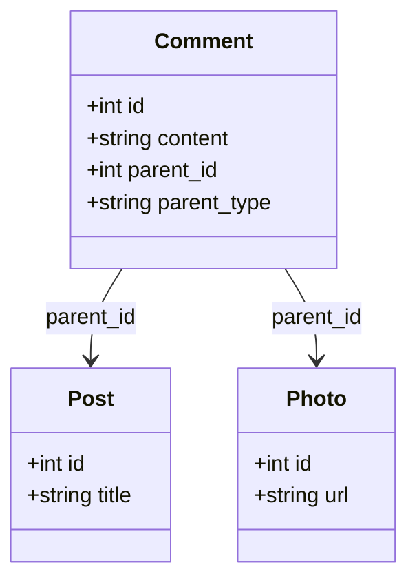

## 4.3 Polymorphic Associations

In the realm of relational databases, polymorphic associations present a unique challenge and opportunity for database architects and software engineers. This design pattern allows a child entity to be associated with multiple parent types, providing flexibility in data modeling. However, it also introduces complexity that must be carefully managed to maintain data integrity and performance.

### Understanding Polymorphic Associations

**Polymorphic associations** enable a single child entity to relate to multiple parent entities of different types. This is particularly useful in scenarios where a relationship is not limited to a single entity type. For example, consider a comment system where comments can be associated with either a blog post or a photo. In this case, the comment is the child entity, and the blog post and photo are the parent entities.

#### Key Concepts

- **Child Entity**: The entity that holds the reference to multiple parent types.
- **Parent Entity**: The entities that can be referenced by the child entity.
- **Type Identifier**: A field that specifies the type of the parent entity.
- **Foreign Key**: A reference to the primary key of the parent entity.

### Implementation Strategies

There are two primary strategies for implementing polymorphic associations in SQL:

1. **Single Table Strategy**: This involves using a single table with type identifiers and foreign keys to manage the associations.
2. **Join Tables Strategy**: This involves creating separate association tables for each parent type.

#### Single Table Strategy

In the single table strategy, a single association table is used to manage the relationships. This table includes a type identifier to specify the parent type and a foreign key to reference the parent entity.

**Example Schema**

```sql
CREATE TABLE comments (
    id SERIAL PRIMARY KEY,
    content TEXT NOT NULL,
    parent_id INT NOT NULL,
    parent_type VARCHAR(50) NOT NULL,
    FOREIGN KEY (parent_id) REFERENCES posts(id) ON DELETE CASCADE,
    FOREIGN KEY (parent_id) REFERENCES photos(id) ON DELETE CASCADE
);
```

**Explanation**: In this schema, the `comments` table includes a `parent_id` and a `parent_type` column. The `parent_id` is a foreign key that references the `id` column of either the `posts` or `photos` table, depending on the value of `parent_type`.

#### Join Tables Strategy

The join tables strategy involves creating separate association tables for each parent type. This approach can simplify queries and improve performance by reducing the need for type checks.

**Example Schema**

```sql
CREATE TABLE post_comments (
    comment_id INT PRIMARY KEY,
    post_id INT NOT NULL,
    FOREIGN KEY (comment_id) REFERENCES comments(id) ON DELETE CASCADE,
    FOREIGN KEY (post_id) REFERENCES posts(id) ON DELETE CASCADE
);

CREATE TABLE photo_comments (
    comment_id INT PRIMARY KEY,
    photo_id INT NOT NULL,
    FOREIGN KEY (comment_id) REFERENCES comments(id) ON DELETE CASCADE,
    FOREIGN KEY (photo_id) REFERENCES photos(id) ON DELETE CASCADE
);
```

**Explanation**: Here, we have two separate tables, `post_comments` and `photo_comments`, each managing the association between comments and their respective parent types.

### Design Considerations

When implementing polymorphic associations, it's essential to weigh the complexity against the flexibility offered by each strategy.

- **Complexity**: The single table strategy can become complex when dealing with many parent types, as it requires additional logic to handle type checks and constraints.
- **Flexibility**: The join tables strategy offers more flexibility and can simplify queries, but it requires additional tables and can increase the complexity of the schema.

#### Performance Implications

- **Single Table Strategy**: This approach can lead to performance issues as the number of parent types increases, due to the need for type checks and potential table scans.
- **Join Tables Strategy**: While this approach can improve performance by reducing the need for type checks, it can also lead to increased complexity in managing multiple tables.

### Visualizing Polymorphic Associations

To better understand polymorphic associations, let's visualize the relationships using a class diagram.



**Diagram Explanation**: This diagram illustrates the relationship between the `Comment`, `Post`, and `Photo` entities. The `Comment` entity can be associated with either a `Post` or a `Photo`, as indicated by the `parent_id` and `parent_type` fields.

### Sample Code Snippet

Let's explore a practical example of how to implement polymorphic associations using the single table strategy.

```sql
-- Create tables for posts and photos
CREATE TABLE posts (
    id SERIAL PRIMARY KEY,
    title VARCHAR(255) NOT NULL
);

CREATE TABLE photos (
    id SERIAL PRIMARY KEY,
    url VARCHAR(255) NOT NULL
);

-- Create the comments table with polymorphic associations
CREATE TABLE comments (
    id SERIAL PRIMARY KEY,
    content TEXT NOT NULL,
    parent_id INT NOT NULL,
    parent_type VARCHAR(50) NOT NULL,
    CHECK (parent_type IN ('post', 'photo'))
);

-- Insert sample data
INSERT INTO posts (title) VALUES ('First Post');
INSERT INTO photos (url) VALUES ('photo1.jpg');

-- Insert comments associated with different parent types
INSERT INTO comments (content, parent_id, parent_type) VALUES ('Great post!', 1, 'post');
INSERT INTO comments (content, parent_id, parent_type) VALUES ('Nice photo!', 1, 'photo');

-- Query comments for a specific post
SELECT * FROM comments WHERE parent_id = 1 AND parent_type = 'post';

-- Query comments for a specific photo
SELECT * FROM comments WHERE parent_id = 1 AND parent_type = 'photo';
```

**Code Explanation**: This example demonstrates how to create tables for `posts`, `photos`, and `comments`, and how to insert and query data using polymorphic associations.

### Try It Yourself

Experiment with the code example by adding additional parent types, such as `videos`, and updating the `comments` table to support these new types. Consider the implications of each change on the overall design and performance.

### Differences and Similarities

Polymorphic associations are often compared to other design patterns, such as inheritance mapping patterns. While both patterns deal with relationships between entities, polymorphic associations focus on flexible relationships between different entity types, whereas inheritance mapping patterns focus on modeling hierarchical relationships within a single entity type.

### Design Considerations

When deciding whether to use polymorphic associations, consider the following:

- **Use Cases**: Polymorphic associations are ideal for scenarios where a child entity needs to relate to multiple parent types, such as comments, tags, or attachments.
- **Complexity**: Be mindful of the complexity introduced by polymorphic associations, particularly when dealing with many parent types.
- **Performance**: Consider the performance implications of each implementation strategy and choose the one that best fits your use case.

### Knowledge Check

Before moving on, let's review some key points:

- **Polymorphic Associations**: Allow a child entity to relate to multiple parent types.
- **Single Table Strategy**: Uses a single table with type identifiers and foreign keys.
- **Join Tables Strategy**: Uses separate association tables for each parent type.
- **Design Considerations**: Balance complexity and flexibility, and consider performance implications.

### Embrace the Journey

Remember, mastering polymorphic associations is just one step in your journey to becoming an expert in SQL design patterns. As you continue to explore and experiment with different patterns, you'll gain a deeper understanding of how to design efficient, scalable, and flexible database solutions. Keep experimenting, stay curious, and enjoy the journey!

## Quiz Time!



### What is a polymorphic association in SQL?

- [x] A model where a child entity can be related to multiple parent types.
- [ ] A model where a parent entity can be related to multiple child types.
- [ ] A model where entities are related in a one-to-one relationship.
- [ ] A model where entities are related in a many-to-many relationship.

> **Explanation:** Polymorphic associations allow a child entity to be related to multiple parent types, providing flexibility in data modeling.

### Which strategy uses a single table with type identifiers and foreign keys?

- [x] Single Table Strategy
- [ ] Join Tables Strategy
- [ ] Inheritance Mapping Strategy
- [ ] Entity-Attribute-Value Model

> **Explanation:** The Single Table Strategy uses a single table with type identifiers and foreign keys to manage polymorphic associations.

### What is a key advantage of the Join Tables Strategy?

- [x] Improved performance by reducing the need for type checks.
- [ ] Simplified schema with fewer tables.
- [ ] Easier to implement with fewer constraints.
- [ ] Better support for hierarchical data.

> **Explanation:** The Join Tables Strategy can improve performance by reducing the need for type checks, as each association is managed in a separate table.

### What is a potential drawback of the Single Table Strategy?

- [x] Performance issues as the number of parent types increases.
- [ ] Increased complexity with multiple tables.
- [ ] Difficulty in managing foreign key constraints.
- [ ] Limited flexibility in data modeling.

> **Explanation:** The Single Table Strategy can lead to performance issues as the number of parent types increases, due to the need for type checks and potential table scans.

### Which of the following is NOT a key concept in polymorphic associations?

- [ ] Child Entity
- [ ] Parent Entity
- [x] Inheritance Hierarchy
- [ ] Type Identifier

> **Explanation:** Inheritance Hierarchy is not a key concept in polymorphic associations, which focus on relationships between different entity types.

### What is the role of the `parent_type` field in a polymorphic association?

- [x] It specifies the type of the parent entity.
- [ ] It stores the primary key of the parent entity.
- [ ] It indicates the relationship type between entities.
- [ ] It defines the constraints on the child entity.

> **Explanation:** The `parent_type` field specifies the type of the parent entity in a polymorphic association.

### How can you query comments for a specific post in a polymorphic association?

- [x] SELECT * FROM comments WHERE parent_id = ? AND parent_type = 'post';
- [ ] SELECT * FROM comments WHERE parent_type = 'post';
- [ ] SELECT * FROM comments WHERE parent_id = ?;
- [ ] SELECT * FROM comments WHERE parent_type = 'photo';

> **Explanation:** To query comments for a specific post, you need to filter by both `parent_id` and `parent_type`.

### What is a common use case for polymorphic associations?

- [x] Comments that can be associated with multiple types of content.
- [ ] Modeling hierarchical relationships within a single entity type.
- [ ] Storing metadata for different entity types.
- [ ] Managing user roles and permissions.

> **Explanation:** Polymorphic associations are commonly used for comments that can be associated with multiple types of content, such as posts and photos.

### True or False: Polymorphic associations are ideal for scenarios where a parent entity needs to relate to multiple child types.

- [ ] True
- [x] False

> **Explanation:** Polymorphic associations are ideal for scenarios where a child entity needs to relate to multiple parent types, not the other way around.

### What should you consider when deciding to use polymorphic associations?

- [x] Use cases, complexity, and performance implications.
- [ ] Only the number of parent types.
- [ ] The size of the database.
- [ ] The programming language used.

> **Explanation:** When deciding to use polymorphic associations, consider the use cases, complexity, and performance implications.




