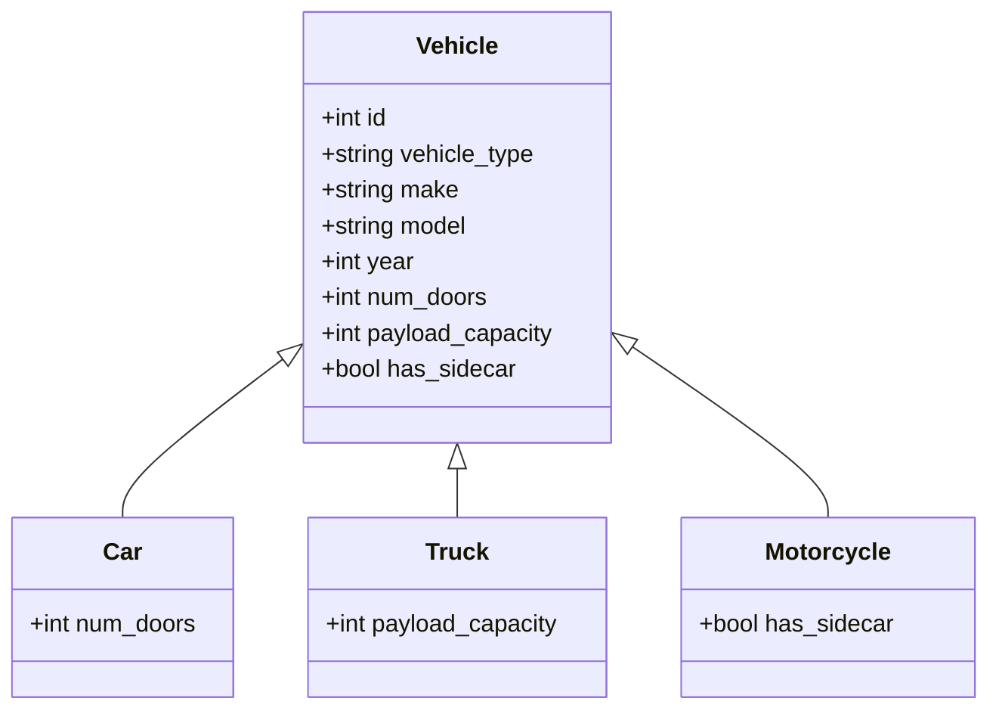

## 4.4.1 Single Table Inheritance

### Introduction

Single Table Inheritance (STI) is a design pattern used in relational databases to handle inheritance hierarchies. In this approach, all classes in the hierarchy are stored in a single table, with each row representing an instance of a class. This pattern is particularly useful when you want to simplify your database schema and avoid complex joins, but it comes with its own set of challenges, such as handling NULL values and ensuring data consistency.

### Design Pattern Name

**Single Table Inheritance (STI)**

### Category

**Inheritance Mapping Patterns**

### Intent

The intent of Single Table Inheritance is to map an entire class hierarchy to a single database table. This pattern is used to simplify the database schema by avoiding multiple tables for each class in the hierarchy, thus making queries straightforward and efficient.

### Key Participants

- **Base Class**: The parent class in the hierarchy, which contains common attributes.
- **Derived Classes**: The child classes that inherit from the base class and may have additional attributes.
- **Discriminator Column**: A special column used to identify the type of each row, indicating which class in the hierarchy the row represents.

### Applicability

Use Single Table Inheritance when:

- You have a simple class hierarchy with shared attributes.
- You want to minimize the number of tables in your database.
- You prefer simple and efficient queries without complex joins.
- You can tolerate the presence of NULL values for attributes not applicable to all classes.

### Sample Code Snippet

Let's consider an example of a class hierarchy representing different types of vehicles: `Car`, `Truck`, and `Motorcycle`. We'll use Single Table Inheritance to store all these types in a single table called `vehicles`.

```sql
CREATE TABLE vehicles (
    id INT PRIMARY KEY,
    vehicle_type VARCHAR(50),
    make VARCHAR(50),
    model VARCHAR(50),
    year INT,
    num_doors INT,          -- Specific to Car
    payload_capacity INT,   -- Specific to Truck
    has_sidecar BOOLEAN     -- Specific to Motorcycle
);

-- Insert data for different vehicle types
INSERT INTO vehicles (id, vehicle_type, make, model, year, num_doors)
VALUES (1, 'Car', 'Toyota', 'Camry', 2020, 4);

INSERT INTO vehicles (id, vehicle_type, make, model, year, payload_capacity)
VALUES (2, 'Truck', 'Ford', 'F-150', 2019, 1000);

INSERT INTO vehicles (id, vehicle_type, make, model, year, has_sidecar)
VALUES (3, 'Motorcycle', 'Harley-Davidson', 'Sportster', 2021, FALSE);
```

### Diagrams

To better understand the structure of Single Table Inheritance, let's visualize the table schema using a class diagram.



### Design Considerations

#### Pros

- **Simplicity**: With all data in a single table, queries are straightforward and do not require joins across multiple tables.
- **Performance**: Single table queries can be more efficient, especially for read-heavy applications.
- **Flexibility**: Adding new types to the hierarchy is as simple as adding new columns, provided the changes are backward compatible.

#### Cons

- **NULL Values**: Columns that are not applicable to all classes will contain NULLs, potentially leading to wasted space.
- **Data Integrity**: Ensuring data consistency can be challenging, as constraints must be managed at the application level.
- **Scalability**: As the hierarchy grows, the table can become unwieldy with many columns, leading to maintenance challenges.

### Differences and Similarities

Single Table Inheritance is often compared with other inheritance mapping patterns like Class Table Inheritance and Concrete Table Inheritance. Here are some key differences:

- **Class Table Inheritance**: Each class in the hierarchy has its own table, which can lead to complex joins but avoids NULL values.
- **Concrete Table Inheritance**: Each concrete class has its own table, which can lead to data duplication but simplifies queries for specific types.

### Try It Yourself

To get hands-on experience with Single Table Inheritance, try modifying the example above:

- Add a new vehicle type, such as `Bicycle`, and include attributes specific to bicycles.
- Experiment with querying the `vehicles` table to retrieve only cars or only trucks.
- Consider how you might handle additional attributes that are shared by some, but not all, vehicle types.

### Knowledge Check

- Explain the main advantage of using Single Table Inheritance.
- What are the potential downsides of using this pattern?
- How does the discriminator column function in Single Table Inheritance?

### Embrace the Journey

Remember, mastering SQL design patterns is a journey. As you explore Single Table Inheritance, consider how it fits into your overall database design strategy. Keep experimenting, stay curious, and enjoy the process of learning and applying these powerful patterns.

### References and Links

- [Single Table Inheritance on Wikipedia](https://en.wikipedia.org/wiki/Single_Table_Inheritance)
- [SQL Design Patterns](https://www.sqlpatterns.com)
- [MDN Web Docs on SQL](https://developer.mozilla.org/en-US/docs/Web/SQL)

## Quiz Time!



### What is the primary advantage of Single Table Inheritance?

- [x] Simplified queries without joins
- [ ] Avoidance of NULL values
- [ ] Reduced data redundancy
- [ ] Enhanced data integrity

> **Explanation:** Single Table Inheritance simplifies queries by storing all data in one table, eliminating the need for joins.

### What is a major drawback of Single Table Inheritance?

- [ ] Complex queries
- [x] Many NULL values
- [ ] Data redundancy
- [ ] Difficult schema changes

> **Explanation:** Single Table Inheritance often results in many NULL values for columns not applicable to all classes.

### What is the role of the discriminator column in Single Table Inheritance?

- [x] Identifies the class type of each row
- [ ] Stores unique identifiers
- [ ] Maintains data integrity
- [ ] Reduces NULL values

> **Explanation:** The discriminator column indicates which class each row represents in the hierarchy.

### Which pattern is often compared with Single Table Inheritance?

- [x] Class Table Inheritance
- [ ] Data Mapper Pattern
- [ ] Repository Pattern
- [ ] Singleton Pattern

> **Explanation:** Class Table Inheritance is another pattern for handling class hierarchies, often compared with Single Table Inheritance.

### How can you handle additional attributes in Single Table Inheritance?

- [x] Add new columns for new attributes
- [ ] Create a new table for each attribute
- [ ] Use a separate schema
- [ ] Avoid adding new attributes

> **Explanation:** In Single Table Inheritance, new attributes are added as new columns in the existing table.

### What is a potential scalability issue with Single Table Inheritance?

- [ ] Too many tables
- [x] Too many columns
- [ ] Complex joins
- [ ] Data duplication

> **Explanation:** As the hierarchy grows, the table can become unwieldy with many columns.

### What is a common alternative to Single Table Inheritance?

- [x] Class Table Inheritance
- [ ] Singleton Pattern
- [ ] Data Mapper Pattern
- [ ] Repository Pattern

> **Explanation:** Class Table Inheritance is a common alternative, where each class has its own table.

### What is a benefit of using a single table for inheritance?

- [x] Simplified schema
- [ ] Reduced NULL values
- [ ] Enhanced data integrity
- [ ] Complex queries

> **Explanation:** Using a single table simplifies the schema by consolidating all data into one table.

### True or False: Single Table Inheritance is ideal for complex hierarchies with many unique attributes.

- [ ] True
- [x] False

> **Explanation:** Single Table Inheritance can become cumbersome with complex hierarchies due to the proliferation of columns and NULL values.

### What should you consider when choosing Single Table Inheritance?

- [x] Tolerance for NULL values
- [ ] Avoidance of joins
- [ ] Data redundancy
- [ ] Complex schema changes

> **Explanation:** Consider whether your application can tolerate NULL values, as they are common in Single Table Inheritance.



By understanding and applying the Single Table Inheritance pattern, you can effectively manage class hierarchies in your database design, balancing simplicity and performance with the challenges of data integrity and scalability.
