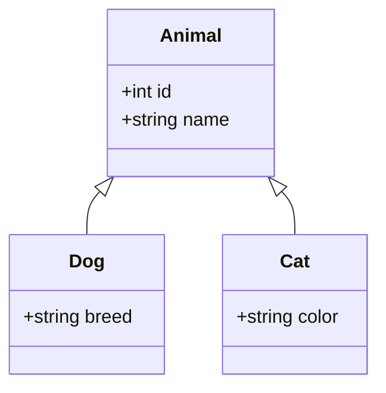
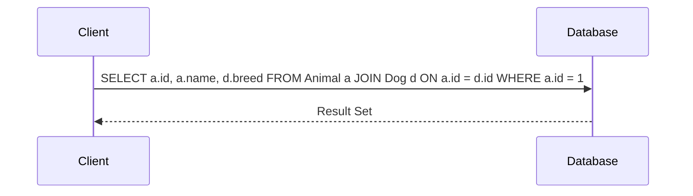

## 4.4.2 Class Table Inheritance

Class Table Inheritance is a sophisticated data modeling pattern used to map object-oriented inheritance hierarchies to relational databases. This pattern is particularly useful when you want to maintain a clear separation between different classes in your object model while still leveraging the power of relational databases. In this section, we will delve into the intricacies of Class Table Inheritance, exploring its implementation, benefits, and challenges.

### Design Pattern Name

**Class Table Inheritance**

### Category

Inheritance Mapping Patterns

### Intent

The intent of Class Table Inheritance is to map each class in an inheritance hierarchy to its own table in a relational database. This approach allows for a clean separation of data, avoiding NULL values for non-applicable fields and accurately modeling the inheritance structure.

### Diagrams

To better understand Class Table Inheritance, let's visualize the relationship between tables using a class diagram.



In this diagram, `Animal` is the base class, while `Dog` and `Cat` are derived classes. Each class corresponds to a separate table in the database.

### Key Participants

- **Base Table**: Represents the base class in the hierarchy. Contains common attributes shared by all derived classes.
- **Derived Tables**: Represent derived classes. Each table contains attributes specific to the derived class.
- **Primary Key**: A unique identifier that links records across tables, typically the same across all tables in the hierarchy.

### Applicability

Use Class Table Inheritance when:

- You need to model complex inheritance hierarchies in a relational database.
- You want to avoid NULL values for non-applicable fields in derived classes.
- You require a clear separation of data for different classes.

### Sample Code Snippet

Let's consider an example where we have an `Animal` class with derived classes `Dog` and `Cat`. We'll implement Class Table Inheritance in SQL.

```sql
-- Base table for Animal
CREATE TABLE Animal (
    id INT PRIMARY KEY,
    name VARCHAR(255) NOT NULL
);

-- Derived table for Dog
CREATE TABLE Dog (
    id INT PRIMARY KEY,
    breed VARCHAR(255),
    FOREIGN KEY (id) REFERENCES Animal(id)
);

-- Derived table for Cat
CREATE TABLE Cat (
    id INT PRIMARY KEY,
    color VARCHAR(255),
    FOREIGN KEY (id) REFERENCES Animal(id)
);
```

In this example, the `Animal` table contains common attributes, while `Dog` and `Cat` tables contain specific attributes. The `id` field serves as a primary key and foreign key to maintain relationships.

### Design Considerations

- **Joins Required**: Retrieving a full object requires joining the base and derived tables, which can impact performance.
- **Data Integrity**: Ensure that the primary key is consistent across all tables to maintain data integrity.
- **Complexity**: This pattern can increase complexity in both database design and query construction.

### Differences and Similarities

Class Table Inheritance is often compared to other inheritance mapping patterns, such as:

- **Single Table Inheritance**: All classes are stored in a single table, leading to potential NULL values for non-applicable fields.
- **Concrete Table Inheritance**: Each class, including the base class, is stored in its own table, with no shared table for common attributes.

### Code Examples

Let's explore more complex scenarios and queries using Class Table Inheritance.

#### Inserting Data

To insert data into the tables, you must first insert into the base table, followed by the derived table.

```sql
-- Insert into Animal
INSERT INTO Animal (id, name) VALUES (1, 'Buddy');

-- Insert into Dog
INSERT INTO Dog (id, breed) VALUES (1, 'Golden Retriever');
```

#### Querying Data

To retrieve a complete object, you need to join the base and derived tables.

```sql
-- Retrieve Dog details
SELECT a.id, a.name, d.breed
FROM Animal a
JOIN Dog d ON a.id = d.id
WHERE a.id = 1;
```

### Visualizing SQL Queries

Let's visualize the SQL query process using a sequence diagram.



This diagram illustrates the interaction between the client and the database when executing a query to retrieve data using Class Table Inheritance.

### Try It Yourself

Experiment with the code examples by modifying the attributes or adding new derived classes. For instance, try adding a `Bird` class with a `wingSpan` attribute and see how the queries change.

### References and Links

- [MDN Web Docs: SQL](https://developer.mozilla.org/en-US/docs/Web/SQL)
- [W3Schools: SQL Tutorial](https://www.w3schools.com/sql/)

### Knowledge Check

- Explain the primary advantage of using Class Table Inheritance.
- What is a potential drawback of using this pattern?
- How does Class Table Inheritance differ from Single Table Inheritance?

### Embrace the Journey

Remember, mastering Class Table Inheritance is just one step in your journey to becoming an expert in SQL design patterns. Keep experimenting, stay curious, and enjoy the process of learning and applying these powerful techniques.

## Quiz Time!



### What is the primary advantage of Class Table Inheritance?

- [x] Avoids NULL values for non-applicable fields
- [ ] Simplifies database schema
- [ ] Eliminates the need for joins
- [ ] Reduces storage requirements

> **Explanation:** Class Table Inheritance avoids NULL values by storing each class in its own table, ensuring only relevant fields are present.

### Which of the following is a potential drawback of Class Table Inheritance?

- [x] Requires joins for full object retrieval
- [ ] Increases storage requirements
- [ ] Leads to data redundancy
- [ ] Simplifies query construction

> **Explanation:** Retrieving a full object requires joining the base and derived tables, which can impact performance.

### How does Class Table Inheritance differ from Single Table Inheritance?

- [x] Each class has its own table
- [ ] All classes share a single table
- [ ] It leads to data redundancy
- [ ] It simplifies query construction

> **Explanation:** In Class Table Inheritance, each class has its own table, unlike Single Table Inheritance where all classes share a single table.

### What is the role of the primary key in Class Table Inheritance?

- [x] Links records across tables
- [ ] Stores common attributes
- [ ] Reduces data redundancy
- [ ] Simplifies query construction

> **Explanation:** The primary key links records across tables, ensuring data integrity and consistency.

### Which SQL command is used to create a derived table in Class Table Inheritance?

- [x] CREATE TABLE
- [ ] INSERT INTO
- [ ] SELECT FROM
- [ ] JOIN ON

> **Explanation:** The CREATE TABLE command is used to define a new table, including derived tables in Class Table Inheritance.

### What is a common use case for Class Table Inheritance?

- [x] Modeling complex inheritance hierarchies
- [ ] Reducing storage requirements
- [ ] Simplifying database schema
- [ ] Eliminating data redundancy

> **Explanation:** Class Table Inheritance is commonly used to model complex inheritance hierarchies in relational databases.

### What is a key consideration when using Class Table Inheritance?

- [x] Ensuring primary key consistency
- [ ] Reducing storage requirements
- [ ] Simplifying query construction
- [ ] Eliminating data redundancy

> **Explanation:** Ensuring primary key consistency across tables is crucial for maintaining data integrity.

### How can you retrieve a complete object in Class Table Inheritance?

- [x] By joining the base and derived tables
- [ ] By querying the base table only
- [ ] By querying the derived table only
- [ ] By using a single table

> **Explanation:** Retrieving a complete object requires joining the base and derived tables to access all relevant attributes.

### What is a potential challenge when using Class Table Inheritance?

- [x] Increased complexity in query construction
- [ ] Simplified database schema
- [ ] Reduced storage requirements
- [ ] Eliminated data redundancy

> **Explanation:** Class Table Inheritance can increase complexity in both database design and query construction.

### True or False: Class Table Inheritance eliminates the need for joins.

- [ ] True
- [x] False

> **Explanation:** Class Table Inheritance requires joins to retrieve full objects, as data is spread across multiple tables.




