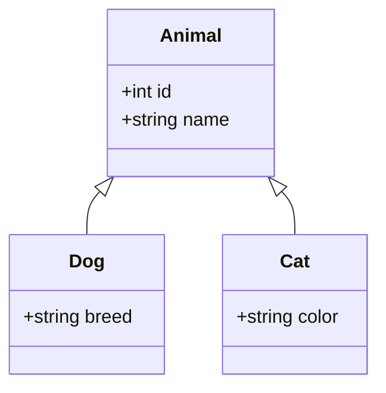
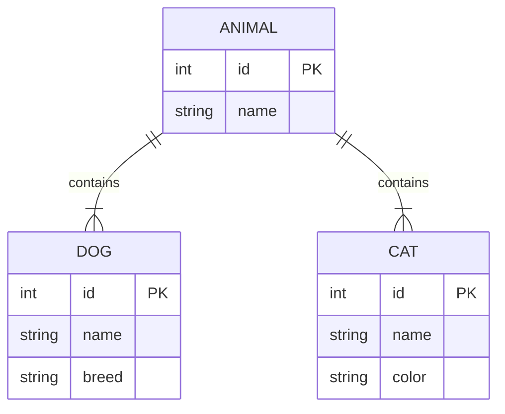

## 4.4.3 Concrete Table Inheritance

Concrete Table Inheritance is a design pattern used in SQL databases to map object-oriented inheritance hierarchies to relational tables. In this approach, each class in the hierarchy has its own table, and these tables duplicate the columns of the base class. This pattern is particularly useful when you want to avoid complex joins and maintain a straightforward table structure. However, it comes with its own set of challenges, such as data redundancy and increased maintenance overhead.

### Design Pattern Name

**Concrete Table Inheritance**

### Category

**Inheritance Mapping Patterns**

### Intent

The intent of Concrete Table Inheritance is to map each class in an inheritance hierarchy to its own table in a relational database. This pattern simplifies the retrieval of data by eliminating the need for joins, as all the data for a class is contained within a single table. It is particularly useful in scenarios where performance is critical, and the overhead of joins is undesirable.

### Diagrams

To better understand Concrete Table Inheritance, let's visualize the structure using a class diagram:



In this diagram, `Animal` is the base class, while `Dog` and `Cat` are derived classes. Each class will have its own table in the database.

### Key Participants

- **Base Class Table**: Contains columns that are common to all derived classes.
- **Derived Class Tables**: Each derived class has its own table, including columns from the base class and any additional columns specific to the derived class.

### Applicability

Concrete Table Inheritance is applicable in scenarios where:

- **Performance**: You want to optimize performance by avoiding joins.
- **Simplicity**: You prefer a simple table structure where each class is mapped to a single table.
- **Data Independence**: Each table can be managed independently, which can be advantageous in certain maintenance scenarios.

### Sample Code Snippet

Let's consider an example where we have an inheritance hierarchy of `Animal`, `Dog`, and `Cat`. Here's how you can implement Concrete Table Inheritance in SQL:

```sql
-- Table for the base class Animal
CREATE TABLE Animal (
    id INT PRIMARY KEY,
    name VARCHAR(255)
);

-- Table for the derived class Dog
CREATE TABLE Dog (
    id INT PRIMARY KEY,
    name VARCHAR(255),
    breed VARCHAR(255),
    FOREIGN KEY (id) REFERENCES Animal(id)
);

-- Table for the derived class Cat
CREATE TABLE Cat (
    id INT PRIMARY KEY,
    name VARCHAR(255),
    color VARCHAR(255),
    FOREIGN KEY (id) REFERENCES Animal(id)
);
```

In this example, each derived class (`Dog` and `Cat`) has its own table, which includes the columns from the `Animal` table.

### Design Considerations

When using Concrete Table Inheritance, consider the following:

- **Data Redundancy**: Since each table duplicates the columns of the base class, there is a risk of data redundancy.
- **Maintenance Overhead**: Changes to the base class structure need to be propagated to all derived class tables.
- **Consistency**: Ensure that data remains consistent across tables, especially when updates are made.

### Differences and Similarities

Concrete Table Inheritance is often compared to other inheritance mapping patterns, such as:

- **Single Table Inheritance**: All classes are stored in a single table, which can lead to sparse data and complex queries.
- **Class Table Inheritance**: Each class has its own table, but the base class table is separate, requiring joins to retrieve complete objects.

Concrete Table Inheritance differs in that it avoids joins by duplicating base class columns in each derived class table.

### Try It Yourself

To better understand Concrete Table Inheritance, try modifying the code example above:

- **Add a new derived class**: Create a new table for a `Bird` class with additional attributes.
- **Modify the base class**: Add a new column to the `Animal` table and update the derived class tables accordingly.
- **Experiment with queries**: Write SQL queries to retrieve data from the `Dog` and `Cat` tables and observe the performance.

### Visualizing Concrete Table Inheritance

Let's visualize how data is stored in Concrete Table Inheritance using a table diagram:



This diagram shows the relationship between the `Animal`, `Dog`, and `Cat` tables, highlighting the duplication of the `name` column.

### References and Links

For further reading on Concrete Table Inheritance and related topics, consider the following resources:

- [MDN Web Docs on SQL](https://developer.mozilla.org/en-US/docs/Web/SQL)
- [W3Schools SQL Tutorial](https://www.w3schools.com/sql/)
- [SQL Design Patterns Book](https://www.oreilly.com/library/view/sql-design-patterns/9780596009762/)

### Knowledge Check

To reinforce your understanding of Concrete Table Inheritance, consider the following questions:

- What are the advantages and disadvantages of using Concrete Table Inheritance?
- How does Concrete Table Inheritance differ from Single Table Inheritance?
- What are some scenarios where Concrete Table Inheritance is particularly useful?

### Embrace the Journey

Remember, mastering SQL design patterns is a journey. As you explore Concrete Table Inheritance, keep experimenting and learning. This pattern is just one of many tools in your SQL toolkit. Stay curious and enjoy the process of building efficient and scalable database solutions.

## Quiz Time!



### What is the primary advantage of Concrete Table Inheritance?

- [x] No joins are needed for data retrieval.
- [ ] It reduces data redundancy.
- [ ] It simplifies data maintenance.
- [ ] It minimizes storage requirements.

> **Explanation:** Concrete Table Inheritance eliminates the need for joins, as each class has its own table with all necessary columns.

### Which of the following is a disadvantage of Concrete Table Inheritance?

- [ ] Simplified table structure.
- [x] Data redundancy.
- [ ] Improved query performance.
- [ ] Reduced maintenance overhead.

> **Explanation:** Concrete Table Inheritance can lead to data redundancy because each table duplicates the columns of the base class.

### In Concrete Table Inheritance, how is data consistency maintained?

- [ ] By using complex joins.
- [x] By ensuring updates are propagated across all tables.
- [ ] By storing all data in a single table.
- [ ] By avoiding foreign key constraints.

> **Explanation:** Consistency is maintained by ensuring that any changes to the base class structure are reflected in all derived class tables.

### What is a key difference between Concrete Table Inheritance and Class Table Inheritance?

- [x] Concrete Table Inheritance duplicates base class columns in each table.
- [ ] Class Table Inheritance avoids data redundancy.
- [ ] Concrete Table Inheritance uses a single table for all classes.
- [ ] Class Table Inheritance requires no joins.

> **Explanation:** Concrete Table Inheritance duplicates base class columns in each derived class table, while Class Table Inheritance separates them.

### Which SQL command is used to create a table for a derived class in Concrete Table Inheritance?

- [x] CREATE TABLE
- [ ] ALTER TABLE
- [ ] INSERT INTO
- [ ] SELECT FROM

> **Explanation:** The `CREATE TABLE` command is used to define a new table for each derived class in Concrete Table Inheritance.

### How can you optimize performance in Concrete Table Inheritance?

- [ ] By using more joins.
- [x] By avoiding joins and duplicating columns.
- [ ] By reducing the number of tables.
- [ ] By using a single table for all classes.

> **Explanation:** Performance is optimized by avoiding joins and duplicating columns in each derived class table.

### What is a potential maintenance challenge in Concrete Table Inheritance?

- [ ] Simplifying table structure.
- [ ] Reducing data redundancy.
- [x] Propagating changes to all tables.
- [ ] Avoiding foreign key constraints.

> **Explanation:** A maintenance challenge is ensuring that changes to the base class structure are propagated to all derived class tables.

### Which scenario is Concrete Table Inheritance best suited for?

- [x] When performance is critical and joins are undesirable.
- [ ] When data redundancy must be minimized.
- [ ] When a single table is preferred for all classes.
- [ ] When complex joins are required.

> **Explanation:** Concrete Table Inheritance is best suited for scenarios where performance is critical and joins are undesirable.

### What is the role of foreign keys in Concrete Table Inheritance?

- [ ] To eliminate data redundancy.
- [x] To maintain referential integrity between tables.
- [ ] To simplify table structure.
- [ ] To avoid joins.

> **Explanation:** Foreign keys maintain referential integrity between tables in Concrete Table Inheritance.

### True or False: Concrete Table Inheritance requires each class to have its own table.

- [x] True
- [ ] False

> **Explanation:** True. In Concrete Table Inheritance, each class in the hierarchy has its own table.




