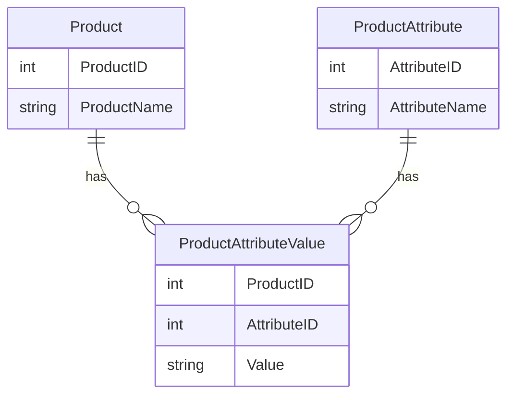

## 4.5 Entity-Attribute-Value (EAV) Model

The Entity-Attribute-Value (EAV) model is a powerful design pattern in SQL databases that provides a flexible schema for entities with dynamic attributes. This model is particularly useful when dealing with variable and sparse data, where traditional relational database schemas may fall short. In this comprehensive guide, we will delve into the intricacies of the EAV model, exploring its structure, advantages, drawbacks, and practical applications.

### Concept of the EAV Model

The EAV model is a data modeling technique that stores attributes in rows rather than columns. This structure allows for a high degree of flexibility, accommodating entities with a wide range of attributes that may not be known at design time. The EAV model is often used in scenarios where the number of attributes is large, variable, or sparse, such as in healthcare systems, product catalogs, and content management systems.

#### Structure of the EAV Model

In a traditional relational database, each entity type has its own table with a fixed set of columns representing attributes. In contrast, the EAV model uses a more flexible structure:

- **Entity**: Represents the object or item being described. Each entity is identified by a unique identifier.
- **Attribute**: Represents a property or characteristic of the entity. Attributes are stored as rows in a separate table.
- **Value**: Represents the data or information associated with an attribute for a specific entity.

The EAV model typically involves three main tables:

1. **Entity Table**: Contains a unique identifier for each entity.
2. **Attribute Table**: Lists all possible attributes that can be associated with entities.
3. **Value Table**: Stores the actual values for each attribute of each entity.

Here is a simplified example of how these tables might be structured:

```sql
-- Entity Table
CREATE TABLE Entity (
    EntityID INT PRIMARY KEY,
    EntityName VARCHAR(255)
);

-- Attribute Table
CREATE TABLE Attribute (
    AttributeID INT PRIMARY KEY,
    AttributeName VARCHAR(255)
);

-- Value Table
CREATE TABLE Value (
    EntityID INT,
    AttributeID INT,
    Value VARCHAR(255),
    PRIMARY KEY (EntityID, AttributeID),
    FOREIGN KEY (EntityID) REFERENCES Entity(EntityID),
    FOREIGN KEY (AttributeID) REFERENCES Attribute(AttributeID)
);
```

### Advantages of the EAV Model

The EAV model offers several advantages, particularly in scenarios where flexibility and scalability are paramount:

- **Flexibility**: The EAV model allows for the addition of new attributes without altering the database schema. This is particularly useful in environments where the set of attributes is not fixed or is subject to frequent changes.
- **Scalability**: By storing attributes as rows, the EAV model can handle a large number of attributes without requiring a large number of columns, which can be inefficient in traditional schemas.
- **Sparsity**: The EAV model is well-suited for handling sparse data, where not all entities have values for all attributes. This can lead to significant storage savings compared to traditional schemas.

### Drawbacks of the EAV Model

Despite its advantages, the EAV model also has several drawbacks that must be carefully considered:

- **Complex Queries**: Queries in an EAV model can become complex and difficult to optimize, particularly when retrieving data for multiple attributes.
- **Performance Issues**: The EAV model can lead to performance issues due to the need for multiple joins and the potential for large result sets.
- **Data Integrity**: Ensuring data integrity can be challenging in an EAV model, as it may be difficult to enforce constraints and validation rules across dynamic attributes.

### Practical Applications of the EAV Model

The EAV model is widely used in various industries and applications where flexibility and scalability are critical. Some common use cases include:

- **Healthcare Systems**: In healthcare, patient records often contain a wide range of attributes that vary between patients. The EAV model allows for the flexible storage of medical data, accommodating new tests and measurements as they become available.
- **Product Catalogs**: E-commerce platforms often have product catalogs with a diverse range of attributes for different product types. The EAV model enables the dynamic addition of new product attributes without requiring schema changes.
- **Content Management Systems**: In content management, articles and media may have varying metadata attributes. The EAV model allows for the flexible storage and retrieval of this metadata.

### Code Example: Implementing the EAV Model

Let's explore a practical example of implementing the EAV model in a SQL database. We'll use a simple product catalog scenario where products can have dynamic attributes.

```sql
-- Create Entity Table for Products
CREATE TABLE Product (
    ProductID INT PRIMARY KEY,
    ProductName VARCHAR(255)
);

-- Create Attribute Table for Product Attributes
CREATE TABLE ProductAttribute (
    AttributeID INT PRIMARY KEY,
    AttributeName VARCHAR(255)
);

-- Create Value Table for Product Attribute Values
CREATE TABLE ProductAttributeValue (
    ProductID INT,
    AttributeID INT,
    Value VARCHAR(255),
    PRIMARY KEY (ProductID, AttributeID),
    FOREIGN KEY (ProductID) REFERENCES Product(ProductID),
    FOREIGN KEY (AttributeID) REFERENCES ProductAttribute(AttributeID)
);

-- Insert Sample Data
INSERT INTO Product (ProductID, ProductName) VALUES (1, 'Laptop');
INSERT INTO ProductAttribute (AttributeID, AttributeName) VALUES (1, 'Color'), (2, 'Weight');
INSERT INTO ProductAttributeValue (ProductID, AttributeID, Value) VALUES (1, 1, 'Silver'), (1, 2, '2.5 kg');

-- Query to Retrieve Product Attributes
SELECT p.ProductName, a.AttributeName, v.Value
FROM Product p
JOIN ProductAttributeValue v ON p.ProductID = v.ProductID
JOIN ProductAttribute a ON v.AttributeID = a.AttributeID
WHERE p.ProductID = 1;
```

### Visualizing the EAV Model

To better understand the EAV model, let's visualize the relationships between the Entity, Attribute, and Value tables using a Mermaid.js diagram.



This diagram illustrates how the Product, ProductAttribute, and ProductAttributeValue tables are related in the EAV model.

### Design Considerations

When implementing the EAV model, it's important to consider the following design considerations:

- **Use Cases**: The EAV model is best suited for scenarios with highly dynamic and variable attributes. Consider alternative models if the attribute set is relatively stable.
- **Performance Optimization**: Optimize queries by indexing the Value table and using appropriate query techniques to minimize performance overhead.
- **Data Integrity**: Implement validation and constraints at the application level to ensure data integrity, as enforcing these at the database level can be challenging.

### Differences and Similarities with Other Patterns

The EAV model is often compared to other data modeling patterns, such as:

- **Traditional Relational Model**: Unlike the traditional model, the EAV model offers flexibility at the cost of complexity and performance.
- **Document-Based Models**: Similar to document-based NoSQL databases, the EAV model provides flexibility in handling dynamic attributes, but within a relational database context.

### Try It Yourself

To deepen your understanding of the EAV model, try modifying the code examples provided. Experiment with adding new products and attributes, and observe how the EAV model handles these changes. Consider the performance implications of different query strategies and explore ways to optimize them.

### Knowledge Check

Before we conclude, let's reinforce what we've learned with a few key takeaways:

- The EAV model provides a flexible schema for handling dynamic attributes in SQL databases.
- It is particularly useful for scenarios with variable and sparse data.
- While offering flexibility, the EAV model can lead to complex queries and performance challenges.

Remember, mastering the EAV model is just one step in your journey to becoming an expert in SQL design patterns. Keep exploring, experimenting, and learning to unlock the full potential of SQL in your projects.

## Quiz Time!



### What is the primary advantage of the EAV model?

- [x] Flexibility in handling dynamic attributes
- [ ] Improved query performance
- [ ] Simplified data integrity enforcement
- [ ] Reduced storage requirements

> **Explanation:** The EAV model is primarily advantageous for its flexibility in handling dynamic and variable attributes.

### Which table in the EAV model stores the actual data values?

- [ ] Entity Table
- [ ] Attribute Table
- [x] Value Table
- [ ] Metadata Table

> **Explanation:** The Value Table stores the actual data values associated with each attribute of an entity.

### What is a common drawback of the EAV model?

- [ ] Limited scalability
- [x] Complex queries
- [ ] Fixed schema
- [ ] Lack of flexibility

> **Explanation:** A common drawback of the EAV model is the complexity of queries, especially when retrieving data for multiple attributes.

### In which scenarios is the EAV model most beneficial?

- [x] When dealing with variable and sparse data
- [ ] When all entities have the same set of attributes
- [ ] When performance is the top priority
- [ ] When data integrity is easily enforced

> **Explanation:** The EAV model is most beneficial in scenarios with variable and sparse data, where flexibility is needed.

### How does the EAV model handle new attributes?

- [x] By adding new rows in the Attribute and Value tables
- [ ] By altering the schema to add new columns
- [ ] By creating new tables for each attribute
- [ ] By using a fixed set of columns

> **Explanation:** The EAV model handles new attributes by adding new rows in the Attribute and Value tables, without altering the schema.

### Which of the following is a key component of the EAV model?

- [x] Entity Table
- [ ] Index Table
- [ ] Metadata Table
- [ ] Constraint Table

> **Explanation:** The Entity Table is a key component of the EAV model, representing the objects or items being described.

### What is a potential performance issue with the EAV model?

- [ ] Excessive storage usage
- [x] Multiple joins required for queries
- [ ] Difficulty in adding new entities
- [ ] Lack of scalability

> **Explanation:** A potential performance issue with the EAV model is the need for multiple joins in queries, which can impact performance.

### How can data integrity be ensured in an EAV model?

- [ ] By using database constraints
- [x] By implementing validation at the application level
- [ ] By using fixed schemas
- [ ] By limiting the number of attributes

> **Explanation:** Data integrity in an EAV model is often ensured by implementing validation at the application level, as enforcing constraints at the database level can be challenging.

### What is a common use case for the EAV model?

- [x] Healthcare systems with dynamic patient records
- [ ] Financial systems with fixed transaction data
- [ ] Inventory systems with static product attributes
- [ ] Real-time analytics with high query performance

> **Explanation:** A common use case for the EAV model is healthcare systems, where patient records often contain a wide range of dynamic attributes.

### True or False: The EAV model is ideal for scenarios with a stable set of attributes.

- [ ] True
- [x] False

> **Explanation:** False. The EAV model is not ideal for scenarios with a stable set of attributes; it is best suited for dynamic and variable attribute sets.


