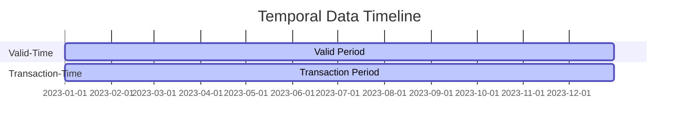

## 4.6.1 Valid-Time and Transaction-Time Tables

In the realm of database design, managing temporal data is crucial for applications that require historical tracking and auditing capabilities. Valid-Time and Transaction-Time tables are powerful constructs that allow us to capture the temporal aspects of data. This section will delve into these concepts, providing expert guidance on their implementation and use in SQL databases.

### Understanding Temporal Data

Temporal data refers to data that is associated with time. In database systems, this is often broken down into two main types:

- **Valid-Time**: This represents the time period during which a fact is true in the real world. For example, an employee's job title might be valid from the date they are promoted until they leave the company.
  
- **Transaction-Time**: This tracks when data is stored in the database. It records the time period during which a fact is stored in the database, regardless of its real-world validity.

### Bitemporal Tables

Bitemporal tables combine both valid-time and transaction-time, providing a comprehensive history of data changes. This allows for complex queries that can retrieve data as it was known at any point in time, both in terms of its real-world validity and its presence in the database.

### Key Concepts and Terminology

Before diving into implementation, let's clarify some key terms:

- **Period**: A range of time with a start and end point.
- **Temporal Table**: A table that includes time periods as part of its schema.
- **Bitemporal Data**: Data that is tracked using both valid-time and transaction-time.

### Implementing Valid-Time Tables

To implement valid-time tables, we need to include columns that define the start and end of the valid period. This allows us to query data based on its real-world validity.

#### Example Schema

```sql
CREATE TABLE Employee_ValidTime (
    EmployeeID INT PRIMARY KEY,
    Name VARCHAR(100),
    Position VARCHAR(100),
    ValidFrom DATE,
    ValidTo DATE
);
```

In this schema, `ValidFrom` and `ValidTo` define the period during which the employee's position is valid.

#### Querying Valid-Time Data

To retrieve data that was valid at a specific point in time, we can use SQL queries that filter based on the valid period.

```sql
SELECT * FROM Employee_ValidTime
WHERE '2023-01-01' BETWEEN ValidFrom AND ValidTo;
```

This query retrieves all records that were valid on January 1, 2023.

### Implementing Transaction-Time Tables

Transaction-time tables require columns that track when data was inserted and when it was logically deleted (if applicable).

#### Example Schema

```sql
CREATE TABLE Employee_TransactionTime (
    EmployeeID INT PRIMARY KEY,
    Name VARCHAR(100),
    Position VARCHAR(100),
    TransactionStart TIMESTAMP DEFAULT CURRENT_TIMESTAMP,
    TransactionEnd TIMESTAMP DEFAULT '9999-12-31 23:59:59'
);
```

Here, `TransactionStart` and `TransactionEnd` track the period during which the data is stored in the database.

#### Querying Transaction-Time Data

To find data as it was stored at a particular time, we can query based on the transaction period.

```sql
SELECT * FROM Employee_TransactionTime
WHERE '2023-01-01 12:00:00' BETWEEN TransactionStart AND TransactionEnd;
```

This query retrieves records that were present in the database at noon on January 1, 2023.

### Bitemporal Tables: Combining Valid-Time and Transaction-Time

Bitemporal tables incorporate both valid-time and transaction-time, allowing for sophisticated temporal queries.

#### Example Schema

```sql
CREATE TABLE Employee_Bitemporal (
    EmployeeID INT PRIMARY KEY,
    Name VARCHAR(100),
    Position VARCHAR(100),
    ValidFrom DATE,
    ValidTo DATE,
    TransactionStart TIMESTAMP DEFAULT CURRENT_TIMESTAMP,
    TransactionEnd TIMESTAMP DEFAULT '9999-12-31 23:59:59'
);
```

#### Querying Bitemporal Data

Bitemporal queries can filter based on both valid-time and transaction-time, providing a complete historical view.

```sql
SELECT * FROM Employee_Bitemporal
WHERE '2023-01-01' BETWEEN ValidFrom AND ValidTo
AND '2023-01-01 12:00:00' BETWEEN TransactionStart AND TransactionEnd;
```

This query retrieves records that were valid in the real world and stored in the database at the specified times.

### Visualizing Temporal Data

To better understand the concept of bitemporal data, let's visualize it using a timeline diagram.



This diagram illustrates how valid-time and transaction-time can overlap, providing a comprehensive view of data history.

### Design Considerations

When implementing temporal tables, consider the following:

- **Storage Requirements**: Temporal tables can grow large due to historical data. Plan for adequate storage and consider archiving strategies.
- **Performance**: Indexing temporal columns can improve query performance. Consider using composite indexes for complex queries.
- **Data Integrity**: Ensure that valid-time and transaction-time periods do not overlap incorrectly, which could lead to data inconsistencies.

### Differences and Similarities

Valid-time and transaction-time tables are often confused due to their similar purpose of tracking time. However, they serve distinct roles:

- **Valid-Time**: Focuses on real-world validity.
- **Transaction-Time**: Focuses on database storage history.

Bitemporal tables combine these aspects, offering a complete temporal perspective.

### Try It Yourself

To deepen your understanding, try modifying the code examples:

- Add additional columns to track other aspects of temporal data, such as user modifications.
- Implement triggers to automatically update transaction-time periods upon data changes.
- Experiment with different indexing strategies to optimize query performance.

### References and Further Reading

- [Temporal Tables in SQL Server](https://docs.microsoft.com/en-us/sql/relational-databases/tables/temporal-tables)
- [Temporal Data in PostgreSQL](https://www.postgresql.org/docs/current/temporal.html)

### Knowledge Check

- What are the key differences between valid-time and transaction-time tables?
- How can bitemporal tables enhance data auditing capabilities?
- What are some potential challenges when implementing temporal tables?

### Embrace the Journey

Remember, mastering temporal data management is a journey. As you explore these concepts, you'll gain valuable insights into how data evolves over time. Keep experimenting, stay curious, and enjoy the process!

## Quiz Time!



### What is the primary purpose of valid-time tables?

- [x] To record when data is valid in the real world
- [ ] To track when data changes occur in the database
- [ ] To combine both valid-time and transaction-time
- [ ] To manage data storage

> **Explanation:** Valid-time tables are designed to capture the period during which data is valid in the real world.

### What does transaction-time track in a database?

- [ ] Real-world validity of data
- [x] When data changes occur in the database
- [ ] Both valid-time and transaction-time
- [ ] Data storage capacity

> **Explanation:** Transaction-time tracks the period during which data is stored in the database.

### What is a bitemporal table?

- [ ] A table that only tracks valid-time
- [ ] A table that only tracks transaction-time
- [x] A table that combines both valid-time and transaction-time
- [ ] A table that tracks data storage

> **Explanation:** Bitemporal tables combine both valid-time and transaction-time to provide a comprehensive history of data changes.

### How can you query data that was valid at a specific point in time using valid-time tables?

- [x] Use a SQL query with a WHERE clause filtering based on the valid period
- [ ] Use a SQL query with a WHERE clause filtering based on the transaction period
- [ ] Use a SQL query with a JOIN clause
- [ ] Use a SQL query with an ORDER BY clause

> **Explanation:** To query data valid at a specific time, filter based on the valid period using a WHERE clause.

### What is a key consideration when implementing temporal tables?

- [x] Storage requirements due to historical data
- [ ] Lack of indexing options
- [ ] Inability to track data changes
- [ ] Limited query capabilities

> **Explanation:** Temporal tables can grow large due to historical data, so storage requirements must be considered.

### Which SQL clause is used to filter data based on transaction-time?

- [ ] GROUP BY
- [ ] ORDER BY
- [x] WHERE
- [ ] HAVING

> **Explanation:** The WHERE clause is used to filter data based on transaction-time.

### What is the default value for the TransactionEnd column in the example schema?

- [ ] CURRENT_TIMESTAMP
- [x] '9999-12-31 23:59:59'
- [ ] NULL
- [ ] '1970-01-01 00:00:00'

> **Explanation:** The default value for TransactionEnd is set to '9999-12-31 23:59:59' to represent an open-ended period.

### How can indexing improve temporal table performance?

- [x] By speeding up query execution on temporal columns
- [ ] By reducing storage requirements
- [ ] By increasing data validity
- [ ] By simplifying schema design

> **Explanation:** Indexing temporal columns can significantly improve query performance by speeding up execution.

### What is the role of a period in temporal data management?

- [x] To define a range of time with a start and end point
- [ ] To store data changes
- [ ] To manage database transactions
- [ ] To optimize query performance

> **Explanation:** A period defines a range of time with a start and end point, crucial for managing temporal data.

### True or False: Bitemporal tables can only be implemented in SQL Server.

- [ ] True
- [x] False

> **Explanation:** Bitemporal tables can be implemented in various SQL databases, not just SQL Server.


