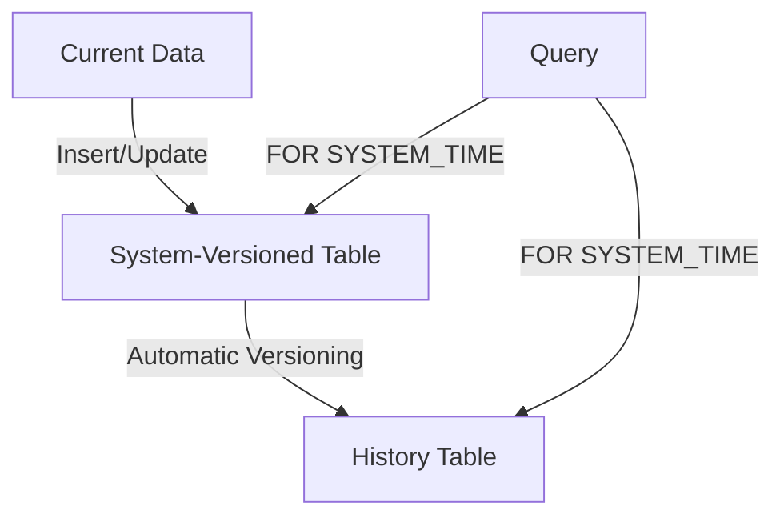

## 4.6.2 System-Versioned Temporal Tables

In the realm of SQL and database management, handling temporal data efficiently is crucial for maintaining historical records, auditing changes, and ensuring data integrity. System-Versioned Temporal Tables (SVTT) offer a robust solution by automatically managing historical data, allowing developers to focus on application logic rather than manual data tracking. In this section, we will delve into the features, implementation, and benefits of System-Versioned Temporal Tables, providing expert insights and practical examples to master this powerful SQL design pattern.

### Understanding System-Versioned Temporal Tables

System-Versioned Temporal Tables are a feature in SQL that allows the database system to automatically manage the history of data changes. This is achieved by maintaining both current and historical data within the same table structure, enabling seamless querying of data at any point in time.

#### Key Features

- **Automatic History Management**: The database system automatically tracks changes to data, storing historical versions without requiring manual intervention.
- **Temporal Queries**: SQL provides specific syntax to query data as it existed at any given point in time, using `FOR SYSTEM_TIME`.
- **Data Integrity**: Ensures that historical data is consistent and accurate, reducing the risk of data loss or corruption.

### Implementation of System-Versioned Temporal Tables

Implementing System-Versioned Temporal Tables involves defining a table with system-versioning capabilities, using SQL syntax to specify temporal attributes. Let's explore the steps involved in creating and managing these tables.

#### Creating a System-Versioned Temporal Table

To create a System-Versioned Temporal Table, you need to define two additional columns to store the start and end of the system time period. Here's a step-by-step guide:

```sql
CREATE TABLE EmployeeHistory (
    EmployeeID INT PRIMARY KEY,
    Name NVARCHAR(100),
    Position NVARCHAR(50),
    Salary DECIMAL(10, 2),
    SysStartTime DATETIME2 GENERATED ALWAYS AS ROW START NOT NULL,
    SysEndTime DATETIME2 GENERATED ALWAYS AS ROW END NOT NULL,
    PERIOD FOR SYSTEM_TIME (SysStartTime, SysEndTime)
) WITH (SYSTEM_VERSIONING = ON (HISTORY_TABLE = dbo.EmployeeHistoryArchive));
```

**Explanation:**

- **Primary Table**: `EmployeeHistory` is the primary table that stores current data.
- **History Table**: `EmployeeHistoryArchive` is the history table that stores historical versions of the data.
- **System Time Columns**: `SysStartTime` and `SysEndTime` are used to define the period for system time.
- **System Versioning**: The `SYSTEM_VERSIONING = ON` clause enables automatic versioning.

#### Querying System-Versioned Temporal Tables

Once the table is set up, you can perform temporal queries to retrieve data as it existed at any point in time. Here are some examples:

- **Retrieve Current Data**:

```sql
SELECT * FROM EmployeeHistory
WHERE EmployeeID = 1;
```

- **Retrieve Historical Data**:

```sql
SELECT * FROM EmployeeHistory
FOR SYSTEM_TIME AS OF '2023-01-01'
WHERE EmployeeID = 1;
```

- **Retrieve Data Over a Period**:

```sql
SELECT * FROM EmployeeHistory
FOR SYSTEM_TIME FROM '2023-01-01' TO '2023-12-31'
WHERE EmployeeID = 1;
```

**Key Points:**

- **`FOR SYSTEM_TIME AS OF`**: Retrieves data as it existed at a specific point in time.
- **`FOR SYSTEM_TIME FROM ... TO ...`**: Retrieves data over a specified period.

### Benefits of System-Versioned Temporal Tables

System-Versioned Temporal Tables offer several advantages that make them an essential tool for managing temporal data:

- **Simplified Temporal Data Handling**: Automates the process of tracking historical data, reducing the complexity of application logic.
- **Enhanced Data Integrity**: Ensures that historical data is accurate and consistent, providing a reliable audit trail.
- **Efficient Data Retrieval**: Allows for efficient querying of historical data without the need for complex joins or manual tracking.
- **Regulatory Compliance**: Facilitates compliance with regulations that require data retention and auditability.

### Design Considerations

When implementing System-Versioned Temporal Tables, consider the following:

- **Storage Requirements**: Historical data can increase storage requirements. Plan for adequate storage capacity.
- **Performance Impact**: While temporal tables simplify data management, they may impact performance due to additional storage and indexing.
- **Data Retention Policies**: Define clear policies for data retention and archiving to manage storage and compliance.

### Differences and Similarities with Other Patterns

System-Versioned Temporal Tables are often compared with other temporal data management patterns, such as:

- **Application-Versioned Temporal Tables**: Managed by application logic rather than the database system.
- **Bi-Temporal Tables**: Track both system time and valid time, providing a more comprehensive temporal model.

### Visualizing System-Versioned Temporal Tables

To better understand the structure and flow of System-Versioned Temporal Tables, let's visualize the process using a Mermaid.js diagram:



**Diagram Description**: This diagram illustrates how current data is inserted or updated in the System-Versioned Table, which automatically manages versioning and stores historical data in the History Table. Queries can access both current and historical data using the `FOR SYSTEM_TIME` syntax.

### Try It Yourself

To deepen your understanding, try modifying the code examples:

- **Add New Columns**: Extend the `EmployeeHistory` table with additional columns and observe how historical data is managed.
- **Experiment with Queries**: Use different `FOR SYSTEM_TIME` clauses to retrieve data at various points in time.
- **Analyze Performance**: Monitor the performance impact of system-versioning on large datasets.

### References and Further Reading

- [Microsoft Docs: Temporal Tables](https://docs.microsoft.com/en-us/sql/relational-databases/tables/temporal-tables)
- [W3Schools SQL Tutorial](https://www.w3schools.com/sql/)
- [SQL Server System-Versioned Temporal Tables](https://www.sqlshack.com/sql-server-system-versioned-temporal-tables/)

### Knowledge Check

- **What are the key benefits of using System-Versioned Temporal Tables?**
- **How does the `FOR SYSTEM_TIME` clause enhance querying capabilities?**
- **What are the storage implications of using temporal tables?**

### Embrace the Journey

Remember, mastering System-Versioned Temporal Tables is just one step in your journey to becoming an expert in SQL design patterns. As you continue to explore and experiment, you'll gain deeper insights into managing temporal data efficiently. Keep experimenting, stay curious, and enjoy the journey!

## Quiz Time!



### What is a primary benefit of System-Versioned Temporal Tables?

- [x] Automatic history management
- [ ] Manual data tracking
- [ ] Reduced storage requirements
- [ ] Simplified indexing

> **Explanation:** System-Versioned Temporal Tables automatically manage historical data, eliminating the need for manual tracking.

### Which SQL clause is used to query historical data in System-Versioned Temporal Tables?

- [ ] SELECT * FROM
- [x] FOR SYSTEM_TIME
- [ ] WHERE SYSTEM_TIME
- [ ] ORDER BY SYSTEM_TIME

> **Explanation:** The `FOR SYSTEM_TIME` clause is used to query data as it existed at a specific point in time.

### What is a potential drawback of using System-Versioned Temporal Tables?

- [ ] Reduced data integrity
- [x] Increased storage requirements
- [ ] Complex application logic
- [ ] Manual versioning

> **Explanation:** Storing historical data can increase storage requirements.

### How do System-Versioned Temporal Tables ensure data integrity?

- [x] By automatically managing historical data
- [ ] By requiring manual data entry
- [ ] By using complex joins
- [ ] By reducing data redundancy

> **Explanation:** The database system automatically tracks and manages historical data, ensuring integrity.

### What is the purpose of the `PERIOD FOR SYSTEM_TIME` clause?

- [x] To define the start and end of the system time period
- [ ] To specify the primary key
- [ ] To create indexes
- [ ] To manage user permissions

> **Explanation:** `PERIOD FOR SYSTEM_TIME` defines the columns used for system time tracking.

### Which of the following is NOT a feature of System-Versioned Temporal Tables?

- [ ] Automatic history management
- [ ] Temporal queries
- [x] Manual data archiving
- [ ] Data integrity

> **Explanation:** System-Versioned Temporal Tables automate history management, eliminating the need for manual archiving.

### What is the role of the history table in System-Versioned Temporal Tables?

- [x] To store historical versions of data
- [ ] To store current data
- [ ] To manage user permissions
- [ ] To create indexes

> **Explanation:** The history table stores historical versions of data for auditing and retrieval.

### How can you retrieve data as it existed on January 1, 2023, using System-Versioned Temporal Tables?

- [x] Use `FOR SYSTEM_TIME AS OF '2023-01-01'`
- [ ] Use `WHERE DATE = '2023-01-01'`
- [ ] Use `ORDER BY DATE`
- [ ] Use `GROUP BY DATE`

> **Explanation:** `FOR SYSTEM_TIME AS OF` retrieves data as it existed at a specific point in time.

### What is a common use case for System-Versioned Temporal Tables?

- [x] Auditing changes over time
- [ ] Reducing database size
- [ ] Simplifying user interfaces
- [ ] Enhancing encryption

> **Explanation:** System-Versioned Temporal Tables are commonly used for auditing changes and maintaining historical records.

### True or False: System-Versioned Temporal Tables require manual intervention to track historical data.

- [ ] True
- [x] False

> **Explanation:** System-Versioned Temporal Tables automatically manage historical data without manual intervention.


