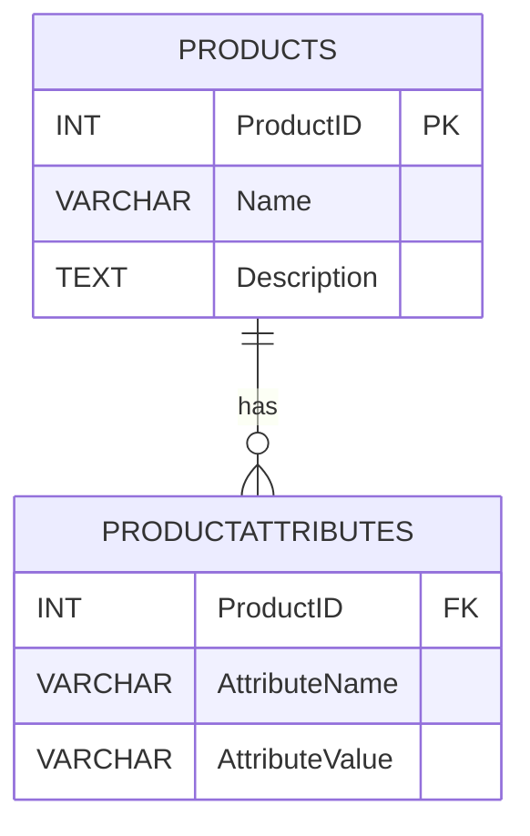

## 4.7 Modeling Sparse Attributes

In the realm of database design, handling sparse attributes is a common challenge. Sparse attributes refer to columns in a database table that are often left empty or null because they are not applicable to every row. This can lead to inefficiencies in storage and performance, especially when dealing with large datasets. In this section, we will explore strategies for modeling sparse attributes effectively, focusing on vertical partitioning and the Entity-Attribute-Value (EAV) model. We will also discuss the considerations involved in choosing the right approach for your specific use case.

### Understanding Sparse Attributes

Sparse attributes arise in scenarios where not all entities have the same set of attributes. For example, consider a database table designed to store information about various types of products. Some products may have attributes like "color" or "size," while others may not. Storing these attributes as columns in a single table can result in many null values, leading to wasted storage space and potential performance issues.

**Problem**: Tables with many nullable columns due to optional attributes.

- **Impact**: 
  - Increased storage requirements due to null values.
  - Potentially slower query performance, as the database engine must handle many null checks.
  - Complicated schema design, making it harder to maintain and extend.

### Solutions for Modeling Sparse Attributes

To address the challenges posed by sparse attributes, we can employ several strategies. The two primary approaches we will discuss are vertical partitioning and the Entity-Attribute-Value (EAV) model.

#### Vertical Partitioning

**Vertical partitioning** involves splitting a table into multiple tables, each containing a subset of the columns. This approach is particularly useful when dealing with columns that are rarely used or applicable to only a subset of the data.

**How It Works**:
- Identify columns that are infrequently used or contain many null values.
- Create a separate table for these columns, linked to the original table via a foreign key.
- This reduces the number of nulls in the main table and can improve query performance by allowing the database engine to focus on the most relevant data.

**Example**:
Consider a `Products` table with optional attributes such as `Color`, `Size`, and `Weight`. We can partition these attributes into a separate table:

```sql
-- Original Products table
CREATE TABLE Products (
    ProductID INT PRIMARY KEY,
    Name VARCHAR(255),
    Description TEXT
    -- Other common attributes
);

-- Partitioned table for optional attributes
CREATE TABLE ProductAttributes (
    ProductID INT,
    AttributeName VARCHAR(255),
    AttributeValue VARCHAR(255),
    FOREIGN KEY (ProductID) REFERENCES Products(ProductID)
);
```

**Benefits**:
- Reduces storage space by eliminating nulls in the main table.
- Improves query performance for operations that do not require the optional attributes.
- Simplifies schema design by separating core and optional data.

**Considerations**:
- Increases complexity in query design, as joins are required to access optional attributes.
- May lead to performance overhead due to additional joins.

#### Entity-Attribute-Value (EAV) Model

The **Entity-Attribute-Value (EAV) model** is a flexible schema design pattern that allows for dynamic attributes. It is particularly useful when the number of potential attributes is large and not all entities share the same attributes.

**How It Works**:
- Store attributes as rows in a separate table, rather than columns.
- Each row in the EAV table represents a single attribute-value pair for a specific entity.

**Example**:
Continuing with the `Products` example, we can implement an EAV model as follows:

```sql
-- Original Products table
CREATE TABLE Products (
    ProductID INT PRIMARY KEY,
    Name VARCHAR(255),
    Description TEXT
    -- Other common attributes
);

-- EAV table for dynamic attributes
CREATE TABLE ProductAttributes (
    ProductID INT,
    AttributeName VARCHAR(255),
    AttributeValue VARCHAR(255),
    FOREIGN KEY (ProductID) REFERENCES Products(ProductID)
);
```

**Benefits**:
- Provides flexibility to add new attributes without altering the schema.
- Efficiently handles a large number of optional attributes.

**Considerations**:
- Can lead to complex queries, as multiple rows must be aggregated to reconstruct an entity's attributes.
- May result in performance issues for large datasets due to the need for extensive joins and aggregations.

### Design Considerations

When choosing between vertical partitioning and the EAV model, consider the following factors:

- **Complexity vs. Flexibility**: Vertical partitioning offers a simpler schema at the cost of flexibility, while the EAV model provides maximum flexibility but increases complexity.
- **Performance**: Vertical partitioning can improve performance for queries that do not require optional attributes, whereas the EAV model may introduce performance overhead due to the need for joins and aggregations.
- **Scalability**: The EAV model is more scalable in terms of adding new attributes, but may not scale well in terms of performance for large datasets.
- **Use Case**: Consider the specific requirements of your application, such as the frequency of attribute changes and the typical query patterns.

### Visualizing Sparse Attribute Models

To better understand the differences between vertical partitioning and the EAV model, let's visualize these concepts using Mermaid.js diagrams.

#### Vertical Partitioning Diagram



**Description**: This diagram illustrates the relationship between the `Products` table and the `ProductAttributes` table in a vertical partitioning model. The `ProductAttributes` table stores optional attributes, linked to the `Products` table via a foreign key.

#### EAV Model Diagram


**Description**: This diagram represents the EAV model, where each attribute-value pair is stored as a separate row in the `ProductAttributes` table, linked to the `Products` table via a foreign key.

### Code Examples and Try It Yourself

Let's explore some code examples to solidify our understanding of these concepts.

#### Vertical Partitioning Example

```sql
-- Query to retrieve product details with optional attributes
SELECT p.ProductID, p.Name, p.Description, pa.AttributeName, pa.AttributeValue
FROM Products p
LEFT JOIN ProductAttributes pa ON p.ProductID = pa.ProductID
WHERE p.ProductID = 1;
```

**Try It Yourself**: Modify the query to filter products based on a specific attribute, such as `Color`.

#### EAV Model Example

```sql
-- Query to retrieve product details with dynamic attributes
SELECT p.ProductID, p.Name, p.Description,
       GROUP_CONCAT(CONCAT(pa.AttributeName, ': ', pa.AttributeValue) SEPARATOR ', ') AS Attributes
FROM Products p
LEFT JOIN ProductAttributes pa ON p.ProductID = pa.ProductID
WHERE p.ProductID = 1
GROUP BY p.ProductID;
```

**Try It Yourself**: Experiment with adding new attributes to the `ProductAttributes` table and observe how the query results change.

### References and Further Reading

- [Vertical Partitioning in SQL](https://www.sqlshack.com/vertical-partitioning-in-sql-server/)
- [Entity-Attribute-Value Model](https://en.wikipedia.org/wiki/Entity%E2%80%93attribute%E2%80%93value_model)
- [Database Normalization and Denormalization](https://www.geeksforgeeks.org/database-normalization-and-denormalization/)

### Knowledge Check

- What are the main challenges associated with sparse attributes in SQL databases?
- How does vertical partitioning help in managing sparse attributes?
- What are the benefits and drawbacks of using the EAV model?
- When would you choose vertical partitioning over the EAV model, and vice versa?

### Embrace the Journey

Remember, mastering the art of modeling sparse attributes is a journey. As you explore different strategies and experiment with various approaches, you'll gain a deeper understanding of how to optimize your database design for performance and scalability. Keep experimenting, stay curious, and enjoy the journey!

## Quiz Time!



### What is a primary challenge of handling sparse attributes in SQL databases?

- [x] Increased storage requirements due to null values
- [ ] Difficulty in creating indexes
- [ ] Lack of support for foreign keys
- [ ] Inability to perform joins

> **Explanation:** Sparse attributes often lead to increased storage requirements because of the many null values present in the table.

### Which approach involves splitting a table into multiple tables to handle sparse attributes?

- [x] Vertical Partitioning
- [ ] Horizontal Partitioning
- [ ] EAV Model
- [ ] Sharding

> **Explanation:** Vertical partitioning involves splitting a table into multiple tables, each containing a subset of the columns, to manage sparse attributes.

### What is a key benefit of the EAV model?

- [x] Flexibility to add new attributes without altering the schema
- [ ] Improved query performance
- [ ] Simplified schema design
- [ ] Reduced storage space

> **Explanation:** The EAV model provides flexibility to add new attributes without altering the schema, making it suitable for dynamic attribute scenarios.

### In vertical partitioning, how are optional attributes typically stored?

- [x] In a separate table linked via a foreign key
- [ ] As additional columns in the main table
- [ ] In a JSON or XML format
- [ ] Using a key-value store

> **Explanation:** In vertical partitioning, optional attributes are stored in a separate table linked to the main table via a foreign key.

### What is a potential drawback of using the EAV model?

- [x] Complex queries due to multiple rows per entity
- [ ] Lack of flexibility in adding new attributes
- [ ] Increased storage requirements
- [ ] Difficulty in handling joins

> **Explanation:** The EAV model can lead to complex queries because multiple rows must be aggregated to reconstruct an entity's attributes.

### Which approach is more scalable in terms of adding new attributes?

- [x] EAV Model
- [ ] Vertical Partitioning
- [ ] Horizontal Partitioning
- [ ] Denormalization

> **Explanation:** The EAV model is more scalable in terms of adding new attributes, as it allows for dynamic attribute addition without schema changes.

### What is a common use case for vertical partitioning?

- [x] Reducing storage space by eliminating nulls
- [ ] Handling hierarchical data
- [ ] Implementing full-text search
- [ ] Managing large binary objects

> **Explanation:** Vertical partitioning is commonly used to reduce storage space by eliminating nulls in the main table.

### How does vertical partitioning improve query performance?

- [x] By allowing the database engine to focus on the most relevant data
- [ ] By reducing the number of joins required
- [ ] By simplifying the schema design
- [ ] By storing data in a denormalized format

> **Explanation:** Vertical partitioning improves query performance by allowing the database engine to focus on the most relevant data, reducing the need to handle many nulls.

### What is a key consideration when choosing between vertical partitioning and the EAV model?

- [x] Complexity vs. Flexibility
- [ ] Storage space vs. Query performance
- [ ] Schema design vs. Data integrity
- [ ] Indexing vs. Foreign keys

> **Explanation:** A key consideration when choosing between vertical partitioning and the EAV model is balancing complexity and flexibility.

### True or False: The EAV model is suitable for scenarios with a fixed set of attributes.

- [ ] True
- [x] False

> **Explanation:** False. The EAV model is suitable for scenarios with a large and dynamic set of attributes, not a fixed set.


