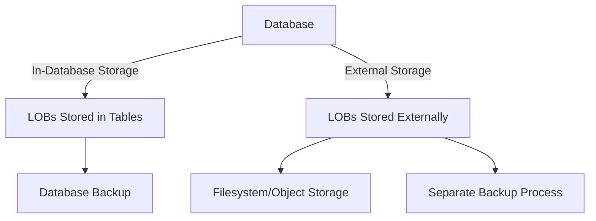

## 4.8 Handling Large Objects (LOBs)

In the realm of SQL databases, handling Large Objects (LOBs) is a critical aspect of data modeling and management. LOBs, which include Binary Large Objects (BLOBs) and Character Large Objects (CLOBs), are used to store large amounts of data such as images, videos, documents, and other multimedia content. This section delves into the various data types, storage options, and best practices for managing LOBs efficiently.

### Understanding LOB Data Types

LOBs are designed to store large volumes of data that exceed the typical size limits of standard data types. The most common LOB data types include:

- **BLOB (Binary Large Object):** Used for storing binary data such as images, audio, and video files.
- **CLOB (Character Large Object):** Used for storing large text data, such as documents and XML files.
- **TEXT:** A variant of CLOB used in some SQL dialects for large text storage.
- **BYTEA:** A PostgreSQL-specific data type for storing binary data.

Each of these data types serves a specific purpose and is optimized for different kinds of data. Understanding the characteristics of each type is crucial for selecting the appropriate one for your application.

### Storage Options for LOBs

When it comes to storing LOBs, there are two primary strategies: in-database storage and external storage. Each approach has its advantages and trade-offs.

#### In-Database Storage

In-database storage involves storing LOBs directly within the database tables. This approach offers several benefits:

- **Transaction Management:** LOBs stored in the database benefit from the ACID properties of transactions, ensuring data integrity and consistency.
- **Simplified Backup and Recovery:** Since LOBs are part of the database, they are included in standard backup and recovery processes.
- **Security:** Database-level security mechanisms can be applied to LOBs, providing a unified security model.

However, in-database storage can lead to performance issues, especially with very large LOBs, as they can increase the size of the database significantly and impact query performance.

#### External Storage

External storage involves storing LOBs outside the database, typically on a filesystem or in object storage services, with pointers or references stored in the database. This approach offers:

- **Scalability:** External storage can handle larger volumes of data without impacting database performance.
- **Cost Efficiency:** Storing LOBs externally can be more cost-effective, especially when using cloud-based object storage solutions.
- **Performance:** Offloading LOB storage can improve database performance by reducing the size of the database.

However, managing LOBs externally requires additional considerations for transaction management, security, and backup strategies.

### Best Practices for Managing LOBs

To effectively manage LOBs, consider the following best practices:

#### 1. Choose the Right Storage Strategy

Evaluate the trade-offs between in-database and external storage based on your application's requirements. Consider factors such as data size, access patterns, and performance needs.

#### 2. Optimize LOB Sizes

- **Compression:** Use compression techniques to reduce the size of LOBs and improve storage efficiency.
- **Chunking:** For very large LOBs, consider breaking them into smaller chunks for easier management and retrieval.

#### 3. Implement Efficient Backup Strategies

- **Incremental Backups:** Use incremental backups to reduce the time and storage required for backing up large LOBs.
- **Separate LOB Backups:** Consider backing up LOBs separately from the rest of the database to optimize backup processes.

#### 4. Tune Performance

- **Indexing:** Use indexing strategies to optimize queries that involve LOBs, especially when using in-database storage.
- **Caching:** Implement caching mechanisms to improve access times for frequently accessed LOBs.

#### 5. Ensure Security

- **Encryption:** Encrypt LOBs both at rest and in transit to protect sensitive data.
- **Access Control:** Implement fine-grained access control to restrict who can access or modify LOBs.

### Code Examples

Let's explore some code examples to illustrate how to handle LOBs in SQL databases.

#### Example 1: Storing a BLOB in MySQL

```sql
CREATE TABLE images (
    id INT AUTO_INCREMENT PRIMARY KEY,
    image_data LONGBLOB
);

-- Insert an image into the table
INSERT INTO images (image_data) VALUES (LOAD_FILE('/path/to/image.jpg'));
```

In this example, we create a table to store images as BLOBs in MySQL. The `LOAD_FILE` function is used to read the image file from the filesystem and insert it into the database.

#### Example 2: Storing a CLOB in Oracle

```sql
CREATE TABLE documents (
    id NUMBER GENERATED BY DEFAULT AS IDENTITY PRIMARY KEY,
    document_text CLOB
);

-- Insert a document into the table
INSERT INTO documents (document_text) VALUES ('This is a large text document...');
```

Here, we create a table to store documents as CLOBs in Oracle. The `CLOB` data type is used to handle large text data efficiently.

#### Example 3: Using External Storage with PostgreSQL

```sql
CREATE TABLE files (
    id SERIAL PRIMARY KEY,
    file_path TEXT
);

-- Insert a file reference into the table
INSERT INTO files (file_path) VALUES ('/external/storage/path/to/file.pdf');
```

In this PostgreSQL example, we store file paths in the database while keeping the actual files in external storage. This approach allows for efficient management of large files without impacting database performance.

### Visualizing LOB Storage Options

To better understand the differences between in-database and external storage, let's visualize these options using a Mermaid.js diagram.



**Diagram Description:** This diagram illustrates the two primary storage options for LOBs: in-database storage, where LOBs are stored within database tables, and external storage, where LOBs are stored outside the database with references in the database.

### Try It Yourself

Experiment with the code examples provided by modifying the file paths, data types, or storage strategies. Consider the following challenges:

- Modify the MySQL example to store a different type of binary data, such as a video file.
- In the Oracle example, try inserting a larger text document and observe how the database handles it.
- For the PostgreSQL example, implement a mechanism to retrieve and display the files stored externally.

### Knowledge Check

Before moving on, let's reinforce what we've learned with a few questions:

- What are the advantages of using external storage for LOBs?
- How can compression and chunking help manage large LOBs?
- What are some security considerations when handling LOBs?

### Embrace the Journey

Handling LOBs effectively is a crucial skill for database architects and developers. As you continue to explore SQL design patterns, remember that mastering LOB management will enhance your ability to build scalable and efficient database solutions. Keep experimenting, stay curious, and enjoy the journey!

## Quiz Time!



### What is a BLOB used for in SQL databases?

- [x] Storing binary data such as images and videos
- [ ] Storing large text data
- [ ] Storing small integers
- [ ] Storing date and time values

> **Explanation:** BLOB stands for Binary Large Object and is used to store binary data like images and videos.

### Which storage option is more scalable for LOBs?

- [ ] In-database storage
- [x] External storage
- [ ] Temporary storage
- [ ] Volatile storage

> **Explanation:** External storage is more scalable as it can handle larger volumes of data without impacting database performance.

### What is a key benefit of in-database storage for LOBs?

- [x] Transaction management and ACID compliance
- [ ] Reduced database size
- [ ] Lower storage costs
- [ ] Faster retrieval times

> **Explanation:** In-database storage benefits from transaction management and ACID compliance, ensuring data integrity.

### How can LOB sizes be optimized?

- [x] Compression and chunking
- [ ] Increasing database size
- [ ] Using volatile storage
- [ ] Disabling indexing

> **Explanation:** Compression and chunking can reduce LOB sizes and improve storage efficiency.

### What is a common data type for storing large text data?

- [ ] BLOB
- [x] CLOB
- [ ] BYTEA
- [ ] INTEGER

> **Explanation:** CLOB (Character Large Object) is used for storing large text data.

### What is a benefit of using external storage for LOBs?

- [ ] Simplified transaction management
- [x] Improved database performance
- [ ] Unified security model
- [ ] Automatic indexing

> **Explanation:** External storage can improve database performance by reducing the size of the database.

### What is a security consideration for handling LOBs?

- [x] Encrypting LOBs at rest and in transit
- [ ] Using volatile storage
- [ ] Disabling access control
- [ ] Storing LOBs in plain text

> **Explanation:** Encrypting LOBs at rest and in transit protects sensitive data from unauthorized access.

### Which SQL dialect uses the BYTEA data type for binary data?

- [ ] MySQL
- [ ] Oracle
- [x] PostgreSQL
- [ ] SQL Server

> **Explanation:** PostgreSQL uses the BYTEA data type for storing binary data.

### What is a disadvantage of in-database storage for LOBs?

- [ ] Improved security
- [ ] Simplified backup processes
- [x] Potential performance issues with large LOBs
- [ ] Unified transaction management

> **Explanation:** In-database storage can lead to performance issues, especially with very large LOBs.

### True or False: LOBs stored externally require separate backup processes.

- [x] True
- [ ] False

> **Explanation:** LOBs stored externally are not included in standard database backups and require separate backup processes.


