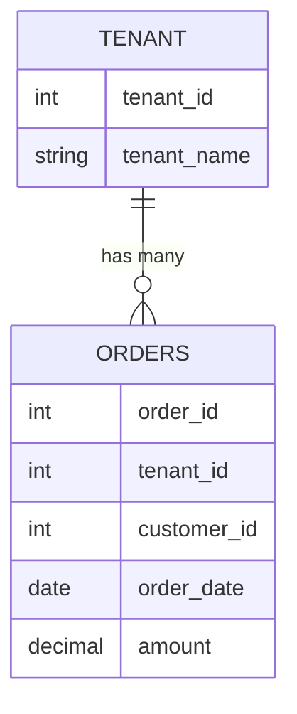

## 4.9.1 Shared Database, Shared Schema

In the realm of multi-tenancy, the **Shared Database, Shared Schema** design pattern stands out as a popular choice for applications that need to serve multiple tenants efficiently. This pattern involves using a single database and schema to store data for all tenants, with a tenant identifier to distinguish between them. Let's delve into the intricacies of this pattern, exploring its design, advantages, challenges, and implementation strategies.

### Design

The **Shared Database, Shared Schema** pattern is characterized by a single set of tables shared among all tenants. Each table includes a column, often referred to as the `tenant_id`, which uniquely identifies the tenant to which each row belongs. This approach allows for efficient resource utilization by minimizing the overhead associated with maintaining separate databases or schemas for each tenant.

#### Key Participants

- **Tenant Identifier**: A unique identifier for each tenant, typically a column in each table.
- **Shared Tables**: Tables that store data for all tenants, differentiated by the tenant identifier.
- **Access Control Mechanisms**: Ensure that tenants can only access their own data.

#### Applicability

This pattern is suitable for applications where:

- **Resource Efficiency**: There's a need to optimize resource usage by sharing infrastructure among tenants.
- **Scalability**: The application must scale to accommodate a large number of tenants without significant overhead.
- **Cost-Effectiveness**: Reducing costs associated with database maintenance and management is a priority.

### Advantages

1. **Efficient Resource Utilization**: By sharing a single database and schema, this pattern minimizes the resources required for database management, leading to cost savings and simplified maintenance.

2. **Simplified Management**: With a single schema to manage, updates and changes can be applied uniformly across all tenants, reducing the complexity of database administration.

3. **Scalability**: The pattern supports a large number of tenants without the need for additional database instances, making it easier to scale the application.

4. **Cost-Effective**: Lower infrastructure and maintenance costs due to shared resources.

### Challenges

1. **Data Isolation and Security**: Ensuring that tenants can only access their own data is critical. This requires robust access control mechanisms and careful query design to prevent data leakage.

2. **Performance Bottlenecks**: As the number of tenants grows, the shared database may become a performance bottleneck, requiring careful optimization and monitoring.

3. **Complex Query Design**: Queries must be designed to efficiently filter data by tenant, which can add complexity to the application logic.

4. **Backup and Recovery**: Managing backups and recovery for a shared database can be challenging, especially when different tenants have different data retention requirements.

### Implementation Strategies

#### Designing the Schema

When implementing the Shared Database, Shared Schema pattern, the schema design is crucial. Each table should include a `tenant_id` column to differentiate data between tenants. Here's an example of a simple table design:

```sql
CREATE TABLE orders (
    order_id INT PRIMARY KEY,
    tenant_id INT NOT NULL,
    customer_id INT,
    order_date DATE,
    amount DECIMAL(10, 2),
    FOREIGN KEY (tenant_id) REFERENCES tenants(tenant_id)
);
```

In this example, the `tenant_id` column is used to identify which tenant each order belongs to. This column is critical for maintaining data isolation.

#### Access Control

Implementing access control is essential to ensure that tenants can only access their own data. This can be achieved through:

- **Application-Level Filtering**: Ensure that all queries include a filter on the `tenant_id` column to restrict data access to the current tenant.
- **Database Views**: Create views that automatically filter data by `tenant_id`, simplifying query logic and enhancing security.

```sql
CREATE VIEW tenant_orders AS
SELECT * FROM orders
WHERE tenant_id = CURRENT_TENANT_ID();
```

#### Performance Optimization

To address potential performance bottlenecks, consider the following strategies:

- **Indexing**: Create indexes on the `tenant_id` column to improve query performance.
- **Partitioning**: Partition tables by `tenant_id` to distribute data more evenly and improve access speed.
- **Caching**: Implement caching mechanisms to reduce database load and improve response times.

#### Backup and Recovery

Develop a backup and recovery strategy that accommodates the needs of all tenants. This may involve:

- **Regular Backups**: Schedule regular backups of the entire database.
- **Tenant-Specific Backups**: Implement mechanisms to restore data for individual tenants if needed.

### Code Examples

Let's explore some code examples to illustrate the concepts discussed.

#### Sample Code Snippet: Query with Tenant Filtering

```sql
-- Retrieve orders for a specific tenant
SELECT order_id, customer_id, order_date, amount
FROM orders
WHERE tenant_id = :tenant_id;
```

In this query, the `tenant_id` parameter is used to filter orders for a specific tenant, ensuring data isolation.

#### Sample Code Snippet: Creating an Indexed View

```sql
-- Create an indexed view for tenant-specific orders
CREATE VIEW tenant_orders AS
SELECT order_id, customer_id, order_date, amount
FROM orders
WHERE tenant_id = CURRENT_TENANT_ID();

CREATE INDEX idx_tenant_orders ON tenant_orders (tenant_id);
```

This indexed view improves query performance by pre-filtering data for the current tenant.

### Design Considerations

When implementing the Shared Database, Shared Schema pattern, consider the following:

- **Security**: Implement robust access control mechanisms to prevent unauthorized data access.
- **Performance**: Monitor and optimize database performance to prevent bottlenecks.
- **Scalability**: Plan for future growth by designing the schema and infrastructure to accommodate additional tenants.

### Differences and Similarities

The Shared Database, Shared Schema pattern is often compared to other multi-tenancy patterns, such as:

- **Shared Database, Separate Schema**: Each tenant has a separate schema within the same database. This provides better data isolation but requires more resources.
- **Separate Database**: Each tenant has a separate database. This offers the highest level of isolation but at a higher cost.

### Visualizing the Shared Database, Shared Schema Pattern

To better understand the architecture of the Shared Database, Shared Schema pattern, let's visualize it using a diagram.



This Entity-Relationship (ER) diagram illustrates the relationship between tenants and orders in a shared schema. Each order is associated with a tenant through the `tenant_id` column.

### Try It Yourself

To deepen your understanding of the Shared Database, Shared Schema pattern, try modifying the code examples provided:

- **Add a new table**: Create a new table for storing customer information, including a `tenant_id` column.
- **Implement a new view**: Create a view that combines data from multiple tables, filtered by `tenant_id`.
- **Optimize performance**: Experiment with different indexing strategies to improve query performance.

### Knowledge Check

To reinforce your understanding of the Shared Database, Shared Schema pattern, consider the following questions:

- What are the key advantages of using a shared schema for multi-tenancy?
- How can you ensure data isolation in a shared schema environment?
- What are some potential performance challenges associated with this pattern?

### Embrace the Journey

Remember, mastering the Shared Database, Shared Schema pattern is just one step in your journey as a software engineer or architect. As you continue to explore SQL design patterns, you'll gain the skills and knowledge needed to build efficient, scalable, and secure database solutions. Keep experimenting, stay curious, and enjoy the journey!

### References and Links

For further reading on multi-tenancy and database design patterns, consider the following resources:

- [Multi-Tenant Data Architecture](https://www.red-gate.com/simple-talk/sql/database-administration/multi-tenant-data-architecture/)
- [Designing Multi-Tenant Applications](https://docs.microsoft.com/en-us/azure/architecture/guide/multitenant/)
- [SQL Server Multi-Tenancy Patterns](https://www.sqlshack.com/sql-server-multi-tenancy-patterns/)

## Quiz Time!



### What is a key advantage of the Shared Database, Shared Schema pattern?

- [x] Efficient resource utilization
- [ ] High data isolation
- [ ] Separate databases for each tenant
- [ ] Complex schema management

> **Explanation:** The Shared Database, Shared Schema pattern is known for its efficient resource utilization by sharing a single database and schema among all tenants.

### How can data isolation be ensured in a Shared Database, Shared Schema environment?

- [x] By using a tenant identifier in each table
- [ ] By creating separate databases for each tenant
- [ ] By using complex joins
- [ ] By encrypting all data

> **Explanation:** Data isolation is ensured by using a tenant identifier in each table to distinguish data belonging to different tenants.

### What is a potential challenge of the Shared Database, Shared Schema pattern?

- [x] Performance bottlenecks
- [ ] High infrastructure costs
- [ ] Complex schema management
- [ ] Limited scalability

> **Explanation:** Performance bottlenecks can occur as the number of tenants grows, requiring careful optimization and monitoring.

### Which of the following is a strategy to optimize performance in a Shared Database, Shared Schema environment?

- [x] Indexing the tenant identifier column
- [ ] Using separate schemas for each tenant
- [ ] Encrypting all data
- [ ] Using complex joins

> **Explanation:** Indexing the tenant identifier column can improve query performance by allowing faster data retrieval.

### What is a key consideration when designing a schema for a Shared Database, Shared Schema pattern?

- [x] Including a tenant identifier in each table
- [ ] Using separate databases for each tenant
- [ ] Encrypting all data
- [ ] Using complex joins

> **Explanation:** Including a tenant identifier in each table is crucial for distinguishing data between tenants and ensuring data isolation.

### How can access control be implemented in a Shared Database, Shared Schema environment?

- [x] By filtering queries based on the tenant identifier
- [ ] By using separate databases for each tenant
- [ ] By encrypting all data
- [ ] By using complex joins

> **Explanation:** Access control can be implemented by filtering queries based on the tenant identifier to restrict data access to the current tenant.

### What is a benefit of using views in a Shared Database, Shared Schema environment?

- [x] Simplifying query logic and enhancing security
- [ ] Creating separate databases for each tenant
- [ ] Encrypting all data
- [ ] Using complex joins

> **Explanation:** Views can simplify query logic and enhance security by automatically filtering data by tenant identifier.

### Which of the following is a potential performance optimization strategy for a Shared Database, Shared Schema environment?

- [x] Partitioning tables by tenant identifier
- [ ] Using separate databases for each tenant
- [ ] Encrypting all data
- [ ] Using complex joins

> **Explanation:** Partitioning tables by tenant identifier can distribute data more evenly and improve access speed.

### What is a key challenge of managing backups in a Shared Database, Shared Schema environment?

- [x] Accommodating different data retention requirements for tenants
- [ ] High infrastructure costs
- [ ] Complex schema management
- [ ] Limited scalability

> **Explanation:** Managing backups can be challenging due to different data retention requirements for tenants, requiring a flexible strategy.

### True or False: The Shared Database, Shared Schema pattern is suitable for applications with high data isolation requirements.

- [ ] True
- [x] False

> **Explanation:** The Shared Database, Shared Schema pattern is not ideal for applications with high data isolation requirements due to shared resources.


