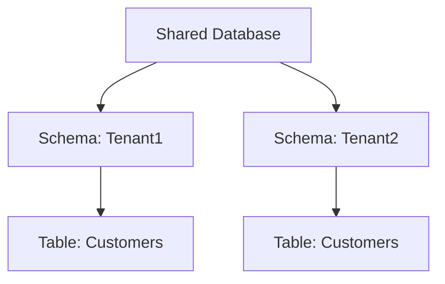

## 4.9.2 Shared Database, Separate Schema

In the realm of multi-tenancy, the **Shared Database, Separate Schema** pattern stands out as a robust solution for managing multiple tenants within a single database environment. This pattern provides a balance between resource efficiency and data isolation, making it a popular choice for SaaS applications and other multi-tenant architectures. In this section, we will delve into the intricacies of this pattern, exploring its design, advantages, challenges, and practical implementation strategies.

### Design Pattern Name

**Shared Database, Separate Schema**

### Category

Multi-Tenancy Patterns

### Intent

The primary intent of the Shared Database, Separate Schema pattern is to provide each tenant with its own schema within a single database. This approach ensures data isolation while optimizing resource utilization by sharing the same database instance among multiple tenants.

### Key Participants

- **Database Administrator (DBA):** Responsible for managing the database and schemas, ensuring security, and optimizing performance.
- **Application Developer:** Implements the application logic to interact with the correct schema based on the tenant context.
- **Tenant:** Represents a distinct customer or user group whose data is stored in a separate schema.

### Applicability

This pattern is applicable in scenarios where:

- **Data Isolation is Critical:** Each tenant requires a high degree of data isolation for security or compliance reasons.
- **Resource Efficiency is Important:** Sharing a single database instance reduces costs and simplifies management.
- **Scalability is a Concern:** The system needs to scale efficiently as the number of tenants grows.

### Advantages

1. **Data Isolation:** Each tenant's data is stored in a separate schema, providing a clear boundary between tenants.
2. **Security:** Schema-level permissions can be applied to enhance security.
3. **Customization:** Allows for tenant-specific customizations at the schema level.
4. **Simplified Backup and Restore:** Individual schemas can be backed up and restored independently.

### Challenges

1. **Schema Proliferation:** Managing a large number of schemas can become complex.
2. **Maintenance Overhead:** Schema updates and migrations need to be applied consistently across all schemas.
3. **Performance Considerations:** As the number of schemas grows, performance tuning becomes more challenging.
4. **Complexity in Querying:** Queries need to be dynamically adjusted to target the correct schema.

### Sample Code Snippet

Let's explore a simple example of how to implement the Shared Database, Separate Schema pattern in SQL. We'll create a database with multiple schemas, each representing a different tenant.

```sql
-- Create a new database
CREATE DATABASE MultiTenantDB;

-- Switch to the new database
USE MultiTenantDB;

-- Create schemas for two tenants
CREATE SCHEMA Tenant1;
CREATE SCHEMA Tenant2;

-- Create a sample table in each schema
CREATE TABLE Tenant1.Customers (
    CustomerID INT PRIMARY KEY,
    Name VARCHAR(100),
    Email VARCHAR(100)
);

CREATE TABLE Tenant2.Customers (
    CustomerID INT PRIMARY KEY,
    Name VARCHAR(100),
    Email VARCHAR(100)
);

-- Insert sample data into Tenant1 schema
INSERT INTO Tenant1.Customers (CustomerID, Name, Email) VALUES (1, 'Alice', 'alice@example.com');

-- Insert sample data into Tenant2 schema
INSERT INTO Tenant2.Customers (CustomerID, Name, Email) VALUES (2, 'Bob', 'bob@example.com');
```

### Design Considerations

- **Schema Management:** Implement automated tools or scripts to manage schema creation, updates, and migrations.
- **Security:** Use schema-level permissions to restrict access to tenant data.
- **Performance Optimization:** Regularly monitor and optimize database performance as the number of schemas increases.
- **Dynamic Querying:** Implement logic in the application layer to dynamically select the appropriate schema based on the tenant context.

### Differences and Similarities

The Shared Database, Separate Schema pattern is often compared to the **Shared Database, Shared Schema** pattern. While both patterns share a single database instance, the key difference lies in data isolation. The Separate Schema pattern provides better data isolation by storing each tenant's data in a distinct schema, whereas the Shared Schema pattern stores all tenant data in a single schema with tenant identifiers.

### Visualizing the Shared Database, Separate Schema Pattern

To better understand the architecture of the Shared Database, Separate Schema pattern, let's visualize it using a Mermaid.js diagram.



**Diagram Description:** This diagram illustrates a shared database containing separate schemas for Tenant1 and Tenant2. Each schema contains a `Customers` table, demonstrating data isolation within the same database.

### Implementation Strategies

1. **Automated Schema Management:** Develop scripts or use database management tools to automate schema creation, updates, and migrations.
2. **Dynamic Schema Selection:** Implement logic in the application to dynamically select the appropriate schema based on the tenant context.
3. **Monitoring and Optimization:** Regularly monitor database performance and optimize queries and indexes as needed.
4. **Security Best Practices:** Apply schema-level permissions and regularly audit access controls to ensure data security.

### Try It Yourself

To gain hands-on experience with the Shared Database, Separate Schema pattern, try modifying the code example provided above. Experiment with adding new schemas, tables, and data. Consider implementing logic to dynamically select the schema based on a tenant identifier.

### References and Links

- [MDN Web Docs: SQL](https://developer.mozilla.org/en-US/docs/Web/SQL)
- [W3Schools: SQL Tutorial](https://www.w3schools.com/sql/)
- [PostgreSQL Documentation: Schemas](https://www.postgresql.org/docs/current/ddl-schemas.html)

### Knowledge Check

- What are the key advantages of the Shared Database, Separate Schema pattern?
- How does this pattern differ from the Shared Database, Shared Schema pattern?
- What are some challenges associated with managing multiple schemas?

### Embrace the Journey

Remember, mastering the Shared Database, Separate Schema pattern is just one step in your journey as a database architect. As you continue to explore multi-tenancy patterns, you'll gain deeper insights into designing scalable and secure database solutions. Keep experimenting, stay curious, and enjoy the journey!

## Quiz Time!



### What is the primary intent of the Shared Database, Separate Schema pattern?

- [x] To provide each tenant with its own schema within a single database.
- [ ] To store all tenant data in a single schema with tenant identifiers.
- [ ] To create a separate database for each tenant.
- [ ] To use a single schema for all tenants without isolation.

> **Explanation:** The Shared Database, Separate Schema pattern aims to provide each tenant with its own schema within a single database, ensuring data isolation.

### Which of the following is an advantage of the Shared Database, Separate Schema pattern?

- [x] Better data isolation.
- [ ] Reduced schema management complexity.
- [ ] Simplified querying across tenants.
- [ ] Lower resource utilization.

> **Explanation:** The pattern provides better data isolation by storing each tenant's data in a separate schema.

### What is a challenge associated with the Shared Database, Separate Schema pattern?

- [x] Managing schema proliferation.
- [ ] Lack of data isolation.
- [ ] High resource utilization.
- [ ] Difficulty in creating new schemas.

> **Explanation:** Managing a large number of schemas can become complex, leading to schema proliferation.

### How does the Shared Database, Separate Schema pattern differ from the Shared Database, Shared Schema pattern?

- [x] It provides better data isolation by using separate schemas for each tenant.
- [ ] It uses a single schema for all tenants with tenant identifiers.
- [ ] It requires a separate database for each tenant.
- [ ] It does not support data isolation.

> **Explanation:** The Separate Schema pattern provides better data isolation by using separate schemas for each tenant, unlike the Shared Schema pattern.

### Which of the following is a key participant in the Shared Database, Separate Schema pattern?

- [x] Database Administrator (DBA)
- [ ] Network Administrator
- [ ] System Architect
- [ ] Frontend Developer

> **Explanation:** The DBA is responsible for managing the database and schemas, ensuring security, and optimizing performance.

### What is a design consideration for implementing the Shared Database, Separate Schema pattern?

- [x] Implementing automated tools for schema management.
- [ ] Using a single schema for all tenants.
- [ ] Avoiding schema-level permissions.
- [ ] Storing all tenant data in a single table.

> **Explanation:** Automated tools or scripts should be implemented to manage schema creation, updates, and migrations.

### What is the role of the application developer in the Shared Database, Separate Schema pattern?

- [x] Implementing application logic to interact with the correct schema based on the tenant context.
- [ ] Managing the database and schemas.
- [ ] Designing the network architecture.
- [ ] Developing frontend user interfaces.

> **Explanation:** The application developer implements the logic to interact with the correct schema based on the tenant context.

### What is a benefit of using schema-level permissions in the Shared Database, Separate Schema pattern?

- [x] Enhanced security.
- [ ] Simplified schema management.
- [ ] Reduced database size.
- [ ] Faster query execution.

> **Explanation:** Schema-level permissions enhance security by restricting access to tenant data.

### What is a potential performance consideration for the Shared Database, Separate Schema pattern?

- [x] Performance tuning becomes more challenging as the number of schemas grows.
- [ ] Queries are always faster due to schema separation.
- [ ] Schema updates are automatically optimized.
- [ ] Data retrieval is slower due to shared resources.

> **Explanation:** As the number of schemas grows, performance tuning becomes more challenging.

### True or False: The Shared Database, Separate Schema pattern is suitable for scenarios where data isolation is not a concern.

- [ ] True
- [x] False

> **Explanation:** The pattern is suitable for scenarios where data isolation is critical, as it provides a high degree of data isolation.


