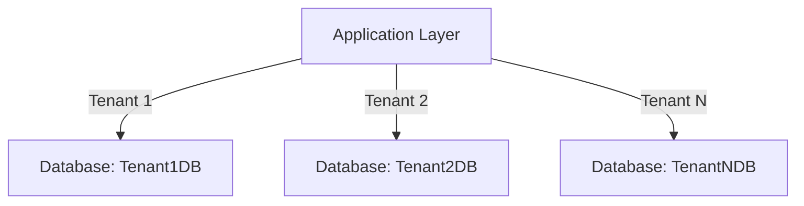

## 4.9.3 Separate Databases per Tenant

In the realm of multi-tenancy, the "Separate Databases per Tenant" pattern stands out as a robust approach to ensuring data isolation, security, and scalability. This pattern involves creating a distinct database instance for each tenant, thereby providing maximum separation and control over data. Let's delve into the intricacies of this design pattern, exploring its advantages, challenges, and practical implementation strategies.

### Design Pattern Name: Separate Databases per Tenant

**Category:** Multi-Tenancy Patterns

**Intent:** To provide each tenant with their own dedicated database instance, ensuring maximum data isolation, security, and customization capabilities.

### Key Participants

- **Tenant:** An individual or organization that uses the application and requires data isolation.
- **Database Administrator (DBA):** Responsible for managing and maintaining the separate databases.
- **Application Layer:** Interfaces with the appropriate database based on the tenant's context.

### Applicability

This pattern is particularly suitable for applications where:

- **Data Security and Isolation:** High levels of data security and isolation are required.
- **Customization:** Tenants require significant customization of the database schema or data.
- **Compliance:** Regulatory compliance necessitates strict data separation.
- **Scalability:** The application must scale to accommodate a large number of tenants without compromising performance.

### Advantages

1. **Maximum Isolation:** Each tenant's data is completely isolated, reducing the risk of data leakage or unauthorized access.
2. **Enhanced Security:** Separate databases allow for tailored security configurations per tenant.
3. **Customization Flexibility:** Tenants can have customized schemas, indexes, and configurations.
4. **Performance Optimization:** Databases can be optimized individually based on tenant-specific usage patterns.
5. **Compliance and Auditing:** Easier to comply with data protection regulations and perform audits.

### Challenges

1. **Resource Usage:** Higher resource consumption due to multiple database instances.
2. **Maintenance Overhead:** Increased complexity in managing and maintaining numerous databases.
3. **Deployment Complexity:** More complex deployment and provisioning processes.
4. **Cost:** Potentially higher costs associated with infrastructure and database licenses.

### Sample Code Snippet

Let's explore a simple example of how to implement the "Separate Databases per Tenant" pattern using SQL and a basic application layer.

```sql
-- Example: Creating a separate database for each tenant
CREATE DATABASE Tenant1DB;
CREATE DATABASE Tenant2DB;

-- Creating a table in Tenant1's database
USE Tenant1DB;
CREATE TABLE Customers (
    CustomerID INT PRIMARY KEY,
    Name VARCHAR(100),
    Email VARCHAR(100)
);

-- Creating a table in Tenant2's database
USE Tenant2DB;
CREATE TABLE Customers (
    CustomerID INT PRIMARY KEY,
    Name VARCHAR(100),
    Email VARCHAR(100)
);
```

In the application layer, you would dynamically connect to the appropriate database based on the tenant's context. Here's a simplified example in Python:

```python
import mysql.connector

def get_database_connection(tenant_id):
    # Map tenant ID to database name
    database_map = {
        'tenant1': 'Tenant1DB',
        'tenant2': 'Tenant2DB'
    }
    
    # Establish a connection to the tenant's database
    connection = mysql.connector.connect(
        host='localhost',
        user='your_username',
        password='your_password',
        database=database_map[tenant_id]
    )
    return connection

tenant_id = 'tenant1'
connection = get_database_connection(tenant_id)
cursor = connection.cursor()
cursor.execute("SELECT * FROM Customers")
for row in cursor.fetchall():
    print(row)
```

### Diagrams

To better understand the architecture of the "Separate Databases per Tenant" pattern, let's visualize it using a Mermaid.js diagram.



**Diagram Description:** This flowchart illustrates how the application layer connects to different databases based on the tenant's context, ensuring data isolation and security.

### Design Considerations

- **Database Provisioning:** Automate the process of creating and configuring databases for new tenants to streamline onboarding.
- **Monitoring and Maintenance:** Implement robust monitoring and maintenance strategies to manage the increased complexity.
- **Backup and Recovery:** Ensure each database has its own backup and recovery plan to prevent data loss.
- **Cost Management:** Evaluate the cost implications of maintaining separate databases, including infrastructure and licensing.

### Differences and Similarities

- **Similarities:** Like the "Shared Database, Separate Schema" pattern, this approach provides data isolation but at a higher level.
- **Differences:** Unlike the "Shared Database, Shared Schema" pattern, this design offers maximum isolation and customization but at the cost of increased resource usage and complexity.

### Try It Yourself

Experiment with the code examples provided by modifying the database schema or adding new tenants. Consider implementing additional features such as tenant-specific indexes or security configurations.

### Knowledge Check

- **Question:** What are the key advantages of using the "Separate Databases per Tenant" pattern?
- **Challenge:** Implement a basic application that dynamically connects to different databases based on tenant context.

### Embrace the Journey

Remember, mastering the "Separate Databases per Tenant" pattern is just one step in your journey to becoming an expert in SQL design patterns. Keep exploring, experimenting, and learning to build more secure and scalable applications.

## Quiz Time!



### What is the primary advantage of the "Separate Databases per Tenant" pattern?

- [x] Maximum data isolation
- [ ] Reduced resource usage
- [ ] Simplified maintenance
- [ ] Lower cost

> **Explanation:** The primary advantage of this pattern is maximum data isolation, as each tenant has their own database instance.

### Which of the following is a challenge associated with the "Separate Databases per Tenant" pattern?

- [ ] Enhanced security
- [x] Higher resource usage
- [ ] Easier compliance
- [ ] Simplified deployment

> **Explanation:** Higher resource usage is a challenge because each tenant requires a separate database instance.

### How does the "Separate Databases per Tenant" pattern enhance security?

- [x] By providing tailored security configurations for each tenant
- [ ] By reducing the number of databases
- [ ] By sharing schemas among tenants
- [ ] By using a single database for all tenants

> **Explanation:** This pattern enhances security by allowing tailored security configurations for each tenant's database.

### What is a potential cost implication of using the "Separate Databases per Tenant" pattern?

- [x] Higher infrastructure and licensing costs
- [ ] Lower maintenance costs
- [ ] Reduced hardware requirements
- [ ] Decreased software costs

> **Explanation:** The pattern can lead to higher infrastructure and licensing costs due to multiple database instances.

### Which SQL command is used to create a new database for a tenant?

- [x] CREATE DATABASE
- [ ] CREATE TABLE
- [ ] CREATE SCHEMA
- [ ] CREATE USER

> **Explanation:** The `CREATE DATABASE` command is used to create a new database for a tenant.

### What is a key consideration when implementing the "Separate Databases per Tenant" pattern?

- [x] Automating database provisioning
- [ ] Sharing tables among tenants
- [ ] Using a single schema for all tenants
- [ ] Reducing database instances

> **Explanation:** Automating database provisioning is crucial to streamline the onboarding of new tenants.

### How can the application layer determine which database to connect to for a tenant?

- [x] By mapping tenant IDs to database names
- [ ] By using a single connection string
- [ ] By hardcoding database names
- [ ] By sharing connections among tenants

> **Explanation:** The application layer can map tenant IDs to database names to determine the appropriate database connection.

### What is a similarity between the "Separate Databases per Tenant" and "Shared Database, Separate Schema" patterns?

- [x] Both provide data isolation
- [ ] Both use a single database instance
- [ ] Both reduce resource usage
- [ ] Both simplify maintenance

> **Explanation:** Both patterns provide data isolation, but at different levels.

### True or False: The "Separate Databases per Tenant" pattern is suitable for applications with low data security requirements.

- [ ] True
- [x] False

> **Explanation:** False. This pattern is suitable for applications with high data security requirements due to its maximum isolation.

### True or False: The "Separate Databases per Tenant" pattern allows for tenant-specific database customizations.

- [x] True
- [ ] False

> **Explanation:** True. This pattern allows for tenant-specific customizations, such as schemas and indexes.



By understanding and implementing the "Separate Databases per Tenant" pattern, you can design applications that offer unparalleled data isolation and security, meeting the needs of even the most demanding tenants. Keep exploring and refining your skills to excel in the world of SQL design patterns.
