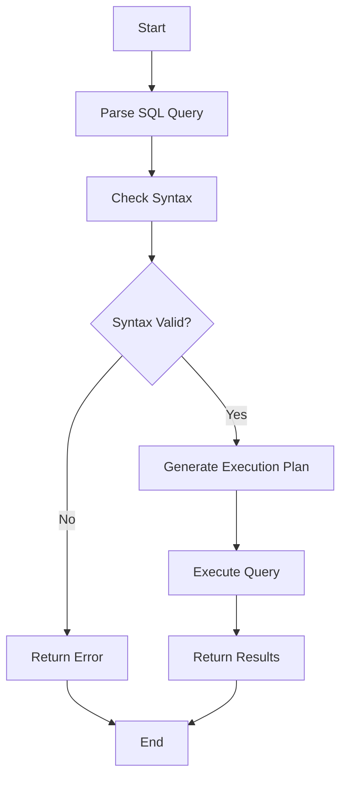

## 5.1 Designing Efficient Select Queries

Designing efficient SQL SELECT queries is a critical skill for expert software engineers and architects. In this section, we will explore techniques and best practices to optimize SELECT queries, ensuring fast and efficient data retrieval. We'll cover selective retrieval, avoiding unnecessary data transfer, leveraging indexes, and understanding query execution plans.

### Selective Retrieval: Using Specific Columns and WHERE Clauses

Efficient SELECT queries begin with the principle of selective retrieval. This involves specifying only the necessary columns and using WHERE clauses to filter data effectively.

#### Specifying Columns

When writing a SELECT query, it's crucial to specify only the columns you need. This reduces the amount of data transferred from the database to the application, improving performance.

```sql
-- Inefficient query: retrieves all columns
SELECT * FROM employees;

-- Efficient query: retrieves only necessary columns
SELECT first_name, last_name, email FROM employees;
```

**Key Point**: Avoid using `SELECT *` as it retrieves all columns, which can lead to unnecessary data transfer and increased load on the database.

#### Using WHERE Clauses

The WHERE clause is essential for filtering data. It allows you to retrieve only the rows that meet specific criteria, reducing the dataset size and improving query performance.

```sql
-- Retrieve employees from the 'Sales' department
SELECT first_name, last_name FROM employees WHERE department = 'Sales';
```

**Tip**: Use WHERE clauses to filter data as early as possible in the query process. This minimizes the amount of data processed and returned.

### Avoiding SELECT *: Reducing Unnecessary Data Transfer

Using `SELECT *` is a common anti-pattern in SQL queries. It retrieves all columns from a table, which can lead to performance issues, especially with large tables.

#### Why Avoid SELECT *?

1. **Increased Data Transfer**: Retrieving all columns increases the amount of data transferred, which can slow down query execution.
2. **Unpredictable Results**: If the table schema changes (e.g., columns are added or removed), `SELECT *` can lead to unexpected results.
3. **Index Inefficiency**: Indexes may not be fully utilized, as the query optimizer cannot predict which columns are needed.

#### Best Practices

- **Explicit Column Listing**: Always specify the columns you need. This makes your queries more readable and maintainable.
- **Schema Awareness**: Be aware of the table schema and select only the necessary columns.

### Proper Index Usage: Leveraging Indexes for Faster Access

Indexes are powerful tools for improving query performance. They allow the database to quickly locate and retrieve data without scanning the entire table.

#### Understanding Indexes

Indexes are data structures that store a subset of columns in a way that allows for fast lookups. They are particularly useful for columns frequently used in WHERE clauses, JOIN conditions, and ORDER BY clauses.

```sql
-- Create an index on the 'email' column
CREATE INDEX idx_email ON employees(email);
```

#### Types of Indexes

- **B-Tree Indexes**: Suitable for most queries, especially those involving range searches.
- **Hash Indexes**: Ideal for equality comparisons.
- **Bitmap Indexes**: Useful for columns with a limited number of distinct values.

#### Best Practices for Index Usage

- **Index Selective Columns**: Focus on columns with high selectivity (i.e., columns that significantly reduce the number of rows).
- **Avoid Over-Indexing**: Too many indexes can slow down write operations (INSERT, UPDATE, DELETE).
- **Monitor Index Usage**: Use database tools to analyze index usage and identify unused or redundant indexes.

### Query Planning: Understanding and Utilizing Query Execution Plans

Query execution plans provide insights into how the database executes a query. Understanding these plans can help you optimize queries for better performance.

#### Analyzing Execution Plans

Execution plans show the steps the database takes to execute a query, including table scans, index usage, and join operations. Most databases provide tools to visualize execution plans.

```sql
-- Example of viewing an execution plan in PostgreSQL
EXPLAIN ANALYZE SELECT first_name, last_name FROM employees WHERE department = 'Sales';
```

#### Key Components of Execution Plans

- **Seq Scan**: A sequential scan of the entire table. Indicates a lack of suitable indexes.
- **Index Scan**: Uses an index to retrieve data. Generally faster than a sequential scan.
- **Nested Loop Join**: Iterates over one table for each row in another. Efficient for small datasets.
- **Hash Join**: Builds a hash table for one dataset and probes it with another. Suitable for larger datasets.

#### Best Practices for Query Planning

- **Use EXPLAIN**: Regularly analyze execution plans to identify performance bottlenecks.
- **Optimize Joins**: Ensure that joins are performed on indexed columns.
- **Refactor Queries**: Simplify complex queries to improve execution efficiency.

### Visualizing Query Execution

To better understand query execution, let's visualize a simple SELECT query using a flowchart.



**Diagram Explanation**: This flowchart illustrates the process of executing a SELECT query. The database parses the query, checks syntax, generates an execution plan, and executes the query to return results.

### Try It Yourself

Experiment with the following query by modifying the WHERE clause and observing the impact on performance.

```sql
-- Original query
SELECT first_name, last_name FROM employees WHERE department = 'Sales';

-- Try changing the department
SELECT first_name, last_name FROM employees WHERE department = 'Engineering';
```

**Challenge**: Create an index on the `department` column and compare the execution time with and without the index.

### References and Links

- [SQL SELECT Statement - W3Schools](https://www.w3schools.com/sql/sql_select.asp)
- [Understanding SQL Indexes - MDN Web Docs](https://developer.mozilla.org/en-US/docs/Web/SQL/Indexes)
- [PostgreSQL EXPLAIN Documentation](https://www.postgresql.org/docs/current/sql-explain.html)

### Knowledge Check

- What is the impact of using `SELECT *` in a query?
- How can indexes improve query performance?
- What are the key components of a query execution plan?

### Embrace the Journey

Remember, designing efficient SELECT queries is an ongoing process. As you gain experience, you'll develop an intuition for optimizing queries and leveraging database features. Keep experimenting, stay curious, and enjoy the journey!

## Quiz Time!



### What is the primary benefit of specifying columns in a SELECT query instead of using SELECT *?

- [x] Reduces unnecessary data transfer
- [ ] Increases query complexity
- [ ] Decreases query readability
- [ ] Increases data retrieval time

> **Explanation:** Specifying columns reduces the amount of data transferred from the database, improving performance.

### Which type of index is most suitable for range searches?

- [x] B-Tree Index
- [ ] Hash Index
- [ ] Bitmap Index
- [ ] Full-Text Index

> **Explanation:** B-Tree indexes are ideal for range searches due to their ordered structure.

### What does a Seq Scan in an execution plan indicate?

- [x] A sequential scan of the entire table
- [ ] An index scan
- [ ] A hash join
- [ ] A nested loop join

> **Explanation:** A Seq Scan indicates that the database is scanning the entire table, often due to a lack of suitable indexes.

### What is the purpose of the WHERE clause in a SELECT query?

- [x] To filter data based on specific criteria
- [ ] To specify the columns to retrieve
- [ ] To join tables
- [ ] To sort the results

> **Explanation:** The WHERE clause filters data, allowing you to retrieve only the rows that meet specific criteria.

### Which of the following is a disadvantage of using too many indexes?

- [x] Slows down write operations
- [ ] Increases query execution time
- [ ] Decreases data retrieval accuracy
- [ ] Reduces data integrity

> **Explanation:** Too many indexes can slow down write operations like INSERT, UPDATE, and DELETE.

### What tool can be used to analyze query execution plans in PostgreSQL?

- [x] EXPLAIN
- [ ] ANALYZE
- [ ] DESCRIBE
- [ ] SHOW

> **Explanation:** The EXPLAIN command in PostgreSQL is used to analyze query execution plans.

### What is a key benefit of using the EXPLAIN command?

- [x] Identifies performance bottlenecks
- [ ] Increases query complexity
- [ ] Decreases query readability
- [ ] Increases data retrieval time

> **Explanation:** EXPLAIN helps identify performance bottlenecks by showing how the database executes a query.

### Which join type is efficient for small datasets?

- [x] Nested Loop Join
- [ ] Hash Join
- [ ] Merge Join
- [ ] Cartesian Join

> **Explanation:** Nested Loop Joins are efficient for small datasets due to their iterative nature.

### What is the role of an index in a database?

- [x] To speed up data retrieval
- [ ] To increase data storage
- [ ] To decrease query complexity
- [ ] To reduce data redundancy

> **Explanation:** Indexes speed up data retrieval by allowing the database to quickly locate and access data.

### True or False: Using SELECT * can lead to unpredictable results if the table schema changes.

- [x] True
- [ ] False

> **Explanation:** Using SELECT * can lead to unpredictable results if columns are added or removed from the table schema.




