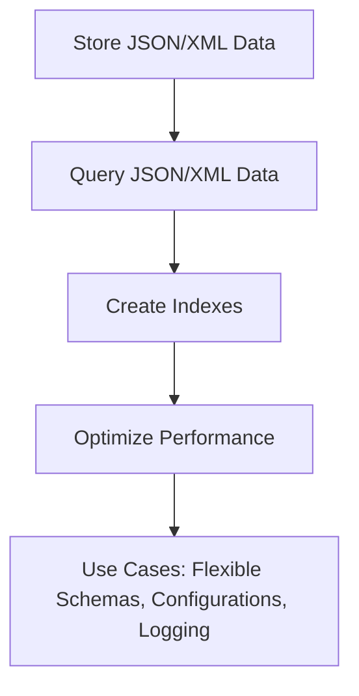

## 5.10 JSON and XML Data Handling

In the modern data landscape, handling semi-structured data efficiently is crucial for building robust and flexible database solutions. JSON (JavaScript Object Notation) and XML (eXtensible Markup Language) are two widely used formats for representing semi-structured data. This section delves into the intricacies of storing, querying, and optimizing JSON and XML data in SQL databases, providing expert insights and practical examples for software engineers and architects.

### Storing Semi-Structured Data

#### JSON Data Type

JSON is a lightweight data interchange format that is easy for humans to read and write, and easy for machines to parse and generate. Many modern SQL databases, such as PostgreSQL, MySQL, and SQL Server, offer native support for JSON data types, allowing you to store JSON documents directly in your tables.

**Example: Storing JSON Data in PostgreSQL**

```sql
CREATE TABLE products (
    id SERIAL PRIMARY KEY,
    name VARCHAR(100),
    specifications JSONB
);

INSERT INTO products (name, specifications) VALUES
('Smartphone', '{"brand": "TechCorp", "model": "X100", "features": {"camera": "12MP", "battery": "3000mAh"}}'),
('Laptop', '{"brand": "CompTech", "model": "ProBook", "features": {"processor": "i7", "ram": "16GB"}}');
```

In this example, the `specifications` column is of type `JSONB`, which is a binary format optimized for JSON storage and querying in PostgreSQL.

#### XML Data Type

XML is a markup language that defines a set of rules for encoding documents in a format that is both human-readable and machine-readable. SQL databases like Oracle and SQL Server provide native support for XML data types, enabling you to store and manipulate XML documents.

**Example: Storing XML Data in SQL Server**

```sql
CREATE TABLE orders (
    order_id INT PRIMARY KEY,
    customer_name VARCHAR(100),
    order_details XML
);

INSERT INTO orders (order_id, customer_name, order_details) VALUES
(1, 'Alice', '<order><item>Book</item><quantity>2</quantity></order>'),
(2, 'Bob', '<order><item>Laptop</item><quantity>1</quantity></order>');
```

Here, the `order_details` column is of type `XML`, allowing you to store structured order information in an XML format.

### Querying JSON and XML Data

#### JSON Querying

SQL databases provide various functions to extract and manipulate JSON data. Let's explore some of these functions.

**JSON_VALUE() and JSON_QUERY() in SQL Server**

- `JSON_VALUE()`: Extracts a scalar value from a JSON string.
- `JSON_QUERY()`: Extracts an object or array from a JSON string.

**Example: Extracting JSON Data**

```sql
SELECT 
    name,
    JSON_VALUE(specifications, '$.brand') AS brand,
    JSON_VALUE(specifications, '$.features.camera') AS camera
FROM products;
```

This query extracts the brand and camera features from the JSON data stored in the `specifications` column.

#### XML Querying

XML data can be queried using XQuery and XPath expressions. SQL databases offer functions to work with XML data, such as `XMLNODES()`, `XMLVALUE()`, and `XMLQUERY()`.

**Example: Extracting XML Data in SQL Server**

```sql
SELECT 
    order_id,
    customer_name,
    order_details.value('(/order/item)[1]', 'VARCHAR(50)') AS item,
    order_details.value('(/order/quantity)[1]', 'INT') AS quantity
FROM orders;
```

This query extracts the item and quantity from the XML data stored in the `order_details` column.

### Indexing JSON and XML Fields

Indexing is crucial for optimizing the performance of queries on JSON and XML data. Let's explore how to create indexes on these fields.

#### JSON Indexing

In PostgreSQL, you can create a GIN (Generalized Inverted Index) on JSONB columns to speed up queries.

**Example: Creating a JSONB Index**

```sql
CREATE INDEX idx_specifications ON products USING GIN (specifications);
```

This index improves the performance of queries that filter or search within the `specifications` JSONB column.

#### XML Indexing

In SQL Server, you can create XML indexes to optimize queries on XML data.

**Example: Creating an XML Index**

```sql
CREATE PRIMARY XML INDEX idx_order_details ON orders (order_details);
```

This index enhances the performance of queries that involve the `order_details` XML column.

### Use Cases for JSON and XML Data

#### Flexible Schemas

JSON and XML are ideal for scenarios where the schema may evolve over time or where different records may have varying structures. This flexibility is particularly useful in applications like content management systems and IoT data storage.

#### Configurations

Storing configuration data in JSON or XML format allows for easy updates and retrieval. This is common in applications that require dynamic configuration settings.

#### Logging Data

JSON and XML are often used to store log data due to their ability to represent complex nested structures. This is beneficial for applications that require detailed logging for auditing or debugging purposes.

### Visualizing JSON and XML Data Handling

To better understand the flow of JSON and XML data handling in SQL, let's visualize the process using a Mermaid.js diagram.



This diagram illustrates the key steps involved in handling JSON and XML data in SQL databases, from storage to optimization and practical use cases.

### Try It Yourself

Experiment with the provided code examples by modifying the JSON and XML structures or adding new fields. Try creating additional indexes and observe the impact on query performance. This hands-on approach will deepen your understanding of JSON and XML data handling in SQL.

### References and Links

- [PostgreSQL JSON Functions and Operators](https://www.postgresql.org/docs/current/functions-json.html)
- [SQL Server JSON Functions](https://docs.microsoft.com/en-us/sql/relational-databases/json/json-data-sql-server)
- [SQL Server XML Data Type and Columns](https://docs.microsoft.com/en-us/sql/relational-databases/xml/xml-data-sql-server)

### Knowledge Check

- What are the advantages of using JSON and XML for semi-structured data?
- How do JSON_VALUE() and JSON_QUERY() differ in SQL Server?
- What is the purpose of creating indexes on JSON and XML fields?

### Embrace the Journey

Remember, mastering JSON and XML data handling in SQL is a journey. As you continue to explore and experiment, you'll gain deeper insights and develop more efficient database solutions. Stay curious and enjoy the process!

## Quiz Time!



### What is the primary advantage of using JSON and XML for data storage?

- [x] Flexibility in schema design
- [ ] Faster data retrieval
- [ ] Reduced storage space
- [ ] Improved data security

> **Explanation:** JSON and XML offer flexibility in schema design, allowing for varying structures and easy evolution over time.

### Which SQL function is used to extract a scalar value from JSON data in SQL Server?

- [x] JSON_VALUE()
- [ ] JSON_QUERY()
- [ ] JSON_EXTRACT()
- [ ] JSON_PATH()

> **Explanation:** JSON_VALUE() is used to extract scalar values from JSON data in SQL Server.

### How can you optimize queries on JSONB columns in PostgreSQL?

- [x] By creating a GIN index
- [ ] By using a B-Tree index
- [ ] By normalizing the data
- [ ] By using JSON_PATH()

> **Explanation:** A GIN index is used to optimize queries on JSONB columns in PostgreSQL.

### What is the purpose of the XMLNODES() function in SQL?

- [x] To extract nodes from an XML document
- [ ] To create an XML document
- [ ] To validate XML syntax
- [ ] To convert XML to JSON

> **Explanation:** XMLNODES() is used to extract nodes from an XML document in SQL.

### Which of the following is a common use case for JSON and XML data?

- [x] Logging data
- [ ] Storing binary files
- [ ] Real-time analytics
- [ ] Image processing

> **Explanation:** JSON and XML are commonly used for logging data due to their ability to represent complex nested structures.

### What type of index is typically used for XML data in SQL Server?

- [x] XML Index
- [ ] B-Tree Index
- [ ] Hash Index
- [ ] Bitmap Index

> **Explanation:** An XML Index is used to optimize queries on XML data in SQL Server.

### Which function is used to extract an object or array from JSON data in SQL Server?

- [x] JSON_QUERY()
- [ ] JSON_VALUE()
- [ ] JSON_EXTRACT()
- [ ] JSON_PATH()

> **Explanation:** JSON_QUERY() is used to extract objects or arrays from JSON data in SQL Server.

### What is a key benefit of using JSON for configuration data?

- [x] Easy updates and retrieval
- [ ] Faster processing speed
- [ ] Reduced data redundancy
- [ ] Enhanced security

> **Explanation:** JSON allows for easy updates and retrieval of configuration data due to its flexible structure.

### True or False: XML data can be queried using XQuery and XPath expressions.

- [x] True
- [ ] False

> **Explanation:** XML data can indeed be queried using XQuery and XPath expressions.

### What is the role of JSONB in PostgreSQL?

- [x] To store JSON data in a binary format for optimized querying
- [ ] To convert JSON to XML
- [ ] To validate JSON syntax
- [ ] To compress JSON data

> **Explanation:** JSONB stores JSON data in a binary format, optimizing it for querying in PostgreSQL.


