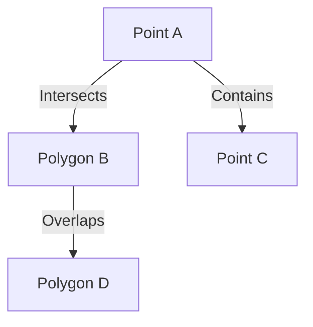

## 5.11 Geospatial Queries

In the realm of SQL, geospatial queries represent a powerful toolset for managing and analyzing spatial data. As the demand for location-based services and spatial analytics grows, understanding how to effectively utilize geospatial queries is essential for expert software engineers and architects. This section delves into the core concepts of geospatial queries, including data types, spatial functions, indexing strategies, and practical applications.

### Understanding Geospatial Data Types

Geospatial data types are specialized data types used to store spatial data, such as points, lines, and polygons. In SQL, the two primary geospatial data types are `GEOMETRY` and `GEOGRAPHY`.

- **GEOMETRY**: This data type is used for planar spatial data, which assumes a flat, two-dimensional plane. It is suitable for applications where the Earth's curvature can be ignored, such as small-scale mapping projects.

- **GEOGRAPHY**: This data type is used for geodetic spatial data, which accounts for the Earth's curvature. It is ideal for applications that require accurate distance and area calculations over large geographic areas.

#### Example: Creating a Table with Geospatial Data Types

```sql
CREATE TABLE Locations (
    ID INT PRIMARY KEY,
    Name VARCHAR(100),
    Location GEOGRAPHY
);
```

In this example, the `Locations` table includes a `GEOGRAPHY` column to store spatial data, allowing for precise geospatial queries.

### Spatial Functions in SQL

Spatial functions are essential for performing operations on geospatial data. They enable calculations such as distances, intersections, and spatial relationships.

#### Distance Calculations

Distance calculations are fundamental in geospatial queries. They allow you to measure the distance between two spatial points.

```sql
SELECT 
    Name,
    Location.STDistance(geography::Point(47.6062, -122.3321, 4326)) AS DistanceFromSeattle
FROM 
    Locations
ORDER BY 
    DistanceFromSeattle;
```

In this query, we calculate the distance from a fixed point (Seattle) to each location in the `Locations` table.

#### Spatial Relationships

Spatial relationships determine how spatial objects relate to one another. Common spatial relationships include `STIntersects`, `STContains`, and `STOverlaps`.

```sql
SELECT 
    Name
FROM 
    Locations
WHERE 
    Location.STIntersects(geography::STGeomFromText('POLYGON((...))', 4326)) = 1;
```

This query checks which locations intersect with a specified polygon, useful for identifying points within a geographic boundary.

### Spatial Indexing for Efficient Querying

Spatial indexing is crucial for optimizing geospatial queries. It allows for rapid retrieval of spatial data by indexing spatial columns.

#### Creating a Spatial Index

```sql
CREATE SPATIAL INDEX idx_Location ON Locations(Location);
```

By creating a spatial index on the `Location` column, queries involving spatial operations become significantly faster, especially for large datasets.

### Applications of Geospatial Queries

Geospatial queries have a wide range of applications, from mapping services to location-based analytics.

- **Mapping Services**: Geospatial queries are the backbone of mapping services, enabling features like route planning, geofencing, and proximity searches.

- **Location-Based Analytics**: Businesses use geospatial queries to analyze customer locations, optimize delivery routes, and perform market analysis.

### Visualizing Geospatial Data

To better understand geospatial data, visualizations such as maps and diagrams are invaluable. Below is a simple representation of spatial relationships using Mermaid.js.



This diagram illustrates how different spatial objects relate to each other, providing a visual aid for understanding spatial relationships.

### Try It Yourself

Experiment with the provided SQL code examples by modifying the coordinates or spatial objects. Try creating your own spatial queries to explore different geospatial scenarios.

### Further Reading

For more information on geospatial queries and spatial data management, consider exploring the following resources:

- [PostGIS Documentation](https://postgis.net/documentation/)
- [Microsoft SQL Server Spatial Data](https://docs.microsoft.com/en-us/sql/relational-databases/spatial/spatial-data-sql-server)

### Key Takeaways

- Geospatial queries leverage specialized data types (`GEOMETRY`, `GEOGRAPHY`) to manage spatial data.
- Spatial functions enable operations like distance calculations and spatial relationship checks.
- Spatial indexing is essential for optimizing geospatial queries, especially in large datasets.
- Geospatial queries have diverse applications, including mapping services and location-based analytics.

Remember, mastering geospatial queries opens up a world of possibilities in spatial data analysis and application development. Keep experimenting, stay curious, and enjoy the journey!

## Quiz Time!



### What is the primary difference between the GEOMETRY and GEOGRAPHY data types in SQL?

- [x] GEOMETRY is for planar data, while GEOGRAPHY accounts for the Earth's curvature.
- [ ] GEOMETRY is for 3D data, while GEOGRAPHY is for 2D data.
- [ ] GEOMETRY is used for small datasets, while GEOGRAPHY is for large datasets.
- [ ] GEOMETRY is faster, while GEOGRAPHY is more accurate.

> **Explanation:** GEOMETRY is used for planar spatial data, assuming a flat surface, whereas GEOGRAPHY accounts for the Earth's curvature, making it suitable for global applications.

### Which SQL function is used to calculate the distance between two spatial points?

- [x] STDistance
- [ ] STIntersects
- [ ] STContains
- [ ] STOverlaps

> **Explanation:** The STDistance function calculates the distance between two spatial points.

### What is the purpose of creating a spatial index in SQL?

- [x] To optimize the performance of geospatial queries.
- [ ] To store spatial data in a separate table.
- [ ] To convert spatial data into text format.
- [ ] To visualize spatial data on a map.

> **Explanation:** A spatial index improves the performance of geospatial queries by allowing rapid retrieval of spatial data.

### Which spatial relationship function checks if one spatial object contains another?

- [ ] STDistance
- [ ] STIntersects
- [x] STContains
- [ ] STOverlaps

> **Explanation:** The STContains function checks if one spatial object contains another.

### What are common applications of geospatial queries?

- [x] Mapping services and location-based analytics.
- [ ] Data encryption and security.
- [ ] Text processing and analysis.
- [ ] Image rendering and manipulation.

> **Explanation:** Geospatial queries are commonly used in mapping services and location-based analytics.

### How can you visualize geospatial data relationships?

- [x] Using diagrams and maps.
- [ ] Using text descriptions.
- [ ] Using numerical tables.
- [ ] Using audio recordings.

> **Explanation:** Diagrams and maps are effective tools for visualizing geospatial data relationships.

### What is the benefit of using the GEOGRAPHY data type for global applications?

- [x] It accounts for the Earth's curvature, providing accurate distance calculations.
- [ ] It simplifies data storage by using a flat plane.
- [ ] It reduces the size of spatial data.
- [ ] It increases the speed of data retrieval.

> **Explanation:** The GEOGRAPHY data type accounts for the Earth's curvature, making it ideal for accurate distance calculations in global applications.

### Which SQL function would you use to determine if two spatial objects overlap?

- [ ] STDistance
- [ ] STContains
- [ ] STIntersects
- [x] STOverlaps

> **Explanation:** The STOverlaps function checks if two spatial objects overlap.

### What is a key advantage of using spatial functions in SQL?

- [x] They enable complex spatial operations like distance calculations and spatial relationships.
- [ ] They convert spatial data into text format.
- [ ] They simplify the storage of spatial data.
- [ ] They enhance the security of spatial data.

> **Explanation:** Spatial functions enable complex operations on spatial data, such as distance calculations and spatial relationships.

### True or False: Spatial indexing is only necessary for small datasets.

- [ ] True
- [x] False

> **Explanation:** Spatial indexing is especially important for large datasets to optimize the performance of geospatial queries.


