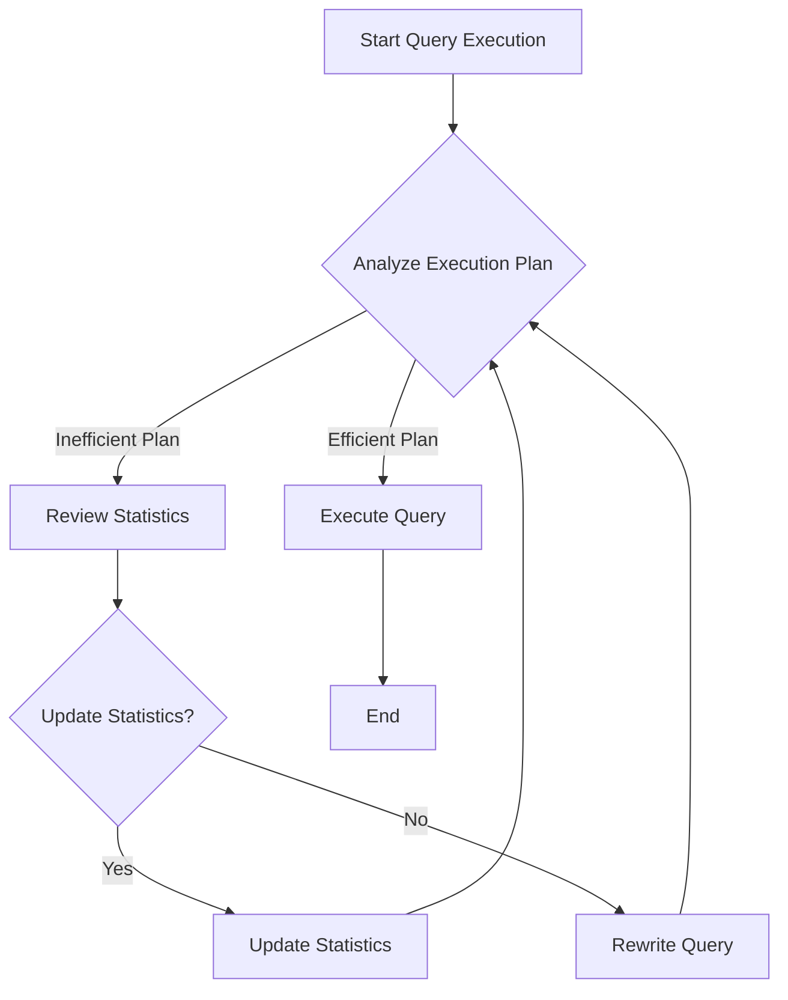

## 5.12 Query Optimization Techniques

In the realm of SQL database management, query optimization is a critical skill for ensuring efficient and performant data retrieval. As databases grow in size and complexity, the need for optimized queries becomes paramount to maintain system responsiveness and resource efficiency. In this section, we will delve into the intricacies of query optimization, exploring execution plans, statistics, query rewriting, and the use of hints and directives to guide the optimizer.

### Understanding Execution Plans

Execution plans are the blueprints that SQL database engines use to execute queries. They provide a detailed roadmap of how a query will be processed, including the order of operations, the methods used to access data, and the estimated cost of each operation. Understanding execution plans is crucial for identifying bottlenecks and inefficiencies in query execution.

#### Reading and Interpreting Execution Plans

Execution plans can be visualized in different formats depending on the database system, such as graphical plans, text-based plans, or XML plans. Let's explore how to read and interpret these plans:

- **Graphical Execution Plans**: These are often the most intuitive, providing a visual representation of the query execution process. Each node represents an operation, such as a table scan or an index seek, and arrows indicate the flow of data between operations.

- **Text-Based Execution Plans**: These provide a detailed textual description of the execution process. They are useful for understanding the sequence of operations and the estimated cost associated with each step.

- **XML Execution Plans**: These offer a structured, machine-readable format that can be parsed and analyzed programmatically.

#### Key Components of Execution Plans

- **Operators**: These are the building blocks of execution plans, representing actions such as scans, seeks, joins, and sorts.

- **Cost Estimates**: Each operator has an associated cost, which is an estimate of the resources required to perform the operation. The optimizer uses these estimates to choose the most efficient execution path.

- **Data Flow**: Execution plans show the flow of data between operators, helping to identify potential bottlenecks or inefficient data paths.

#### Example: Analyzing an Execution Plan

Consider the following SQL query:

```sql
SELECT e.name, d.department_name
FROM employees e
JOIN departments d ON e.department_id = d.department_id
WHERE e.salary > 50000;
```

To view the execution plan, you can use the `EXPLAIN` statement (or its equivalent in your database system):

```sql
EXPLAIN SELECT e.name, d.department_name
FROM employees e
JOIN departments d ON e.department_id = d.department_id
WHERE e.salary > 50000;
```

This will generate an execution plan that might include operations like an index seek on the `employees` table and a hash join with the `departments` table. By analyzing the plan, you can identify if the query is using indexes effectively and if there are any costly operations that could be optimized.

### Statistics and Histograms

The SQL optimizer relies heavily on statistics and histograms to estimate the number of rows that will be processed by each operation in a query. Accurate statistics are essential for the optimizer to make informed decisions about the most efficient execution plan.

#### How the Optimizer Uses Statistics

- **Row Count Estimates**: Statistics provide the optimizer with estimates of the number of rows that will be returned by each operation. These estimates are crucial for determining the cost of different execution paths.

- **Distribution of Values**: Histograms offer insights into the distribution of values within a column, allowing the optimizer to make more accurate estimates for range queries and joins.

#### Maintaining Accurate Statistics

To ensure the optimizer has the most accurate information, it's important to regularly update statistics, especially after significant data changes. Most modern database systems offer automatic statistics maintenance, but manual updates may be necessary in some cases.

```sql
-- Update statistics for a specific table
UPDATE STATISTICS employees;
```

### Rewriting Queries

Sometimes, the way a query is written can significantly impact its performance. Rewriting queries to take advantage of indexes, reduce the number of operations, or simplify complex logic can lead to substantial performance improvements.

#### Techniques for Query Rewriting

- **Use of Indexes**: Ensure that queries are written to leverage existing indexes. This might involve restructuring joins or using indexed columns in WHERE clauses.

- **Simplifying Logic**: Break down complex queries into simpler components or use common table expressions (CTEs) to improve readability and performance.

- **Avoiding Subqueries**: In some cases, replacing subqueries with joins or CTEs can lead to more efficient execution plans.

#### Example: Query Rewriting

Consider the following query:

```sql
SELECT * FROM orders
WHERE order_id IN (SELECT order_id FROM order_items WHERE quantity > 10);
```

This query can be rewritten using a join to improve performance:

```sql
SELECT o.*
FROM orders o
JOIN order_items oi ON o.order_id = oi.order_id
WHERE oi.quantity > 10;
```

### Hints and Directives

While the SQL optimizer is generally effective at choosing the best execution plan, there are situations where providing hints or directives can improve performance. Hints allow developers to influence the optimizer's decisions, guiding it towards more efficient execution paths.

#### Common SQL Hints

- **Index Hints**: Direct the optimizer to use a specific index for a query.

- **Join Hints**: Specify the join algorithm to be used, such as a hash join or a nested loop join.

- **Query Hints**: Influence the overall execution strategy, such as forcing a parallel execution plan.

#### Example: Using Hints

```sql
SELECT /*+ INDEX(employees emp_idx) */ name, department_id
FROM employees
WHERE salary > 50000;
```

In this example, the `INDEX` hint directs the optimizer to use the `emp_idx` index for the query, potentially improving performance.

### Visualizing Query Optimization

To better understand the flow of query optimization, let's visualize the process using a flowchart:



**Caption**: This flowchart illustrates the iterative process of query optimization, from analyzing execution plans to updating statistics and rewriting queries.

### Try It Yourself

To solidify your understanding of query optimization techniques, try experimenting with the following exercises:

1. **Analyze Execution Plans**: Use the `EXPLAIN` statement to analyze execution plans for different queries. Identify costly operations and consider how they might be optimized.

2. **Rewrite Queries**: Take a complex query from your database and attempt to rewrite it for better performance. Consider using joins, CTEs, or index hints.

3. **Update Statistics**: If you have access to a database, update statistics for a table and observe any changes in query performance.

### References and Further Reading

- [SQL Server Query Performance Tuning](https://docs.microsoft.com/en-us/sql/relational-databases/performance/query-performance-tuning?view=sql-server-ver15)
- [MySQL Query Optimization](https://dev.mysql.com/doc/refman/8.0/en/optimization.html)
- [PostgreSQL Performance Optimization](https://www.postgresql.org/docs/current/performance-tips.html)

### Knowledge Check

- **What are execution plans and why are they important?**
- **How do statistics and histograms influence query optimization?**
- **What are some common techniques for rewriting queries?**
- **When might you use hints to guide the optimizer?**

### Embrace the Journey

Remember, mastering query optimization is an ongoing journey. As you continue to explore and experiment with different techniques, you'll gain a deeper understanding of how to craft efficient and performant SQL queries. Keep experimenting, stay curious, and enjoy the journey!

## Quiz Time!



### What is the primary purpose of an execution plan?

- [x] To provide a roadmap for how a query will be executed
- [ ] To store the results of a query
- [ ] To define the schema of a database
- [ ] To manage user permissions

> **Explanation:** Execution plans outline the steps and operations the database engine will take to execute a query.

### How do statistics help the SQL optimizer?

- [x] By providing estimates of row counts and data distribution
- [ ] By storing query results
- [ ] By defining user roles
- [ ] By managing database connections

> **Explanation:** Statistics give the optimizer information about data distribution and row counts, which helps in choosing efficient execution plans.

### Which of the following is a technique for query rewriting?

- [x] Using joins instead of subqueries
- [ ] Increasing the number of columns in SELECT
- [ ] Removing indexes
- [ ] Adding more tables to the query

> **Explanation:** Rewriting queries to use joins instead of subqueries can often lead to more efficient execution plans.

### What is a common use of SQL hints?

- [x] To guide the optimizer in choosing execution strategies
- [ ] To define new tables
- [ ] To update database schemas
- [ ] To manage user sessions

> **Explanation:** SQL hints provide guidance to the optimizer on how to execute a query, such as which index to use.

### What should you do if a query execution plan is inefficient?

- [x] Review statistics and consider rewriting the query
- [ ] Increase the database size
- [ ] Remove all indexes
- [ ] Add more columns to the query

> **Explanation:** Reviewing statistics and rewriting the query can help improve an inefficient execution plan.

### What is the role of histograms in query optimization?

- [x] To provide insights into the distribution of values within a column
- [ ] To store query execution results
- [ ] To define database schemas
- [ ] To manage user permissions

> **Explanation:** Histograms help the optimizer understand the distribution of values, which is crucial for estimating row counts.

### Which SQL statement is used to view execution plans?

- [x] EXPLAIN
- [ ] SELECT
- [ ] INSERT
- [ ] DELETE

> **Explanation:** The `EXPLAIN` statement is used to view execution plans and understand how a query will be executed.

### What is a benefit of using index hints?

- [x] They can improve query performance by directing the optimizer to use specific indexes
- [ ] They increase the number of rows returned by a query
- [ ] They decrease the size of the database
- [ ] They manage user permissions

> **Explanation:** Index hints can improve performance by guiding the optimizer to use the most efficient indexes.

### What is a common indicator of an inefficient query execution plan?

- [x] High estimated cost and long execution time
- [ ] Low number of columns in SELECT
- [ ] Small database size
- [ ] Few tables in the query

> **Explanation:** High estimated costs and long execution times are indicators of inefficiencies in query execution plans.

### True or False: Updating statistics can improve query performance.

- [x] True
- [ ] False

> **Explanation:** Updating statistics ensures the optimizer has accurate information, which can lead to better execution plans and improved performance.




