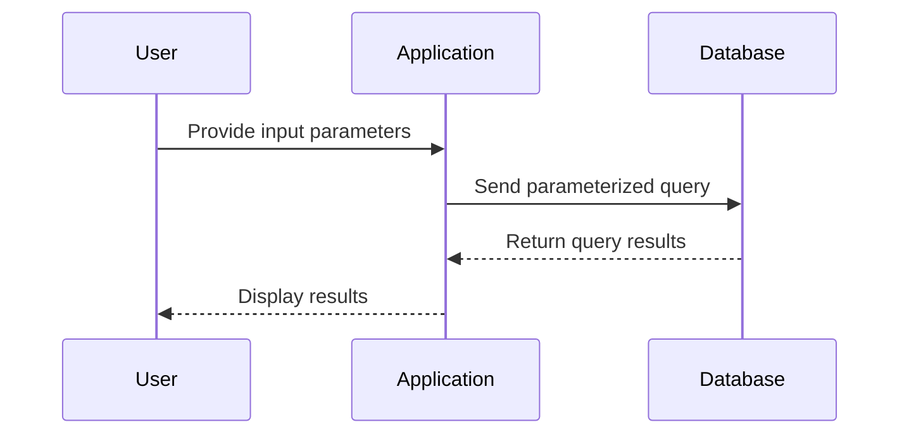

## 5.13 Dynamic Query Building

Dynamic query building is a powerful technique in SQL that allows developers to construct queries based on user inputs or other runtime conditions. This flexibility is essential for creating adaptable and responsive applications. However, it also introduces challenges, particularly around security and performance. In this section, we will explore the techniques and best practices for dynamic query building, focusing on parameterized queries, stored procedures, and security measures to prevent SQL injection.

### Introduction to Dynamic Query Building

Dynamic query building involves creating SQL queries that can change based on input parameters or conditions. This is particularly useful in scenarios where the exact query structure cannot be determined until runtime. For example, a search feature in an application might allow users to filter results based on various criteria, requiring the query to adapt to different combinations of filters.

#### Scenarios for Dynamic Query Building

Dynamic query building is commonly used in the following scenarios:

- **User-Driven Searches**: Constructing queries based on user-selected filters or search criteria.
- **Reporting and Analytics**: Generating queries for reports that require different data views or aggregations.
- **Conditional Logic**: Executing different queries based on application logic or user roles.

### Techniques for Dynamic Query Building

There are several techniques for building dynamic queries in SQL, each with its own advantages and considerations. The most common techniques include parameterized queries and stored procedures.

#### Parameterized Queries

Parameterized queries are a method of dynamically constructing SQL queries by injecting variables into predefined query templates. This approach not only simplifies query construction but also enhances security by preventing SQL injection attacks.

**Example of a Parameterized Query:**

```sql
-- Define a parameterized query to fetch user details based on user ID
SELECT * FROM Users WHERE UserID = @UserID;
```

In this example, `@UserID` is a parameter that will be replaced with an actual value at runtime. This prevents malicious input from altering the query structure.

**Benefits of Parameterized Queries:**

- **Security**: By separating SQL code from data, parameterized queries prevent SQL injection attacks.
- **Performance**: Parameterized queries can be precompiled, improving execution speed.
- **Maintainability**: Queries are easier to read and maintain, as the logic is separated from the data.

#### Stored Procedures

Stored procedures are precompiled SQL code stored in the database that can accept parameters and execute complex logic. They are an excellent choice for dynamic query building when the logic is too complex for simple parameterized queries.

**Example of a Stored Procedure:**

```sql
-- Create a stored procedure to fetch orders based on customer ID and order date
CREATE PROCEDURE GetCustomerOrders
    @CustomerID INT,
    @OrderDate DATE
AS
BEGIN
    SELECT * FROM Orders
    WHERE CustomerID = @CustomerID AND OrderDate = @OrderDate;
END;
```

In this example, the stored procedure `GetCustomerOrders` takes two parameters, `@CustomerID` and `@OrderDate`, and returns orders matching these criteria.

**Benefits of Stored Procedures:**

- **Encapsulation**: Complex logic can be encapsulated within the database, reducing application complexity.
- **Reusability**: Stored procedures can be reused across different applications or modules.
- **Security**: Permissions can be managed at the procedure level, controlling access to underlying data.

### Security Considerations

Dynamic query building, if not handled properly, can expose applications to SQL injection attacks. SQL injection is a technique where an attacker can execute arbitrary SQL code by manipulating input data. To prevent this, it is crucial to follow best practices for query construction and input validation.

#### Preventing SQL Injection

- **Use Parameterized Queries**: Always use parameterized queries or prepared statements to separate SQL code from data.
- **Validate Input**: Ensure that all user inputs are validated and sanitized before being used in queries.
- **Limit Permissions**: Restrict database permissions to only what is necessary for the application to function.
- **Use Stored Procedures**: Where possible, use stored procedures to encapsulate query logic and control access.

**Example of SQL Injection Prevention:**

```sql
-- Incorrect: Vulnerable to SQL injection
string query = "SELECT * FROM Users WHERE Username = '" + userInput + "'";

-- Correct: Using parameterized query
string query = "SELECT * FROM Users WHERE Username = @Username";
```

In the correct example, the parameter `@Username` is used to safely inject user input into the query.

### Best Practices for Dynamic Query Building

To effectively use dynamic query building, consider the following best practices:

- **Design for Flexibility**: Anticipate changes in requirements and design queries that can adapt to new conditions.
- **Optimize for Performance**: Use indexing and query optimization techniques to ensure dynamic queries perform well.
- **Test Thoroughly**: Test dynamic queries with a variety of inputs to ensure they handle all scenarios correctly.
- **Monitor and Log**: Implement logging to track query execution and identify potential issues.

### Visualizing Dynamic Query Building

To better understand the flow of dynamic query building, let's visualize the process using a sequence diagram.



**Diagram Description**: This sequence diagram illustrates the interaction between a user, an application, and a database during dynamic query building. The user provides input parameters, which the application uses to construct a parameterized query. The query is sent to the database, which returns the results to the application for display.

### Try It Yourself

Experiment with dynamic query building by modifying the following code example to add additional filters or conditions.

```sql
-- Original query to fetch products based on category
SELECT * FROM Products WHERE CategoryID = @CategoryID;

-- Try adding a price filter
SELECT * FROM Products WHERE CategoryID = @CategoryID AND Price < @MaxPrice;
```

### References and Further Reading

- [SQL Injection Prevention Cheat Sheet](https://cheatsheetseries.owasp.org/cheatsheets/SQL_Injection_Prevention_Cheat_Sheet.html) - OWASP
- [Parameterized Queries in SQL](https://www.w3schools.com/sql/sql_injection.asp) - W3Schools
- [Stored Procedures in SQL](https://docs.microsoft.com/en-us/sql/relational-databases/stored-procedures/stored-procedures-database-engine) - Microsoft Docs

### Knowledge Check

- **What are the benefits of using parameterized queries?**
- **How can stored procedures enhance security in dynamic query building?**
- **What are some common scenarios for using dynamic query building?**

### Embrace the Journey

Remember, mastering dynamic query building is a journey. As you continue to explore and experiment, you'll gain a deeper understanding of how to create flexible, secure, and efficient SQL queries. Keep pushing the boundaries of what's possible, and enjoy the process of learning and growing as a developer.

## Quiz Time!



### What is a primary benefit of using parameterized queries?

- [x] They prevent SQL injection attacks.
- [ ] They allow for faster query execution.
- [ ] They simplify database schema design.
- [ ] They eliminate the need for indexes.

> **Explanation:** Parameterized queries prevent SQL injection by separating SQL code from data, ensuring that user input cannot alter the query structure.

### How do stored procedures enhance security?

- [x] By encapsulating complex logic within the database.
- [ ] By allowing direct access to database tables.
- [ ] By eliminating the need for parameterized queries.
- [ ] By increasing the complexity of SQL code.

> **Explanation:** Stored procedures encapsulate logic within the database, allowing for controlled access and reducing the risk of SQL injection.

### Which technique is NOT recommended for preventing SQL injection?

- [ ] Using parameterized queries
- [ ] Validating user input
- [ ] Limiting database permissions
- [x] Concatenating user input directly into SQL queries

> **Explanation:** Concatenating user input directly into SQL queries can lead to SQL injection vulnerabilities.

### What is a common scenario for dynamic query building?

- [x] User-driven searches
- [ ] Static report generation
- [ ] Fixed data imports
- [ ] Schema migrations

> **Explanation:** Dynamic query building is often used in scenarios where queries need to adapt to user-driven inputs, such as search filters.

### What is a key advantage of using stored procedures?

- [x] Reusability across different applications
- [ ] They eliminate the need for indexes
- [ ] They simplify database schema design
- [ ] They allow for direct table access

> **Explanation:** Stored procedures can be reused across different applications, providing a consistent and efficient way to execute complex logic.

### What should be done to ensure dynamic queries perform well?

- [x] Use indexing and query optimization techniques
- [ ] Avoid using parameterized queries
- [ ] Increase database permissions
- [ ] Use complex concatenated strings

> **Explanation:** Indexing and query optimization techniques help ensure that dynamic queries perform efficiently.

### Which of the following is a security measure for dynamic queries?

- [x] Validating and sanitizing user input
- [ ] Allowing unrestricted database access
- [ ] Using complex concatenated strings
- [ ] Disabling all stored procedures

> **Explanation:** Validating and sanitizing user input is crucial for preventing SQL injection and ensuring query security.

### What is a benefit of using parameterized queries over concatenated strings?

- [x] Improved security against SQL injection
- [ ] Faster query execution
- [ ] Simplified database schema design
- [ ] Elimination of the need for indexes

> **Explanation:** Parameterized queries improve security by preventing SQL injection, as they separate SQL code from data.

### What is a potential pitfall of dynamic query building?

- [x] Increased complexity and potential for errors
- [ ] Reduced flexibility in query design
- [ ] Inability to handle user input
- [ ] Elimination of stored procedures

> **Explanation:** Dynamic query building can increase complexity, making it more prone to errors if not carefully managed.

### True or False: Stored procedures can accept parameters to customize queries.

- [x] True
- [ ] False

> **Explanation:** Stored procedures can accept parameters, allowing them to execute customized queries based on input values.


