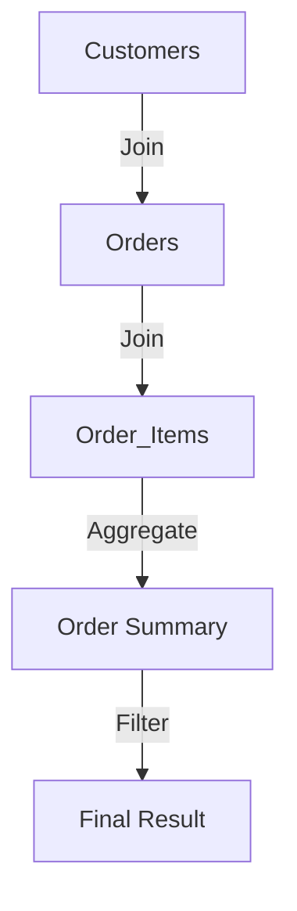

## 5.14 Managing Complex Joins and Subqueries

In the realm of SQL, managing complex joins and subqueries is a critical skill for expert software engineers and architects. As databases grow in complexity and size, the ability to efficiently retrieve and manipulate data becomes paramount. This section delves into advanced techniques for handling complex joins and subqueries, focusing on breaking down queries, utilizing temporary tables and Common Table Expressions (CTEs), performance tuning, and modular development.

### Breaking Down Queries: Simplifying Complex Statements

Complex SQL queries can often become unwieldy, making them difficult to understand, maintain, and optimize. Breaking down these queries into simpler components is a fundamental strategy for managing complexity.

#### Decomposition Strategy

1. **Identify Core Components**: Start by identifying the main components of your query. This includes the primary tables involved, the key joins, and the essential filters.
   
2. **Modularize Subqueries**: Break down subqueries into smaller, manageable parts. Each subquery should perform a distinct function that contributes to the overall query.

3. **Use Descriptive Aliases**: Assign meaningful aliases to tables and columns to improve readability and maintainability.

4. **Document the Query Logic**: Use comments to explain the purpose and logic of each part of the query. This is especially important for complex joins and subqueries.

#### Example: Decomposing a Complex Query

Consider a query that retrieves customer orders along with their total order value and the number of items ordered:

```sql
SELECT 
    c.customer_id,
    c.customer_name,
    SUM(o.order_value) AS total_order_value,
    COUNT(oi.item_id) AS total_items_ordered
FROM 
    customers c
JOIN 
    orders o ON c.customer_id = o.customer_id
JOIN 
    order_items oi ON o.order_id = oi.order_id
WHERE 
    o.order_date BETWEEN '2024-01-01' AND '2024-12-31'
GROUP BY 
    c.customer_id, c.customer_name;
```

To simplify, we can break it down into smaller parts:

1. **Retrieve Orders for the Year**:

    ```sql
    SELECT 
        o.order_id, 
        o.customer_id, 
        o.order_value
    FROM 
        orders o
    WHERE 
        o.order_date BETWEEN '2024-01-01' AND '2024-12-31';
    ```

2. **Calculate Total Items Ordered**:

    ```sql
    SELECT 
        oi.order_id, 
        COUNT(oi.item_id) AS total_items
    FROM 
        order_items oi
    GROUP BY 
        oi.order_id;
    ```

3. **Combine Results**:

    ```sql
    SELECT 
        c.customer_id,
        c.customer_name,
        SUM(o.order_value) AS total_order_value,
        SUM(oi.total_items) AS total_items_ordered
    FROM 
        customers c
    JOIN 
        (SELECT o.order_id, o.customer_id, o.order_value FROM orders o WHERE o.order_date BETWEEN '2024-01-01' AND '2024-12-31') o
    ON 
        c.customer_id = o.customer_id
    JOIN 
        (SELECT oi.order_id, COUNT(oi.item_id) AS total_items FROM order_items oi GROUP BY oi.order_id) oi
    ON 
        o.order_id = oi.order_id
    GROUP BY 
        c.customer_id, c.customer_name;
    ```

### Temporary Tables and CTEs: Staging Intermediate Results

Temporary tables and Common Table Expressions (CTEs) are powerful tools for staging intermediate results, making complex queries more manageable and efficient.

#### Temporary Tables

Temporary tables are useful for storing intermediate results that can be reused across multiple queries. They are particularly beneficial when dealing with large datasets or when performing complex calculations.

**Creating a Temporary Table**:

```sql
CREATE TEMPORARY TABLE temp_orders AS
SELECT 
    o.order_id, 
    o.customer_id, 
    o.order_value
FROM 
    orders o
WHERE 
    o.order_date BETWEEN '2024-01-01' AND '2024-12-31';
```

**Using the Temporary Table**:

```sql
SELECT 
    c.customer_id,
    c.customer_name,
    SUM(temp_orders.order_value) AS total_order_value
FROM 
    customers c
JOIN 
    temp_orders ON c.customer_id = temp_orders.customer_id
GROUP BY 
    c.customer_id, c.customer_name;
```

#### Common Table Expressions (CTEs)

CTEs provide a way to define temporary result sets that can be referenced within a `SELECT`, `INSERT`, `UPDATE`, or `DELETE` statement. They are particularly useful for recursive queries and improving query readability.

**Defining a CTE**:

```sql
WITH OrderSummary AS (
    SELECT 
        o.order_id, 
        o.customer_id, 
        SUM(oi.item_price) AS total_order_value
    FROM 
        orders o
    JOIN 
        order_items oi ON o.order_id = oi.order_id
    WHERE 
        o.order_date BETWEEN '2024-01-01' AND '2024-12-31'
    GROUP BY 
        o.order_id, o.customer_id
)
SELECT 
    c.customer_id,
    c.customer_name,
    SUM(OrderSummary.total_order_value) AS total_order_value
FROM 
    customers c
JOIN 
    OrderSummary ON c.customer_id = OrderSummary.customer_id
GROUP BY 
    c.customer_id, c.customer_name;
```

### Performance Tuning: Avoiding Unnecessary Computations

Performance tuning is essential to ensure that complex queries run efficiently. Here are some strategies to optimize performance:

1. **Indexing**: Ensure that appropriate indexes are in place for columns used in joins and filters. This can significantly reduce query execution time.

2. **Avoiding Redundant Calculations**: Use CTEs or temporary tables to avoid recalculating the same results multiple times within a query.

3. **Limiting Data Retrieval**: Use `WHERE` clauses to filter data as early as possible in the query execution process.

4. **Analyzing Execution Plans**: Use database tools to analyze query execution plans and identify bottlenecks.

#### Example: Optimizing a Query with Indexes

Consider a query that retrieves customer orders with a specific status:

```sql
SELECT 
    c.customer_id,
    c.customer_name,
    o.order_id,
    o.order_status
FROM 
    customers c
JOIN 
    orders o ON c.customer_id = o.customer_id
WHERE 
    o.order_status = 'Shipped';
```

**Indexing Strategy**:

- Create an index on `orders.order_status` to speed up the filtering process.

```sql
CREATE INDEX idx_order_status ON orders(order_status);
```

### Modular Development: Reusing Query Components

Modular development involves creating reusable query components that can be easily integrated into larger queries. This approach enhances maintainability and reduces redundancy.

#### Creating Reusable Components

1. **Views**: Define views for commonly used query components. Views encapsulate complex logic and can be reused across multiple queries.

2. **Stored Procedures**: Use stored procedures to encapsulate complex query logic that can be executed with a single call.

3. **Parameterized Queries**: Use parameterized queries to create flexible query templates that can be reused with different input values.

#### Example: Using a View for Reusability

**Defining a View**:

```sql
CREATE VIEW CustomerOrderSummary AS
SELECT 
    c.customer_id,
    c.customer_name,
    SUM(o.order_value) AS total_order_value
FROM 
    customers c
JOIN 
    orders o ON c.customer_id = o.customer_id
GROUP BY 
    c.customer_id, c.customer_name;
```

**Using the View**:

```sql
SELECT 
    customer_id,
    customer_name,
    total_order_value
FROM 
    CustomerOrderSummary
WHERE 
    total_order_value > 1000;
```

### Visualizing Complex Joins and Subqueries

To better understand the relationships and data flow in complex queries, visual representations can be invaluable. Below is a diagram illustrating the flow of data in a query with multiple joins and subqueries.



**Diagram Description**: This diagram represents a query that joins the `Customers`, `Orders`, and `Order_Items` tables, aggregates the order data, and filters the results to produce the final output.

### Try It Yourself

Experiment with the examples provided by modifying the queries to suit different scenarios. For instance, try changing the date range in the CTE example or adding additional filters to the view. This hands-on practice will deepen your understanding of managing complex joins and subqueries.

### Knowledge Check

- Explain the benefits of breaking down complex queries into simpler components.
- Demonstrate how to use temporary tables and CTEs to manage intermediate results.
- Provide examples of performance tuning techniques for complex queries.
- Discuss the advantages of modular development in SQL query design.

### Embrace the Journey

Remember, mastering complex joins and subqueries is a journey. As you continue to practice and apply these techniques, you'll gain greater confidence and proficiency in SQL query design. Keep experimenting, stay curious, and enjoy the process of learning and discovery!

## Quiz Time!



### What is the primary benefit of breaking down complex SQL queries?

- [x] Improved readability and maintainability
- [ ] Increased execution time
- [ ] Reduced data retrieval
- [ ] Enhanced security

> **Explanation:** Breaking down complex queries improves readability and maintainability, making it easier to understand and modify the query.

### Which SQL feature allows you to define temporary result sets within a query?

- [ ] Temporary Tables
- [x] Common Table Expressions (CTEs)
- [ ] Indexes
- [ ] Views

> **Explanation:** Common Table Expressions (CTEs) allow you to define temporary result sets that can be referenced within a query.

### What is a key strategy for optimizing SQL query performance?

- [ ] Using more subqueries
- [x] Indexing columns used in joins and filters
- [ ] Increasing the number of joins
- [ ] Removing WHERE clauses

> **Explanation:** Indexing columns used in joins and filters can significantly reduce query execution time and improve performance.

### How can modular development enhance SQL query design?

- [x] By creating reusable query components
- [ ] By increasing query complexity
- [ ] By reducing query execution time
- [ ] By eliminating the need for joins

> **Explanation:** Modular development involves creating reusable query components, enhancing maintainability and reducing redundancy.

### Which SQL construct is used to encapsulate complex logic for reuse?

- [ ] Indexes
- [ ] Temporary Tables
- [x] Views
- [ ] Constraints

> **Explanation:** Views encapsulate complex logic and can be reused across multiple queries.

### What is the purpose of using descriptive aliases in SQL queries?

- [x] To improve readability and maintainability
- [ ] To increase execution time
- [ ] To reduce data retrieval
- [ ] To enhance security

> **Explanation:** Descriptive aliases improve readability and maintainability by making it easier to understand the query.

### Which of the following is NOT a benefit of using CTEs?

- [ ] Improving query readability
- [ ] Simplifying complex queries
- [x] Increasing query execution time
- [ ] Enabling recursive queries

> **Explanation:** CTEs improve query readability, simplify complex queries, and enable recursive queries, but they do not inherently increase execution time.

### What is a common use case for temporary tables in SQL?

- [ ] Storing permanent data
- [x] Staging intermediate results
- [ ] Defining indexes
- [ ] Creating views

> **Explanation:** Temporary tables are commonly used for staging intermediate results that can be reused across multiple queries.

### How can you analyze query execution plans to identify bottlenecks?

- [x] Use database tools to analyze execution plans
- [ ] Increase the number of joins
- [ ] Remove WHERE clauses
- [ ] Use more subqueries

> **Explanation:** Analyzing query execution plans with database tools helps identify bottlenecks and optimize performance.

### True or False: Modular development in SQL involves creating complex queries that cannot be reused.

- [ ] True
- [x] False

> **Explanation:** Modular development involves creating reusable query components, not complex queries that cannot be reused.


