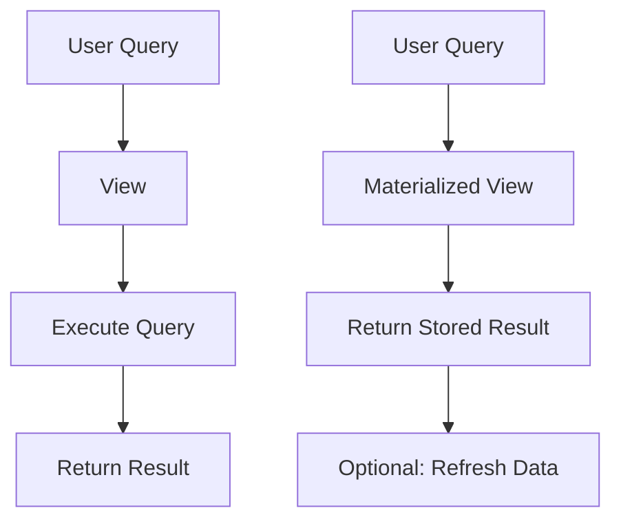

## 5.15 Using Views and Materialized Views

In the realm of SQL and database management, views and materialized views serve as powerful tools for abstracting complex queries, enhancing security, and optimizing performance. Understanding how to effectively use these features can significantly improve the design and efficiency of your database systems. In this section, we will delve into the purpose, functionality, and best practices for using views and materialized views in SQL.

### Understanding Views

**Views** in SQL are virtual tables that are defined by a query. They do not store data themselves but provide a way to present data from one or more tables in a specific format. Views can simplify complex queries, enhance security by restricting access to specific data, and provide a level of abstraction that separates the logical data model from the physical data storage.

#### Purpose of Views

- **Abstracting Complex Queries**: Views can encapsulate complex SQL queries, making it easier for developers and users to interact with the data without needing to understand the underlying query logic.
- **Enhancing Security**: By restricting access to specific columns or rows, views can serve as a security layer, ensuring that sensitive data is only accessible to authorized users.
- **Simplifying Data Access**: Views can present data in a way that is more intuitive and easier to understand, which can be particularly useful for reporting and data analysis.

#### Creating and Using Views

To create a view, you use the `CREATE VIEW` statement, followed by the view name and the query that defines the view. Here is a simple example:

```sql
-- Create a view to show employee details with their department names
CREATE VIEW EmployeeDepartment AS
SELECT e.EmployeeID, e.FirstName, e.LastName, d.DepartmentName
FROM Employees e
JOIN Departments d ON e.DepartmentID = d.DepartmentID;
```

This view, `EmployeeDepartment`, abstracts the join operation between the `Employees` and `Departments` tables, providing a simplified interface for users to access employee details along with their department names.

#### Updatable Views

Not all views are updatable, but when they are, they allow for data modifications through the view itself. For a view to be updatable, it must meet certain conditions:

- The view must be based on a single table.
- The view must include all columns that are not nullable or have default values.
- The view must not include aggregate functions, `DISTINCT`, or `GROUP BY` clauses.

Here's an example of an updatable view:

```sql
-- Create an updatable view for employee contact information
CREATE VIEW EmployeeContact AS
SELECT EmployeeID, FirstName, LastName, Email
FROM Employees;

-- Update the email of an employee through the view
UPDATE EmployeeContact
SET Email = 'new.email@example.com'
WHERE EmployeeID = 101;
```

In this example, the `EmployeeContact` view is updatable because it directly maps to the `Employees` table without any complex transformations.

### Exploring Materialized Views

**Materialized Views** differ from regular views in that they store the result set of a query physically. This can lead to significant performance improvements, especially for complex queries that are executed frequently.

#### Purpose of Materialized Views

- **Storing Query Results**: Materialized views store the results of a query, allowing for faster retrieval of data compared to executing the query each time.
- **Improving Performance**: By precomputing and storing query results, materialized views can reduce the load on the database and improve response times for complex queries.
- **Supporting Data Warehousing**: Materialized views are often used in data warehousing environments to store aggregated data, making it easier to perform analytical queries.

#### Creating and Using Materialized Views

To create a materialized view, you use the `CREATE MATERIALIZED VIEW` statement. Here is an example:

```sql
-- Create a materialized view to store total sales per product
CREATE MATERIALIZED VIEW TotalSalesPerProduct AS
SELECT ProductID, SUM(SalesAmount) AS TotalSales
FROM Sales
GROUP BY ProductID;
```

This materialized view, `TotalSalesPerProduct`, stores the total sales amount for each product, allowing for quick retrieval of this aggregated data.

#### Refresh Strategies for Materialized Views

Materialized views can become stale as the underlying data changes. To keep them up-to-date, you can use different refresh strategies:

- **Immediate Refresh**: The materialized view is updated immediately after the underlying data changes.
- **Deferred Refresh**: The materialized view is updated at a specified interval or on-demand.
- **Manual Refresh**: The materialized view is updated manually by executing a refresh command.

Here's how you can refresh a materialized view manually:

```sql
-- Refresh the materialized view manually
REFRESH MATERIALIZED VIEW TotalSalesPerProduct;
```

Choosing the right refresh strategy depends on the specific requirements of your application, such as the need for real-time data versus performance considerations.

### Considerations for Using Views and Materialized Views

When deciding whether to use views or materialized views, consider the following factors:

- **Performance vs. Data Freshness**: Materialized views can improve performance but may not always reflect the most current data. Regular views always show the latest data but may be slower for complex queries.
- **Complexity and Maintenance**: Views are easier to maintain as they do not store data, while materialized views require additional maintenance to ensure data consistency.
- **Use Case Requirements**: Consider the specific needs of your application, such as the frequency of data updates and the complexity of queries, when choosing between views and materialized views.

### Visualizing Views and Materialized Views

To better understand the differences between views and materialized views, let's visualize their workflows:



**Diagram Description**: This diagram illustrates the workflow for views and materialized views. For views, the query is executed each time, while for materialized views, the stored result is returned, with optional data refresh.

### Try It Yourself

Experiment with creating and using views and materialized views in your database. Try modifying the queries, adding new columns, or changing the refresh strategies for materialized views. Observe how these changes affect performance and data freshness.

### Key Takeaways

- **Views** provide a way to abstract complex queries and enhance security by restricting access to specific data.
- **Materialized Views** store query results physically, offering performance benefits for complex queries.
- **Refresh Strategies** for materialized views include immediate, deferred, and manual updates, each with its own trade-offs.
- **Considerations** for using views and materialized views include balancing performance with data freshness and understanding the specific requirements of your application.

## Quiz Time!



### What is a primary purpose of using SQL views?

- [x] To abstract complex queries
- [ ] To store query results physically
- [ ] To improve data freshness
- [ ] To replace indexes

> **Explanation:** SQL views are primarily used to abstract complex queries and provide a simplified interface for users.

### Which of the following is a condition for a view to be updatable?

- [x] The view must be based on a single table.
- [ ] The view must include aggregate functions.
- [ ] The view must use the `DISTINCT` clause.
- [ ] The view must include a `GROUP BY` clause.

> **Explanation:** For a view to be updatable, it must be based on a single table and not include aggregate functions, `DISTINCT`, or `GROUP BY` clauses.

### What is a key advantage of using materialized views?

- [x] They store query results for faster access.
- [ ] They always show the most current data.
- [ ] They require no maintenance.
- [ ] They replace the need for indexes.

> **Explanation:** Materialized views store query results, which allows for faster access compared to executing the query each time.

### How can a materialized view be refreshed?

- [x] Manually using a refresh command
- [ ] Automatically without any configuration
- [ ] Only at database startup
- [ ] By dropping and recreating the view

> **Explanation:** Materialized views can be refreshed manually using a refresh command, among other strategies.

### What is a potential drawback of using materialized views?

- [x] They may not reflect the most current data.
- [ ] They cannot be indexed.
- [ ] They are always slower than regular views.
- [ ] They cannot be used in data warehousing.

> **Explanation:** Materialized views may not always reflect the most current data, depending on the refresh strategy used.

### Which refresh strategy updates a materialized view immediately after data changes?

- [x] Immediate Refresh
- [ ] Deferred Refresh
- [ ] Manual Refresh
- [ ] Scheduled Refresh

> **Explanation:** Immediate refresh updates the materialized view immediately after the underlying data changes.

### What is a common use case for materialized views?

- [x] Supporting data warehousing with precomputed aggregates
- [ ] Replacing all indexes in a database
- [ ] Ensuring real-time data updates
- [ ] Simplifying user authentication

> **Explanation:** Materialized views are commonly used in data warehousing to store precomputed aggregates for faster analytical queries.

### Which SQL statement is used to create a view?

- [x] CREATE VIEW
- [ ] CREATE TABLE
- [ ] CREATE INDEX
- [ ] CREATE DATABASE

> **Explanation:** The `CREATE VIEW` statement is used to define a new view in SQL.

### What is a benefit of using views for security?

- [x] Restricting access to specific columns or rows
- [ ] Encrypting all data in the database
- [ ] Automatically logging user access
- [ ] Preventing SQL injection attacks

> **Explanation:** Views can restrict access to specific columns or rows, enhancing security by limiting what data users can see.

### True or False: Materialized views always provide the most current data.

- [ ] True
- [x] False

> **Explanation:** Materialized views may not always provide the most current data, as they rely on refresh strategies to update their stored results.



Remember, mastering the use of views and materialized views is just one step in optimizing your SQL database systems. Keep exploring, experimenting, and learning to enhance your skills and build efficient, scalable database solutions.
