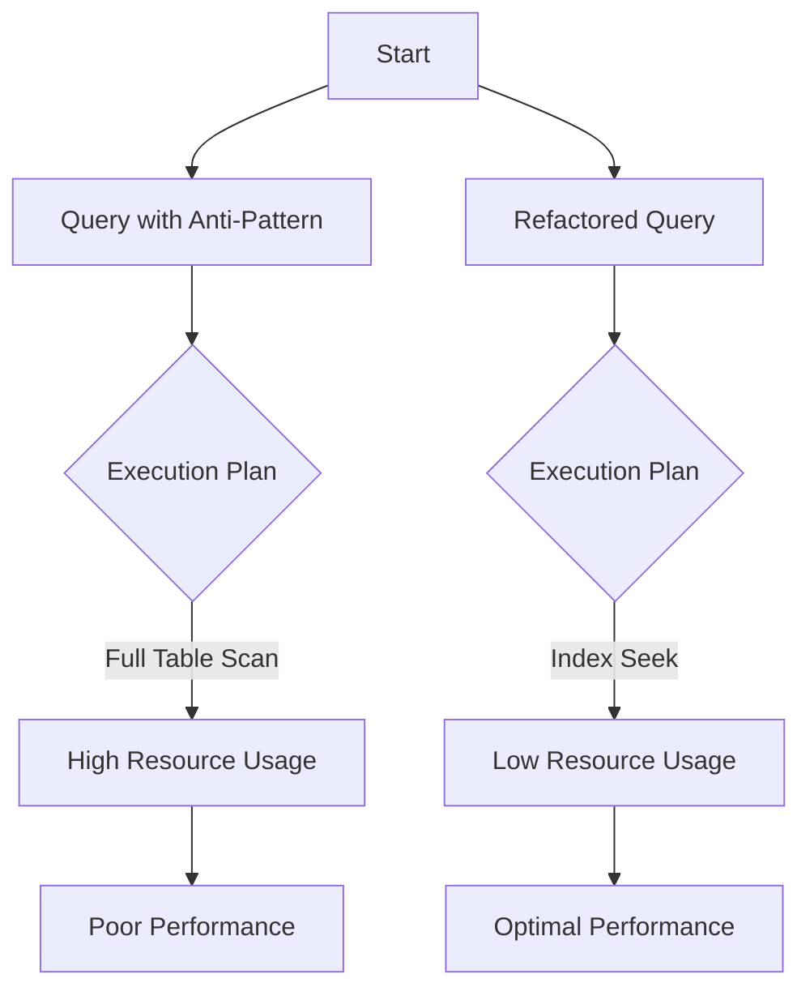

## 5.16 Common Query Anti-Patterns and How to Avoid Them

In the realm of SQL development, understanding and avoiding query anti-patterns is crucial for maintaining efficient and scalable database systems. Anti-patterns are common practices that may seem effective at first glance but lead to suboptimal performance, increased complexity, and maintenance challenges. In this section, we will explore some of the most prevalent SQL query anti-patterns and provide strategies to avoid them, ensuring your database queries are both efficient and maintainable.

### Understanding SQL Query Anti-Patterns

SQL query anti-patterns are practices that degrade the performance and maintainability of database queries. These patterns often arise from misconceptions or oversights in query design and can lead to inefficient execution plans, excessive resource consumption, and increased complexity. By identifying and addressing these anti-patterns, developers can optimize their queries and improve overall database performance.

### SELECT *: Fetching Unnecessary Columns

One of the most common anti-patterns in SQL queries is the use of `SELECT *`. While it may seem convenient to retrieve all columns from a table, this practice can lead to several issues:

- **Increased Data Transfer**: Fetching unnecessary columns increases the amount of data transferred between the database and the application, leading to higher network latency and resource consumption.
- **Reduced Query Performance**: Retrieving all columns can prevent the database from using covering indexes, which are optimized for specific columns.
- **Maintenance Challenges**: Changes to the table schema, such as adding or removing columns, can inadvertently affect query results and application logic.

#### How to Avoid SELECT * Anti-Pattern

To avoid this anti-pattern, explicitly specify the columns you need in your queries. This approach not only improves performance but also enhances code readability and maintainability.

```sql
-- Anti-pattern: Using SELECT * to fetch all columns
SELECT * FROM employees WHERE department_id = 10;

-- Best practice: Specify only the necessary columns
SELECT employee_id, first_name, last_name FROM employees WHERE department_id = 10;
```

### Implicit Conversions: Causing Index Scans Instead of Seeks

Implicit conversions occur when the data types of columns and values in a query do not match, causing the database to convert data types automatically. This can lead to index scans instead of seeks, significantly impacting query performance.

#### Example of Implicit Conversion

Consider a scenario where a column is of type `VARCHAR`, but the query uses an integer value:

```sql
-- Anti-pattern: Implicit conversion due to mismatched data types
SELECT * FROM orders WHERE order_id = 12345;

-- Assuming order_id is a VARCHAR column, the query causes an implicit conversion
```

#### How to Avoid Implicit Conversion Anti-Pattern

To avoid this anti-pattern, ensure that the data types of columns and values in your queries match. Use explicit conversions if necessary to maintain consistency.

```sql
-- Best practice: Use explicit conversion to match data types
SELECT * FROM orders WHERE order_id = '12345';
```

### Non-SARGable Conditions: Using Functions on Indexed Columns in WHERE Clauses

Non-SARGable (Search ARGument Able) conditions occur when functions or operations are applied to indexed columns in the `WHERE` clause, preventing the database from using indexes efficiently. This results in full table scans instead of index seeks.

#### Example of Non-SARGable Condition

Consider a query that uses a function on an indexed column:

```sql
-- Anti-pattern: Non-SARGable condition due to function on indexed column
SELECT * FROM customers WHERE YEAR(birth_date) = 1990;
```

#### How to Avoid Non-SARGable Condition Anti-Pattern

To avoid this anti-pattern, rewrite queries to allow the database to use indexes effectively. This often involves moving functions to the other side of the comparison or using indexed columns directly.

```sql
-- Best practice: Rewrite query to use indexed column directly
SELECT * FROM customers WHERE birth_date BETWEEN '1990-01-01' AND '1990-12-31';
```

### Over-Normalization in Queries: Excessive Joins Leading to Poor Performance

Over-normalization occurs when a database schema is excessively normalized, leading to complex queries with multiple joins. While normalization is essential for data integrity, excessive joins can degrade query performance and increase complexity.

#### Example of Over-Normalization

Consider a query that joins multiple tables to retrieve related data:

```sql
-- Anti-pattern: Over-normalized query with excessive joins
SELECT e.employee_id, e.first_name, d.department_name, p.project_name
FROM employees e
JOIN department_employee de ON e.employee_id = de.employee_id
JOIN departments d ON de.department_id = d.department_id
JOIN project_employee pe ON e.employee_id = pe.employee_id
JOIN projects p ON pe.project_id = p.project_id;
```

#### How to Avoid Over-Normalization Anti-Pattern

To avoid this anti-pattern, consider denormalization techniques where appropriate, such as creating summary tables or using materialized views to reduce the number of joins required.

```sql
-- Best practice: Use a summary table to reduce joins
SELECT e.employee_id, e.first_name, d.department_name, p.project_name
FROM employee_summary es
JOIN departments d ON es.department_id = d.department_id
JOIN projects p ON es.project_id = p.project_id;
```

### Solutions: Refactoring Queries for Efficiency, Indexing Appropriately

Refactoring queries and indexing appropriately are essential strategies for avoiding SQL query anti-patterns. By optimizing query design and leveraging indexes effectively, developers can enhance performance and maintainability.

#### Refactoring Queries

Refactoring involves rewriting queries to improve performance and readability. This may include simplifying complex logic, reducing the number of joins, and eliminating redundant operations.

```sql
-- Example of refactored query
SELECT e.employee_id, e.first_name, d.department_name
FROM employees e
JOIN departments d ON e.department_id = d.department_id
WHERE e.status = 'active';
```

#### Indexing Strategies

Indexing is a powerful tool for optimizing query performance. By creating indexes on frequently queried columns, developers can significantly reduce query execution time.

```sql
-- Example of creating an index on a frequently queried column
CREATE INDEX idx_department_id ON employees(department_id);
```

### Visualizing SQL Query Anti-Patterns

To better understand the impact of SQL query anti-patterns, let's visualize the execution plan of a query with and without anti-patterns using a flowchart.



**Caption**: Visualizing the impact of SQL query anti-patterns on execution plans and performance.

### Try It Yourself

To solidify your understanding of SQL query anti-patterns, try modifying the code examples provided in this section. Experiment with different query structures and indexing strategies to observe their impact on performance.

### References and Further Reading

- [SQL Performance Tuning](https://www.sqlshack.com/sql-performance-tuning/)
- [Understanding Execution Plans](https://docs.microsoft.com/en-us/sql/relational-databases/performance/execution-plans)
- [Indexing Strategies for SQL Databases](https://www.red-gate.com/simple-talk/sql/performance/sql-server-indexing-strategies/)

### Knowledge Check

- What are SQL query anti-patterns, and why are they important to avoid?
- How does the `SELECT *` anti-pattern affect query performance?
- What is the impact of implicit conversions on query execution?
- How can non-SARGable conditions be refactored for better performance?
- What are the trade-offs of over-normalization in database design?

### Embrace the Journey

Remember, mastering SQL query design is an ongoing journey. As you continue to refine your skills, you'll discover new ways to optimize performance and enhance the efficiency of your database systems. Keep experimenting, stay curious, and enjoy the process of learning and growth!

## Quiz Time!



### What is a common consequence of using `SELECT *` in SQL queries?

- [x] Increased data transfer and reduced query performance
- [ ] Improved query readability
- [ ] Enhanced security
- [ ] Faster query execution

> **Explanation:** Using `SELECT *` fetches all columns, leading to increased data transfer and reduced performance.

### How can implicit conversions in SQL queries affect performance?

- [x] They can cause index scans instead of seeks
- [ ] They improve query readability
- [ ] They enhance data integrity
- [ ] They reduce query execution time

> **Explanation:** Implicit conversions can lead to index scans, which are less efficient than index seeks.

### What is a non-SARGable condition in SQL queries?

- [x] A condition that prevents the use of indexes efficiently
- [ ] A condition that improves query performance
- [ ] A condition that enhances data integrity
- [ ] A condition that simplifies query logic

> **Explanation:** Non-SARGable conditions prevent efficient index usage, leading to full table scans.

### What is a potential drawback of over-normalization in database design?

- [x] Excessive joins leading to poor performance
- [ ] Improved data integrity
- [ ] Simplified query logic
- [ ] Enhanced security

> **Explanation:** Over-normalization can lead to complex queries with excessive joins, degrading performance.

### How can you avoid the `SELECT *` anti-pattern?

- [x] By specifying only the necessary columns in queries
- [ ] By using implicit conversions
- [ ] By applying functions to indexed columns
- [ ] By increasing normalization

> **Explanation:** Specifying only necessary columns improves performance and maintainability.

### What is the impact of non-SARGable conditions on query execution?

- [x] They cause full table scans instead of index seeks
- [ ] They improve query readability
- [ ] They enhance data integrity
- [ ] They reduce query execution time

> **Explanation:** Non-SARGable conditions lead to full table scans, which are less efficient.

### How can you refactor a query with non-SARGable conditions?

- [x] By rewriting the query to use indexed columns directly
- [ ] By using `SELECT *`
- [ ] By increasing normalization
- [ ] By applying implicit conversions

> **Explanation:** Refactoring queries to use indexed columns directly allows efficient index usage.

### What is a benefit of refactoring queries for efficiency?

- [x] Improved performance and readability
- [ ] Increased data transfer
- [ ] Enhanced security
- [ ] Simplified query logic

> **Explanation:** Refactoring queries improves performance and readability by optimizing execution plans.

### How can indexing strategies enhance query performance?

- [x] By reducing query execution time
- [ ] By increasing data transfer
- [ ] By enhancing data integrity
- [ ] By simplifying query logic

> **Explanation:** Indexing strategies reduce execution time by allowing efficient data retrieval.

### True or False: Over-normalization always improves database performance.

- [ ] True
- [x] False

> **Explanation:** Over-normalization can lead to excessive joins and poor performance, so it's important to balance normalization with performance considerations.




