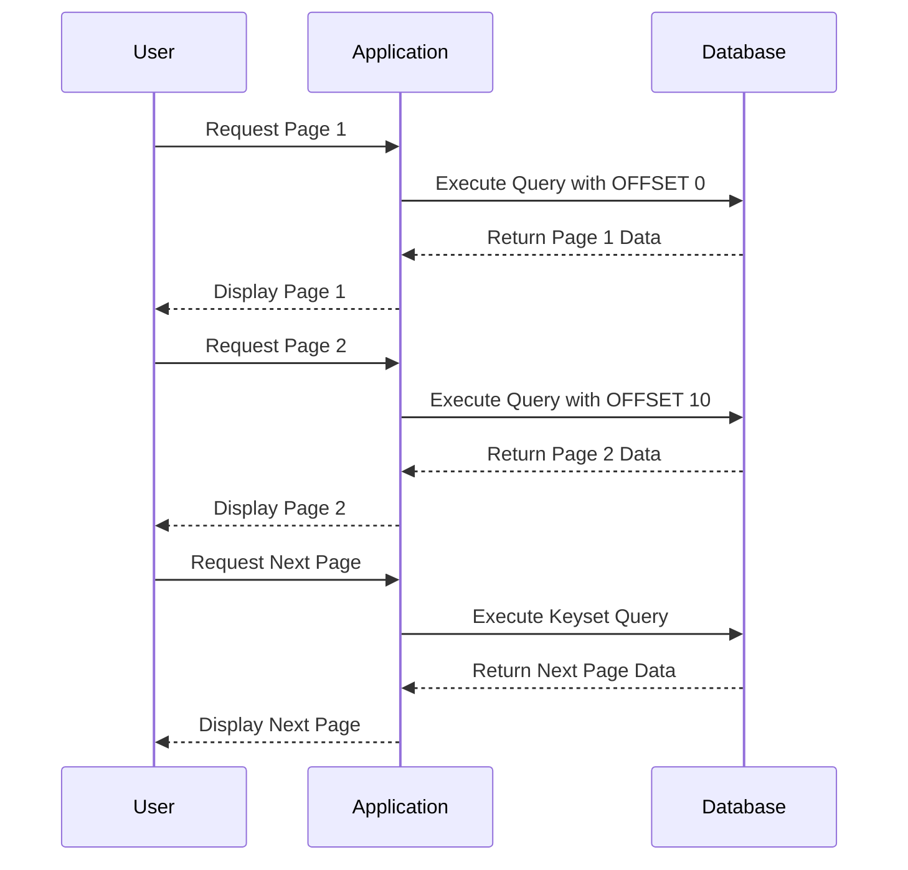

## 5.2 Pagination and Limiting Results

In the realm of database management and application development, efficiently handling large datasets is crucial. Pagination and limiting results are essential techniques that allow developers to manage and display data in a user-friendly manner. This section delves into the intricacies of SQL pagination, exploring various methods, performance considerations, and best practices to ensure optimal user experience.

### Understanding Pagination and Limiting Results

Pagination refers to the process of dividing a dataset into discrete pages, allowing users to navigate through data incrementally. Limiting results, on the other hand, involves restricting the number of records returned by a query. Together, these techniques enhance performance and usability, especially when dealing with large datasets.

### Techniques for Pagination

#### OFFSET and FETCH: Skipping and Limiting Rows

The OFFSET and FETCH clauses are widely used in SQL for pagination. They allow you to skip a specified number of rows and then return a set number of rows from the result set.

**Syntax:**

```sql
SELECT column1, column2, ...
FROM table_name
ORDER BY column_name
OFFSET number_of_rows_to_skip ROWS
FETCH NEXT number_of_rows_to_return ROWS ONLY;
```

**Example:**

Consider a table `employees` with columns `id`, `name`, and `salary`. To retrieve the second page of results, assuming each page contains 10 records, you can use the following query:

```sql
SELECT id, name, salary
FROM employees
ORDER BY id
OFFSET 10 ROWS
FETCH NEXT 10 ROWS ONLY;
```

**Explanation:**

- **OFFSET 10 ROWS**: Skips the first 10 rows.
- **FETCH NEXT 10 ROWS ONLY**: Retrieves the next 10 rows.

**Performance Considerations:**

While OFFSET and FETCH are straightforward, they can become inefficient with large datasets. The database engine must process all preceding rows before reaching the desired offset, which can lead to increased resource consumption.

#### Keyset Pagination: Using Indexed Columns for Efficient Navigation

Keyset pagination, also known as the "seek method," leverages indexed columns to navigate through data efficiently. Unlike OFFSET and FETCH, keyset pagination does not require scanning all preceding rows, making it more performant for large datasets.

**Syntax:**

```sql
SELECT column1, column2, ...
FROM table_name
WHERE indexed_column > last_seen_value
ORDER BY indexed_column
LIMIT number_of_rows_to_return;
```

**Example:**

Using the `employees` table, if you want to retrieve the next set of records after the last `id` of 10, the query would be:

```sql
SELECT id, name, salary
FROM employees
WHERE id > 10
ORDER BY id
LIMIT 10;
```

**Explanation:**

- **WHERE id > 10**: Ensures that only rows with an `id` greater than 10 are considered.
- **LIMIT 10**: Restricts the result to 10 rows.

**Advantages:**

- **Efficiency**: Keyset pagination is more efficient for large datasets as it avoids scanning unnecessary rows.
- **Consistency**: Provides consistent results even if the dataset changes between queries.

### Performance Considerations

When implementing pagination, it's crucial to consider the performance implications, especially with large datasets. Here are some strategies to optimize performance:

- **Indexing**: Ensure that the columns used in the ORDER BY and WHERE clauses are indexed. This can significantly reduce the time required to retrieve the desired rows.
- **Avoid Large Offsets**: Large offsets can degrade performance. Consider using keyset pagination or caching strategies to mitigate this issue.
- **Database-Specific Features**: Some databases offer specific features or extensions for pagination. Explore these options to leverage database-specific optimizations.

### User Experience: Ensuring Consistent and Fast Response Times

Pagination not only affects performance but also impacts user experience. Here are some best practices to ensure a seamless experience:

- **Consistent Page Sizes**: Maintain consistent page sizes across queries to provide a predictable navigation experience.
- **Loading Indicators**: Use loading indicators to inform users that data is being fetched, especially for large datasets.
- **Prefetching**: Consider prefetching subsequent pages to reduce wait times when users navigate through pages.

### Visualizing Pagination Techniques

To better understand the flow of pagination techniques, let's visualize the process using a sequence diagram.



**Diagram Explanation:**

- The sequence diagram illustrates the interaction between the user, application, and database during pagination.
- It highlights the difference between OFFSET/FETCH and keyset pagination.

### Try It Yourself

To deepen your understanding, try modifying the example queries:

- Change the number of rows to skip and fetch in the OFFSET/FETCH example.
- Experiment with different indexed columns in the keyset pagination example.
- Test the performance of each method with varying dataset sizes.

### References and Links

For further reading on SQL pagination and performance optimization, consider the following resources:

- [SQL Pagination Techniques](https://www.sqlshack.com/sql-pagination/)
- [Understanding SQL OFFSET and FETCH](https://www.sqlservertutorial.net/sql-server-basics/sql-server-offset-fetch/)
- [Keyset Pagination in SQL](https://use-the-index-luke.com/sql/partial-results/fetch-next-page)

### Knowledge Check

Before moving on, let's reinforce what we've learned with a few questions:

1. What are the main differences between OFFSET/FETCH and keyset pagination?
2. How can indexing improve the performance of pagination queries?
3. Why is it important to consider user experience when implementing pagination?

### Embrace the Journey

Remember, mastering pagination and limiting results is just one step in optimizing database queries. As you continue to explore SQL design patterns, you'll uncover more techniques to enhance performance and user experience. Keep experimenting, stay curious, and enjoy the journey!

## Quiz Time!



### What is the primary purpose of pagination in SQL?

- [x] To divide a dataset into discrete pages for easier navigation.
- [ ] To increase the number of rows returned by a query.
- [ ] To decrease the size of the database.
- [ ] To enhance data security.

> **Explanation:** Pagination divides a dataset into pages, allowing users to navigate through data incrementally.

### Which SQL clauses are commonly used for pagination?

- [x] OFFSET and FETCH
- [ ] SELECT and WHERE
- [ ] GROUP BY and HAVING
- [ ] INSERT and UPDATE

> **Explanation:** OFFSET and FETCH are used to skip and limit rows in a result set for pagination.

### What is a key advantage of keyset pagination over OFFSET/FETCH?

- [x] It avoids scanning unnecessary rows, improving performance.
- [ ] It is easier to implement.
- [ ] It requires fewer indexes.
- [ ] It is compatible with all SQL databases.

> **Explanation:** Keyset pagination uses indexed columns to navigate efficiently, avoiding the need to scan all preceding rows.

### How can indexing improve pagination performance?

- [x] By reducing the time required to retrieve the desired rows.
- [ ] By increasing the number of rows returned.
- [ ] By decreasing the size of the database.
- [ ] By enhancing data security.

> **Explanation:** Indexing helps the database engine quickly locate and retrieve the desired rows, improving query performance.

### What is a potential drawback of using large offsets in pagination?

- [x] It can degrade performance by requiring the database to process many rows.
- [ ] It increases the number of rows returned.
- [ ] It decreases the size of the database.
- [ ] It enhances data security.

> **Explanation:** Large offsets can lead to inefficient queries as the database must process all preceding rows.

### What is a common user experience consideration for pagination?

- [x] Consistent page sizes across queries.
- [ ] Increasing the number of rows per page.
- [ ] Decreasing the number of pages.
- [ ] Enhancing data security.

> **Explanation:** Consistent page sizes provide a predictable navigation experience for users.

### Which method is more efficient for large datasets?

- [x] Keyset Pagination
- [ ] OFFSET/FETCH
- [ ] SELECT *
- [ ] GROUP BY

> **Explanation:** Keyset pagination is more efficient for large datasets as it avoids scanning unnecessary rows.

### What is the role of a loading indicator in pagination?

- [x] To inform users that data is being fetched.
- [ ] To increase the number of rows returned.
- [ ] To decrease the size of the database.
- [ ] To enhance data security.

> **Explanation:** Loading indicators improve user experience by informing users that data is being fetched.

### Why is prefetching useful in pagination?

- [x] It reduces wait times when users navigate through pages.
- [ ] It increases the number of rows returned.
- [ ] It decreases the size of the database.
- [ ] It enhances data security.

> **Explanation:** Prefetching subsequent pages can reduce wait times, improving user experience.

### True or False: Keyset pagination is always the best choice for all datasets.

- [ ] True
- [x] False

> **Explanation:** While keyset pagination is efficient for large datasets, it may not be suitable for all scenarios, such as when there are no suitable indexed columns.




