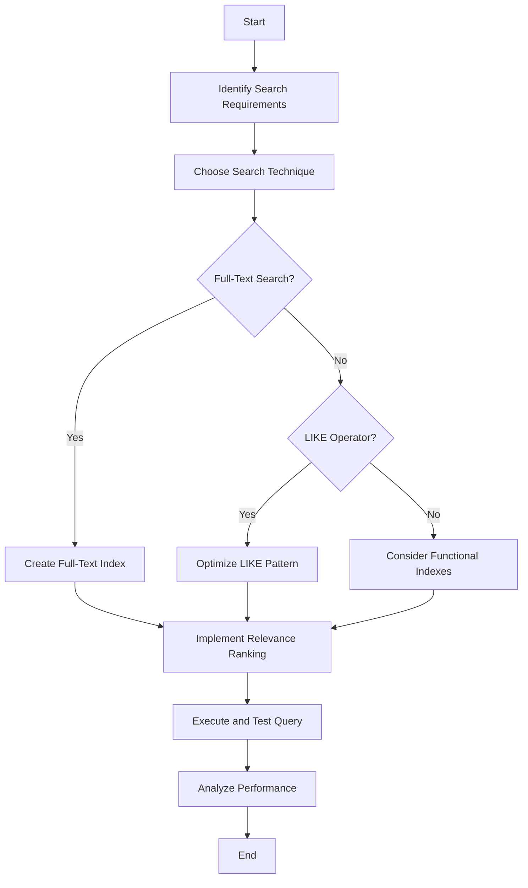

## 5.3 Search-Optimized Queries

In the realm of SQL, search-optimized queries are pivotal for ensuring efficient data retrieval, especially in large databases where performance can be a bottleneck. This section delves into various techniques and patterns that can be employed to optimize search queries, including full-text search, the LIKE operator, functional indexes, and relevance ranking. By mastering these techniques, you can significantly enhance the performance and responsiveness of your database applications.

### Full-Text Search

Full-text search is a powerful feature that allows you to perform complex search operations on text data. Unlike simple pattern matching, full-text search enables searching for words or phrases within text columns, supporting linguistic features such as stemming and stop words.

#### Implementing Full-Text Search

To implement full-text search, you need to create a full-text index on the columns you wish to search. This index allows the database to quickly locate rows that match the search criteria.

**Example: Creating a Full-Text Index**

```sql
-- Create a full-text index on the 'content' column of the 'articles' table
CREATE FULLTEXT INDEX ON articles(content);
```

Once the index is created, you can use the `MATCH` and `AGAINST` operators to perform full-text searches.

**Example: Performing a Full-Text Search**

```sql
-- Search for articles containing the word 'database'
SELECT title, content
FROM articles
WHERE MATCH(content) AGAINST('database');
```

#### Advantages of Full-Text Search

- **Performance**: Full-text indexes are optimized for searching large text fields, providing faster results compared to traditional pattern matching.
- **Relevance**: Full-text search can rank results based on relevance, allowing users to find the most pertinent information quickly.
- **Linguistic Features**: Supports stemming, stop words, and synonyms, making searches more intuitive and user-friendly.

#### Considerations

- **Index Maintenance**: Full-text indexes require maintenance and can increase storage requirements.
- **Complexity**: Implementing full-text search can be more complex than simple pattern matching, requiring careful planning and configuration.

### LIKE Operator

The `LIKE` operator is a simple yet effective tool for pattern matching in SQL. It allows you to search for patterns within text fields using wildcards.

#### Using Wildcards Carefully

The `LIKE` operator supports two wildcards: `%` (percent sign) for matching any sequence of characters and `_` (underscore) for matching a single character.

**Example: Using the LIKE Operator**

```sql
-- Find all customers whose names start with 'Jo'
SELECT name
FROM customers
WHERE name LIKE 'Jo%';
```

#### Performance Considerations

- **Index Usage**: The `LIKE` operator can utilize indexes if the pattern does not start with a wildcard. However, patterns starting with `%` can lead to full table scans.
- **Case Sensitivity**: The behavior of `LIKE` regarding case sensitivity depends on the database collation settings.

#### Best Practices

- **Avoid Leading Wildcards**: To improve performance, avoid using leading wildcards in patterns.
- **Use Functional Indexes**: Consider using functional indexes to optimize `LIKE` queries, especially when dealing with case-insensitive searches.

### Functional Indexes

Functional indexes are indexes on expressions or functions rather than just columns. They can be particularly useful for optimizing search queries that involve calculated fields or transformations.

#### Creating Functional Indexes

Functional indexes allow you to index the result of a function applied to a column, enabling efficient searches on transformed data.

**Example: Creating a Functional Index**

```sql
-- Create an index on the lowercased 'name' column
CREATE INDEX idx_lower_name ON customers(LOWER(name));
```

#### Benefits of Functional Indexes

- **Performance**: Improve query performance by allowing the database to use indexes on transformed data.
- **Flexibility**: Enable indexing of complex expressions and functions, providing more flexibility in query optimization.

#### Considerations

- **Index Maintenance**: Functional indexes require maintenance and can increase storage requirements.
- **Database Support**: Not all databases support functional indexes, so it's important to check your database's capabilities.

### Relevance Ranking

Relevance ranking is the process of ordering search results based on their relevance to the search criteria. This is particularly important in full-text search, where users expect the most relevant results to appear first.

#### Implementing Relevance Ranking

Relevance ranking can be implemented using the `MATCH` and `AGAINST` operators in full-text search, which return a relevance score for each row.

**Example: Ordering Results by Relevance**

```sql
-- Search for articles containing 'database' and order by relevance
SELECT title, content, MATCH(content) AGAINST('database') AS relevance
FROM articles
WHERE MATCH(content) AGAINST('database')
ORDER BY relevance DESC;
```

#### Considerations

- **User Experience**: Relevance ranking can significantly enhance user experience by providing more meaningful search results.
- **Complexity**: Implementing relevance ranking can add complexity to your queries and may require additional tuning and configuration.

### Visualizing Search Optimization

To better understand the impact of search optimization techniques, let's visualize the process of optimizing a search query using a flowchart.



**Diagram Description**: This flowchart illustrates the process of optimizing a search query, starting from identifying search requirements to analyzing performance.

### Try It Yourself

Experiment with the examples provided by modifying the search criteria or index configurations. For instance, try creating a functional index on a different expression or test the impact of different patterns with the `LIKE` operator.

### References and Links

- [MySQL Full-Text Search](https://dev.mysql.com/doc/refman/8.0/en/fulltext-search.html)
- [PostgreSQL Text Search](https://www.postgresql.org/docs/current/textsearch.html)
- [SQL Server Full-Text Search](https://docs.microsoft.com/en-us/sql/relational-databases/search/full-text-search)

### Knowledge Check

- What are the advantages of using full-text search over the `LIKE` operator?
- How can functional indexes improve query performance?
- What are some best practices for using the `LIKE` operator?

### Embrace the Journey

Remember, mastering search-optimized queries is a journey. As you explore these techniques, you'll discover new ways to enhance the performance and responsiveness of your database applications. Keep experimenting, stay curious, and enjoy the journey!

## Quiz Time!



### What is a key advantage of full-text search over the LIKE operator?

- [x] It supports linguistic features like stemming and stop words.
- [ ] It is easier to implement.
- [ ] It requires less storage space.
- [ ] It is faster for small datasets.

> **Explanation:** Full-text search supports linguistic features like stemming and stop words, making it more powerful for complex text searches.

### Which wildcard character in the LIKE operator matches any sequence of characters?

- [x] %
- [ ] _
- [ ] *
- [ ] ?

> **Explanation:** The `%` wildcard matches any sequence of characters in the LIKE operator.

### What is a functional index?

- [x] An index on an expression or function.
- [ ] An index on a primary key.
- [ ] An index on a foreign key.
- [ ] An index on a unique constraint.

> **Explanation:** A functional index is an index on an expression or function, allowing efficient searches on transformed data.

### How can you improve the performance of a LIKE query?

- [x] Avoid using leading wildcards.
- [ ] Use only uppercase letters.
- [ ] Use the `SELECT *` syntax.
- [ ] Avoid using indexes.

> **Explanation:** Avoiding leading wildcards in LIKE queries can improve performance by allowing the use of indexes.

### What does the MATCH operator do in full-text search?

- [x] It searches for words or phrases within text columns.
- [ ] It matches exact strings only.
- [ ] It performs arithmetic operations.
- [ ] It creates indexes.

> **Explanation:** The MATCH operator searches for words or phrases within text columns in full-text search.

### What is the purpose of relevance ranking in search queries?

- [x] To order results based on their relevance to the search criteria.
- [ ] To increase the storage space required.
- [ ] To simplify query syntax.
- [ ] To reduce the number of results returned.

> **Explanation:** Relevance ranking orders results based on their relevance to the search criteria, enhancing user experience.

### What is a potential drawback of full-text indexes?

- [x] They require maintenance and can increase storage requirements.
- [ ] They are not supported by any database.
- [ ] They are slower than traditional indexes.
- [ ] They cannot be used with text data.

> **Explanation:** Full-text indexes require maintenance and can increase storage requirements, which is a potential drawback.

### Which SQL clause is used to order search results by relevance?

- [x] ORDER BY
- [ ] GROUP BY
- [ ] HAVING
- [ ] WHERE

> **Explanation:** The ORDER BY clause is used to order search results by relevance in SQL queries.

### True or False: Functional indexes are supported by all SQL databases.

- [ ] True
- [x] False

> **Explanation:** Not all SQL databases support functional indexes, so it's important to check your database's capabilities.

### What is a best practice when using the LIKE operator?

- [x] Avoid leading wildcards for better performance.
- [ ] Use the `SELECT *` syntax.
- [ ] Always use uppercase letters.
- [ ] Avoid using indexes.

> **Explanation:** Avoiding leading wildcards in LIKE queries is a best practice for better performance.


