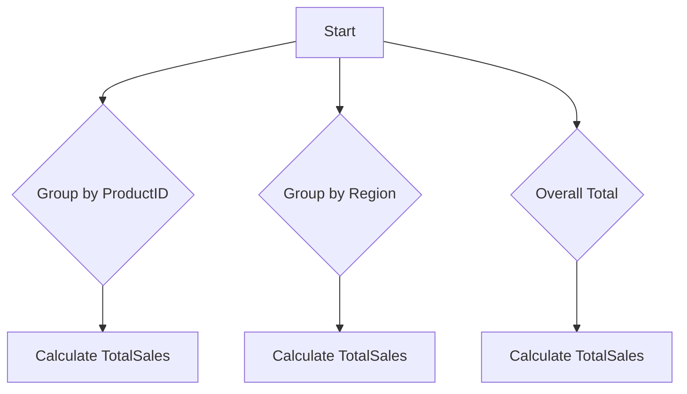

## 5.4 Aggregate Functions and Grouping Sets

In the realm of SQL, aggregate functions and grouping sets are essential tools for data analysis and reporting. They allow us to summarize and analyze data efficiently, providing insights that are crucial for decision-making. In this section, we will delve into the intricacies of aggregate functions, the `GROUP BY` clause, and the powerful `GROUPING SETS` feature. We will also explore the `HAVING` clause, which is used to filter aggregated data. Let's embark on this journey to master these SQL concepts.

### Understanding Aggregate Functions

Aggregate functions perform calculations on a set of values and return a single value. They are commonly used in conjunction with the `GROUP BY` clause to perform operations on groups of data. Here are the most commonly used aggregate functions:

- **`SUM()`**: Calculates the total sum of a numeric column.
- **`COUNT()`**: Returns the number of rows that match a specified condition.
- **`AVG()`**: Computes the average value of a numeric column.
- **`MIN()`**: Finds the minimum value in a set.
- **`MAX()`**: Finds the maximum value in a set.

#### Example: Using Aggregate Functions

Let's consider a table named `Sales` with columns `ProductID`, `Quantity`, and `Price`. We want to calculate the total sales for each product.

```sql
SELECT ProductID, SUM(Quantity * Price) AS TotalSales
FROM Sales
GROUP BY ProductID;
```

In this example, the `SUM()` function calculates the total sales for each `ProductID` by multiplying `Quantity` and `Price`.

### The `GROUP BY` Clause

The `GROUP BY` clause is used to arrange identical data into groups. This clause is often used with aggregate functions to group the result set by one or more columns.

#### Example: Grouping Data

Consider the `Sales` table again. We want to find the total quantity sold for each product.

```sql
SELECT ProductID, SUM(Quantity) AS TotalQuantity
FROM Sales
GROUP BY ProductID;
```

Here, the `GROUP BY` clause groups the rows by `ProductID`, and the `SUM()` function calculates the total quantity for each group.

### Introducing `GROUPING SETS`

`GROUPING SETS` is an advanced feature that allows you to define multiple groupings in a single query. It is particularly useful when you need to perform multiple aggregations with different grouping criteria.

#### Example: Using `GROUPING SETS`

Suppose we want to calculate the total sales for each product and the overall total sales. We can achieve this using `GROUPING SETS`.

```sql
SELECT ProductID, SUM(Quantity * Price) AS TotalSales
FROM Sales
GROUP BY GROUPING SETS ((ProductID), ());
```

In this query, `GROUPING SETS` specifies two groupings: one by `ProductID` and one with no grouping (overall total).

### The `HAVING` Clause

The `HAVING` clause is used to filter groups based on aggregate criteria. It is similar to the `WHERE` clause, but it operates on aggregated data.

#### Example: Filtering with `HAVING`

Let's filter the products to show only those with total sales greater than 1000.

```sql
SELECT ProductID, SUM(Quantity * Price) AS TotalSales
FROM Sales
GROUP BY ProductID
HAVING SUM(Quantity * Price) > 1000;
```

In this example, the `HAVING` clause filters the groups to include only those with total sales exceeding 1000.

### Combining Concepts: A Comprehensive Example

To illustrate the power of these concepts, let's consider a more complex scenario. We have a `Sales` table with `ProductID`, `Region`, `Quantity`, and `Price`. We want to calculate the total sales for each product in each region and the overall total sales, but only for products with total sales greater than 500 in any region.

```sql
SELECT ProductID, Region, SUM(Quantity * Price) AS TotalSales
FROM Sales
GROUP BY GROUPING SETS ((ProductID, Region), ())
HAVING SUM(Quantity * Price) > 500;
```

This query uses `GROUPING SETS` to calculate totals for each product-region combination and the overall total. The `HAVING` clause filters out groups with total sales less than 500.

### Visualizing Grouping Sets

To better understand how `GROUPING SETS` works, let's visualize the grouping process.



This diagram illustrates the different groupings performed by `GROUPING SETS`.

### Try It Yourself

Experiment with the following SQL code by modifying the `GROUP BY` and `HAVING` clauses to see how the results change:

```sql
SELECT ProductID, Region, SUM(Quantity * Price) AS TotalSales
FROM Sales
GROUP BY GROUPING SETS ((ProductID, Region), (Region), ())
HAVING SUM(Quantity * Price) > 500;
```

Try changing the grouping criteria or the `HAVING` condition to explore different scenarios.

### Key Takeaways

- **Aggregate Functions**: Essential for summarizing data. Use `SUM()`, `COUNT()`, `AVG()`, `MIN()`, and `MAX()` to perform calculations on data sets.
- **`GROUP BY` Clause**: Groups data for aggregation. Combine with aggregate functions to analyze data by specific columns.
- **`GROUPING SETS`**: Allows for multiple groupings in a single query, providing flexibility in data analysis.
- **`HAVING` Clause**: Filters aggregated data based on specified criteria, enabling more refined data analysis.

### Further Reading

- [SQL Aggregate Functions - W3Schools](https://www.w3schools.com/sql/sql_count_avg_sum.asp)
- [GROUP BY Clause - MDN Web Docs](https://developer.mozilla.org/en-US/docs/Web/SQL/Group_by)
- [Advanced SQL: GROUPING SETS - Oracle Docs](https://docs.oracle.com/en/database/oracle/oracle-database/19/sqlrf/GROUPING-SETs.html)

## Quiz Time!



### What is the primary purpose of aggregate functions in SQL?

- [x] To perform calculations on a set of values and return a single value.
- [ ] To filter rows based on a condition.
- [ ] To join multiple tables together.
- [ ] To sort the result set.

> **Explanation:** Aggregate functions are used to perform calculations on a set of values and return a single value, such as totals or averages.

### Which SQL clause is used to group rows that have the same values in specified columns?

- [x] GROUP BY
- [ ] WHERE
- [ ] ORDER BY
- [ ] JOIN

> **Explanation:** The `GROUP BY` clause is used to group rows that have the same values in specified columns.

### What does the `HAVING` clause do?

- [x] Filters groups based on aggregate criteria.
- [ ] Filters rows before aggregation.
- [ ] Sorts the result set.
- [ ] Joins tables.

> **Explanation:** The `HAVING` clause filters groups based on aggregate criteria, allowing for refined data analysis.

### Which of the following is NOT an aggregate function?

- [ ] SUM()
- [ ] COUNT()
- [x] JOIN()
- [ ] AVG()

> **Explanation:** `JOIN()` is not an aggregate function; it is used to combine rows from two or more tables.

### What is the purpose of `GROUPING SETS`?

- [x] To define multiple groupings in a single query.
- [ ] To sort the result set.
- [ ] To filter rows based on a condition.
- [ ] To join multiple tables together.

> **Explanation:** `GROUPING SETS` allows for defining multiple groupings in a single query, providing flexibility in data analysis.

### How does the `HAVING` clause differ from the `WHERE` clause?

- [x] `HAVING` filters aggregated data, while `WHERE` filters rows before aggregation.
- [ ] `WHERE` filters aggregated data, while `HAVING` filters rows before aggregation.
- [ ] Both filter aggregated data.
- [ ] Both filter rows before aggregation.

> **Explanation:** The `HAVING` clause filters aggregated data, while the `WHERE` clause filters rows before aggregation.

### Which aggregate function would you use to find the highest value in a set?

- [ ] SUM()
- [ ] COUNT()
- [ ] AVG()
- [x] MAX()

> **Explanation:** The `MAX()` function is used to find the highest value in a set.

### What is the result of using `GROUP BY GROUPING SETS ((ProductID), ())`?

- [x] It calculates totals for each `ProductID` and an overall total.
- [ ] It calculates totals for each `ProductID` only.
- [ ] It calculates an overall total only.
- [ ] It filters rows based on a condition.

> **Explanation:** `GROUP BY GROUPING SETS ((ProductID), ())` calculates totals for each `ProductID` and an overall total.

### True or False: The `HAVING` clause can be used without a `GROUP BY` clause.

- [ ] True
- [x] False

> **Explanation:** The `HAVING` clause is typically used with a `GROUP BY` clause to filter aggregated data.

### Which of the following is a correct use of the `SUM()` function?

- [x] `SELECT SUM(Quantity) FROM Sales;`
- [ ] `SELECT SUM(Quantity, Price) FROM Sales;`
- [ ] `SELECT SUM() FROM Sales;`
- [ ] `SELECT SUM(Quantity * Price) GROUP BY ProductID;`

> **Explanation:** `SELECT SUM(Quantity) FROM Sales;` is a correct use of the `SUM()` function to calculate the total quantity.



Remember, mastering SQL aggregate functions and grouping sets is just the beginning. As you progress, you'll uncover more complex patterns and techniques that will enhance your data analysis skills. Keep experimenting, stay curious, and enjoy the journey!
