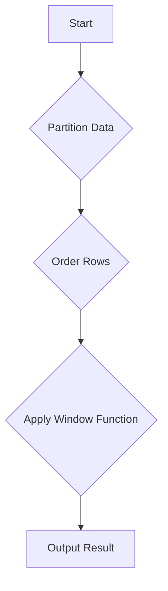

## 5.5 Windowing and Ranking Data

In the realm of SQL, window functions and ranking data techniques are powerful tools that allow developers to perform complex calculations across sets of rows related to the current row. These functions are essential for performing advanced data analysis and reporting tasks, enabling the calculation of running totals, moving averages, and rankings without the need for complex subqueries or temporary tables. In this section, we will delve into the intricacies of window functions, explore the `OVER` clause, and demonstrate practical applications of these techniques.

### Understanding Window Functions

Window functions operate over a set of rows defined by the `OVER` clause, which specifies the partitioning and ordering of data. Unlike aggregate functions, which return a single value for a group of rows, window functions return a value for each row in the result set. This makes them ideal for tasks that require row-by-row calculations while still considering the context of surrounding rows.

#### Key Concepts of Window Functions

1. **Partitioning**: Divides the result set into partitions to which the window function is applied. Each partition is processed independently.
2. **Ordering**: Determines the sequence of rows within each partition. This order is crucial for functions that rely on the position of rows, such as ranking functions.
3. **Window Frame**: Defines the subset of rows within the partition that the function should consider. This can be specified using `ROWS` or `RANGE` clauses.

### The OVER Clause: Defining Partitions and Orderings

The `OVER` clause is the cornerstone of window functions, allowing you to define how the data is partitioned and ordered. Let's break down its components:

- **Partition By**: This clause divides the result set into partitions. Each partition is processed separately by the window function.
- **Order By**: Specifies the order of rows within each partition. This order is essential for functions like `RANK()`, `ROW_NUMBER()`, and `LAG()`.

#### Example: Using the OVER Clause

```sql
SELECT 
    employee_id,
    department_id,
    salary,
    RANK() OVER (PARTITION BY department_id ORDER BY salary DESC) AS salary_rank
FROM 
    employees;
```

In this example, we rank employees within each department based on their salary. The `PARTITION BY department_id` clause creates separate partitions for each department, and the `ORDER BY salary DESC` clause orders employees by salary within each partition.

### Range and Row Frames: Specifying Window Frames for Calculations

Window frames define the subset of rows within a partition that the window function should consider. They can be specified using `ROWS` or `RANGE` clauses:

- **ROWS**: Defines a frame based on physical row positions.
- **RANGE**: Defines a frame based on logical relationships between values.

#### Example: Using ROWS and RANGE

```sql
SELECT 
    order_id,
    order_date,
    amount,
    SUM(amount) OVER (ORDER BY order_date ROWS BETWEEN 2 PRECEDING AND CURRENT ROW) AS moving_sum
FROM 
    orders;
```

In this example, we calculate a moving sum of order amounts over the current row and the two preceding rows. The `ROWS BETWEEN 2 PRECEDING AND CURRENT ROW` clause specifies the window frame.

### Practical Applications: Calculating Moving Averages, Percentiles

Window functions are incredibly versatile and can be applied to a wide range of practical scenarios. Let's explore some common applications:

#### Calculating Moving Averages

A moving average smooths out fluctuations in data by averaging values over a specified window of time or rows. This is particularly useful in financial analysis and forecasting.

```sql
SELECT 
    date,
    sales,
    AVG(sales) OVER (ORDER BY date ROWS BETWEEN 6 PRECEDING AND CURRENT ROW) AS moving_average
FROM 
    sales_data;
```

In this example, we calculate a 7-day moving average of sales, which helps identify trends over time.

#### Calculating Percentiles

Percentiles are used to understand the distribution of data. The `PERCENT_RANK()` function can be used to calculate the relative standing of a value within a partition.

```sql
SELECT 
    student_id,
    score,
    PERCENT_RANK() OVER (ORDER BY score DESC) AS percentile_rank
FROM 
    exam_results;
```

This query calculates the percentile rank of each student's score, providing insight into their performance relative to peers.

### Visualizing Window Functions

To better understand how window functions operate, let's visualize the process using a diagram.



**Diagram Description**: This flowchart illustrates the process of applying a window function. Data is first partitioned, then ordered, and finally, the window function is applied to produce the result.

### Try It Yourself

Experiment with the following code examples by modifying the window frames or partitioning criteria. Observe how changes affect the results:

1. Change the `ROWS` clause to `RANGE` and see how it impacts the moving average calculation.
2. Modify the `PARTITION BY` clause to group data differently and analyze the effect on ranking functions.

### References and Links

For further reading on window functions and their applications, consider the following resources:

- [Window Functions in SQL: A Practical Guide](https://www.sqlshack.com/window-functions-in-sql-a-practical-guide/)
- [SQL Window Functions Explained](https://mode.com/sql-tutorial/sql-window-functions/)
- [Advanced SQL: Window Functions](https://www.datacamp.com/community/tutorials/tutorial-sql-window-functions)

### Knowledge Check

To reinforce your understanding of window functions, consider the following questions:

- What is the difference between `ROWS` and `RANGE` in window frames?
- How does the `PARTITION BY` clause affect the result of a window function?
- In what scenarios would you use a moving average calculation?

### Embrace the Journey

Remember, mastering window functions is a journey. As you explore these techniques, you'll unlock new possibilities for data analysis and reporting. Keep experimenting, stay curious, and enjoy the process!

## Quiz Time!



### What is the primary purpose of the OVER clause in SQL window functions?

- [x] To define partitions and orderings for window functions
- [ ] To aggregate data across multiple tables
- [ ] To filter rows based on a condition
- [ ] To join tables in a query

> **Explanation:** The `OVER` clause is used to define how data is partitioned and ordered for window functions.

### Which clause is used to divide the result set into partitions in a window function?

- [x] PARTITION BY
- [ ] ORDER BY
- [ ] GROUP BY
- [ ] WHERE

> **Explanation:** The `PARTITION BY` clause divides the result set into partitions for window functions.

### What is the difference between ROWS and RANGE in window frames?

- [x] ROWS is based on physical row positions, while RANGE is based on logical relationships
- [ ] ROWS is used for ordering, while RANGE is used for partitioning
- [ ] ROWS is used for filtering, while RANGE is used for joining
- [ ] ROWS is used for aggregation, while RANGE is used for sorting

> **Explanation:** `ROWS` defines a frame based on physical row positions, while `RANGE` defines a frame based on logical relationships.

### Which function would you use to calculate a moving average in SQL?

- [x] AVG() with a window frame
- [ ] SUM() with a GROUP BY clause
- [ ] COUNT() with a HAVING clause
- [ ] MAX() with an ORDER BY clause

> **Explanation:** The `AVG()` function with a window frame is used to calculate a moving average.

### How does the ORDER BY clause affect window functions?

- [x] It determines the sequence of rows within each partition
- [ ] It filters rows based on a condition
- [ ] It aggregates data across multiple tables
- [ ] It joins tables in a query

> **Explanation:** The `ORDER BY` clause determines the sequence of rows within each partition for window functions.

### What is a practical application of window functions?

- [x] Calculating moving averages
- [ ] Filtering rows based on a condition
- [ ] Joining tables in a query
- [ ] Aggregating data across multiple tables

> **Explanation:** Window functions are used for tasks like calculating moving averages, which require row-by-row calculations.

### Which function calculates the relative standing of a value within a partition?

- [x] PERCENT_RANK()
- [ ] SUM()
- [ ] COUNT()
- [ ] MAX()

> **Explanation:** The `PERCENT_RANK()` function calculates the relative standing of a value within a partition.

### What is the purpose of the PARTITION BY clause in a window function?

- [x] To divide the result set into partitions
- [ ] To filter rows based on a condition
- [ ] To join tables in a query
- [ ] To aggregate data across multiple tables

> **Explanation:** The `PARTITION BY` clause divides the result set into partitions for window functions.

### True or False: Window functions return a single value for a group of rows.

- [ ] True
- [x] False

> **Explanation:** Window functions return a value for each row in the result set, not a single value for a group of rows.

### Which of the following is NOT a window function?

- [x] JOIN()
- [ ] RANK()
- [ ] ROW_NUMBER()
- [ ] LAG()

> **Explanation:** `JOIN()` is not a window function; it is used to combine rows from two or more tables.


