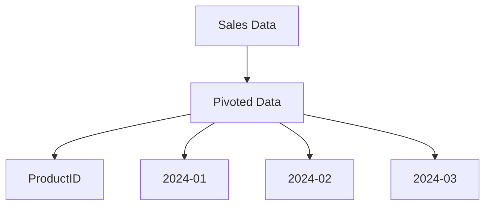
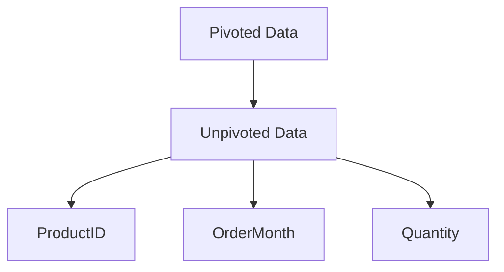

## 5.6 Pivoting and Unpivoting Data

In the realm of SQL, the ability to transform data is crucial for creating meaningful reports and analyses. Two powerful techniques for data transformation are **pivoting** and **unpivoting**. These techniques allow you to reshape your data, turning rows into columns and vice versa, to better suit your analytical needs. In this section, we will delve into the concepts of pivoting and unpivoting, explore their use cases, and provide practical examples to illustrate their implementation.

### Pivoting Data

**Pivoting** is the process of transforming row data into columns. This technique is particularly useful when you want to summarize data and present it in a more readable format. For instance, pivoting can be used to convert a list of sales transactions into a summary table that shows total sales per product for each month.

#### Purpose of Pivoting

- **Data Summarization**: Aggregate data to provide a concise summary.
- **Enhanced Readability**: Transform data into a format that is easier to interpret.
- **Report Generation**: Create structured reports that highlight key metrics.

#### Implementation of Pivoting

Pivoting can be implemented using SQL's **PIVOT** operator or **CASE** statements. The choice between these methods depends on the SQL dialect you are using and the complexity of your data transformation needs.

##### Using the PIVOT Operator

The **PIVOT** operator is a powerful tool available in some SQL dialects, such as SQL Server, that simplifies the process of transforming rows into columns.

```sql
-- Example of using PIVOT operator
SELECT *
FROM (
    SELECT ProductID, OrderDate, Quantity
    FROM Sales
) AS SourceTable
PIVOT (
    SUM(Quantity)
    FOR OrderDate IN ([2024-01], [2024-02], [2024-03])
) AS PivotTable;
```

**Explanation**:
- **SourceTable**: A subquery that selects the data to be pivoted.
- **PIVOT**: The operator that performs the transformation.
- **SUM(Quantity)**: The aggregation function applied to the data.
- **FOR OrderDate IN**: Specifies the column to pivot and the values to transform into columns.

##### Using CASE Statements

For SQL dialects that do not support the PIVOT operator, you can achieve similar results using **CASE** statements.

```sql
-- Example of using CASE statements for pivoting
SELECT
    ProductID,
    SUM(CASE WHEN OrderDate = '2024-01' THEN Quantity ELSE 0 END) AS Jan_2024,
    SUM(CASE WHEN OrderDate = '2024-02' THEN Quantity ELSE 0 END) AS Feb_2024,
    SUM(CASE WHEN OrderDate = '2024-03' THEN Quantity ELSE 0 END) AS Mar_2024
FROM Sales
GROUP BY ProductID;
```

**Explanation**:
- **CASE WHEN**: Evaluates each row and assigns values to new columns based on conditions.
- **SUM**: Aggregates the data for each new column.

### Unpivoting Data

**Unpivoting** is the reverse process of pivoting, where columns are transformed into rows. This technique is useful when you need to normalize data or prepare it for further analysis.

#### Purpose of Unpivoting

- **Data Normalization**: Convert wide tables into a long format for easier manipulation.
- **Data Preparation**: Prepare data for analytical processes that require a specific format.
- **Flexibility**: Enable dynamic data analysis by transforming static columns into rows.

#### Implementation of Unpivoting

Unpivoting can be implemented using SQL's **UNPIVOT** operator or by employing the **UNION ALL** approach.

##### Using the UNPIVOT Operator

The **UNPIVOT** operator is available in some SQL dialects, such as SQL Server, and provides a straightforward way to transform columns into rows.

```sql
-- Example of using UNPIVOT operator
SELECT ProductID, OrderMonth, Quantity
FROM (
    SELECT ProductID, [2024-01], [2024-02], [2024-03]
    FROM SalesSummary
) AS PivotTable
UNPIVOT (
    Quantity FOR OrderMonth IN ([2024-01], [2024-02], [2024-03])
) AS UnpivotTable;
```

**Explanation**:
- **PivotTable**: A subquery that selects the data to be unpivoted.
- **UNPIVOT**: The operator that performs the transformation.
- **Quantity FOR OrderMonth IN**: Specifies the columns to unpivot and the new row labels.

##### Using UNION ALL

For SQL dialects that do not support the UNPIVOT operator, you can achieve similar results using the **UNION ALL** approach.

```sql
-- Example of using UNION ALL for unpivoting
SELECT ProductID, '2024-01' AS OrderMonth, [2024-01] AS Quantity
FROM SalesSummary
UNION ALL
SELECT ProductID, '2024-02', [2024-02]
FROM SalesSummary
UNION ALL
SELECT ProductID, '2024-03', [2024-03]
FROM SalesSummary;
```

**Explanation**:
- **UNION ALL**: Combines multiple SELECT statements into a single result set.
- **AS**: Renames columns to match the desired output format.

### Use Cases for Pivoting and Unpivoting

Pivoting and unpivoting are essential techniques in various scenarios, including:

- **Creating Reports**: Transform data into a format suitable for reporting tools.
- **Data Transformation**: Reshape data for integration with other systems or applications.
- **Analytical Processing**: Prepare data for complex analyses, such as time series forecasting or trend analysis.

### Visualizing Pivoting and Unpivoting

To better understand the process of pivoting and unpivoting, let's visualize these transformations using a simple example.

#### Example Data

Consider a sales dataset with the following structure:

| ProductID | OrderDate | Quantity |
|-----------|-----------|----------|
| 1         | 2024-01   | 100      |
| 1         | 2024-02   | 150      |
| 2         | 2024-01   | 200      |
| 2         | 2024-03   | 250      |

#### Pivoting Visualization



**Description**: The pivoting process transforms the sales data into a format where each month becomes a separate column.

#### Unpivoting Visualization



**Description**: The unpivoting process converts the pivoted data back into a long format, with each month represented as a row.

### Try It Yourself

To deepen your understanding, try modifying the code examples provided. Experiment with different datasets, aggregation functions, and conditions to see how they affect the pivoting and unpivoting processes.

### References and Links

- [SQL Server PIVOT and UNPIVOT](https://docs.microsoft.com/en-us/sql/t-sql/queries/from-using-pivot-and-unpivot)
- [W3Schools SQL Tutorial](https://www.w3schools.com/sql/)
- [MDN Web Docs on SQL](https://developer.mozilla.org/en-US/docs/Web/SQL)

### Knowledge Check

To reinforce your learning, consider the following questions:

1. What is the primary purpose of pivoting data in SQL?
2. How does the PIVOT operator differ from using CASE statements?
3. What are some common use cases for unpivoting data?
4. How can the UNION ALL approach be used to unpivot data?
5. Why is data transformation important in SQL?

### Embrace the Journey

Remember, mastering pivoting and unpivoting is just one step in your SQL journey. As you continue to explore SQL design patterns, you'll unlock new ways to transform and analyze data. Keep experimenting, stay curious, and enjoy the journey!

## Quiz Time!



### What is the primary purpose of pivoting data in SQL?

- [x] Transforming row data into columns for better readability and summarization.
- [ ] Transforming column data into rows for normalization.
- [ ] Aggregating data without changing its structure.
- [ ] Filtering data based on specific conditions.

> **Explanation:** Pivoting is used to transform row data into columns, making it easier to summarize and read.

### Which SQL operator is specifically designed for pivoting data?

- [x] PIVOT
- [ ] UNPIVOT
- [ ] UNION ALL
- [ ] CASE

> **Explanation:** The PIVOT operator is specifically designed for transforming rows into columns in SQL.

### How can you achieve pivoting in SQL dialects that do not support the PIVOT operator?

- [x] Using CASE statements
- [ ] Using UNPIVOT operator
- [ ] Using UNION ALL
- [ ] Using JOINs

> **Explanation:** CASE statements can be used to manually transform rows into columns in SQL dialects that do not support the PIVOT operator.

### What is the primary purpose of unpivoting data in SQL?

- [x] Transforming columns into rows for normalization and flexibility.
- [ ] Transforming row data into columns for summarization.
- [ ] Aggregating data without changing its structure.
- [ ] Filtering data based on specific conditions.

> **Explanation:** Unpivoting is used to transform columns into rows, which is useful for normalization and preparing data for analysis.

### Which SQL operator is specifically designed for unpivoting data?

- [x] UNPIVOT
- [ ] PIVOT
- [ ] UNION ALL
- [ ] CASE

> **Explanation:** The UNPIVOT operator is specifically designed for transforming columns into rows in SQL.

### How can you achieve unpivoting in SQL dialects that do not support the UNPIVOT operator?

- [x] Using UNION ALL
- [ ] Using PIVOT operator
- [ ] Using CASE statements
- [ ] Using JOINs

> **Explanation:** UNION ALL can be used to manually transform columns into rows in SQL dialects that do not support the UNPIVOT operator.

### What is a common use case for pivoting data?

- [x] Creating structured reports that highlight key metrics.
- [ ] Normalizing data for easier manipulation.
- [ ] Preparing data for analytical processes.
- [ ] Filtering data based on specific conditions.

> **Explanation:** Pivoting is commonly used to create structured reports that highlight key metrics by transforming rows into columns.

### What is a common use case for unpivoting data?

- [x] Preparing data for analytical processes that require a specific format.
- [ ] Creating structured reports that highlight key metrics.
- [ ] Aggregating data without changing its structure.
- [ ] Filtering data based on specific conditions.

> **Explanation:** Unpivoting is commonly used to prepare data for analytical processes by transforming columns into rows.

### True or False: The PIVOT operator is available in all SQL dialects.

- [ ] True
- [x] False

> **Explanation:** The PIVOT operator is not available in all SQL dialects; some require alternative methods like CASE statements.

### True or False: The UNPIVOT operator can be used to transform rows into columns.

- [ ] True
- [x] False

> **Explanation:** The UNPIVOT operator is used to transform columns into rows, not the other way around.


