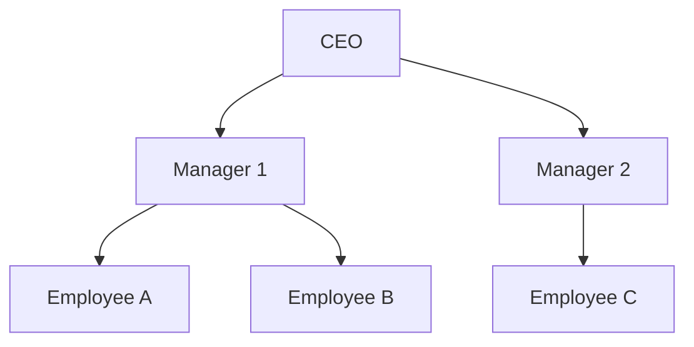

## 5.7 Recursive Queries and Hierarchical Retrieval

In the realm of SQL and database management, recursive queries and hierarchical retrieval are indispensable tools for managing and querying data that is inherently hierarchical. Whether you're dealing with organizational charts, category trees, or any other form of nested data, understanding how to effectively use recursive queries can significantly enhance your ability to work with complex data structures.

### Understanding Recursive Queries

Recursive queries in SQL are used to query hierarchical data structures. They allow you to retrieve data that is organized in a parent-child relationship, such as organizational charts or file systems. The most common way to implement recursive queries in SQL is through Common Table Expressions (CTEs).

#### Common Applications

- **Organizational Charts**: Displaying the hierarchy of employees within a company.
- **Category Trees**: Managing product categories and subcategories in e-commerce platforms.
- **File Systems**: Navigating directories and subdirectories.
- **Bill of Materials**: Representing components and subcomponents in manufacturing.

### Recursive CTE Structure

A recursive CTE is composed of two main parts: the anchor member and the recursive member. Let's break down these components:

#### Anchor Member

The anchor member is the base case of the recursion. It defines the starting point of the recursive query. For example, in an organizational chart, the anchor member might be the top-level manager or CEO.

#### Recursive Member

The recursive member is the part of the query that references the CTE itself. It defines how to move from one level of the hierarchy to the next. This member is executed repeatedly until no more rows are returned.

#### Termination

To prevent infinite loops, recursive queries must have a termination condition. This is typically achieved by ensuring that the recursive member eventually returns no more rows.

### Implementing Recursive Queries

Let's explore how to implement recursive queries using a practical example. We'll use an organizational chart to illustrate the process.

#### Example: Organizational Chart

Consider the following table structure for an organizational chart:

```sql
CREATE TABLE Employees (
    EmployeeID INT PRIMARY KEY,
    EmployeeName VARCHAR(100),
    ManagerID INT
);
```

This table contains employee records, where each employee has an `EmployeeID`, a `EmployeeName`, and a `ManagerID` that references the `EmployeeID` of their manager.

#### Recursive CTE Example

To retrieve the hierarchy of employees starting from a specific manager, we can use a recursive CTE:

```sql
WITH RECURSIVE EmployeeHierarchy AS (
    -- Anchor member: Select the top-level manager
    SELECT EmployeeID, EmployeeName, ManagerID, 1 AS Level
    FROM Employees
    WHERE ManagerID IS NULL

    UNION ALL

    -- Recursive member: Select employees reporting to the current level
    SELECT e.EmployeeID, e.EmployeeName, e.ManagerID, eh.Level + 1
    FROM Employees e
    INNER JOIN EmployeeHierarchy eh ON e.ManagerID = eh.EmployeeID
)
SELECT EmployeeID, EmployeeName, Level
FROM EmployeeHierarchy;
```

In this example, the anchor member selects the top-level manager (where `ManagerID` is `NULL`). The recursive member joins the `Employees` table with the `EmployeeHierarchy` CTE to find employees reporting to the current level.

### Visualizing Hierarchical Data

To better understand the flow of recursive queries, let's visualize the hierarchical structure using a diagram.



This diagram represents an organizational chart where the CEO is at the top, followed by managers and employees.

### Best Practices for Recursive Queries

When working with recursive queries, consider the following best practices:

- **Limit Recursion Depth**: Use a depth limit to prevent excessive recursion and potential performance issues.
- **Optimize Base and Recursive Members**: Ensure that both the anchor and recursive members are optimized for performance.
- **Use Indexes**: Index the columns involved in the recursive join to improve query performance.
- **Test for Infinite Loops**: Carefully design your queries to avoid infinite loops, which can occur if the termination condition is not met.

### Advanced Recursive Query Techniques

Beyond basic hierarchical retrieval, recursive queries can be used for more advanced data manipulation tasks:

#### Calculating Aggregates

You can use recursive queries to calculate aggregates over hierarchical data. For example, calculating the total salary of all employees under a specific manager:

```sql
WITH RECURSIVE EmployeeSalaries AS (
    SELECT EmployeeID, Salary
    FROM Employees
    WHERE ManagerID IS NULL

    UNION ALL

    SELECT e.EmployeeID, e.Salary + es.Salary
    FROM Employees e
    INNER JOIN EmployeeSalaries es ON e.ManagerID = es.EmployeeID
)
SELECT SUM(Salary) AS TotalSalary
FROM EmployeeSalaries;
```

#### Path Enumeration

Path enumeration involves generating a path from the root to each node in the hierarchy. This can be useful for displaying breadcrumb navigation or understanding the lineage of a node.

```sql
WITH RECURSIVE PathEnumeration AS (
    SELECT EmployeeID, EmployeeName, CAST(EmployeeName AS VARCHAR(1000)) AS Path
    FROM Employees
    WHERE ManagerID IS NULL

    UNION ALL

    SELECT e.EmployeeID, e.EmployeeName, CONCAT(pe.Path, ' > ', e.EmployeeName)
    FROM Employees e
    INNER JOIN PathEnumeration pe ON e.ManagerID = pe.EmployeeID
)
SELECT EmployeeID, Path
FROM PathEnumeration;
```

### Try It Yourself

Experiment with the provided examples by modifying the `Employees` table data or changing the starting point of the hierarchy. Try adding new levels or calculating different aggregates to see how recursive queries adapt to changes.

### References and Further Reading

- [SQL Recursive Queries](https://www.sqlservertutorial.net/sql-server-basics/sql-server-recursive-cte/)
- [Common Table Expressions (CTEs)](https://www.w3schools.com/sql/sql_cte.asp)

### Knowledge Check

To reinforce your understanding of recursive queries and hierarchical retrieval, consider the following questions and exercises:

- What is the purpose of the anchor member in a recursive CTE?
- How can you prevent infinite loops in recursive queries?
- Modify the recursive query example to include an additional level of hierarchy.
- Calculate the total number of employees under a specific manager using a recursive query.

### Embrace the Journey

Remember, mastering recursive queries is a journey. As you continue to explore and experiment with these concepts, you'll gain a deeper understanding of how to effectively manage and query hierarchical data. Keep pushing the boundaries of what's possible with SQL, and enjoy the process of discovery and learning!

## Quiz Time!



### What is the purpose of the anchor member in a recursive CTE?

- [x] It defines the starting point of the recursive query.
- [ ] It terminates the recursion.
- [ ] It calculates aggregates.
- [ ] It optimizes query performance.

> **Explanation:** The anchor member defines the starting point of the recursive query, establishing the base case for recursion.

### How can you prevent infinite loops in recursive queries?

- [x] By ensuring the recursive member eventually returns no more rows.
- [ ] By using only anchor members.
- [ ] By avoiding joins in the recursive member.
- [ ] By indexing all columns.

> **Explanation:** To prevent infinite loops, the recursive member must be designed to eventually return no more rows, ensuring a termination condition is met.

### Which SQL clause is used to define a recursive CTE?

- [x] WITH RECURSIVE
- [ ] SELECT RECURSIVE
- [ ] RECURSIVE CTE
- [ ] CTE RECURSIVE

> **Explanation:** The `WITH RECURSIVE` clause is used to define a recursive CTE in SQL.

### What is a common application of recursive queries?

- [x] Organizational charts
- [ ] Flat file storage
- [ ] Data encryption
- [ ] Indexing strategies

> **Explanation:** Recursive queries are commonly used to manage and query hierarchical data structures, such as organizational charts.

### What is the role of the recursive member in a recursive CTE?

- [x] It references the CTE itself to move from one level of the hierarchy to the next.
- [ ] It terminates the recursion.
- [ ] It optimizes query performance.
- [ ] It defines the starting point of the query.

> **Explanation:** The recursive member references the CTE itself and is responsible for moving from one level of the hierarchy to the next.

### How can you optimize recursive queries?

- [x] By indexing the columns involved in the recursive join.
- [ ] By avoiding the use of CTEs.
- [ ] By using only anchor members.
- [ ] By limiting the number of columns selected.

> **Explanation:** Indexing the columns involved in the recursive join can significantly improve the performance of recursive queries.

### What is path enumeration in the context of recursive queries?

- [x] Generating a path from the root to each node in the hierarchy.
- [ ] Calculating aggregates over hierarchical data.
- [ ] Optimizing query performance.
- [ ] Terminating recursion.

> **Explanation:** Path enumeration involves generating a path from the root to each node in the hierarchy, useful for breadcrumb navigation or lineage understanding.

### Which of the following is a best practice for recursive queries?

- [x] Limit recursion depth to prevent excessive recursion.
- [ ] Use only anchor members.
- [ ] Avoid using indexes.
- [ ] Use SELECT * for all queries.

> **Explanation:** Limiting recursion depth is a best practice to prevent excessive recursion and potential performance issues.

### What is a termination condition in recursive queries?

- [x] A condition that ensures the recursion ends.
- [ ] A condition that starts the recursion.
- [ ] A condition that optimizes query performance.
- [ ] A condition that calculates aggregates.

> **Explanation:** A termination condition ensures that the recursion ends, preventing infinite loops.

### Recursive queries are only applicable to organizational charts.

- [ ] True
- [x] False

> **Explanation:** Recursive queries are applicable to various hierarchical data structures, not just organizational charts.


