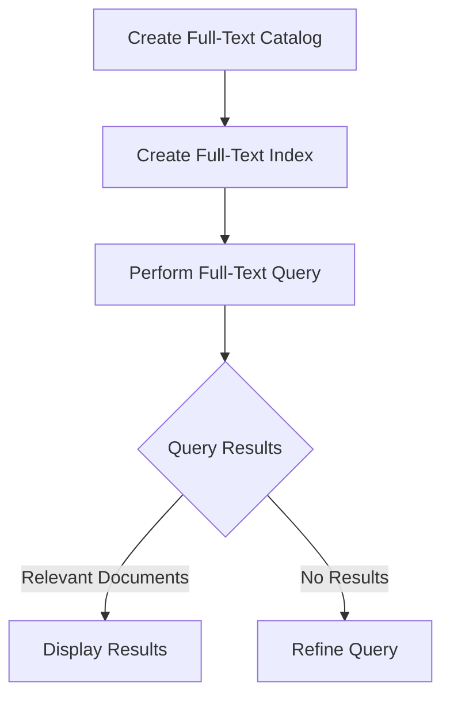

## 5.8 Implementing Full-Text Search

In today's data-driven world, the ability to efficiently search and retrieve text data is paramount. Full-text search (FTS) is a powerful feature in SQL databases that allows for complex querying of text data, enabling users to find relevant information quickly and accurately. This section will guide you through the implementation of full-text search, covering indexing, querying, advanced features, and performance considerations.

### Indexing Text Data

**Full-Text Indexes** are specialized indexes that enable efficient searching of text data stored in a database. Unlike traditional indexes, which are optimized for exact matches, full-text indexes are designed to handle complex queries involving phrases, proximity, and linguistic variations.

#### Creating Full-Text Indexes

To implement full-text search, the first step is to create full-text indexes on the columns you wish to search. This process involves defining the columns and specifying the type of data they contain. Here's a basic example of creating a full-text index in SQL Server:

```sql
-- Create a full-text catalog
CREATE FULLTEXT CATALOG ftCatalog AS DEFAULT;

-- Create a full-text index on the 'content' column of the 'documents' table
CREATE FULLTEXT INDEX ON documents(content)
   KEY INDEX PK_documents
   WITH STOPLIST = SYSTEM;
```

In this example, we first create a full-text catalog, which is a logical container for full-text indexes. We then create a full-text index on the `content` column of the `documents` table, using the primary key index `PK_documents` as the unique key for the full-text index.

#### Considerations for Indexing

- **Data Type**: Ensure that the columns you index are of a text-compatible data type, such as `VARCHAR`, `TEXT`, or `NVARCHAR`.
- **Stopwords**: Full-text indexes often use stoplists to exclude common words (e.g., "the", "and") from indexing. You can customize the stoplist to suit your needs.
- **Language Support**: Specify the language for the indexed data to enable language-specific features like stemming and thesaurus support.

### Querying with Full-Text Search

Once your full-text indexes are in place, you can begin querying your text data using specialized full-text search functions. These functions allow for complex queries that go beyond simple keyword searches.

#### Using CONTAINS and FREETEXT

Two common functions for full-text search in SQL are `CONTAINS` and `FREETEXT`. Each serves a different purpose:

- **CONTAINS**: Use this function to search for specific words or phrases, with support for logical operators and wildcard characters.
  
  ```sql
  SELECT * FROM documents
  WHERE CONTAINS(content, 'SQL AND "full-text search"');
  ```

  In this query, we're searching for documents that contain both the word "SQL" and the phrase "full-text search".

- **FREETEXT**: This function is used for natural language queries, allowing for more flexible searches without the need for precise syntax.

  ```sql
  SELECT * FROM documents
  WHERE FREETEXT(content, 'find documents about SQL full-text search');
  ```

  Here, the query attempts to find documents relevant to the given phrase, interpreting it in a natural language context.

### Advanced Features of Full-Text Search

Full-text search offers several advanced features that enhance its capabilities, making it a powerful tool for text retrieval.

#### Stemming

Stemming allows full-text search to match words with the same root, enabling more flexible queries. For example, a search for "running" might also return results for "run" and "runs". This feature is language-dependent and requires specifying the appropriate language during index creation.

#### Thesaurus Support

Thesaurus support enables synonym searching, allowing queries to match words with similar meanings. This feature requires configuring a thesaurus file with the desired synonyms.

#### Proximity Searches

Proximity searches allow you to find words that are near each other in the text. This is useful for finding phrases or related terms that appear close together.

```sql
SELECT * FROM documents
WHERE CONTAINS(content, 'NEAR((SQL, "full-text"), 5)');
```

In this example, we're searching for documents where the word "SQL" appears within five words of the phrase "full-text".

### Performance Considerations

Implementing full-text search can significantly impact database performance, both positively and negatively. It's crucial to balance index maintenance with query speed to achieve optimal performance.

#### Index Maintenance

Full-text indexes require regular maintenance to ensure they remain efficient. This includes updating the indexes when the underlying data changes and periodically reorganizing or rebuilding them to optimize performance.

#### Query Optimization

- **Use Appropriate Functions**: Choose between `CONTAINS` and `FREETEXT` based on the query requirements. `CONTAINS` is more precise, while `FREETEXT` is more flexible.
- **Limit Search Scope**: Narrow down the search scope by combining full-text search with other query conditions, such as date ranges or specific categories.
- **Monitor Query Performance**: Use database performance monitoring tools to identify slow queries and optimize them accordingly.

### Visualizing Full-Text Search

To better understand the process of full-text search, let's visualize the workflow using a Mermaid.js diagram:



**Diagram Description**: This flowchart illustrates the process of implementing full-text search, starting with the creation of a full-text catalog and index, followed by querying and displaying results.

### Try It Yourself

Experiment with the following code examples to deepen your understanding of full-text search:

1. **Modify the Stoplist**: Customize the stoplist to exclude or include specific words and observe how it affects query results.
2. **Implement Thesaurus Support**: Configure a thesaurus file with synonyms and test queries to see how synonym matching works.
3. **Test Proximity Searches**: Experiment with different proximity values in `NEAR` queries to understand their impact on search results.

### References and Links

- [Microsoft Docs: Full-Text Search](https://docs.microsoft.com/en-us/sql/relational-databases/search/full-text-search)
- [PostgreSQL Documentation: Full Text Search](https://www.postgresql.org/docs/current/textsearch.html)
- [MySQL Full-Text Search Functions](https://dev.mysql.com/doc/refman/8.0/en/fulltext-search.html)

### Knowledge Check

- Explain the difference between `CONTAINS` and `FREETEXT` functions.
- Describe how stemming and thesaurus support enhance full-text search capabilities.
- Discuss the importance of index maintenance in full-text search performance.

### Embrace the Journey

Remember, mastering full-text search is a journey. As you explore its features and capabilities, you'll unlock new ways to retrieve and analyze text data. Keep experimenting, stay curious, and enjoy the process!

## Quiz Time!



### What is the primary purpose of a full-text index?

- [x] To enable efficient searching of text data
- [ ] To store large binary objects
- [ ] To improve numerical calculations
- [ ] To manage database transactions

> **Explanation:** Full-text indexes are designed to optimize the search and retrieval of text data, allowing for complex queries and efficient performance.

### Which function would you use for a natural language query in SQL?

- [ ] CONTAINS
- [x] FREETEXT
- [ ] LIKE
- [ ] MATCH

> **Explanation:** The `FREETEXT` function is used for natural language queries, allowing for flexible searches without precise syntax.

### What feature allows full-text search to match words with the same root?

- [ ] Proximity search
- [ ] Thesaurus support
- [x] Stemming
- [ ] Stoplist

> **Explanation:** Stemming enables full-text search to match words with the same root, enhancing query flexibility.

### How can you perform a proximity search in SQL?

- [x] Using the NEAR operator
- [ ] Using the LIKE operator
- [ ] Using the MATCH operator
- [ ] Using the BETWEEN operator

> **Explanation:** The `NEAR` operator is used in full-text search to find words that are near each other in the text.

### What is a stoplist in full-text search?

- [x] A list of common words excluded from indexing
- [ ] A list of synonyms for search terms
- [ ] A list of tables to be indexed
- [ ] A list of queries to be optimized

> **Explanation:** A stoplist is a list of common words that are excluded from full-text indexing to improve search efficiency.

### Which of the following is an advanced feature of full-text search?

- [x] Thesaurus support
- [ ] Data encryption
- [ ] Transaction logging
- [ ] Schema migration

> **Explanation:** Thesaurus support is an advanced feature that allows for synonym searching in full-text search.

### What is the role of a full-text catalog?

- [x] To serve as a logical container for full-text indexes
- [ ] To store database backups
- [ ] To manage user permissions
- [ ] To optimize query execution plans

> **Explanation:** A full-text catalog is a logical container that organizes and manages full-text indexes within a database.

### How can you optimize full-text search queries?

- [x] By limiting the search scope with additional query conditions
- [ ] By increasing the database size
- [ ] By using only the LIKE operator
- [ ] By disabling indexing

> **Explanation:** Limiting the search scope with additional query conditions can help optimize full-text search queries by reducing the amount of data to be searched.

### What is the benefit of using a thesaurus in full-text search?

- [x] It allows for synonym matching in queries
- [ ] It reduces database size
- [ ] It speeds up index creation
- [ ] It enhances data encryption

> **Explanation:** A thesaurus allows for synonym matching, enabling queries to find words with similar meanings.

### True or False: Full-text search can only be used with VARCHAR data types.

- [ ] True
- [x] False

> **Explanation:** Full-text search can be used with various text-compatible data types, including `VARCHAR`, `TEXT`, and `NVARCHAR`.


