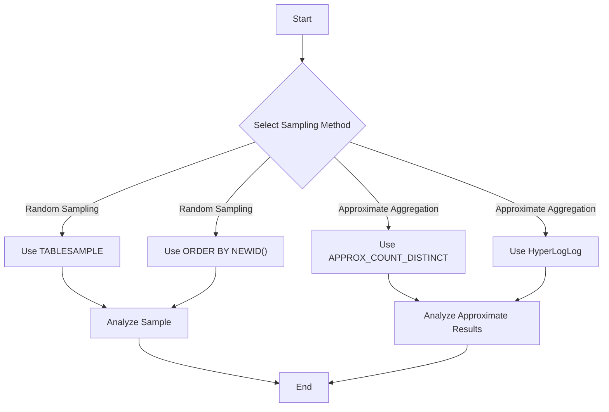

## 5.9 Data Sampling and Approximation

In the realm of SQL and database management, data sampling and approximation are powerful techniques that allow us to work with large datasets efficiently. These methods are particularly useful when dealing with big data, where processing the entire dataset might be computationally expensive or time-consuming. In this section, we will explore various data sampling techniques, including random sampling, and delve into approximate aggregations, which provide faster results with acceptable error margins.

### Introduction to Data Sampling

Data sampling is the process of selecting a subset of data from a larger dataset. This subset, or sample, is used to make inferences about the entire dataset. Sampling is a fundamental concept in statistics and is widely used in data analysis, machine learning, and database management.

**Key Concepts:**

- **Population**: The entire dataset from which a sample is drawn.
- **Sample**: A subset of the population used for analysis.
- **Sampling Frame**: A list or representation of all elements in the population.
- **Sampling Method**: The technique used to select a sample from the population.

### Random Sampling Techniques

Random sampling is a method where each element in the population has an equal chance of being selected. This technique is crucial for ensuring that the sample is representative of the population, reducing bias in the analysis.

#### 1. TABLESAMPLE

The `TABLESAMPLE` clause in SQL is used to retrieve a random sample of rows from a table. It is supported by several SQL databases, including SQL Server and PostgreSQL.

**Syntax:**

```sql
SELECT * FROM table_name TABLESAMPLE (percentage PERCENT);
```

**Example:**

Suppose we have a table named `customers` with thousands of records. We want to randomly sample 10% of the records for analysis.

```sql
SELECT * FROM customers TABLESAMPLE (10 PERCENT);
```

**Key Points:**

- `TABLESAMPLE` is efficient for large datasets as it retrieves a subset without scanning the entire table.
- The percentage specified determines the approximate size of the sample.
- The randomness of the sample depends on the underlying database engine's implementation.

#### 2. ORDER BY NEWID()

Another method for random sampling is using the `ORDER BY NEWID()` technique, which is commonly used in SQL Server.

**Example:**

```sql
SELECT TOP 100 * FROM customers ORDER BY NEWID();
```

**Explanation:**

- `NEWID()` generates a unique identifier for each row, effectively randomizing the order.
- `TOP 100` retrieves the first 100 rows from the randomized result set.

**Considerations:**

- This method can be resource-intensive for large datasets as it requires sorting the entire table.
- It is more suitable for smaller datasets or when precise control over the sample size is needed.

### Applications of Random Sampling

Random sampling is widely used in various applications, including:

- **Statistical Analysis**: To estimate population parameters, such as mean or variance.
- **Testing and Validation**: To create test datasets that are representative of the production environment.
- **Machine Learning**: To split data into training and testing sets.

### Approximate Aggregations

Approximate aggregations are techniques used to compute aggregate functions quickly, with a trade-off in accuracy. These methods are beneficial when exact results are not necessary, and speed is a priority.

#### Purpose of Approximate Aggregations

- **Faster Results**: Approximate aggregations provide quicker insights, especially useful in exploratory data analysis.
- **Scalability**: They are well-suited for large datasets where exact computations are impractical.

#### Techniques for Approximate Aggregations

1. **Approximate Count Distinct**

Some databases, like Google BigQuery, offer functions like `APPROX_COUNT_DISTINCT` to estimate the number of distinct values in a column.

**Example:**

```sql
SELECT APPROX_COUNT_DISTINCT(customer_id) FROM orders;
```

**Explanation:**

- This function provides an approximate count of distinct `customer_id` values.
- It is faster than the exact `COUNT(DISTINCT customer_id)` function.

2. **HyperLogLog**

HyperLogLog is a probabilistic data structure used for approximate cardinality estimation. It is implemented in databases like PostgreSQL through extensions.

**Example:**

```sql
SELECT hll_cardinality(hll_add_agg(hll_hash_integer(customer_id))) FROM orders;
```

**Explanation:**

- `hll_cardinality` estimates the number of distinct `customer_id` values.
- This method is memory-efficient and provides a good balance between speed and accuracy.

### Limitations of Approximate Aggregations

- **Accuracy**: Approximate aggregations introduce some level of error, which may not be acceptable in all scenarios.
- **Use Cases**: They are not suitable when exact counts are required, such as in financial reporting or compliance.

### Visualizing Data Sampling and Approximation

To better understand the concepts of data sampling and approximation, let's visualize the process using a flowchart.



**Diagram Explanation:**

- The flowchart illustrates the decision-making process for selecting a sampling method or approximate aggregation technique.
- It highlights the steps involved in analyzing the sample or approximate results.

### Try It Yourself

Experiment with the following SQL queries to gain hands-on experience with data sampling and approximation techniques:

1. Modify the `TABLESAMPLE` percentage to see how it affects the sample size.
2. Use `ORDER BY NEWID()` with different `TOP` values to control the sample size.
3. Compare the results of `COUNT(DISTINCT column)` and `APPROX_COUNT_DISTINCT(column)` to observe the difference in speed and accuracy.

### References and Further Reading

- [SQL Server TABLESAMPLE](https://docs.microsoft.com/en-us/sql/t-sql/queries/select-transact-sql?view=sql-server-ver15#tablesample)
- [PostgreSQL HyperLogLog Extension](https://www.postgresql.org/docs/current/hyperloglog.html)
- [Google BigQuery APPROX_COUNT_DISTINCT](https://cloud.google.com/bigquery/docs/reference/standard-sql/approximate-aggregate-functions)

### Knowledge Check

Before we wrap up, let's reinforce our understanding with a few questions:

- What are the advantages of using `TABLESAMPLE` over `ORDER BY NEWID()`?
- In what scenarios would approximate aggregations be preferred over exact calculations?
- How does HyperLogLog achieve memory efficiency in cardinality estimation?

### Embrace the Journey

Remember, mastering data sampling and approximation techniques is just the beginning. As you continue to explore SQL and database management, you'll discover more advanced methods to optimize performance and scalability. Keep experimenting, stay curious, and enjoy the journey!

## Quiz Time!



### What is the primary purpose of data sampling in SQL?

- [x] To select a subset of data for analysis
- [ ] To increase the size of the dataset
- [ ] To delete unnecessary data
- [ ] To ensure data integrity

> **Explanation:** Data sampling is used to select a subset of data from a larger dataset for analysis, making it easier to work with large datasets.

### Which SQL clause is used for random sampling of rows?

- [x] TABLESAMPLE
- [ ] GROUP BY
- [ ] ORDER BY
- [ ] WHERE

> **Explanation:** The `TABLESAMPLE` clause is used to retrieve a random sample of rows from a table.

### What is the function of `ORDER BY NEWID()` in SQL?

- [x] To randomize the order of rows
- [ ] To sort rows in ascending order
- [ ] To filter rows based on a condition
- [ ] To group rows by a column

> **Explanation:** `ORDER BY NEWID()` generates a unique identifier for each row, effectively randomizing the order of rows.

### Approximate aggregations are most useful when:

- [x] Speed is prioritized over accuracy
- [ ] Exact results are required
- [ ] Data integrity is a concern
- [ ] Data needs to be deleted

> **Explanation:** Approximate aggregations provide faster results with acceptable error margins, making them useful when speed is prioritized over accuracy.

### Which function provides an approximate count of distinct values in Google BigQuery?

- [x] APPROX_COUNT_DISTINCT
- [ ] COUNT
- [ ] SUM
- [ ] AVG

> **Explanation:** `APPROX_COUNT_DISTINCT` is a function in Google BigQuery that provides an approximate count of distinct values.

### What is a key advantage of using HyperLogLog for cardinality estimation?

- [x] Memory efficiency
- [ ] Exact accuracy
- [ ] Simplicity
- [ ] High computational cost

> **Explanation:** HyperLogLog is a probabilistic data structure that is memory-efficient, making it suitable for cardinality estimation.

### In which scenario would `ORDER BY NEWID()` be less efficient?

- [x] Large datasets
- [ ] Small datasets
- [ ] When exact order is needed
- [ ] When filtering data

> **Explanation:** `ORDER BY NEWID()` can be resource-intensive for large datasets as it requires sorting the entire table.

### What is the main limitation of approximate aggregations?

- [x] They introduce some level of error
- [ ] They are slower than exact calculations
- [ ] They require more memory
- [ ] They cannot be used with large datasets

> **Explanation:** Approximate aggregations introduce some level of error, which may not be acceptable in all scenarios.

### Which of the following is a random sampling technique in SQL?

- [x] TABLESAMPLE
- [ ] GROUP BY
- [ ] JOIN
- [ ] HAVING

> **Explanation:** `TABLESAMPLE` is a random sampling technique used in SQL to retrieve a subset of rows from a table.

### True or False: Approximate aggregations are suitable for financial reporting.

- [ ] True
- [x] False

> **Explanation:** Approximate aggregations are not suitable for financial reporting as they introduce some level of error, which may not be acceptable in such scenarios.




