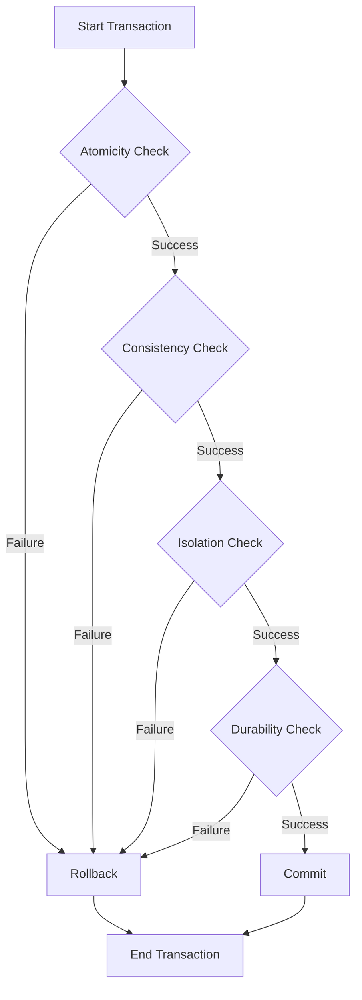

## 6.1 Understanding ACID Properties

In the realm of relational databases, ensuring data integrity and reliability is paramount. This is where the ACID properties come into play. ACID, an acronym for Atomicity, Consistency, Isolation, and Durability, forms the cornerstone of reliable transaction processing in SQL databases. These properties ensure that database transactions are processed reliably, even in the face of errors, power failures, or other unexpected events. Let's delve into each of these properties to understand their significance and implementation.

### Atomicity

**Atomicity** ensures that a series of operations within a transaction are treated as a single unit. This means that either all operations are completed successfully, or none are. If any part of the transaction fails, the entire transaction is aborted, and the database is left unchanged. This all-or-nothing approach is crucial for maintaining data integrity.

#### Key Concepts of Atomicity

- **Transaction as a Unit**: A transaction is a sequence of operations performed as a single logical unit of work. If any operation within the transaction fails, the entire transaction fails.
- **Rollback Mechanism**: In case of failure, the database system must have a mechanism to roll back the transaction, undoing any changes made during the transaction.

#### Code Example: Atomicity in SQL

```sql
BEGIN TRANSACTION;

-- Deduct amount from sender's account
UPDATE accounts SET balance = balance - 100 WHERE account_id = 1;

-- Add amount to receiver's account
UPDATE accounts SET balance = balance + 100 WHERE account_id = 2;

-- Commit the transaction if both operations succeed
COMMIT;

-- Rollback the transaction if any operation fails
ROLLBACK;
```

In this example, transferring money between two accounts involves two operations. If either operation fails, the transaction is rolled back, ensuring atomicity.

### Consistency

**Consistency** ensures that a transaction brings the database from one valid state to another. This means that any data written to the database must be valid according to all defined rules, including constraints, cascades, triggers, and any combination thereof.

#### Key Concepts of Consistency

- **Integrity Constraints**: These are rules that ensure data validity. Examples include primary keys, foreign keys, and unique constraints.
- **State Transition**: A transaction must transition the database from one consistent state to another, adhering to all integrity constraints.

#### Code Example: Consistency in SQL

```sql
BEGIN TRANSACTION;

-- Ensure the balance does not go negative
UPDATE accounts SET balance = balance - 100 WHERE account_id = 1 AND balance >= 100;

-- Check if the update was successful
IF @@ROWCOUNT = 0
BEGIN
    -- Rollback if the balance was insufficient
    ROLLBACK;
    THROW 50000, 'Insufficient balance', 1;
END

-- Commit the transaction if the update was successful
COMMIT;
```

In this example, the transaction ensures that the account balance does not go negative, maintaining consistency.

### Isolation

**Isolation** ensures that transactions are executed in isolation from one another. This means that the intermediate state of a transaction is invisible to other transactions. Isolation prevents concurrent transactions from interfering with each other, ensuring data integrity.

#### Key Concepts of Isolation

- **Isolation Levels**: SQL databases provide various isolation levels, such as Read Uncommitted, Read Committed, Repeatable Read, and Serializable, each offering different levels of isolation.
- **Concurrency Control**: Mechanisms like locking and multiversion concurrency control (MVCC) are used to manage concurrent transactions.

#### Code Example: Isolation Levels in SQL

```sql
-- Set the isolation level to Serializable
SET TRANSACTION ISOLATION LEVEL SERIALIZABLE;

BEGIN TRANSACTION;

-- Perform a read operation
SELECT balance FROM accounts WHERE account_id = 1;

-- Perform a write operation
UPDATE accounts SET balance = balance - 100 WHERE account_id = 1;

COMMIT;
```

Setting the isolation level to Serializable ensures the highest level of isolation, preventing other transactions from accessing the data until the transaction is complete.

### Durability

**Durability** ensures that once a transaction is committed, it remains so, even in the event of a system failure. This means that the results of a committed transaction are permanently recorded in the database.

#### Key Concepts of Durability

- **Commit Log**: The database system writes the transaction's changes to a log before committing, ensuring that changes can be recovered in case of a failure.
- **Recovery Mechanisms**: In the event of a crash, the database system uses the log to recover committed transactions.

#### Code Example: Durability in SQL

```sql
BEGIN TRANSACTION;

-- Perform operations
UPDATE accounts SET balance = balance - 100 WHERE account_id = 1;
UPDATE accounts SET balance = balance + 100 WHERE account_id = 2;

-- Commit the transaction
COMMIT;
```

Once the transaction is committed, the changes are durable and will persist even if the system crashes immediately after the commit.

### Importance of ACID Properties

The ACID properties are foundational for reliable transaction processing in relational databases. They ensure that transactions are processed reliably, maintaining data integrity and consistency. Without ACID properties, databases would be prone to errors, data corruption, and inconsistencies, especially in environments with high concurrency.

### Visualizing ACID Properties

To better understand the interaction of ACID properties, let's visualize the process using a flowchart.



**Diagram Description**: This flowchart illustrates the sequence of checks a transaction undergoes to ensure ACID compliance. Each property is checked in sequence, and any failure results in a rollback.

### Try It Yourself

Experiment with the code examples provided. Try modifying the isolation levels and observe how it affects concurrent transactions. Implement additional constraints to test consistency. This hands-on approach will deepen your understanding of ACID properties.

### References and Further Reading

- [ACID Properties on Wikipedia](https://en.wikipedia.org/wiki/ACID)
- [SQL Transaction Management on W3Schools](https://www.w3schools.com/sql/sql_transactions.asp)
- [Database Systems: The Complete Book](https://www.amazon.com/Database-Systems-Complete-Hector-Garcia-Molina/dp/0131873253)

### Knowledge Check

Let's reinforce what we've learned with some questions and exercises.

## Quiz Time!



### What does the 'A' in ACID stand for?

- [x] Atomicity
- [ ] Availability
- [ ] Accessibility
- [ ] Accuracy

> **Explanation:** 'A' in ACID stands for Atomicity, which ensures that all operations within a transaction are completed successfully or none are.

### Which ACID property ensures that a transaction brings the database from one valid state to another?

- [ ] Atomicity
- [x] Consistency
- [ ] Isolation
- [ ] Durability

> **Explanation:** Consistency ensures that a transaction brings the database from one valid state to another, maintaining all integrity constraints.

### What is the highest level of isolation in SQL?

- [ ] Read Uncommitted
- [ ] Read Committed
- [ ] Repeatable Read
- [x] Serializable

> **Explanation:** Serializable is the highest level of isolation, ensuring complete isolation from other transactions.

### Which ACID property ensures that once a transaction is committed, it remains so even in the event of a system failure?

- [ ] Atomicity
- [ ] Consistency
- [ ] Isolation
- [x] Durability

> **Explanation:** Durability ensures that once a transaction is committed, it remains so, even in the event of a system failure.

### What mechanism is used to roll back a transaction in case of failure?

- [x] Rollback
- [ ] Commit
- [ ] Savepoint
- [ ] Checkpoint

> **Explanation:** Rollback is used to undo changes made during a transaction in case of failure.

### Which isolation level allows a transaction to see uncommitted changes made by other transactions?

- [x] Read Uncommitted
- [ ] Read Committed
- [ ] Repeatable Read
- [ ] Serializable

> **Explanation:** Read Uncommitted allows a transaction to see uncommitted changes made by other transactions.

### What is the purpose of a commit log in ensuring durability?

- [x] To record changes before committing
- [ ] To undo changes
- [ ] To isolate transactions
- [ ] To enforce constraints

> **Explanation:** A commit log records changes before committing, ensuring that changes can be recovered in case of a failure.

### Which SQL command is used to start a transaction?

- [x] BEGIN TRANSACTION
- [ ] START TRANSACTION
- [ ] INITIATE TRANSACTION
- [ ] OPEN TRANSACTION

> **Explanation:** BEGIN TRANSACTION is used to start a transaction in SQL.

### True or False: ACID properties are only relevant in SQL databases.

- [ ] True
- [x] False

> **Explanation:** False. ACID properties are relevant in any database system that supports transactions, not just SQL databases.

### What is the main benefit of using ACID properties in transaction processing?

- [x] Ensuring data integrity and reliability
- [ ] Improving query performance
- [ ] Reducing storage costs
- [ ] Simplifying database design

> **Explanation:** The main benefit of using ACID properties is ensuring data integrity and reliability in transaction processing.



Remember, mastering ACID properties is just the beginning. As you progress, you'll build more complex and reliable database systems. Keep experimenting, stay curious, and enjoy the journey!
