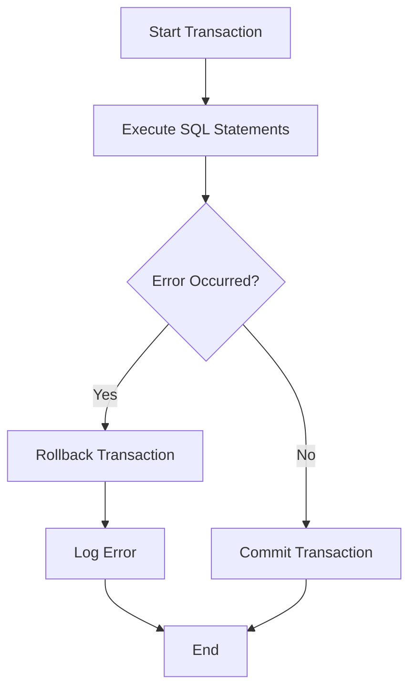

## 6.10 Error Handling in Transactions

In the realm of SQL database management, transactions are the cornerstone of maintaining data integrity and consistency. However, even the most meticulously crafted transactions can encounter errors. Understanding how to effectively handle these errors is crucial for building robust and reliable database systems. In this section, we will delve into the intricacies of error handling in SQL transactions, covering exception management, rollbacks, and logging.

### Exception Management

Exception management is a critical aspect of error handling in SQL transactions. It involves anticipating potential errors and implementing mechanisms to handle them gracefully, ensuring that the database remains in a consistent state.

#### TRY...CATCH Blocks

The `TRY...CATCH` construct is a powerful tool for managing exceptions in SQL. It allows you to define a block of code to be executed and specify a separate block to handle any errors that occur within the `TRY` block.

```sql
BEGIN TRY
    BEGIN TRANSACTION
    -- Attempt to execute a series of SQL statements
    INSERT INTO Orders (OrderID, CustomerID, OrderDate)
    VALUES (1, 'CUST001', GETDATE());

    UPDATE Inventory
    SET Quantity = Quantity - 1
    WHERE ProductID = 101;

    COMMIT TRANSACTION
END TRY
BEGIN CATCH
    -- Handle errors
    ROLLBACK TRANSACTION;
    DECLARE @ErrorMessage NVARCHAR(4000);
    SET @ErrorMessage = ERROR_MESSAGE();
    PRINT 'Error occurred: ' + @ErrorMessage;
END CATCH;
```

**Explanation:**

- **BEGIN TRY...END TRY**: Encapsulates the transactional code that might throw an error.
- **BEGIN CATCH...END CATCH**: Contains the error handling logic, including rolling back the transaction and logging the error message.

#### Custom Error Messages

Providing meaningful feedback through custom error messages can greatly enhance the debugging process and user experience. SQL allows you to define custom error messages that can be raised when specific conditions are met.

```sql
BEGIN TRY
    -- Check for a specific condition
    IF (SELECT COUNT(*) FROM Inventory WHERE ProductID = 101 AND Quantity <= 0) > 0
    BEGIN
        THROW 50001, 'Insufficient inventory for ProductID 101.', 1;
    END

    -- Proceed with transaction
    BEGIN TRANSACTION
    -- Transactional code here
    COMMIT TRANSACTION
END TRY
BEGIN CATCH
    -- Handle errors
    ROLLBACK TRANSACTION;
    PRINT 'Custom error: ' + ERROR_MESSAGE();
END CATCH;
```

**Explanation:**

- **THROW**: Raises a custom error with a specified message and error number.
- **ERROR_MESSAGE()**: Retrieves the error message for the most recent error.

### Rollbacks

Rollbacks are essential for maintaining data integrity by undoing changes made during a transaction when an error occurs. SQL provides mechanisms for both partial and complete rollbacks.

#### Partial Rollbacks

Partial rollbacks allow you to undo specific operations within a transaction using savepoints. Savepoints act as markers within a transaction, enabling you to roll back to a specific point without affecting the entire transaction.

```sql
BEGIN TRY
    BEGIN TRANSACTION
    SAVE TRANSACTION SavePoint1;

    -- First operation
    INSERT INTO Orders (OrderID, CustomerID, OrderDate)
    VALUES (1, 'CUST001', GETDATE());

    -- Second operation
    SAVE TRANSACTION SavePoint2;
    UPDATE Inventory
    SET Quantity = Quantity - 1
    WHERE ProductID = 101;

    -- Error condition
    IF (SELECT COUNT(*) FROM Inventory WHERE ProductID = 101 AND Quantity < 0) > 0
    BEGIN
        ROLLBACK TRANSACTION SavePoint2;
        PRINT 'Rolled back to SavePoint2 due to insufficient inventory.';
    END

    COMMIT TRANSACTION
END TRY
BEGIN CATCH
    -- Handle errors
    ROLLBACK TRANSACTION;
    PRINT 'Error occurred: ' + ERROR_MESSAGE();
END CATCH;
```

**Explanation:**

- **SAVE TRANSACTION**: Creates a savepoint within the transaction.
- **ROLLBACK TRANSACTION SavePointName**: Rolls back to the specified savepoint.

#### Complete Rollbacks

Complete rollbacks are used to abort an entire transaction when a critical failure occurs, ensuring that no partial changes are committed to the database.

```sql
BEGIN TRY
    BEGIN TRANSACTION
    -- Transactional code here

    -- Simulate a critical error
    IF (SELECT COUNT(*) FROM Orders WHERE OrderID = 1) > 0
    BEGIN
        THROW 50002, 'Duplicate OrderID detected.', 1;
    END

    COMMIT TRANSACTION
END TRY
BEGIN CATCH
    -- Handle errors
    ROLLBACK TRANSACTION;
    PRINT 'Transaction aborted: ' + ERROR_MESSAGE();
END CATCH;
```

**Explanation:**

- **ROLLBACK TRANSACTION**: Aborts the entire transaction, undoing all changes.

### Logging and Auditing

Logging and auditing are vital for monitoring and troubleshooting errors in SQL transactions. By recording errors and transaction details, you can gain insights into the causes of failures and improve system reliability.

#### Implementing Logging

Implement logging mechanisms to capture error details and transaction states. This can be achieved by writing error information to a dedicated log table.

```sql
CREATE TABLE ErrorLog (
    ErrorID INT IDENTITY(1,1) PRIMARY KEY,
    ErrorMessage NVARCHAR(4000),
    ErrorDateTime DATETIME DEFAULT GETDATE()
);

BEGIN TRY
    BEGIN TRANSACTION
    -- Transactional code here

    COMMIT TRANSACTION
END TRY
BEGIN CATCH
    -- Handle errors
    ROLLBACK TRANSACTION;
    INSERT INTO ErrorLog (ErrorMessage)
    VALUES (ERROR_MESSAGE());
    PRINT 'Error logged: ' + ERROR_MESSAGE();
END CATCH;
```

**Explanation:**

- **ErrorLog Table**: Stores error messages and timestamps for auditing purposes.
- **INSERT INTO ErrorLog**: Records the error message when an exception occurs.

#### Auditing Transactions

Auditing involves tracking changes and access to data within the database. Implement auditing by capturing transaction details such as user actions, timestamps, and affected records.

```sql
CREATE TABLE AuditLog (
    AuditID INT IDENTITY(1,1) PRIMARY KEY,
    UserName NVARCHAR(100),
    Action NVARCHAR(100),
    ActionDateTime DATETIME DEFAULT GETDATE(),
    Details NVARCHAR(4000)
);

BEGIN TRY
    BEGIN TRANSACTION
    -- Capture audit details
    INSERT INTO AuditLog (UserName, Action, Details)
    VALUES (SYSTEM_USER, 'Insert Order', 'OrderID: 1, CustomerID: CUST001');

    -- Transactional code here

    COMMIT TRANSACTION
END TRY
BEGIN CATCH
    -- Handle errors
    ROLLBACK TRANSACTION;
    PRINT 'Error occurred: ' + ERROR_MESSAGE();
END CATCH;
```

**Explanation:**

- **AuditLog Table**: Records user actions and transaction details for auditing.
- **SYSTEM_USER**: Retrieves the current user's name for logging purposes.

### Visualizing Error Handling in Transactions

To better understand the flow of error handling in transactions, let's visualize the process using a flowchart.



**Description:**

- **Start Transaction**: Initiates the transaction.
- **Execute SQL Statements**: Executes the transactional code.
- **Error Occurred?**: Checks for errors during execution.
- **Rollback Transaction**: Reverts changes if an error occurs.
- **Commit Transaction**: Commits changes if no errors occur.
- **Log Error**: Records error details for auditing.
- **End**: Completes the transaction process.

### Try It Yourself

Experiment with the provided code examples by modifying the SQL statements and error conditions. Try adding additional savepoints, custom error messages, and logging mechanisms to enhance your understanding of error handling in transactions.

### Knowledge Check

- What is the purpose of the `TRY...CATCH` block in SQL transactions?
- How can custom error messages improve error handling?
- Explain the difference between partial and complete rollbacks.
- Why is logging important in error handling?
- How can auditing enhance transaction monitoring?

### Embrace the Journey

Remember, mastering error handling in SQL transactions is a continuous journey. As you gain experience, you'll develop more sophisticated techniques for managing errors and ensuring data integrity. Keep experimenting, stay curious, and enjoy the journey!

## Quiz Time!



### What is the primary purpose of a `TRY...CATCH` block in SQL?

- [x] To handle errors within a transaction
- [ ] To optimize query performance
- [ ] To create savepoints
- [ ] To define custom error messages

> **Explanation:** The `TRY...CATCH` block is used to handle errors that occur within a transaction, allowing for graceful error management.

### How can custom error messages enhance error handling?

- [x] By providing meaningful feedback
- [ ] By improving query performance
- [ ] By reducing transaction time
- [ ] By creating savepoints

> **Explanation:** Custom error messages provide meaningful feedback, making it easier to understand and debug errors.

### What is a partial rollback?

- [x] Undoing specific operations within a transaction
- [ ] Aborting the entire transaction
- [ ] Committing all changes
- [ ] Logging errors

> **Explanation:** A partial rollback involves undoing specific operations within a transaction using savepoints.

### Why is logging important in error handling?

- [x] For monitoring and troubleshooting errors
- [ ] For optimizing query performance
- [ ] For creating savepoints
- [ ] For defining custom error messages

> **Explanation:** Logging is important for monitoring and troubleshooting errors, providing insights into the causes of failures.

### What does the `ROLLBACK TRANSACTION` command do?

- [x] Aborts the entire transaction
- [ ] Commits the transaction
- [ ] Creates a savepoint
- [ ] Logs an error

> **Explanation:** The `ROLLBACK TRANSACTION` command aborts the entire transaction, undoing all changes.

### How can auditing enhance transaction monitoring?

- [x] By tracking changes and access to data
- [ ] By optimizing query performance
- [ ] By reducing transaction time
- [ ] By creating savepoints

> **Explanation:** Auditing enhances transaction monitoring by tracking changes and access to data, providing a detailed record of user actions.

### What is the role of the `THROW` statement in SQL?

- [x] To raise a custom error
- [ ] To commit a transaction
- [ ] To create a savepoint
- [ ] To log an error

> **Explanation:** The `THROW` statement is used to raise a custom error with a specified message and error number.

### What is the function of the `ERROR_MESSAGE()` function?

- [x] To retrieve the error message for the most recent error
- [ ] To commit a transaction
- [ ] To create a savepoint
- [ ] To log an error

> **Explanation:** The `ERROR_MESSAGE()` function retrieves the error message for the most recent error, providing details for debugging.

### What is the benefit of using savepoints in transactions?

- [x] To allow partial rollbacks
- [ ] To optimize query performance
- [ ] To commit transactions
- [ ] To log errors

> **Explanation:** Savepoints allow for partial rollbacks within a transaction, enabling specific operations to be undone without affecting the entire transaction.

### True or False: Complete rollbacks are used to undo specific operations within a transaction.

- [ ] True
- [x] False

> **Explanation:** False. Complete rollbacks are used to abort the entire transaction, undoing all changes.


