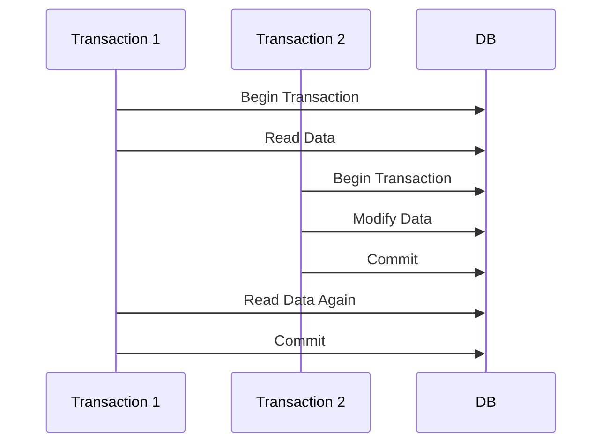
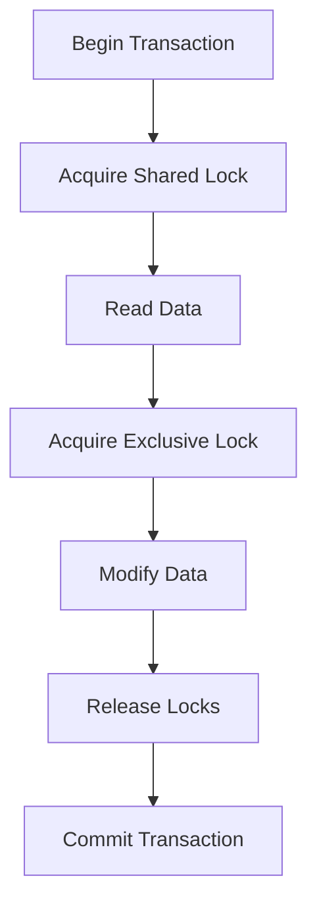

## 6.2 Isolation Levels and Locking Behavior

In the realm of SQL databases, ensuring data consistency while allowing concurrent access is a critical challenge. This is where isolation levels and locking behavior come into play. These mechanisms are essential for managing how transactions interact with each other, ensuring that the database remains in a consistent state even when multiple transactions are executed simultaneously. In this section, we will delve into the intricacies of isolation levels and locking behavior, providing expert insights and practical examples to help you master these concepts.

### Understanding Isolation Levels

Isolation levels define the degree to which the operations in one transaction are isolated from those in other transactions. They are a key component of the ACID (Atomicity, Consistency, Isolation, Durability) properties that ensure reliable transaction processing in databases. Let's explore the four standard isolation levels defined by the SQL standard:

#### 1. Read Uncommitted

**Intent**: This is the lowest isolation level, where transactions are allowed to read data from uncommitted transactions. It is useful in scenarios where performance is prioritized over accuracy.

**Characteristics**:
- **Dirty Reads**: Transactions can read data that has been modified but not yet committed by other transactions.
- **Non-Repeatable Reads**: Data read by a transaction can change if another transaction modifies it.
- **Phantom Reads**: New rows can appear in subsequent reads if another transaction inserts them.

**Use Case**: Suitable for applications where data accuracy is not critical, such as logging or monitoring systems.

**Code Example**:
```sql
SET TRANSACTION ISOLATION LEVEL READ UNCOMMITTED;

BEGIN TRANSACTION;
SELECT * FROM Orders WHERE Status = 'Pending';
-- Other transactions may modify the data being read here
COMMIT;
```

#### 2. Read Committed

**Intent**: This isolation level prevents dirty reads by ensuring that only committed data is read by a transaction.

**Characteristics**:
- **No Dirty Reads**: Transactions cannot read data from uncommitted transactions.
- **Non-Repeatable Reads**: Data read by a transaction can still change if another transaction modifies it.
- **Phantom Reads**: New rows can appear in subsequent reads if another transaction inserts them.

**Use Case**: Commonly used in applications where data consistency is important, but performance is also a consideration.

**Code Example**:
```sql
SET TRANSACTION ISOLATION LEVEL READ COMMITTED;

BEGIN TRANSACTION;
SELECT * FROM Orders WHERE Status = 'Pending';
-- Data read is guaranteed to be committed
COMMIT;
```

#### 3. Repeatable Read

**Intent**: This isolation level ensures that if a row is read twice in the same transaction, it will not change, preventing non-repeatable reads.

**Characteristics**:
- **No Dirty Reads**: Transactions cannot read data from uncommitted transactions.
- **Repeatable Reads**: Data read by a transaction remains consistent throughout the transaction.
- **Phantom Reads**: New rows can appear in subsequent reads if another transaction inserts them.

**Use Case**: Suitable for applications where data consistency is crucial, such as financial systems.

**Code Example**:
```sql
SET TRANSACTION ISOLATION LEVEL REPEATABLE READ;

BEGIN TRANSACTION;
SELECT * FROM Orders WHERE Status = 'Pending';
-- Data read remains consistent throughout the transaction
COMMIT;
```

#### 4. Serializable

**Intent**: This is the highest isolation level, providing complete isolation of transactions. It ensures that transactions are executed in a serial order.

**Characteristics**:
- **No Dirty Reads**: Transactions cannot read data from uncommitted transactions.
- **Repeatable Reads**: Data read by a transaction remains consistent throughout the transaction.
- **No Phantom Reads**: New rows cannot appear in subsequent reads.

**Use Case**: Used in scenarios where data integrity is paramount, such as in banking systems.

**Code Example**:
```sql
SET TRANSACTION ISOLATION LEVEL SERIALIZABLE;

BEGIN TRANSACTION;
SELECT * FROM Orders WHERE Status = 'Pending';
-- Complete isolation from other transactions
COMMIT;
```

### Visualizing Isolation Levels

To better understand how isolation levels affect transaction behavior, let's visualize the interactions between transactions using a sequence diagram.



**Description**: This diagram illustrates how two transactions interact with the database under different isolation levels. Depending on the isolation level, Transaction 1 may or may not see the changes made by Transaction 2.

### Locking Mechanisms

Locks are used to control access to database resources, ensuring that transactions do not interfere with each other. There are several types of locks, each serving a specific purpose:

#### 1. Shared Locks

**Intent**: Allow multiple transactions to read a resource without modifying it.

**Characteristics**:
- Multiple transactions can hold shared locks on the same resource.
- Prevents other transactions from acquiring exclusive locks on the resource.

**Use Case**: Suitable for read-only operations where data consistency is required.

**Code Example**:
```sql
BEGIN TRANSACTION;
SELECT * FROM Orders WITH (HOLDLOCK);
-- Shared lock is acquired on the Orders table
COMMIT;
```

#### 2. Exclusive Locks

**Intent**: Used when modifying data, preventing other transactions from accessing the resource.

**Characteristics**:
- Only one transaction can hold an exclusive lock on a resource at a time.
- Prevents other transactions from acquiring shared or exclusive locks on the resource.

**Use Case**: Necessary for operations that modify data to ensure data integrity.

**Code Example**:
```sql
BEGIN TRANSACTION;
UPDATE Orders SET Status = 'Shipped' WHERE OrderID = 1;
-- Exclusive lock is acquired on the affected rows
COMMIT;
```

#### 3. Intent Locks

**Intent**: Indicate a transaction's future intention to acquire locks on a resource.

**Characteristics**:
- Used to signal that a transaction intends to acquire shared or exclusive locks on a resource.
- Helps the database manage locks more efficiently.

**Use Case**: Useful in complex transactions involving multiple resources.

**Code Example**:
```sql
BEGIN TRANSACTION;
SELECT * FROM Orders WITH (HOLDLOCK);
-- Intent lock is acquired on the Orders table
UPDATE Orders SET Status = 'Shipped' WHERE OrderID = 1;
-- Exclusive lock is acquired on the affected rows
COMMIT;
```

### Visualizing Locking Behavior

To illustrate how locks work, let's use a flowchart to show the process of acquiring and releasing locks during a transaction.



**Description**: This flowchart demonstrates the sequence of acquiring and releasing locks during a transaction. It highlights the transition from shared to exclusive locks when modifying data.

### Design Considerations

When choosing isolation levels and locking mechanisms, consider the following:

- **Performance vs. Consistency**: Higher isolation levels provide better consistency but can impact performance due to increased locking.
- **Application Requirements**: Choose the isolation level that aligns with your application's consistency and performance needs.
- **Deadlocks**: Be aware of potential deadlocks, which occur when transactions wait indefinitely for resources locked by each other.
- **Lock Granularity**: Consider the granularity of locks (e.g., row-level vs. table-level) to balance performance and concurrency.

### Differences and Similarities

Isolation levels and locking mechanisms are often confused with each other. Here's a quick comparison:

- **Isolation Levels**: Define the visibility of data changes between transactions.
- **Locking Mechanisms**: Control access to resources to enforce isolation levels.

### Try It Yourself

Experiment with different isolation levels and locking mechanisms in your database. Modify the code examples provided to see how changes affect transaction behavior. For instance, try using `SET TRANSACTION ISOLATION LEVEL REPEATABLE READ` and observe how it impacts data consistency compared to `READ COMMITTED`.

### References and Links

- [SQL Server Isolation Levels](https://docs.microsoft.com/en-us/sql/t-sql/statements/set-transaction-isolation-level-transact-sql)
- [PostgreSQL Concurrency Control](https://www.postgresql.org/docs/current/mvcc.html)
- [Oracle Database Locking Mechanisms](https://docs.oracle.com/en/database/oracle/oracle-database/19/admin/managing-concurrency.html)

### Knowledge Check

- What are the differences between shared and exclusive locks?
- How do isolation levels affect transaction consistency and performance?
- What is a phantom read, and which isolation levels prevent it?

### Embrace the Journey

Remember, mastering isolation levels and locking behavior is a journey. As you experiment and apply these concepts, you'll gain a deeper understanding of how to manage concurrency and ensure data consistency in your applications. Keep exploring, stay curious, and enjoy the process!

## Quiz Time!



### Which isolation level allows dirty reads?

- [x] Read Uncommitted
- [ ] Read Committed
- [ ] Repeatable Read
- [ ] Serializable

> **Explanation:** Read Uncommitted allows transactions to read data from uncommitted transactions, leading to dirty reads.

### What is the main characteristic of the Serializable isolation level?

- [ ] Allows dirty reads
- [ ] Allows non-repeatable reads
- [ ] Allows phantom reads
- [x] Provides complete isolation

> **Explanation:** Serializable provides the highest level of isolation, ensuring transactions are completely isolated from each other.

### Which lock type allows multiple transactions to read a resource simultaneously?

- [x] Shared Lock
- [ ] Exclusive Lock
- [ ] Intent Lock
- [ ] None of the above

> **Explanation:** Shared locks allow multiple transactions to read a resource without modifying it.

### What is the purpose of an intent lock?

- [ ] To allow dirty reads
- [ ] To prevent deadlocks
- [x] To indicate future intention to acquire locks
- [ ] To provide complete isolation

> **Explanation:** Intent locks signal a transaction's intention to acquire shared or exclusive locks on a resource.

### Which isolation level prevents non-repeatable reads?

- [ ] Read Uncommitted
- [ ] Read Committed
- [x] Repeatable Read
- [ ] Serializable

> **Explanation:** Repeatable Read ensures that if a row is read twice in the same transaction, it will not change, preventing non-repeatable reads.

### What is a phantom read?

- [ ] Reading uncommitted data
- [ ] Reading the same data twice
- [x] New rows appearing in subsequent reads
- [ ] None of the above

> **Explanation:** Phantom reads occur when new rows appear in subsequent reads due to another transaction's insertions.

### Which isolation level is most suitable for financial systems?

- [ ] Read Uncommitted
- [ ] Read Committed
- [x] Repeatable Read
- [ ] Serializable

> **Explanation:** Repeatable Read is suitable for financial systems where data consistency is crucial.

### What is the main disadvantage of higher isolation levels?

- [x] Reduced performance
- [ ] Increased data consistency
- [ ] More dirty reads
- [ ] None of the above

> **Explanation:** Higher isolation levels provide better consistency but can impact performance due to increased locking.

### How do shared locks affect other transactions?

- [ ] Prevents all access
- [x] Allows read access
- [ ] Allows write access
- [ ] None of the above

> **Explanation:** Shared locks allow multiple transactions to read a resource but prevent modifications.

### True or False: Serializable isolation level allows phantom reads.

- [ ] True
- [x] False

> **Explanation:** Serializable prevents phantom reads by ensuring complete isolation of transactions.


