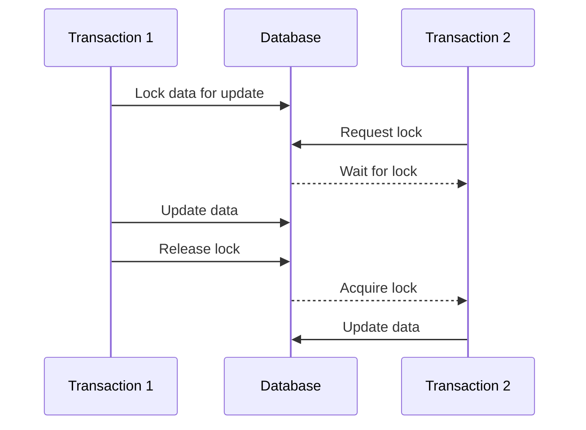
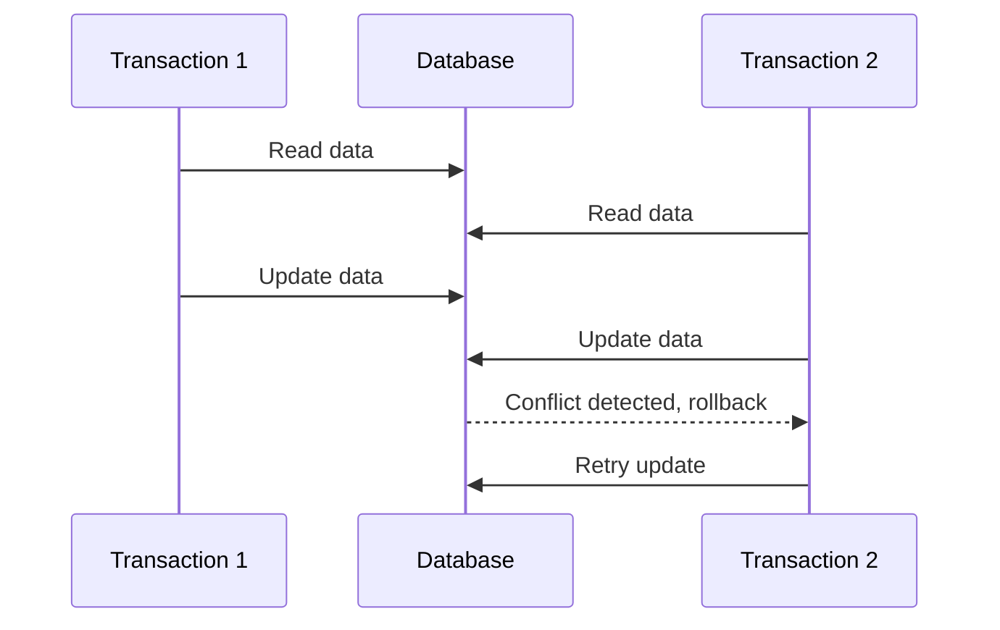

## 6.3 Optimistic vs. Pessimistic Concurrency Control

Concurrency control is a critical aspect of database management, ensuring that multiple transactions can occur simultaneously without leading to data inconsistencies. In this section, we will delve into two primary concurrency control mechanisms: **Optimistic Concurrency Control (OCC)** and **Pessimistic Concurrency Control (PCC)**. Understanding these mechanisms is essential for expert software engineers and architects who aim to design robust, efficient, and scalable database systems.

### Introduction to Concurrency Control

Concurrency control in databases is the process of managing simultaneous operations without conflicting with each other. It ensures the consistency and integrity of data when multiple transactions are executed concurrently. The two main strategies for concurrency control are optimistic and pessimistic concurrency control.

### Pessimistic Concurrency Control

#### Approach

Pessimistic concurrency control assumes that conflicts between transactions are likely to occur. As a result, it locks data resources when a transaction reads or writes data. This locking mechanism prevents other transactions from accessing the locked data until the lock is released, thereby avoiding conflicts.

#### Use Cases

Pessimistic concurrency control is suitable for high-contention environments where data conflicts are frequent. It is often used in scenarios where:

- Transactions are long-running and involve complex operations.
- The cost of resolving conflicts is high.
- Data integrity is critical, and the risk of data corruption must be minimized.

#### Implementation

Pessimistic concurrency control can be implemented using various locking mechanisms, such as:

- **Exclusive Locks**: Prevent other transactions from reading or writing the locked data.
- **Shared Locks**: Allow other transactions to read but not write the locked data.

Here is a simple SQL example demonstrating pessimistic locking:

```sql
BEGIN TRANSACTION;

-- Acquire an exclusive lock on the row
SELECT * FROM accounts
WHERE account_id = 12345
FOR UPDATE;

-- Perform operations on the locked data
UPDATE accounts
SET balance = balance - 100
WHERE account_id = 12345;

COMMIT;
```

In this example, the `FOR UPDATE` clause locks the selected row, preventing other transactions from modifying it until the current transaction is committed or rolled back.

### Optimistic Concurrency Control

#### Approach

Optimistic concurrency control assumes that conflicts are rare and allows transactions to proceed without locking data resources. Instead, it checks for conflicts before committing a transaction. If a conflict is detected, the transaction is rolled back and retried.

#### Use Cases

Optimistic concurrency control is ideal for low-contention environments where data conflicts are infrequent. It is commonly used in scenarios where:

- Transactions are short-lived and involve simple operations.
- The cost of retrying a transaction is low.
- The system can tolerate occasional rollbacks.

#### Implementation

Optimistic concurrency control can be implemented using version numbers or timestamps to detect changes. Here is an example using a version column:

```sql
BEGIN TRANSACTION;

-- Retrieve the current version of the row
SELECT balance, version FROM accounts
WHERE account_id = 12345;

-- Perform operations on the data
UPDATE accounts
SET balance = balance - 100, version = version + 1
WHERE account_id = 12345 AND version = @current_version;

-- Check if the update was successful
IF @@ROWCOUNT = 0
BEGIN
    -- Conflict detected, rollback and retry
    ROLLBACK;
    -- Retry logic here
END
ELSE
BEGIN
    COMMIT;
END
```

In this example, the `version` column is used to detect changes. If another transaction modifies the row before the current transaction commits, the `WHERE` clause will fail, and the transaction will be rolled back.

### Visualizing Concurrency Control

To better understand the differences between optimistic and pessimistic concurrency control, let's visualize the processes using Mermaid.js diagrams.

#### Pessimistic Concurrency Control Flow



#### Optimistic Concurrency Control Flow



### Key Participants

- **Transaction**: A sequence of operations performed as a single logical unit of work.
- **Database**: The system that manages data and enforces concurrency control mechanisms.

### Applicability

- **Pessimistic Concurrency Control**: Use when data conflicts are frequent, and the cost of resolving conflicts is high.
- **Optimistic Concurrency Control**: Use when data conflicts are rare, and the cost of retrying transactions is low.

### Design Considerations

When choosing between optimistic and pessimistic concurrency control, consider the following factors:

- **Transaction Length**: Longer transactions may benefit from pessimistic locking to prevent conflicts.
- **Contention Level**: High-contention environments may require pessimistic locking to ensure data integrity.
- **System Tolerance**: Systems that can tolerate occasional rollbacks may benefit from optimistic concurrency control.

### Differences and Similarities

- **Differences**:
  - Pessimistic concurrency control locks data resources, while optimistic concurrency control allows concurrent access.
  - Pessimistic concurrency control is suitable for high-contention environments, whereas optimistic concurrency control is ideal for low-contention environments.

- **Similarities**:
  - Both mechanisms aim to ensure data consistency and integrity.
  - Both can be implemented using SQL features such as locks, version numbers, and timestamps.

### Try It Yourself

To gain a deeper understanding of concurrency control, try modifying the code examples provided. Experiment with different scenarios, such as:

- Increasing the number of concurrent transactions to observe the effects on performance.
- Implementing retry logic for optimistic concurrency control.
- Testing the impact of different isolation levels on concurrency control.

### References and Links

For further reading on concurrency control, consider the following resources:

- [Concurrency Control in Databases](https://en.wikipedia.org/wiki/Concurrency_control)
- [Optimistic Concurrency Control](https://www.microsoft.com/en-us/research/publication/optimistic-concurrency-control/)
- [Pessimistic Concurrency Control](https://www.ibm.com/docs/en/db2-for-zos/11?topic=concepts-pessimistic-concurrency-control)

### Knowledge Check

To reinforce your understanding of optimistic and pessimistic concurrency control, consider the following questions:

- What are the main differences between optimistic and pessimistic concurrency control?
- In what scenarios would you choose optimistic concurrency control over pessimistic concurrency control?
- How can version numbers or timestamps be used to implement optimistic concurrency control?

### Embrace the Journey

Remember, mastering concurrency control is an ongoing journey. As you continue to explore and experiment with different concurrency control mechanisms, you'll gain valuable insights and skills that will enhance your ability to design efficient and scalable database systems. Keep experimenting, stay curious, and enjoy the journey!

## Quiz Time!



### What is the primary assumption of pessimistic concurrency control?

- [x] Conflicts between transactions are likely to occur.
- [ ] Conflicts between transactions are rare.
- [ ] Transactions are always short-lived.
- [ ] Data integrity is not a concern.

> **Explanation:** Pessimistic concurrency control assumes that conflicts between transactions are likely to occur, which is why it locks data resources to prevent conflicts.

### In which environment is optimistic concurrency control most suitable?

- [ ] High-contention environments
- [x] Low-contention environments
- [ ] Environments with long transactions
- [ ] Environments with frequent data conflicts

> **Explanation:** Optimistic concurrency control is most suitable for low-contention environments where data conflicts are infrequent.

### What mechanism does pessimistic concurrency control use to prevent conflicts?

- [x] Locks
- [ ] Version numbers
- [ ] Timestamps
- [ ] Retry logic

> **Explanation:** Pessimistic concurrency control uses locks to prevent conflicts by restricting access to data resources.

### How does optimistic concurrency control detect conflicts?

- [ ] By locking data resources
- [x] By checking version numbers or timestamps
- [ ] By using shared locks
- [ ] By preventing concurrent access

> **Explanation:** Optimistic concurrency control detects conflicts by checking version numbers or timestamps before committing a transaction.

### What is a potential drawback of pessimistic concurrency control?

- [ ] It allows too many concurrent transactions.
- [x] It can lead to decreased performance due to locking.
- [ ] It does not ensure data integrity.
- [ ] It is only suitable for low-contention environments.

> **Explanation:** A potential drawback of pessimistic concurrency control is decreased performance due to locking, which can limit concurrency.

### What is the main benefit of optimistic concurrency control?

- [x] It allows for higher concurrency without locking.
- [ ] It prevents all data conflicts.
- [ ] It is suitable for high-contention environments.
- [ ] It requires complex retry logic.

> **Explanation:** The main benefit of optimistic concurrency control is that it allows for higher concurrency without locking, which can improve performance in low-contention environments.

### Which SQL clause is used in pessimistic concurrency control to lock data for updates?

- [x] FOR UPDATE
- [ ] WHERE
- [ ] SELECT
- [ ] JOIN

> **Explanation:** The `FOR UPDATE` clause is used in SQL to lock data for updates in pessimistic concurrency control.

### What happens if a conflict is detected in optimistic concurrency control?

- [ ] The transaction is committed.
- [x] The transaction is rolled back and retried.
- [ ] The transaction is ignored.
- [ ] The transaction is locked.

> **Explanation:** If a conflict is detected in optimistic concurrency control, the transaction is rolled back and retried.

### Which concurrency control mechanism is more suitable for systems that can tolerate occasional rollbacks?

- [ ] Pessimistic concurrency control
- [x] Optimistic concurrency control
- [ ] Both are equally suitable
- [ ] Neither is suitable

> **Explanation:** Optimistic concurrency control is more suitable for systems that can tolerate occasional rollbacks, as it allows for higher concurrency without locking.

### True or False: Pessimistic concurrency control is always the best choice for ensuring data integrity.

- [ ] True
- [x] False

> **Explanation:** False. While pessimistic concurrency control can ensure data integrity by preventing conflicts through locking, it is not always the best choice. The choice between optimistic and pessimistic concurrency control depends on the specific use case and environment.


