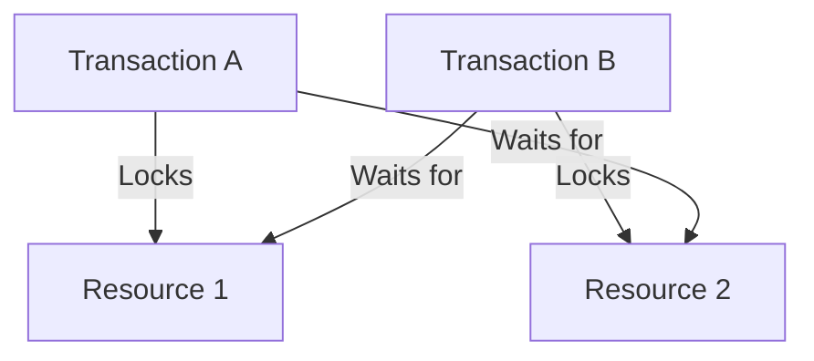
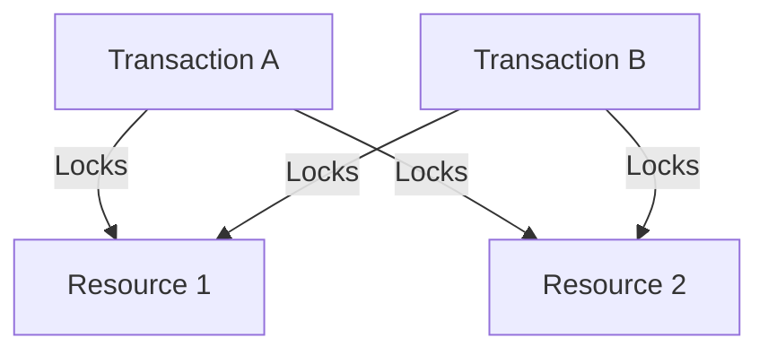

## 6.4 Deadlocks and How to Prevent Them

In the realm of SQL databases, deadlocks represent a critical challenge that can significantly impact the performance and reliability of applications. A deadlock occurs when two or more transactions are unable to proceed because each is waiting for the other to release locks on resources they need. This section delves into the nature of deadlocks, how they occur, and strategies to detect, prevent, and resolve them effectively.

### Understanding Deadlocks

**Deadlocks** are a specific type of concurrency problem that occurs in database systems. They arise when two or more transactions are waiting indefinitely for each other to release locks. This situation leads to a standstill, where none of the transactions can proceed, causing a bottleneck in the system.

#### How Deadlocks Occur

Deadlocks typically occur in environments where multiple transactions are competing for the same set of resources. Consider the following scenario:

1. **Transaction A** locks Resource 1 and waits for Resource 2.
2. **Transaction B** locks Resource 2 and waits for Resource 1.

In this situation, neither transaction can proceed because each is waiting for the other to release a lock. This creates a cycle of dependencies that results in a deadlock.

#### Visualizing Deadlocks

To better understand deadlocks, let's visualize the scenario using a diagram:



In this diagram, Transaction A locks Resource 1 and waits for Resource 2, while Transaction B locks Resource 2 and waits for Resource 1, creating a circular wait condition.

### Detecting Deadlocks

Most modern database systems have built-in mechanisms to detect deadlocks. These systems periodically check for cycles in the wait-for graph, which represents the dependencies between transactions and resources. When a cycle is detected, the system typically resolves the deadlock by terminating one of the transactions, allowing the others to proceed.

#### Example: Deadlock Detection in SQL Server

SQL Server, for instance, uses a background process called the **Lock Monitor** to detect deadlocks. When a deadlock is detected, SQL Server chooses a victim transaction to terminate based on factors such as the cost of rollback and the priority of the transaction.

### Preventing Deadlocks

Preventing deadlocks is crucial for maintaining the performance and reliability of database systems. Here are some effective strategies:

#### 1. Lock Ordering

**Lock Ordering** involves acquiring locks in a consistent order across all transactions. By ensuring that all transactions lock resources in the same sequence, you can prevent circular wait conditions that lead to deadlocks.

#### 2. Timeouts

Implementing **Timeouts** for locks can help prevent deadlocks by ensuring that transactions do not wait indefinitely for resources. If a transaction cannot acquire a lock within a specified time, it is rolled back, freeing up resources for other transactions.

#### 3. Reducing Transaction Scope

**Reducing Transaction Scope** involves keeping transactions short and minimizing the duration of locks. By limiting the amount of time a transaction holds locks, you reduce the likelihood of deadlocks occurring.

#### 4. Using Lower Isolation Levels

In some cases, using lower isolation levels can reduce the likelihood of deadlocks. For example, using the **Read Committed** isolation level instead of **Serializable** can decrease the number of locks held by transactions, thus reducing the chances of deadlocks.

### Code Examples

Let's explore some code examples to illustrate how deadlocks can occur and how to prevent them.

#### Example 1: Deadlock Scenario

Consider the following SQL code that demonstrates a potential deadlock scenario:

```sql
-- Transaction A
BEGIN TRANSACTION;
UPDATE Accounts SET Balance = Balance - 100 WHERE AccountID = 1;
WAITFOR DELAY '00:00:05'; -- Simulate delay
UPDATE Accounts SET Balance = Balance + 100 WHERE AccountID = 2;
COMMIT TRANSACTION;

-- Transaction B
BEGIN TRANSACTION;
UPDATE Accounts SET Balance = Balance - 100 WHERE AccountID = 2;
WAITFOR DELAY '00:00:05'; -- Simulate delay
UPDATE Accounts SET Balance = Balance + 100 WHERE AccountID = 1;
COMMIT TRANSACTION;
```

In this example, Transaction A updates Account 1 and then waits before updating Account 2, while Transaction B updates Account 2 and waits before updating Account 1. This creates a deadlock situation.

#### Example 2: Preventing Deadlocks with Lock Ordering

To prevent deadlocks, we can modify the transactions to acquire locks in a consistent order:

```sql
-- Transaction A
BEGIN TRANSACTION;
UPDATE Accounts SET Balance = Balance - 100 WHERE AccountID = 1;
UPDATE Accounts SET Balance = Balance + 100 WHERE AccountID = 2;
COMMIT TRANSACTION;

-- Transaction B
BEGIN TRANSACTION;
UPDATE Accounts SET Balance = Balance - 100 WHERE AccountID = 1;
UPDATE Accounts SET Balance = Balance + 100 WHERE AccountID = 2;
COMMIT TRANSACTION;
```

By ensuring both transactions update Account 1 before Account 2, we eliminate the circular wait condition.

### Try It Yourself

Experiment with the code examples above by modifying the order of operations or introducing delays to observe how deadlocks occur and can be prevented. Try implementing different prevention strategies, such as lock ordering or timeouts, to see their effects.

### Visualizing Deadlock Prevention

Let's visualize the lock ordering strategy using a diagram:



In this diagram, both transactions acquire locks in the same order, preventing a circular wait condition.

### References and Further Reading

- [SQL Server Deadlock Detection and Resolution](https://docs.microsoft.com/en-us/sql/relational-databases/sql-server-deadlocks)
- [PostgreSQL Concurrency Control](https://www.postgresql.org/docs/current/mvcc.html)
- [MySQL Locking and Deadlock Prevention](https://dev.mysql.com/doc/refman/8.0/en/innodb-deadlocks.html)

### Knowledge Check

- What is a deadlock, and how does it occur?
- How can lock ordering help prevent deadlocks?
- What role do timeouts play in deadlock prevention?
- How does reducing transaction scope minimize the risk of deadlocks?

### Embrace the Journey

Remember, mastering deadlock prevention is a crucial step in becoming an expert in SQL transaction management. As you continue to explore and experiment with different strategies, you'll gain a deeper understanding of how to build efficient and reliable database systems. Keep experimenting, stay curious, and enjoy the journey!

## Quiz Time!



### What is a deadlock in SQL transactions?

- [x] A situation where two or more transactions are waiting indefinitely for each other to release locks.
- [ ] A situation where a transaction is waiting for a resource that is not available.
- [ ] A situation where a transaction is terminated due to a timeout.
- [ ] A situation where a transaction is rolled back due to an error.

> **Explanation:** A deadlock occurs when two or more transactions are waiting indefinitely for each other to release locks, creating a cycle of dependencies.

### How can lock ordering prevent deadlocks?

- [x] By ensuring all transactions acquire locks in a consistent order.
- [ ] By reducing the number of locks held by transactions.
- [ ] By increasing the isolation level of transactions.
- [ ] By using timeouts to release locks.

> **Explanation:** Lock ordering prevents deadlocks by ensuring all transactions acquire locks in a consistent order, eliminating circular wait conditions.

### What is the role of timeouts in deadlock prevention?

- [x] To ensure transactions do not wait indefinitely for resources.
- [ ] To increase the number of locks held by transactions.
- [ ] To decrease the isolation level of transactions.
- [ ] To prevent transactions from acquiring locks.

> **Explanation:** Timeouts prevent deadlocks by ensuring transactions do not wait indefinitely for resources, allowing them to be rolled back if necessary.

### How does reducing transaction scope help prevent deadlocks?

- [x] By minimizing the duration of locks held by transactions.
- [ ] By increasing the number of locks held by transactions.
- [ ] By decreasing the isolation level of transactions.
- [ ] By using timeouts to release locks.

> **Explanation:** Reducing transaction scope helps prevent deadlocks by minimizing the duration of locks held by transactions, reducing the likelihood of circular wait conditions.

### Which of the following is a common deadlock detection method?

- [x] Periodically checking for cycles in the wait-for graph.
- [ ] Increasing the isolation level of transactions.
- [ ] Using timeouts to release locks.
- [ ] Reducing the number of locks held by transactions.

> **Explanation:** Deadlock detection often involves periodically checking for cycles in the wait-for graph, which represents dependencies between transactions and resources.

### What happens when a deadlock is detected in SQL Server?

- [x] One of the transactions is terminated to resolve the deadlock.
- [ ] All transactions are terminated to resolve the deadlock.
- [ ] The isolation level of transactions is increased.
- [ ] The number of locks held by transactions is reduced.

> **Explanation:** When a deadlock is detected in SQL Server, one of the transactions is terminated to resolve the deadlock and allow other transactions to proceed.

### How can using lower isolation levels reduce the likelihood of deadlocks?

- [x] By decreasing the number of locks held by transactions.
- [ ] By increasing the number of locks held by transactions.
- [ ] By ensuring all transactions acquire locks in a consistent order.
- [ ] By using timeouts to release locks.

> **Explanation:** Using lower isolation levels can reduce the likelihood of deadlocks by decreasing the number of locks held by transactions, reducing the chances of circular wait conditions.

### What is a wait-for graph?

- [x] A representation of dependencies between transactions and resources.
- [ ] A diagram showing the order of lock acquisition.
- [ ] A chart illustrating the duration of locks held by transactions.
- [ ] A table listing all active transactions in the database.

> **Explanation:** A wait-for graph is a representation of dependencies between transactions and resources, used to detect cycles that indicate deadlocks.

### Which strategy involves keeping transactions short to prevent deadlocks?

- [x] Reducing Transaction Scope
- [ ] Lock Ordering
- [ ] Using Timeouts
- [ ] Increasing Isolation Levels

> **Explanation:** Reducing transaction scope involves keeping transactions short and minimizing the duration of locks, helping to prevent deadlocks.

### True or False: Deadlocks can be completely eliminated in all database systems.

- [ ] True
- [x] False

> **Explanation:** While deadlocks can be minimized and managed, they cannot be completely eliminated in all database systems due to the inherent nature of concurrent transactions.


