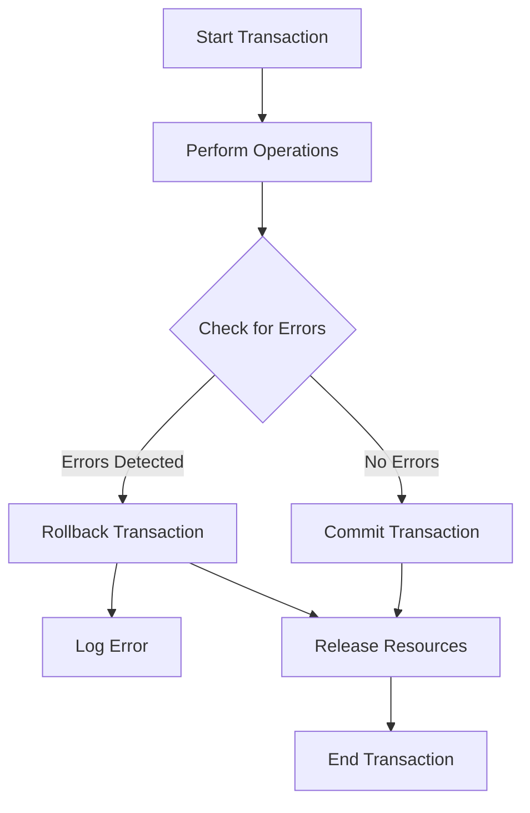

## 6.5 Transaction Design Best Practices

In the realm of SQL database management, transactions are the cornerstone of maintaining data integrity and consistency. A transaction is a sequence of operations performed as a single logical unit of work. If any operation within the transaction fails, the entire transaction is rolled back, ensuring that the database remains in a consistent state. This section delves into the best practices for designing robust transactions, focusing on key aspects such as granularity, error handling, idempotency, resource management, and consistency.

### Granularity: Keeping Transactions Focused and Concise

Granularity refers to the level of detail or scope of a transaction. Designing transactions with the right granularity is crucial for performance and maintainability. 

#### Why Granularity Matters

- **Performance**: Smaller transactions reduce lock contention and improve concurrency.
- **Maintainability**: Concise transactions are easier to understand, debug, and maintain.
- **Resource Utilization**: Efficient transactions minimize resource usage, such as memory and CPU.

#### Best Practices for Transaction Granularity

1. **Limit the Scope**: Ensure that each transaction only includes operations that are logically related. Avoid bundling unrelated operations into a single transaction.

2. **Minimize Duration**: Keep transactions as short as possible to reduce the time locks are held, thereby improving concurrency.

3. **Batch Operations**: For operations that can be batched, such as inserting multiple rows, use batch processing to reduce the number of transactions.

4. **Avoid User Interaction**: Do not include user interaction within a transaction, as it can lead to long-running transactions and increased lock contention.

#### Example: Granular Transaction Design

```sql
-- Example of a granular transaction for updating an order status
BEGIN TRANSACTION;

-- Update order status
UPDATE Orders
SET Status = 'Shipped'
WHERE OrderID = 12345;

-- Log the status change
INSERT INTO OrderLogs (OrderID, Status, ChangeDate)
VALUES (12345, 'Shipped', GETDATE());

COMMIT TRANSACTION;
```

### Error Handling: Properly Managing Exceptions and Rollbacks

Error handling is a critical component of transaction design. Proper error handling ensures that transactions are rolled back in case of failure, maintaining data integrity.

#### Key Concepts in Error Handling

- **Atomicity**: Ensures that all operations within a transaction are completed successfully or none at all.
- **Rollback**: Reverts the database to its previous state if an error occurs during the transaction.

#### Best Practices for Error Handling

1. **Use TRY...CATCH Blocks**: Implement error handling using TRY...CATCH blocks to catch exceptions and perform rollbacks.

2. **Log Errors**: Record errors in a log table for auditing and troubleshooting purposes.

3. **Graceful Degradation**: Design applications to handle transaction failures gracefully, providing meaningful feedback to users.

#### Example: Error Handling in Transactions

```sql
BEGIN TRY
    BEGIN TRANSACTION;

    -- Update inventory
    UPDATE Inventory
    SET Quantity = Quantity - 1
    WHERE ProductID = 98765;

    -- Insert order details
    INSERT INTO OrderDetails (OrderID, ProductID, Quantity)
    VALUES (12345, 98765, 1);

    COMMIT TRANSACTION;
END TRY
BEGIN CATCH
    -- Rollback transaction in case of error
    ROLLBACK TRANSACTION;

    -- Log error details
    INSERT INTO ErrorLog (ErrorMessage, ErrorDate)
    VALUES (ERROR_MESSAGE(), GETDATE());
END CATCH;
```

### Idempotency: Designing Transactions That Can Be Safely Retried

Idempotency is the property of a transaction that allows it to be executed multiple times without changing the result beyond the initial application. This is particularly important in distributed systems where network failures can lead to retries.

#### Importance of Idempotency

- **Reliability**: Ensures that repeated execution of a transaction does not lead to inconsistent data.
- **Fault Tolerance**: Allows systems to recover gracefully from failures by safely retrying transactions.

#### Best Practices for Idempotency

1. **Use Unique Identifiers**: Employ unique identifiers for operations to ensure that repeated transactions do not duplicate actions.

2. **Check Before Insert**: Before inserting data, check if the data already exists to prevent duplicates.

3. **Design for Retries**: Structure transactions to be safely retried without adverse effects.

#### Example: Idempotent Transaction Design

```sql
-- Example of an idempotent transaction using a unique identifier
BEGIN TRANSACTION;

-- Check if the order has already been processed
IF NOT EXISTS (SELECT 1 FROM ProcessedOrders WHERE OrderID = 12345)
BEGIN
    -- Insert order processing record
    INSERT INTO ProcessedOrders (OrderID, ProcessedDate)
    VALUES (12345, GETDATE());

    -- Update order status
    UPDATE Orders
    SET Status = 'Processed'
    WHERE OrderID = 12345;
END

COMMIT TRANSACTION;
```

### Resource Management: Releasing Locks and Resources Promptly

Efficient resource management is crucial for maintaining system performance and preventing deadlocks.

#### Key Concepts in Resource Management

- **Locking**: Controls access to data to ensure consistency during concurrent transactions.
- **Deadlocks**: Occur when two or more transactions are waiting for each other to release locks, causing a standstill.

#### Best Practices for Resource Management

1. **Release Locks Promptly**: Ensure that locks are released as soon as they are no longer needed.

2. **Use Appropriate Isolation Levels**: Choose the right isolation level to balance consistency and concurrency.

3. **Monitor and Resolve Deadlocks**: Implement monitoring to detect and resolve deadlocks promptly.

#### Example: Resource Management in Transactions

```sql
-- Example of resource management with appropriate isolation level
SET TRANSACTION ISOLATION LEVEL READ COMMITTED;

BEGIN TRANSACTION;

-- Update customer balance
UPDATE Customers
SET Balance = Balance - 100
WHERE CustomerID = 54321;

-- Insert transaction record
INSERT INTO Transactions (CustomerID, Amount, TransactionDate)
VALUES (54321, -100, GETDATE());

COMMIT TRANSACTION;
```

### Consistency: Ensuring Business Rules and Data Integrity Are Upheld

Consistency ensures that a transaction transforms the database from one valid state to another, maintaining all defined rules and constraints.

#### Importance of Consistency

- **Data Integrity**: Ensures that all data modifications adhere to business rules and constraints.
- **Reliability**: Provides assurance that the database remains in a consistent state after transactions.

#### Best Practices for Consistency

1. **Enforce Constraints**: Use database constraints such as primary keys, foreign keys, and check constraints to enforce data integrity.

2. **Validate Data**: Perform data validation within transactions to ensure that all data modifications are valid.

3. **Use Transactions for Critical Operations**: Wrap critical operations in transactions to ensure atomicity and consistency.

#### Example: Consistency in Transaction Design

```sql
-- Example of enforcing consistency with constraints
BEGIN TRANSACTION;

-- Insert new customer with data validation
INSERT INTO Customers (CustomerID, Name, Email)
VALUES (12345, 'John Doe', 'john.doe@example.com');

-- Ensure email is unique
ALTER TABLE Customers
ADD CONSTRAINT UQ_Email UNIQUE (Email);

COMMIT TRANSACTION;
```

### Visualizing Transaction Design Best Practices

To better understand the flow and interaction of these best practices, let's visualize a typical transaction lifecycle using a flowchart.



**Caption**: This flowchart illustrates the typical lifecycle of a transaction, highlighting key stages such as error checking, committing or rolling back, and resource management.

### Try It Yourself

Experiment with the code examples provided by modifying them to suit different scenarios. For instance, try changing the isolation level in the resource management example to see how it affects transaction behavior. Consider adding additional error handling logic or implementing idempotency checks in different ways.

### References and Links

For further reading on SQL transactions and best practices, consider exploring the following resources:

- [SQL Server Transactions](https://docs.microsoft.com/en-us/sql/t-sql/statements/transactions-transact-sql)
- [PostgreSQL Transactions](https://www.postgresql.org/docs/current/tutorial-transactions.html)
- [MySQL Transactional and Locking Statements](https://dev.mysql.com/doc/refman/8.0/en/commit.html)

### Knowledge Check

To reinforce your understanding of transaction design best practices, consider the following questions and challenges:

- What are the benefits of keeping transactions granular?
- How can you implement idempotency in a transaction?
- What are some common causes of deadlocks, and how can they be prevented?
- Why is it important to enforce constraints within transactions?

### Embrace the Journey

Remember, mastering transaction design is a journey. As you continue to explore and implement these best practices, you'll gain deeper insights into building robust and efficient database systems. Keep experimenting, stay curious, and enjoy the process of learning and growing as a software engineer.

## Quiz Time!



### What is the primary benefit of keeping transactions granular?

- [x] Improved performance and concurrency
- [ ] Easier error handling
- [ ] Simplified user interaction
- [ ] Reduced resource usage

> **Explanation:** Granular transactions improve performance and concurrency by reducing lock contention and allowing more transactions to be processed simultaneously.

### Which SQL statement is used to revert a transaction to its previous state in case of an error?

- [ ] COMMIT
- [x] ROLLBACK
- [ ] SAVEPOINT
- [ ] BEGIN

> **Explanation:** The ROLLBACK statement is used to revert a transaction to its previous state if an error occurs, ensuring data integrity.

### What is idempotency in the context of SQL transactions?

- [ ] The ability to execute a transaction only once
- [x] The ability to execute a transaction multiple times without changing the result
- [ ] The ability to execute a transaction with minimal resources
- [ ] The ability to execute a transaction with user interaction

> **Explanation:** Idempotency ensures that a transaction can be executed multiple times without changing the result beyond the initial application, which is crucial for reliability and fault tolerance.

### What is a common cause of deadlocks in SQL transactions?

- [ ] Using too many indexes
- [ ] Long-running transactions
- [x] Transactions waiting for each other to release locks
- [ ] Excessive use of JOIN operations

> **Explanation:** Deadlocks occur when two or more transactions are waiting for each other to release locks, causing a standstill.

### How can you ensure that a transaction is idempotent?

- [x] Use unique identifiers for operations
- [ ] Avoid using constraints
- [ ] Include user interaction in the transaction
- [ ] Use nested transactions

> **Explanation:** Using unique identifiers for operations helps ensure that repeated transactions do not duplicate actions, making the transaction idempotent.

### What is the purpose of using TRY...CATCH blocks in SQL transactions?

- [ ] To improve performance
- [x] To handle errors and perform rollbacks
- [ ] To simplify transaction logic
- [ ] To enforce constraints

> **Explanation:** TRY...CATCH blocks are used to handle errors and perform rollbacks in SQL transactions, ensuring data integrity.

### Which isolation level should you use to balance consistency and concurrency?

- [ ] SERIALIZABLE
- [x] READ COMMITTED
- [ ] READ UNCOMMITTED
- [ ] REPEATABLE READ

> **Explanation:** The READ COMMITTED isolation level provides a balance between consistency and concurrency by allowing transactions to read only committed data.

### What is the role of constraints in ensuring consistency in SQL transactions?

- [ ] To improve performance
- [x] To enforce data integrity and business rules
- [ ] To simplify transaction logic
- [ ] To manage resources

> **Explanation:** Constraints enforce data integrity and business rules, ensuring that all data modifications within a transaction are valid and consistent.

### Why is it important to release locks promptly in SQL transactions?

- [ ] To simplify transaction logic
- [x] To improve concurrency and prevent deadlocks
- [ ] To enforce constraints
- [ ] To handle errors

> **Explanation:** Releasing locks promptly improves concurrency and prevents deadlocks by allowing other transactions to access the locked resources.

### True or False: Including user interaction within a transaction is a best practice.

- [ ] True
- [x] False

> **Explanation:** Including user interaction within a transaction is not a best practice, as it can lead to long-running transactions and increased lock contention.


