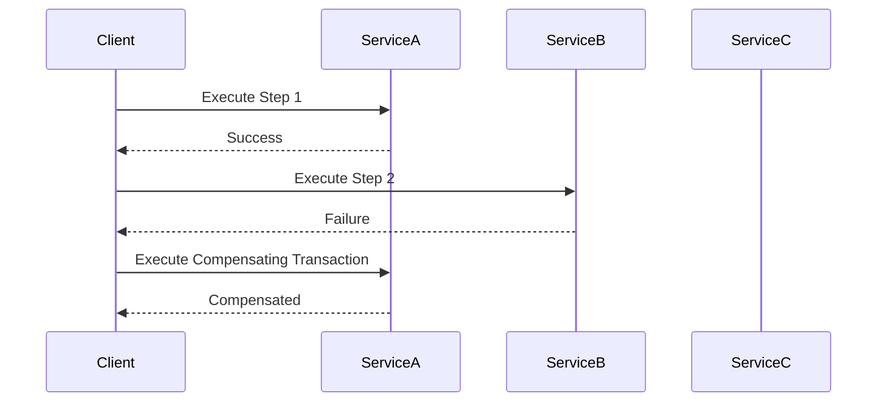

## 6.6 Long Transactions and Saga Pattern

In the realm of SQL design patterns, managing transactions effectively is crucial for maintaining data integrity and ensuring system reliability. As systems grow in complexity, particularly with the advent of distributed architectures and microservices, traditional transaction management techniques face new challenges. This section delves into the intricacies of long transactions and the Saga Pattern, providing expert insights into their implementation and management.

### Long Transactions

#### Understanding Long Transactions

Long transactions are operations that span extended periods, often involving multiple steps or interactions with various data sources. Unlike short transactions, which complete quickly and release resources, long transactions can hold locks for extended durations, potentially leading to contention and performance bottlenecks.

**Challenges of Long Transactions:**

- **Resource Contention:** Holding locks for long periods can block other transactions, leading to increased wait times and reduced throughput.
- **Increased Risk of Deadlocks:** The longer a transaction holds resources, the higher the chance of encountering deadlocks.
- **Complex Error Handling:** Managing errors in long transactions requires careful planning to ensure data consistency and integrity.
- **Scalability Issues:** As the number of concurrent long transactions increases, system performance can degrade.

#### Strategies for Managing Long Transactions

To mitigate the challenges associated with long transactions, consider the following strategies:

1. **Breaking Down Transactions:**
   - Divide long transactions into smaller, manageable units. This approach reduces lock contention and improves system responsiveness.
   - Use batch processing to handle large volumes of data in smaller chunks.

2. **Optimistic Concurrency Control:**
   - Instead of locking resources, allow transactions to proceed and check for conflicts at commit time. If a conflict is detected, the transaction is rolled back and retried.

3. **Timeouts and Deadlock Detection:**
   - Implement timeouts to automatically abort transactions that exceed a predefined duration.
   - Use deadlock detection mechanisms to identify and resolve deadlocks promptly.

4. **Compensating Transactions:**
   - Design compensating transactions to undo the effects of a long transaction if it fails. This approach is particularly useful in distributed systems.

5. **Asynchronous Processing:**
   - Offload long-running tasks to background processes, allowing the main transaction to complete quickly.

#### Code Example: Breaking Down a Long Transaction

```sql
-- Example of breaking down a long transaction into smaller units

BEGIN TRANSACTION;

-- Step 1: Process a batch of records
UPDATE Orders SET Status = 'Processed' WHERE OrderID BETWEEN 1 AND 100;

-- Step 2: Commit the changes
COMMIT;

-- Repeat for the next batch
BEGIN TRANSACTION;
UPDATE Orders SET Status = 'Processed' WHERE OrderID BETWEEN 101 AND 200;
COMMIT;
```

### The Saga Pattern

#### Introduction to the Saga Pattern

The Saga Pattern is a design pattern used to manage data consistency across distributed systems. It involves breaking down a long transaction into a series of smaller, independent transactions, each with its own commit and rollback logic. If a step fails, compensating transactions are executed to undo the changes made by previous steps.

**Key Concepts of the Saga Pattern:**

- **Local Transactions:** Each step in a saga is a local transaction that updates a single service or data source.
- **Compensating Transactions:** If a step fails, compensating transactions are executed to revert the changes made by previous steps.
- **Coordination:** A saga coordinator manages the execution of transactions and compensations, ensuring data consistency.

#### Implementing the Saga Pattern

To implement the Saga Pattern, follow these steps:

1. **Identify the Steps:**
   - Break down the long transaction into discrete steps, each corresponding to a local transaction.

2. **Define Compensating Transactions:**
   - For each step, define a compensating transaction that can undo its effects in case of failure.

3. **Implement a Saga Coordinator:**
   - Develop a coordinator to manage the execution of steps and handle failures by invoking compensating transactions.

4. **Ensure Idempotency:**
   - Design each step and compensating transaction to be idempotent, ensuring that repeated execution produces the same result.

#### Code Example: Implementing a Saga Pattern

```sql
-- Example of implementing a saga pattern for a distributed order processing system

-- Step 1: Reserve inventory
BEGIN TRANSACTION;
UPDATE Inventory SET Reserved = Reserved + 1 WHERE ProductID = 123;
COMMIT;

-- Step 2: Create order
BEGIN TRANSACTION;
INSERT INTO Orders (OrderID, ProductID, Quantity) VALUES (1, 123, 1);
COMMIT;

-- Compensating transaction for Step 1
-- If Step 2 fails, revert the inventory reservation
BEGIN TRANSACTION;
UPDATE Inventory SET Reserved = Reserved - 1 WHERE ProductID = 123;
COMMIT;
```

#### Visualizing the Saga Pattern



### Use Cases for Long Transactions and Saga Pattern

**Microservices Architectures:**

- In microservices, each service manages its own data, making distributed transactions challenging. The Saga Pattern provides a way to maintain consistency without relying on distributed transactions.

**Distributed Databases:**

- In distributed databases, long transactions can span multiple nodes, increasing the risk of contention and failure. The Saga Pattern helps manage these complexities by coordinating local transactions.

### Design Considerations

- **Consistency vs. Availability:** In distributed systems, achieving both consistency and availability can be challenging. The Saga Pattern prioritizes availability by allowing partial failures and compensations.
- **Complexity:** Implementing the Saga Pattern adds complexity to the system, requiring careful design and testing.
- **Performance:** While the Saga Pattern improves availability, it can introduce latency due to the coordination of multiple transactions.

### Differences and Similarities

- **Long Transactions vs. Saga Pattern:**
  - Long transactions involve a single, extended transaction, while the Saga Pattern breaks it into smaller, independent transactions.
  - Both approaches aim to maintain data consistency, but the Saga Pattern is better suited for distributed systems.

### Try It Yourself

Experiment with breaking down a long transaction into smaller units and implementing a simple saga pattern. Modify the code examples to suit your use case and observe the impact on system performance and consistency.

### References and Links

- [Microservices Patterns: With examples in Java](https://www.amazon.com/Microservices-Patterns-examples-Chris-Richardson/dp/1617294543)
- [Distributed Systems: Principles and Paradigms](https://www.amazon.com/Distributed-Systems-Principles-Andrew-Tanenbaum/dp/0132392273)
- [Saga Pattern in Microservices](https://microservices.io/patterns/data/saga.html)

### Knowledge Check

- What are the main challenges of long transactions?
- How does the Saga Pattern manage data consistency in distributed systems?
- What are compensating transactions, and why are they important?
- How can you implement a saga coordinator?

### Embrace the Journey

Remember, mastering long transactions and the Saga Pattern is a journey. As you progress, you'll gain the skills to design robust, scalable systems that handle complex transactions with ease. Keep experimenting, stay curious, and enjoy the journey!

## Quiz Time!



### What is a primary challenge of long transactions?

- [x] Resource contention
- [ ] Data redundancy
- [ ] Lack of scalability
- [ ] High availability

> **Explanation:** Long transactions can hold locks for extended periods, leading to resource contention.

### Which strategy helps manage long transactions?

- [x] Breaking down transactions into smaller units
- [ ] Increasing transaction timeouts
- [ ] Using more locks
- [ ] Avoiding compensating transactions

> **Explanation:** Breaking down transactions into smaller units reduces lock contention and improves system responsiveness.

### What is the Saga Pattern used for?

- [x] Managing data consistency across distributed systems
- [ ] Improving database indexing
- [ ] Enhancing query performance
- [ ] Reducing data redundancy

> **Explanation:** The Saga Pattern manages data consistency across distributed systems by coordinating local transactions.

### What is a compensating transaction?

- [x] A transaction that undoes the effects of a previous transaction
- [ ] A transaction that increases data redundancy
- [ ] A transaction that improves query performance
- [ ] A transaction that holds locks longer

> **Explanation:** Compensating transactions are used to revert changes made by previous transactions in case of failure.

### How does the Saga Pattern prioritize availability?

- [x] By allowing partial failures and compensations
- [ ] By increasing transaction timeouts
- [ ] By using more locks
- [ ] By reducing data redundancy

> **Explanation:** The Saga Pattern allows partial failures and compensations, prioritizing availability over strict consistency.

### What is a key difference between long transactions and the Saga Pattern?

- [x] Long transactions involve a single transaction, while the Saga Pattern involves multiple transactions
- [ ] Long transactions are faster
- [ ] The Saga Pattern is used for indexing
- [ ] Long transactions reduce data redundancy

> **Explanation:** Long transactions involve a single, extended transaction, while the Saga Pattern breaks it into smaller, independent transactions.

### What is a common use case for the Saga Pattern?

- [x] Microservices architectures
- [ ] Data warehousing
- [ ] Query optimization
- [ ] Data redundancy reduction

> **Explanation:** The Saga Pattern is commonly used in microservices architectures to manage data consistency across distributed systems.

### What is a potential drawback of the Saga Pattern?

- [x] Increased complexity
- [ ] Reduced availability
- [ ] Lack of scalability
- [ ] Data redundancy

> **Explanation:** Implementing the Saga Pattern adds complexity to the system, requiring careful design and testing.

### How can you ensure idempotency in the Saga Pattern?

- [x] Design each step to produce the same result when executed multiple times
- [ ] Increase transaction timeouts
- [ ] Use more locks
- [ ] Avoid compensating transactions

> **Explanation:** Ensuring idempotency means designing each step to produce the same result when executed multiple times.

### True or False: The Saga Pattern is better suited for distributed systems than long transactions.

- [x] True
- [ ] False

> **Explanation:** The Saga Pattern is better suited for distributed systems as it breaks down long transactions into smaller, independent transactions.


