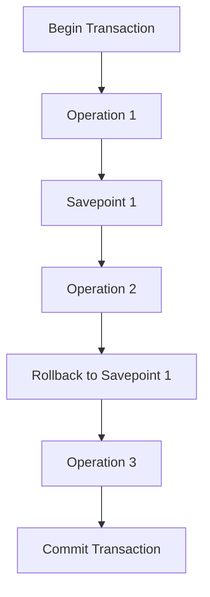

## 6.7 Savepoints and Nested Transactions

In the realm of SQL and database management, transaction control is a cornerstone of ensuring data integrity and consistency. As expert software engineers and architects, understanding the nuances of transaction management is crucial. This section delves into the advanced concepts of **Savepoints** and **Nested Transactions**, providing you with the knowledge to handle complex transactional operations efficiently.

### Savepoints

**Purpose**: Savepoints are intermediate markers within a transaction that allow you to roll back to a specific point without affecting the entire transaction. This capability is particularly useful in scenarios where only a portion of the transaction needs to be undone due to an error or a change in logic.

**Usage**: Savepoints are employed to manage complex transactions by providing flexibility in error handling. They enable partial rollbacks, which can be critical in maintaining data integrity without discarding all changes made during the transaction.

#### How Savepoints Work

Savepoints are set within a transaction using the `SAVEPOINT` command. Once a savepoint is established, you can roll back to it using the `ROLLBACK TO SAVEPOINT` command. This operation undoes all changes made after the savepoint was set, but retains changes made before it.

```sql
BEGIN TRANSACTION;

-- Perform some operations
INSERT INTO orders (order_id, customer_id, order_date) VALUES (1, 101, '2024-11-17');

-- Set a savepoint
SAVEPOINT sp1;

-- Perform more operations
INSERT INTO order_details (order_id, product_id, quantity) VALUES (1, 202, 5);

-- Rollback to the savepoint
ROLLBACK TO SAVEPOINT sp1;

-- Commit the transaction
COMMIT;
```

In this example, the insertion into `order_details` is undone, but the insertion into `orders` remains intact.

#### Key Considerations

- **Performance**: Excessive use of savepoints can impact performance, as the database must maintain additional state information.
- **Portability**: Not all database management systems (DBMS) support savepoints in the same way. Always check the specific capabilities of your DBMS.
- **Complexity**: While savepoints add flexibility, they also introduce complexity in transaction management. Use them judiciously to avoid overly complicated transaction logic.

### Nested Transactions

**Concept**: Nested transactions are transactions within transactions. They allow for more granular control over complex operations, enabling you to commit or roll back sub-transactions independently of the main transaction.

**Support**: True nested transactions are not universally supported across all DBMS. Many systems simulate nested transactions using savepoints, providing similar functionality.

#### Implementing Nested Transactions

In systems that do not support true nested transactions, you can simulate them using savepoints. This approach allows you to achieve similar outcomes by managing sub-transactions within a larger transaction context.

```sql
BEGIN TRANSACTION;

-- Outer transaction operations
INSERT INTO customers (customer_id, name) VALUES (101, 'John Doe');

-- Simulate a nested transaction
SAVEPOINT nested1;

-- Nested transaction operations
INSERT INTO orders (order_id, customer_id, order_date) VALUES (1, 101, '2024-11-17');

-- Decide to rollback the nested transaction
ROLLBACK TO SAVEPOINT nested1;

-- Continue with outer transaction
INSERT INTO customers (customer_id, name) VALUES (102, 'Jane Smith');

-- Commit the outer transaction
COMMIT;
```

In this scenario, the operations within the simulated nested transaction are rolled back, while the outer transaction continues unaffected.

#### Key Participants

- **Main Transaction**: The overarching transaction that encompasses all operations, including nested transactions.
- **Nested Transaction**: A sub-transaction that can be committed or rolled back independently within the context of the main transaction.

#### Applicability

Nested transactions are particularly useful in scenarios where complex operations require independent control over sub-transactions. They are ideal for:

- **Modular Operations**: Breaking down large transactions into smaller, manageable units.
- **Error Isolation**: Isolating errors within sub-transactions to prevent them from affecting the entire transaction.
- **Complex Business Logic**: Implementing intricate business rules that require conditional commits or rollbacks.

### Design Considerations

When implementing savepoints and nested transactions, consider the following:

- **DBMS Support**: Verify the level of support your DBMS provides for savepoints and nested transactions. Some systems may offer limited functionality or require specific configurations.
- **Transaction Complexity**: Avoid unnecessary complexity by carefully planning transaction logic. Overuse of savepoints and nested transactions can lead to convoluted code that is difficult to maintain.
- **Performance Impact**: Be mindful of the performance implications, especially in high-volume environments. Savepoints and nested transactions can increase the overhead of transaction management.

### Differences and Similarities

While savepoints and nested transactions share similarities in providing granular control over transactions, they differ in their implementation and support across DBMS:

- **Savepoints**: Universally supported in most DBMS, offering a straightforward way to manage partial rollbacks.
- **Nested Transactions**: Not widely supported as a native feature, often requiring simulation through savepoints.

### Visualizing Savepoints and Nested Transactions

To better understand the flow of savepoints and nested transactions, consider the following diagram:



**Diagram Description**: This flowchart illustrates a transaction with a savepoint. After setting a savepoint, subsequent operations can be rolled back to this point, allowing the transaction to continue with new operations before committing.

### Try It Yourself

Experiment with the provided code examples by modifying the operations within the transactions. Try adding additional savepoints and rolling back to different points to observe how the transaction behaves. This hands-on approach will deepen your understanding of savepoints and nested transactions.

### References and Links

- [SQL Transaction Control Language (TCL)](https://www.w3schools.com/sql/sql_tcl.asp) - W3Schools
- [Savepoints in SQL](https://www.postgresql.org/docs/current/sql-savepoint.html) - PostgreSQL Documentation
- [Nested Transactions](https://en.wikipedia.org/wiki/Nested_transaction) - Wikipedia

### Knowledge Check

To reinforce your understanding, consider the following questions:

1. What is the primary purpose of a savepoint in a transaction?
2. How can nested transactions be simulated in a DBMS that does not support them natively?
3. What are the potential performance implications of using savepoints excessively?

### Embrace the Journey

Remember, mastering transaction management is a journey. As you continue to explore and implement these concepts, you'll gain greater control over your database operations. Keep experimenting, stay curious, and enjoy the process of becoming an expert in SQL design patterns.

## Quiz Time!



### What is the primary purpose of a savepoint in a transaction?

- [x] To set an intermediate point to which a rollback can occur
- [ ] To commit a transaction
- [ ] To start a new transaction
- [ ] To end a transaction

> **Explanation:** Savepoints allow rolling back to a specific point within a transaction without affecting the entire transaction.

### How can nested transactions be simulated in a DBMS that does not support them natively?

- [x] Using savepoints
- [ ] Using triggers
- [ ] Using stored procedures
- [ ] Using views

> **Explanation:** Savepoints can be used to simulate nested transactions by allowing partial rollbacks within a transaction.

### Which of the following is a key consideration when using savepoints?

- [x] Performance impact
- [ ] Data type compatibility
- [ ] Indexing strategy
- [ ] Table partitioning

> **Explanation:** Savepoints can impact performance due to the additional state information the database must maintain.

### What is a nested transaction?

- [x] A transaction within a transaction
- [ ] A transaction that spans multiple databases
- [ ] A transaction that is automatically committed
- [ ] A transaction that is read-only

> **Explanation:** Nested transactions are transactions within transactions, allowing for independent control over sub-transactions.

### Which SQL command is used to set a savepoint?

- [x] SAVEPOINT
- [ ] BEGIN
- [ ] COMMIT
- [ ] ROLLBACK

> **Explanation:** The `SAVEPOINT` command is used to set an intermediate point within a transaction.

### What happens when you roll back to a savepoint?

- [x] Changes after the savepoint are undone
- [ ] The entire transaction is committed
- [ ] The entire transaction is rolled back
- [ ] The transaction is paused

> **Explanation:** Rolling back to a savepoint undoes changes made after the savepoint was set.

### Which of the following is NOT a benefit of using nested transactions?

- [ ] Modular operations
- [ ] Error isolation
- [x] Automatic indexing
- [ ] Complex business logic implementation

> **Explanation:** Nested transactions do not provide automatic indexing; they offer modular operations and error isolation.

### What is a potential drawback of using too many savepoints?

- [x] Increased complexity
- [ ] Improved performance
- [ ] Simplified transaction logic
- [ ] Reduced error handling

> **Explanation:** Excessive use of savepoints can lead to increased complexity in transaction management.

### Which DBMS feature is often used to simulate nested transactions?

- [x] Savepoints
- [ ] Triggers
- [ ] Views
- [ ] Indexes

> **Explanation:** Savepoints are often used to simulate nested transactions in systems that do not support them natively.

### True or False: All DBMS support true nested transactions.

- [ ] True
- [x] False

> **Explanation:** Not all DBMS support true nested transactions; many simulate them using savepoints.


