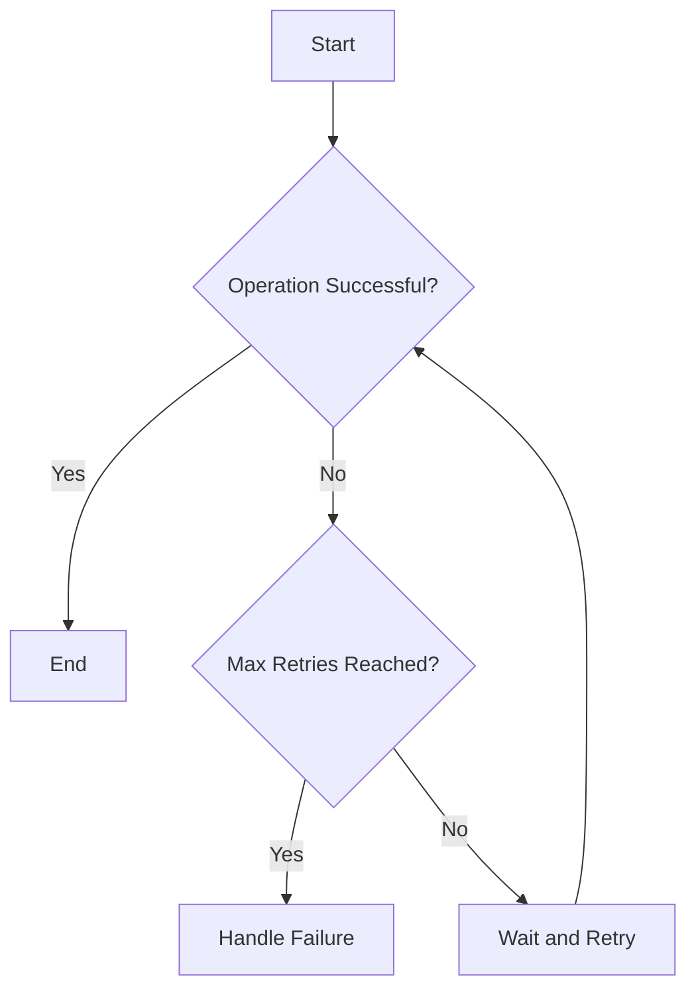

## 6.8 Implementing Retry Logic

In the realm of SQL database management, ensuring the reliability and consistency of transactions is paramount. One of the key strategies to achieve this is through implementing retry logic, particularly in the face of transient failures. This section will delve into the concepts of transient failures, explore various retry strategies such as exponential backoff and the circuit breaker pattern, and discuss the importance of idempotency in maintaining data integrity.

### Understanding Transient Failures

**Transient Failures** are temporary errors that occur in a system, often due to network issues, resource contention, or temporary unavailability of services. These failures are typically short-lived and can often be resolved by simply retrying the operation. However, indiscriminate retries can lead to increased load and potential cascading failures, making it crucial to implement intelligent retry strategies.

#### Common Causes of Transient Failures

- **Network Glitches**: Temporary loss of connectivity or high latency.
- **Resource Contention**: Competing processes vying for limited resources.
- **Service Unavailability**: Temporary downtime or overload of a dependent service.

### Retry Strategies

Implementing effective retry strategies is essential to handle transient failures gracefully. Two widely adopted strategies are Exponential Backoff and the Circuit Breaker Pattern.

#### Exponential Backoff

**Exponential Backoff** is a retry strategy that involves increasing the wait time between successive retries. This approach helps to reduce the load on the system and increases the likelihood of success on subsequent attempts.

**Algorithm:**

1. **Initial Retry**: Attempt the operation immediately after the first failure.
2. **Wait Time**: Double the wait time after each subsequent failure.
3. **Maximum Retries**: Set a limit on the number of retries to prevent indefinite attempts.

**Example Code:**

```sql
DECLARE @RetryCount INT = 0;
DECLARE @MaxRetries INT = 5;
DECLARE @WaitTime INT = 1000; -- Initial wait time in milliseconds

WHILE @RetryCount < @MaxRetries
BEGIN
    BEGIN TRY
        -- Attempt the operation
        EXEC PerformDatabaseOperation;
        BREAK; -- Exit loop if successful
    END TRY
    BEGIN CATCH
        SET @RetryCount = @RetryCount + 1;
        IF @RetryCount < @MaxRetries
        BEGIN
            -- Wait before retrying
            WAITFOR DELAY '00:00:' + CAST(@WaitTime / 1000 AS VARCHAR);
            SET @WaitTime = @WaitTime * 2; -- Exponential backoff
        END
        ELSE
        BEGIN
            -- Handle failure after max retries
            RAISERROR('Operation failed after maximum retries.', 16, 1);
        END
    END CATCH
END
```

**Key Points:**

- **Scalability**: Reduces system load by spacing out retries.
- **Flexibility**: Allows customization of initial wait time and maximum retries.

#### Circuit Breaker Pattern

The **Circuit Breaker Pattern** is designed to prevent retry storms by halting retries after a series of consecutive failures. It acts as a protective mechanism, allowing the system to recover before further attempts.

**States of a Circuit Breaker:**

1. **Closed**: Normal operation; retries are allowed.
2. **Open**: Retries are blocked after a threshold of failures.
3. **Half-Open**: A test state to check if the system has recovered.

**Example Code:**

```sql
DECLARE @FailureCount INT = 0;
DECLARE @FailureThreshold INT = 3;
DECLARE @CircuitState VARCHAR(10) = 'Closed';

WHILE @CircuitState = 'Closed'
BEGIN
    BEGIN TRY
        -- Attempt the operation
        EXEC PerformDatabaseOperation;
        SET @FailureCount = 0; -- Reset failure count on success
        BREAK;
    END TRY
    BEGIN CATCH
        SET @FailureCount = @FailureCount + 1;
        IF @FailureCount >= @FailureThreshold
        BEGIN
            SET @CircuitState = 'Open';
            RAISERROR('Circuit is open due to repeated failures.', 16, 1);
        END
    END CATCH
END

-- Logic to transition to Half-Open state after a cooldown period
IF @CircuitState = 'Open'
BEGIN
    WAITFOR DELAY '00:05:00'; -- Cooldown period
    SET @CircuitState = 'Half-Open';
    -- Attempt a limited number of retries to test recovery
    -- If successful, transition back to Closed state
END
```

**Key Points:**

- **Protection**: Prevents system overload by stopping retries after repeated failures.
- **Recovery**: Allows the system to recover before resuming normal operations.

### Idempotency Considerations

**Idempotency** is a crucial concept in retry logic, ensuring that repeated transactions do not cause unintended effects. An operation is idempotent if performing it multiple times has the same effect as performing it once.

#### Ensuring Idempotency

- **Unique Identifiers**: Use unique transaction IDs to track operations and prevent duplicates.
- **State Checks**: Verify the current state before performing an operation to avoid redundant actions.
- **Compensating Transactions**: Implement mechanisms to reverse unintended changes.

**Example Code:**

```sql
-- Example of ensuring idempotency using a unique transaction ID
DECLARE @TransactionID UNIQUEIDENTIFIER = NEWID();

IF NOT EXISTS (SELECT 1 FROM Transactions WHERE TransactionID = @TransactionID)
BEGIN
    -- Perform the operation
    INSERT INTO Transactions (TransactionID, OperationDetails)
    VALUES (@TransactionID, 'Operation performed');
END
```

**Key Points:**

- **Consistency**: Maintains data integrity by preventing duplicate operations.
- **Reliability**: Ensures that retries do not lead to inconsistent states.

### Visualizing Retry Logic

To better understand the flow of retry logic, let's visualize the process using a flowchart.



**Diagram Description:**

- **Start**: Initiates the retry logic process.
- **Operation Successful?**: Checks if the operation was successful.
- **Max Retries Reached?**: Determines if the maximum number of retries has been reached.
- **Wait and Retry**: Implements the wait time before retrying the operation.
- **Handle Failure**: Executes failure handling logic after reaching the retry limit.

### References and Links

For further reading on retry logic and related concepts, consider exploring the following resources:

- [Microsoft Docs: Transient Fault Handling](https://docs.microsoft.com/en-us/azure/architecture/patterns/transient-fault-handling)
- [AWS Architecture Blog: Implementing Exponential Backoff](https://aws.amazon.com/blogs/architecture/exponential-backoff-and-jitter/)
- [Martin Fowler: Circuit Breaker](https://martinfowler.com/bliki/CircuitBreaker.html)

### Knowledge Check

To reinforce your understanding of retry logic, consider the following questions and exercises:

1. **Question**: What are transient failures, and why are they important to address in SQL transactions?
2. **Exercise**: Implement a retry logic using exponential backoff for a database operation in your preferred SQL environment.
3. **Challenge**: Design a circuit breaker pattern for a critical database operation, ensuring it transitions between states effectively.

### Embrace the Journey

Remember, mastering retry logic is just one step in building robust and reliable SQL database systems. As you continue to explore and implement these patterns, you'll enhance your ability to design systems that gracefully handle failures and maintain data integrity. Keep experimenting, stay curious, and enjoy the journey!

## Quiz Time!



### What is a transient failure in the context of SQL transactions?

- [x] A temporary error that can be resolved by retrying the operation
- [ ] A permanent error that requires manual intervention
- [ ] An error caused by incorrect SQL syntax
- [ ] A failure due to hardware malfunction

> **Explanation:** Transient failures are temporary errors that can often be resolved by retrying the operation, such as network glitches or resource contention.

### Which retry strategy involves increasing wait times between retries?

- [x] Exponential Backoff
- [ ] Linear Retry
- [ ] Immediate Retry
- [ ] Random Retry

> **Explanation:** Exponential Backoff is a retry strategy that involves increasing the wait time between successive retries to reduce system load.

### What is the purpose of the Circuit Breaker Pattern?

- [x] To prevent retry storms by halting retries after successive failures
- [ ] To ensure retries are attempted immediately after a failure
- [ ] To increase the number of retries for critical operations
- [ ] To decrease the wait time between retries

> **Explanation:** The Circuit Breaker Pattern prevents retry storms by stopping retries after a series of consecutive failures, allowing the system to recover.

### What is idempotency in the context of retry logic?

- [x] Ensuring that repeated transactions do not cause unintended effects
- [ ] Increasing the number of retries for critical operations
- [ ] Decreasing the wait time between retries
- [ ] Preventing retries after a single failure

> **Explanation:** Idempotency ensures that performing an operation multiple times has the same effect as performing it once, preventing unintended effects.

### Which of the following is a key consideration when implementing retry logic?

- [x] Idempotency
- [ ] Redundancy
- [ ] Complexity
- [ ] Simplicity

> **Explanation:** Idempotency is crucial in retry logic to ensure that repeated transactions do not cause unintended effects.

### What is the initial state of a circuit breaker in the Circuit Breaker Pattern?

- [x] Closed
- [ ] Open
- [ ] Half-Open
- [ ] Broken

> **Explanation:** The initial state of a circuit breaker is "Closed," allowing normal operation and retries.

### How does exponential backoff help in retry logic?

- [x] By reducing system load through increased wait times between retries
- [ ] By ensuring retries are attempted immediately after a failure
- [ ] By increasing the number of retries for critical operations
- [ ] By decreasing the wait time between retries

> **Explanation:** Exponential backoff helps reduce system load by increasing the wait time between retries, allowing the system to recover.

### What is the purpose of using unique transaction IDs in retry logic?

- [x] To track operations and prevent duplicates
- [ ] To increase the number of retries for critical operations
- [ ] To decrease the wait time between retries
- [ ] To prevent retries after a single failure

> **Explanation:** Unique transaction IDs help track operations and prevent duplicates, ensuring idempotency in retry logic.

### Which state of a circuit breaker allows limited retries to test recovery?

- [x] Half-Open
- [ ] Closed
- [ ] Open
- [ ] Broken

> **Explanation:** The "Half-Open" state allows limited retries to test if the system has recovered before transitioning back to "Closed."

### True or False: Exponential backoff is a strategy that decreases wait times between retries.

- [ ] True
- [x] False

> **Explanation:** False. Exponential backoff increases wait times between retries to reduce system load and increase the likelihood of success.


