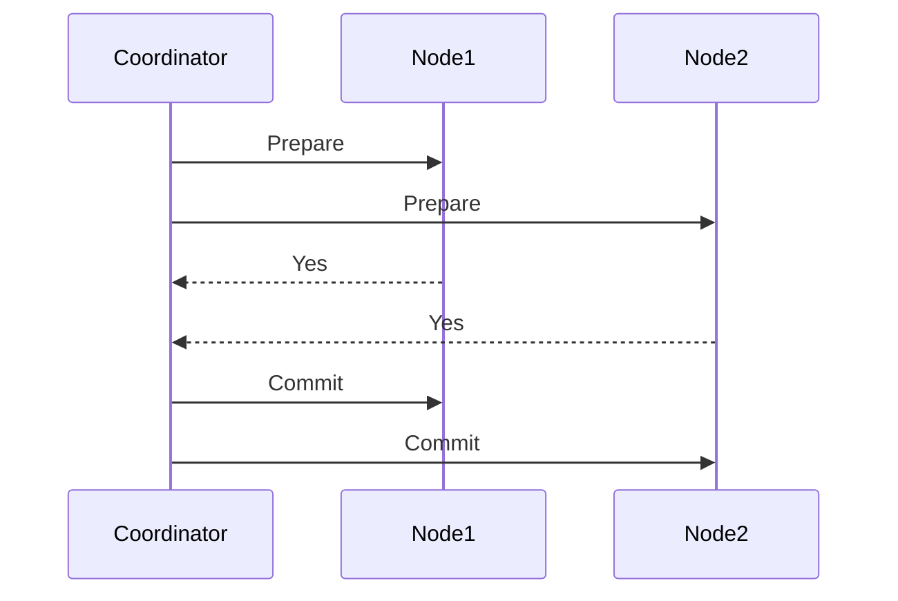

## 6.9 Concurrency in Distributed Systems

Concurrency in distributed systems presents unique challenges and opportunities for software engineers and architects. As systems scale across multiple nodes and geographical locations, managing data consistency becomes crucial. In this section, we will explore the key concepts and patterns that help manage concurrency in distributed systems, focusing on SQL design patterns.

### Challenges of Concurrency in Distributed Systems

Distributed systems inherently involve multiple nodes or databases working together. This setup introduces several challenges:

- **Data Consistency**: Ensuring that all nodes reflect the same data state.
- **Latency**: Delays in data propagation across nodes.
- **Fault Tolerance**: Handling node failures without data loss.
- **Scalability**: Maintaining performance as the system grows.

Let's delve into some of the core concepts and strategies used to address these challenges.

### Distributed Transactions

Distributed transactions are operations that span multiple nodes or databases. They require coordination to ensure that all parts of the transaction are completed successfully. Two common protocols for managing distributed transactions are the Two-Phase Commit (2PC) and Three-Phase Commit (3PC).

#### Two-Phase Commit (2PC)

The Two-Phase Commit protocol is a consensus algorithm used to ensure that all nodes in a distributed system agree to commit a transaction. It consists of two phases:

1. **Prepare Phase**: The coordinator node asks all participant nodes if they can commit the transaction.
2. **Commit Phase**: If all participants agree, the coordinator sends a commit message. Otherwise, it sends a rollback message.

```sql
-- Example of a Two-Phase Commit in SQL
BEGIN TRANSACTION;

-- Phase 1: Prepare
PREPARE TRANSACTION 'txn1';

-- Phase 2: Commit or Rollback
COMMIT PREPARED 'txn1';
-- or
ROLLBACK PREPARED 'txn1';
```

**Key Considerations**:
- **Blocking**: 2PC can block if a participant fails during the commit phase.
- **Consistency**: Ensures strong consistency across nodes.

#### Three-Phase Commit (3PC)

The Three-Phase Commit protocol adds an additional phase to improve reliability and reduce blocking:

1. **CanCommit Phase**: Similar to the prepare phase in 2PC.
2. **PreCommit Phase**: Participants acknowledge readiness to commit.
3. **DoCommit Phase**: Final commit or abort decision.

**Advantages**:
- **Non-blocking**: Reduces the risk of blocking by introducing a timeout mechanism.
- **Fault Tolerance**: Better handles node failures.

### Eventual Consistency

Eventual consistency is a consistency model used in distributed systems where updates to a database will propagate to all nodes eventually, but not immediately. This model accepts temporary inconsistencies for the sake of availability and partition tolerance.

**Key Concepts**:
- **Stale Reads**: Temporary inconsistencies may lead to outdated data being read.
- **Convergence**: All nodes will eventually converge to the same state.

**Example Use Case**: Social media platforms often use eventual consistency to ensure high availability and responsiveness.

### CAP Theorem

The CAP Theorem, proposed by Eric Brewer, states that a distributed system can only guarantee two out of the following three properties:

- **Consistency**: All nodes see the same data at the same time.
- **Availability**: Every request receives a response, regardless of the success or failure of the operation.
- **Partition Tolerance**: The system continues to operate despite network partitions.

**Trade-offs**:
- **CP Systems**: Prioritize consistency and partition tolerance (e.g., traditional databases).
- **AP Systems**: Prioritize availability and partition tolerance (e.g., NoSQL databases).

### Visualizing Concurrency in Distributed Systems

To better understand these concepts, let's visualize the Two-Phase Commit protocol using a sequence diagram.



**Diagram Explanation**: This sequence diagram illustrates the communication flow in a Two-Phase Commit protocol. The coordinator node initiates the prepare phase, waits for responses, and then proceeds to the commit phase if all nodes agree.

### Code Example: Implementing Eventual Consistency

Let's explore a simple code example demonstrating eventual consistency using a distributed key-value store.

```python

class DistributedKVStore:
    def __init__(self):
        self.data = {}
        self.replica_data = {}

    def write(self, key, value):
        # Write to the primary node
        self.data[key] = value
        # Simulate asynchronous replication to replicas
        self.replicate(key, value)

    def replicate(self, key, value):
        # Simulate eventual consistency by updating replicas
        self.replica_data[key] = value

    def read(self, key):
        # Read from the primary node
        return self.data.get(key, "Data not available")

store = DistributedKVStore()
store.write("user1", "Alice")
print(store.read("user1"))  # Output: Alice
```

**Try It Yourself**: Modify the `replicate` method to introduce a delay, simulating network latency, and observe how it affects data consistency.

### Knowledge Check

- **Explain the difference between 2PC and 3PC protocols.**
- **Describe a scenario where eventual consistency is preferable.**
- **Discuss the implications of the CAP theorem on system design.**

### Embrace the Journey

Remember, mastering concurrency in distributed systems is a journey. As you explore these concepts, you'll gain the skills needed to design robust, scalable, and efficient distributed systems. Keep experimenting, stay curious, and enjoy the journey!

## Quiz Time!



### What is the main purpose of the Two-Phase Commit protocol?

- [x] To ensure all nodes in a distributed system agree to commit a transaction
- [ ] To improve the speed of transactions
- [ ] To handle network failures
- [ ] To increase data redundancy

> **Explanation:** The Two-Phase Commit protocol ensures that all nodes agree to commit a transaction, maintaining consistency across a distributed system.

### Which phase is added in the Three-Phase Commit protocol to improve reliability?

- [ ] Prepare Phase
- [x] PreCommit Phase
- [ ] Commit Phase
- [ ] Rollback Phase

> **Explanation:** The PreCommit Phase is added in the Three-Phase Commit protocol to improve reliability and reduce blocking.

### What does eventual consistency guarantee in a distributed system?

- [ ] Immediate consistency across all nodes
- [x] Temporary inconsistency with eventual convergence
- [ ] High latency
- [ ] Strong consistency

> **Explanation:** Eventual consistency allows for temporary inconsistencies but guarantees that all nodes will eventually converge to the same state.

### According to the CAP Theorem, which two properties can a distributed system guarantee?

- [ ] Consistency and Availability
- [x] Consistency and Partition Tolerance
- [ ] Availability and Partition Tolerance
- [ ] Consistency and Scalability

> **Explanation:** The CAP Theorem states that a distributed system can guarantee only two of the three properties: Consistency, Availability, and Partition Tolerance.

### What is a common trade-off in AP systems according to the CAP Theorem?

- [ ] Consistency
- [x] Availability
- [ ] Partition Tolerance
- [ ] Scalability

> **Explanation:** AP systems prioritize Availability and Partition Tolerance, often at the expense of Consistency.

### In a distributed key-value store, what does the `replicate` method simulate?

- [ ] Immediate data consistency
- [x] Asynchronous replication to replicas
- [ ] Synchronous data updates
- [ ] Data deletion

> **Explanation:** The `replicate` method simulates asynchronous replication to replicas, demonstrating eventual consistency.

### What is a potential drawback of the Two-Phase Commit protocol?

- [ ] High availability
- [ ] Low latency
- [x] Blocking in case of participant failure
- [ ] Strong consistency

> **Explanation:** The Two-Phase Commit protocol can block if a participant fails during the commit phase.

### Which consistency model accepts temporary inconsistencies for availability?

- [ ] Strong consistency
- [x] Eventual consistency
- [ ] Immediate consistency
- [ ] Strict consistency

> **Explanation:** Eventual consistency accepts temporary inconsistencies to ensure high availability and responsiveness.

### What is the role of the coordinator in the Two-Phase Commit protocol?

- [x] To manage the transaction and ensure all nodes agree
- [ ] To store all transaction data
- [ ] To handle network failures
- [ ] To increase data redundancy

> **Explanation:** The coordinator manages the transaction and ensures that all nodes agree to commit or rollback.

### True or False: The CAP Theorem allows for a distributed system to guarantee all three properties: Consistency, Availability, and Partition Tolerance.

- [ ] True
- [x] False

> **Explanation:** The CAP Theorem states that a distributed system can only guarantee two out of the three properties: Consistency, Availability, and Partition Tolerance.


